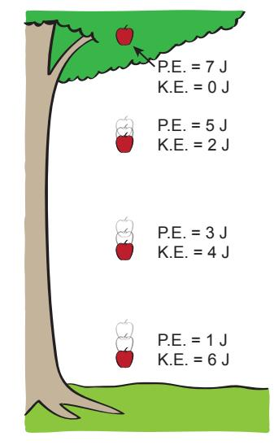
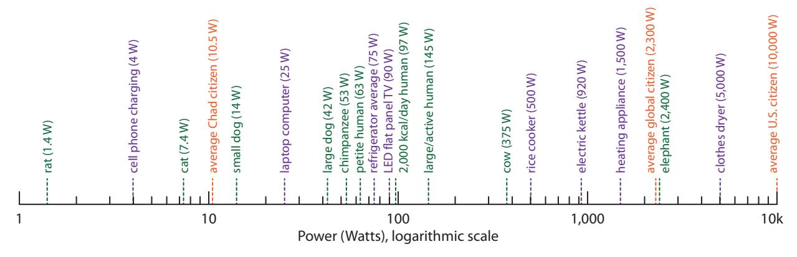
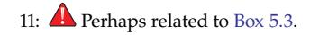
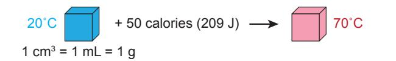
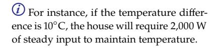
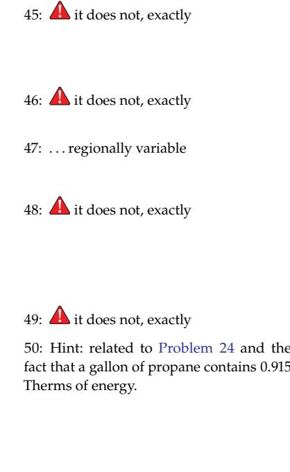

(chap:energypower)=   
# Energy and Power Units                                                                             |

This chapter provides a baseline for understanding the rest of the content in this book, so that students may learn to interpret and convert units, while building a useful intuition in the process. Sec. [A.10](#page-389-0) (p. [370\)](#page-389-0) in the Appendices offers some tips on manipulating units and performing unit conversions.

Unlike most chapters, this one does not tell a single story or advance our perspective on the world. But it builds a foundation, putting us in a position to start looking at consequential matters of energy use in our society in chapters to come. Hopefully, patience will be rewarded.

### **5.1 Energy (J)**

### First, what is [energy?](#page-446-0)

**Definition 5.1.1** *[Energy](#page-446-0) is defined as the* capacity to do [work](#page-457-0)*. Work is well-defined in physics as the application of force through a distance.* 1 *The colloquial use of the word "work" matches relatively well, in that pushing a large couch across the floor (applying force through a distance) or lifting a heavy box up to a shelf feels like work and can tire you out.*

The [SI](#page-455-0) unit of force is the [Newton](#page-452-0) (N), breaking down more fundamentally to kg · m/s2. The best way to remember this is via Newton's Second Law:  $F = ma$  (force equals mass times acceleration). Mass has units of kg, and acceleration2 is measured in meters per second squared.Since work is force times distance, the unit for work (and thus energy) is Newtons times meters, or N · m. We give this unit its own name: the

1: This definition applies to the common circumstance when the motion is aligned with the direction of force, like pushing a box across a level floor, propelling a car along the road, or lifting a weight.

locity. Since velocity is measured in meters per second, the rate at which it changes will be meters per second *per second*, or m/s/s, or m/s 2 . Some students may know that gravitational acceleration on Earth's surface is 9.8 m/s2 , which is another way

Energy units from everyday life. Clockwise from upper left: a utility bill (kWh and Therms); a hot water heater label (Btu/hr); EnergyGuide for same hot water heater (Therms); U.S. nutrition label for peanut butter (Calories; should be kcal); a German nutrition label for Nutella (kJ, kcal); and rechargeable AA batteries (2200 mAh, 1.2 V).

[Joule](#page-450-0) (J). Thus, the application of 1 N of force across a distance of 1 m constitutes 1 J of work, requiring 1 J of energy to perform. [Table](#page-88-1) [5.1](#page-88-1) offers contextual examples (unit prefixes are on page [420\)](#page-439-0).

**Example 5.1.1** Several examples3 illustrate force times distance, the first two amounting to one Joule of energy:- I Pushing a book across a table, applying 2 N of force and sliding it 0.5 m amounts to 1 J of work.
- I Pushing a matchbox toy car across the floor might require only 0.1 N of force. One would have to push it through a distance of 10 m to make up one Joule of energy.
- I A car on level ground may require 150 N of force to roll against friction. Pushing a car 5 m would then require 750 J of work.

Writing out Newtons as  $\text{kg} \cdot \text{m/s}^2$ , we find that the unit of energy amounts to  $\text{J} = \text{N} \cdot \text{m} = \text{kg} \cdot \text{m}^2/\text{s}^2$ . Notice that this looks like mass times velocity-squared. [Box](#page-88-2) [5.1](#page-88-2) explores how this makes a lot of sense.#### **Box 5.1: The Units Make Sense!**

Think about the famous equation  $E = mc^2$ . Energy is mass times the speed of light squared. The units work! More on mass-energy in [Chapter](#page-258-0) [15.](#page-258-0)Also, [kinetic energy](#page-450-1) is K.E. =  $\frac{1}{2}mv^2$ , telling a similar story in terms of units: mass times velocity-squared. More on kinetic energy in [Chapter 12](#page-203-0).[Gravitational potential energy](#page-448-0) is just the weight of an object times the height it is lifted through.[4](#page-448-0) The weight (force) is mass  $(m)$  times the acceleration due to gravity[5](#page-448-0)  $(g)$ , so that lifting (applying a force equal to the weight) through a height  $(h)$  results in a potential energy gain of P.E.  $= mgh$ . The units again check out as
More on gravitational potential energy in Chapter 11.
4: Another example of work (energy) being force times distance.
5: The force needed to hold against gravity is just  $F = ma = mg$ 
$$
mgh \rightarrow \text{kg} \cdot \frac{\text{m}}{\text{s}^{2}} \cdot \text{m} = \frac{\text{kg} \cdot \text{m} \cdot \text{m}}{\text{s}^{2}} = \frac{\text{kg} \cdot \text{m}^{2}}{\text{s}^{2}} = \text{J}.
$$

We'll encounter other ways to describe energy in this book, but *any energy unit can always be cast into units of Joules*, if desired. Later sections in this chapter detail alternative units whose acquaintance we must make in order to interpret energy information in our lives.

## **5.2 Energy Forms and Conservation**

Energy manifests in a variety of forms, which we will treat in greater detail in application-specific chapters in [Part](#page-182-0) [III](#page-182-0) of this text. For now we just want to name them and point to related chapters and applications, as is done in [Table](#page-89-0) [5.2.](#page-89-0)

**Table 5.1:** Approximate energy for familiar activities. The first freeway example is just kinetic energy; the second is the energy cost of a whole trip.

| Action                | Energy |
|-----------------------|--------|
| Nerf football toss    | 15 J   |
| Lift loaded bookbag   | 100 J  |
| Fast-pitch baseball   | 120 J  |
| Speeding bullet       | 5 kJ   |
| Charge cell phone     | 30 kJ  |
| Car on freeway (K.E.) | 675 kJ |
| human daily diet      | 8 MJ   |
| 1 hour freeway drive  | 250 MJ |

3: For examples like these, framed as statements and not questions, you can practice solving several types of problems by covering up one number and then solving for it using still-available information. So each statement can be seen as several examples in one!

More on mass-energy in Chapter 15.

More on kinetic energy in Chapter 12.

[Chapter](#page-192-0) [11.](#page-192-0)

4: Another example of work (energy) being force times distance.

5: The force needed to hold against gravity is just  $F = ma = mg$ Sec. [A.10](#page-389-0) (p. [370\)](#page-389-0) in the Appendices provides additional guidance on manipulating units.

| Energy Form             | Formula           | Chapter(s) | Applications             |
|-------------------------|-------------------|------------|--------------------------|
| gravitational potential | $mgh$             | 11, 16     | hydroelectric, tidal     |
| kinetic                 | $\frac{1}{2}mv^2$ | 12, 16     | wind, ocean current      |
| photon/light            | $hv$              | 13         | solar                    |
| chemical                | $H - TS$          | 8, 14      | fossil fuels, biomass    |
| thermal                 | $c_p m \Delta T$  | 6, 16      | geothermal, heat engines |
| electric potential      | $qV$              | 15         | batteries, nuclear role  |
| mass (nuclear)          | $mc^2$            | 15         | fission and fusion       |

A bedrock principle of physics is [conservation of energy,](#page-444-0) which we take to *never* be violated in any system, ever.6 What this means is that energy can *flow* from one form to another, but it is *never created or destroyed*.

#### **Box 5.2: Energy: The Money of Physics**

A decent way to conceptualize energy conservation is to think of it as the *money* of physics. It may change hands, but is not created or destroyed in the exchange. A large balance in a bank account is like a potential energy: available to spend. Converting to another form—like heat or kinetic energy—is like the act of spending money. The *rate* of spending energy is called *power*.

[Example](#page-89-1) [5.2.1](#page-89-1) traces a few familiar energy conversions, and [Figure](#page-89-2) [5.1](#page-89-2) provides an example illustration. A more encompassing narrative connecting cosmic sources to daily use is provided in Sec. [D.2.2](#page-414-0) (p. [395\)](#page-414-0).

**Example 5.2.1** Various illustrative examples:

- I A rock perched on the edge of a cliff has [gravitational potential](#page-448-0) [energy.](#page-448-0) When it is pushed off, it trades its potential energy for [kinetic energy](#page-450-1) (speed) as it races toward the ground.
- I A pendulum continually exchanges kinetic and potential energy, which can last some time in the absence of frictional influences.
- I A stick of dynamite has energy stored in chemical bonds (a form of potential energy). When ignited, the explosive material becomes very hot in a small fraction of a second, converting [chemical energy](#page-443-0) into [thermal energy.](#page-456-0)
- I The fireball of hot material from the exploding dynamite expands rapidly, pushing air and nearby objects out of the way at high speed, thus converting thermal energy into [kinetic energy.](#page-450-1)
- I Light from the sun [\(photons\)](#page-453-0) hits a black parking lot surface, heating it up as light energy is converted to thermal energy.
- I A uranium nucleus splits apart, releasing nuclear (potential) energy, sending the particles flying off at high speed (kinetic energy). These particles bump into surrounding particles transferring kinetic energy into thermal energy.
- I Thermal energy from burning a fossil fuel or from nuclear fission

**Table 5.2:** Energy forms. Exchange is possible between all forms. Chemical energy is represented here by Gibbs free energy.

6: The only exception is on cosmological scales and times. But across scales even as large as the Milky Way galaxy and over millions of years, we are on solid footing to consider conservation of energy to be inviolate. It is fascinating to note that conservation of energy stems from a symmetry in time itself: if the laws and constants of the Universe are the same across some span of time, then energy is conserved during such time—a concept we trace to Emmy Noether. See Sec. [D.2](#page-412-0) (p. [393\)](#page-412-0) for more.

**Figure 5.1:** Example exchange of potential energy (P.E.) into kinetic energy (K.E.) as an apple drops from a tree. The total energy always adds to the same amount (here 7 J). The apple speeds up as it gains kinetic energy (losing potential energy). When it comes to rest on the ground, the energy will have gone into 7 J of heat (the associated temperature rise is too small to notice).

#### can be used to make steam that drives a turbine (kinetic energy) that in turn generates electrical energy (voltage, current).

Any of the forms of energy (e.g., in [Table](#page-89-0) [5.2\)](#page-89-0) can convert into the other, directly or indirectly. In each conversion, 100% of the energy is accounted for. In the general case, the energy branches into multiple paths, so we do not get 100% efficiency into the channel we want. For instance, the pendulum example above will eventually bleed its energy into stirring the air (kinetic energy) and friction (heat) at the pivot point. The stirring air eventually turns to heat via internal (viscous) friction of the air.

One useful clarification is that [thermal energy](#page-456-0) is really just random motions[—kinetic energy—](#page-450-1)of individual atoms and molecules. So in the case of nuclear fission in [Example](#page-89-1) [5.2.1,](#page-89-1) the initial kinetic energy of the nuclear fragments is already thermal in nature, but at a higher temperature (faster speeds) than the surrounding material. By bumping into surrounding atoms, the excess speed is diffused into the medium, raising its temperature while "cooling" the fragments themselves as they are slowed down.If accounting for all the possible paths7 of energy, we are confident 7: . . . sometimes called channels that they always add up. Nothing is lost.8 Energy is never created or destroyed in any process we study. It just sloshes from one form to another, often branching into multiple parallel avenues. The sum total will always add up to the starting amount. Sec. [D.2.3](#page-415-0) (p. [396\)](#page-415-0) provides a supplement for those interested in better understanding where energy ultimately goes, and why "losing energy to heat" is not actually a loss but just another reservoir for energy.

### **5.3 Power (W)**

Before getting to the various common units for energy, we should absorb the very important concept and units of [power.](#page-453-1)

**Definition 5.3.1** *[Power](#page-453-1) is simply defined as energy per time: how much energy is expended in how much time. The [SI](#page-455-0) unit is therefore J/s, which we rename [Watts](#page-457-1) (W).* One Watt is simply one Joule per second.

While energy is the capacity to do work, it says nothing about how quickly that work might be accomplished. Power addresses the *rate* at which energy is expended. [Figure](#page-91-1) [5.2](#page-91-1) provides a sense of typical power levels of familiar animals and appliances.

**Example 5.3.1** Lifting a 10 kg box, whose weight is therefore about 100 N, Weight is 푚 푔. In this case, 푚 is 10 kg. If we're through a vertical distance of 2 m requires about 200 J of energy. If performed in one second, the task requires 200 W (200 Joules in one second). Stretching the same task out over four seconds requires only 50 W.

mal energy is about *coherence*, in that we characterize the kinetic energy of a raindrop by its bulk motion or velocity. Meanwhile, water molecules *within* the drop are zipping about in *random* directions and at very high speeds exceeding 1,000 meters per second.

7: ... sometimes called channels

8: Actually, the principle is so well established that new particles (like the neutrino) have been discovered by otherwise unaccounted energy in nuclear processes.

One Watt is simply one Joule per second.

being sticklers,  $g = 9.8 \text{ m/s}^2$ , but for convenience we can typically use  $g \approx 10 \text{ m/s}^2$  without significant loss of precision.

**Figure 5.2:** Various power levels for comparison and intuition-building. Green entries correspond to metabolic power [\[33\]](#page-433-0). Purple entries are devices and appliances. Orange entries are per-capita totals for societal (non-metabolic) energy use. Note that appliances whose job it is to create heat demand the greatest power. The "heating appliance" entry stands for things like microwave ovens, toaster ovens, space heaters, or hair dryers plugged into electrical outlets. Do not take the numbers provided as definitive or exact, as almost everything in the figure will vary somewhat from one instance to another.

Of course, we commonly apply the usual multipliers of factors of 103 to the unit to make it more useful. Thus we have the progression W, kW, MW, GW, TW, etc. For reference, a large college campus will require several tens of MW (megawatts) for electricity. A large power plant is typically in the 1–4 GW range. See [Table](#page-91-2) [5.3](#page-91-2) for scales at which we are likely to use the various multiplying factors, and a more complete set of multipliers on page [420.](#page-439-0)Although it won't come up too often in this course, it is worth mentioning that the common unit of horsepower equates to 745.7 W. It is usually sufficient to remember that 1 hp Thus a 100 hp car is capable of delivering about 75 kW of power.

## **5.4 Kilowatt-hour (kWh)**

**Definition 5.4.1** *The [kilowatt-hour](#page-450-2) is an amount of energy (not a power) resulting from an expenditure of energy at a* rate *of 1 kW for a* duration *of one hour, and is the unit of choice for residential electricity usage.*

This unit causes no end of confusion, but it's really pretty straightforward. The kilowatt-hour is a kilowatt *times* an hour. It may help to think of the sequence: kilo-Thus it is power multiplied by time, which is energy (since power is energy over time).

**Example 5.4.1** Let's say you plug in a space heater rated at 1,000 W (1 kW) and run it for one hour. Congratulations—you've just spent 1 kWh.

Or maybe you turn on a 100 W incandescent light bulb (0.1 kW) and leave it on for 10 hours: also 1 kWh!

What if you run a 500 W rice cooker (0.5 kW) for half an hour? That's 0.25 kWh.

**Table 5.3:** Power multipliers and contexts

| Factor | Unit | Context           |
|--------|------|-------------------|
| 1      | W    | phones; computers |
| 103    | kW   | microwave oven    |
| 106    | MW   | campus; community |
| 109    | GW   | power plant; city |
| 1012   | TW   | societal scale    |

is about 750 W.

watt×hour; kW×h; kW-h; kWh.

It is straightforward to convert back to Joules, because 1 kW is 1,000 J/s and one hour is 3,600 s. So 1 kWh is 1 kW times 1 hr, which is 1,000 J/s times 3,600 s, and is therefore equal to 3,600,000 J, or 3.6 MJ. A related measure sometimes comes up: the [watt-hour](#page-457-2) [\(Wh\)](#page-457-2). In much the same vein, this is equivalent to 1 J/s for 3,600 seconds, or 3,600 J.9 9: A [Wh](#page-457-2) is one-thousandth of a kWh, not

### **Box 5.3: Don't be one of those people. . .**

If you ever hear someone say "kilowatts per hour," it's likely a mistake,10 10: Literally, kW/hr would be a sort of *ac*and has the side effect of leading people to erroneously think that kilowatts is a unit of energy, not a power. Kilowatts is already a *rate* (speed) of energy use: 1,000 Joules per second.

One tendency some people have is to mix up kW and kWh.11 Kilowatts 11: Perhaps related to [Box](#page-92-1) [5.3.](#page-92-1) is a unit of *[power](#page-453-1)*, or how fast energy is being used. Think of it like a speedometer: how fast are you moving (through space or energy)? Kilowatt-hours is a multiplication of power times time, becoming an *[energy](#page-446-0)*. It's more like the odometer: how much have you accumulated (distance or energy)? Just like distance is rate (speed) times time, energy is rate (power) times time.

**Example 5.4.2** We will explore kWh using a light bulb for an example. Let's say the light bulb is labeled as 100 W.12 How much energy does 12: . . . an incandescent, for instance it use?

Well, it depends on how long it's on. If it is never turned on, it uses *no* energy. If it is on for 10 seconds, it uses far less than if it's on for a day.

The characteristic quality of the light bulb is the power it expends when it's on—in this case 100 W. It only has one speed. In analogy to a car and speedometer, it's similar to saying that a car travels at a constant speed,13 and asking how far it travels. Well, it depends on 13: . . . maybe 30 m/s; 67 m.p.h.; 108 k.p.h. how much *time* it spends traveling at speed.

So view kWh (energy) as an *accumulated* amount that increases with time. On the other hand, kW is a *rate* of energy expenditure.

# **5.5 Calories (kcal)**

A common unit for describing chemical and thermal processes is the calorie and its siblings.

**Definition 5.5.1** *A [calorie](#page-443-1) is defined as the amount of energy it takes to heat one gram of water (thus also 1 mL, or 1 cm*3 *, or 1 cc) by one degree Celsius [\(Figure](#page-93-0) [5.3\)](#page-93-0). One [calorie](#page-443-1) (note the small "c") is 4.184 J of energy.*

*One [Calorie](#page-442-0) (note the capital "C")*14 is 1,000 calories, or 1 *[kilocalorie](#page-450-3)*surprisingly.

*celeration* through energy. It's a real thing that can happen, but it's usually not what people mean.

12: ...an incandescent, for instance

13: . . . maybe 30 m / s; 67 m.p.h.; 108 k.p.h.

14: This might win the prize for the dumbest convention in science: never define a unit as case-sensitive, as it cannot be differentiated in spoken language!

*(1 [kcal\)](#page-450-4), equating to 4,184 J. Most memorably, it is the amount of energy it takes to heat one* kilogram *(or one liter; 1 L) of water by 1*◦C*. Due to the tragic convention of Calorie, we will opt for kcal whenever possible.*

*Food labels in the U.S. are in Calories, describing the* energy *content of the food we eat.*15 *We would all do ourselves a favor by calling these kcal instead of Calories (same thing). Many other countries sensibly use either kJ or kcal for quantifying food energy.*

**Example 5.5.1** To change 30 mL (30 g) of water by 5◦C requires 150 cal, or a little over 600 J.

Injecting 40 kcal of energy into a 2 L (2 kg) bottle of water will heat it by 20 degrees.

Drinking 250 mL of ice-cold water and heating it up to body temperature (thus raising its temperature by approximately 35 degrees) will take about 8,750 cal, or 8.75 kcal, or a bit over 36 kJ of energy.

It is usually sufficient to remember that the conversion factor between
calories and Joules is about 4.2—or just 4 if performing a crude calcula-
tion.
No deep significance attaches to the fact that
1 cal happens to equate to 4.184 J, other than
to say this describes a property of water
(called *specific heat capacity*),1 cal = 4.184 J  $\approx$  4.2 J  $\sim$  4 J  
1 kcal = 4.184 J  $\approx$  4.2 kJ  $\sim$  4 kJTwo examples will help cement use of the kcal (a more useful scale in this class than the much smaller calorie).

**Example 5.5.2** A typical diet amounts to a daily intake of about 2,000 kcal of food energy. If you think about it, 2,000 kcal/day is a *power* (energy per time). We can convert to Watts by changing kcal to J and one day to seconds. 2,000 kcal is 8.368 MJ. One day has 86,400 seconds. The division of the two is very close to 100 W.16

A second example hews closely to the definition of the kcal: heating water.

**Example 5.5.3** Let's say you want to heat a half-liter (0.5 kg) of water from room temperature (20⁰C) to boiling (100⁰C). Since each kcal can heat 1 kg by 1⁰C, that same energy will raise our half-kg by 2⁰C.17 So raising the temperature by 80⁰C will require 40 kcal, or 167 kJ.If the water is heated at a rate of 1,000 W (1,000 J/s), it would take 167 seconds for the water to reach boiling temperature.

Notice that we did not apply an explicit formula in [Example](#page-93-1) [5.5.3.](#page-93-1) By proceeding stepwise, we attempt to keep it intuitive.

15: Human metabolism is not the same as heating water, but the energy involved can still be counted in an energy unit that is defined in terms of heating water. It's still just energy.

**Figure 5.3:** Following the definition of a calorie, adding 50 cal to one gram of water raises its temperature by 50◦C.

1 cal happens to equate to 4.184 J, other than to say this describes a property of water (called specific [heat capacity\)](#page-448-1).

16: It would serve little purpose to perform exact math here—producing 96.85 W in this case—since the idea that someone's daily diet is exactly 2,000.00 kcal is pretty preposterous. It will likely vary by at least 10% from day to day, and by even larger amounts from individual to individual, so that 100 W is a convenient and approximate representation.

17: Make sure this is clear to you; by understanding, we are installing concepts instead of formulas, which are more powerful and lasting.

Appendix Sec. [A.8](#page-387-0) (p. [368\)](#page-387-0) addresses this We *could* write a philosophy in a bit more detail.

formula, but we implicitly create the formula on the fly by recognizing that the amount of energy required should scale with the mass of water and with the amount of temperature increase. Hopefully, this approach leads to a deeper understanding of the concept, while printing a formula on the page might short-circuit comprehension.

## **5.6 British Thermal Unit (Btu)**

Why would we waste our time talking about the arcane [British thermal](#page-442-1) [unit](#page-442-1) (Btu)? It's because data provided by the U.S. [Energy Information](#page-445-0) [Administration](#page-445-0) on global energy use is based on the Btu. More specifically, country-scale annual energy expenditures are measured in units of quadrillion ( $10^{15}$ ) Btu (see [Box](#page-94-1) [5.4\)](#page-94-1). Also, heating appliances in the U.S.18 are rated in Btu/hour—a unit of power that can be converted to Watts.  
18: . . . hot water heaters, furnaces, air conditioners, ovens and stoves**Definition 5.6.1** *The [Btu](#page-442-2) is the Imperial analog to the kcal.*19 *One Btu is the energy required to heat one pound of water one degree Fahrenheit.*
  
19: Recall that 1 kcal is the energy it takes to heat one kilogram of water by 1°C.*In terms of Joules, 1 Btu is about 1,055 J, or not far from 1 kJ.*

We can make sense of the conversion to Joules in the following way: a pound is *roughly* half a kilogram and one degree Fahrenheit is *approximately* half a degree Celsius. So a Btu should be roughly a quarter of a kcal. Indeed, 1,055 J is close to one quarter of 4,184 J.

### **Box 5.4: Quads: qBtu**

The U.S. uses quadrillion Btu to represent country-scale annual energy expenditures. It is denoted as [qBtu,](#page-454-0) or informally "quads." One qBtu is approximately 1018 J.20 20: 1.055 × 1018 J, more precisely.

The U.S. uses about 100 quads per year. Since a year is about 3.16×107 seconds,21 21: A cute and convenient way to remember dividing energy in Joules by time in seconds tells us that the U.S. *power* is about 3 × 1012 W (3 TW), working out to about 10,000 W per person as a per-capita *rate* of energy use.

**Example 5.6.1** For appliances characterized by Btu/hr, we can relate to power in Watts via 1 Btu/hr as 1,055 J per 3,600 s, working out to 0.293 W.

Thus, a hot water heater rated at 30,000 Btu/hr is effectively 8,800 W.

Let's also pause to understand how long it will take to heat a shower's worth of hot water at this rate. We'll do it two ways:

1. Heating 15 gallons22 (125 pounds) from a cool 68°F to a hot 131°F at 30,000 Btu/hr will take how long? We must put in  

22: Typical shower flow is about 2 gallons,This would be an excellent opportunity to *create your own* formula to capture the idea, like an expert!

We need to cover the unit in this chapter in order to be energy-literate in the U.S., and because it will come up later in this book.

18: ... hot water heaters, furnaces, air con-
ditioners, ovens and stoves

to heat one kilogram of water by 1◦C.

20: 1.055 × 10¹⁸ J, more precisely.

this, approximately, is  $\pi$  × 107 seconds per year.or ∼8 L, per minute.

125 × 63 = 7, 900 Btu of energy at a rate of 30,000 Btu/hr, so it will take 7,900/30,000 of an hour, or just over 15 minutes.

2. In metric terms, the equivalent to 15 gallons is 57 L (57 kg), and we heat from 20◦C to 55◦C at 8,800 W.23 23: 30,000 Btu/hr is equivalent to 8,800 W, Since one kcal heats one kilogram of water 1◦C, heating 57 kg by 35◦C will require 57 × 35 kcal, or 57 × 35 × 4, 184 J = 8.35 MJ, which at 8,800 W will take 950 seconds, also just over 15 minutes (reassuringly, the same answer).

### **5.7 Therms**

We will rarely encounter this unit, but include it here because natural gas utility bills24 24: See, for instance, the banner image for in the U.S. often employ [Therms.](#page-456-1) Since part of the goal of this book is to empower a personal understanding of energy and how to compare different measures of energy (e.g., on a utility bill), conventions in the U.S. demand that we cover the unit here.25 25: [Chapter](#page-347-0) [20](#page-347-0) will explore what might be

**Definition 5.7.1** *One [Therm](#page-456-1)* is 100,000 Btu, or  $1.055 \times 10^8$  *J, or 29.3 [kWh.](#page-451-0)*#### **Box 5.5: Why Therms?**

The [Therm](#page-456-1) is partly adopted for the near-convenience that 100 cubic feet of natural gas (CCF or 100 CF), which meters measure directly, equates to 1.036 Therms. Relatedly, one gallon (3.785 L) of liquid propane gas26 contains 91,500 Btu, which is 0.915 Therms. Thus the Therm very closely matches convenient measures of natural gas (100 cubic feet) or liquid propane (a gallon).**Example 5.7.1** It might take approximately 10,000 kcal of energy27 to heat a fresh infusion of cold water into a hot water heater tank. How many Therms is this? [27](#page-27-1): Based on a capacity of 200 L, pulling inWe do a two-step conversion: first, 10,000 kcal is 41.84 MJ, which at 1,055 J per Btu computes to about 40,000 Btu, which is the same as 0.4 Therm, requiring approximately 40 cubic feet of natural gas, or a little less than half-a-gallon (about 2 L) of liquid propane.

If we learn that the hot water heater is rated at 30,000 Btu per hour, it will take an hour and 20 minutes to complete the job.

## **5.8 Electrical Power**

Electronic interactions are governed by charges pushing on each other. For the purposes of this course, we need only understand a few concepts. The first is voltage.

as worked out above.

this chapter on page [68.](#page-87-1)

learned from utility bills.

cations as a substitute for natural gas when the pipeline infrastructure for natural gas is absent.

chilly water at 5◦C and heating it to 55◦C, thereby requiring 200 kg × 50 C kcal.

It is interesting to reflect on the notion that 200 L of water can be heated by 50◦C for only 2 L of liquid fuel: 1% of the water volume in fuel. If heating to boiling, it would take twice as much fuel, so 2% of the water volume. Seems like a good bargain especially for backpackers who want to boil water and have to lug the fuel around to do so. Inefficiencies in getting heat into the water might require more like 10% fuel volume.

[Voltage](#page-457-4) is a measure of *electric potential*, in [Volts,](#page-457-5) and can be thought of as analogous to how high something is lifted.28 28: . . . making electric potential a lot like A higher voltage is like sitting higher on the shelf, and can do more work if allowed to be released.

[Charge](#page-443-2) is moved around by electrical forces, and the amount of charge moved plays a role similar to that of mass in gravitational settings. The unit of charge is the [Coulomb](#page-444-1) (C), and the smallest unit of charge we encounter in normal situations is from the [proton](#page-454-1) (+1.6 × 10-19 C) or the [electron](#page-446-1) (-1.6 × 10-19 C).**Definition 5.8.1** *The amount of energy in a charge,* 푞*, at a voltage,* 푉*, is*

$$
E = qV.
$$

(5.1)

*One Coulomb of charge at a potential of 1 V has an energy of 1 J.*

[Current](#page-444-2) is the rate at which charge flows, and is usually symbolized by the letter 퐼. Imagine setting up a toll booth in a conducting wire and counting how many charges (or how much cumulative charge) pass the gate per unit time. This gives rise to the [Definition](#page-96-0) [5.8.2.](#page-96-0)

**Definition 5.8.2** *Current is measured in [Amps,](#page-441-0)*29 *which is defined as one Coulomb per second.* 29: [Amperes,](#page-441-1) formallyMoving one Coulomb through one Volt every second would constitute one Joule of energy every second, which is the definition of one [Watt.](#page-457-1) Putting the concepts of [Definition](#page-96-1) [5.8.1](#page-96-1) and [Definition](#page-96-0) [5.8.2](#page-96-0) together, we find ourselves able to define electrical [power.](#page-453-1)

**Definition 5.8.3** *Electrical power is simply current multiplied by voltage:*

$$
P = IV.
$$

$$
(5.2)
$$

*Current,* 퐼*, is in [Amps,](#page-441-0) and voltage,* 푉 *is in [Volts.](#page-457-5)*

**Example 5.8.1** Households in the U.S. often have circuit breakers allowing maximum currents of 15 or 20 Amps for regular power outlets. At a voltage of 120 V,30 this corresponds to a maximum power of 1,800 W or 2,400 W, respectively.31 31: Safety regulations limit continuous useFinally, we are in a position to understand how much energy a battery will hold. Batteries are rated by two numbers: voltage, and charge capacity. Since current is charge per time, multiplying current and time results in just charge.32 32: For example, 0.1 Amps (0.1 Coulombs Therefore, charge capacity in batteries is characterized as Amp-hours (Ah) or milli-amp-hours (mAh). Since Amps times Volts is Watts [\(Eq.](#page-96-2) [5.2\)](#page-96-2), Amp-hours times Volts is [Watt-hours,](#page-457-3) a familiar unit of [energy](#page-446-0) from [Section](#page-91-0) [5.4.](#page-91-0)

[gravitational potential energy](#page-448-0) in flavor

30: The [alternating current](#page-441-2) nature is already accommodated in this measure of

to 80% of the breaker current capacity, so that realistically the limits are 1,400 W and 1,920 W, respectively. This is why "heating appliances" in [Figure](#page-91-1) [5.2](#page-91-1) top out around 1,500 W: circuit/safety limits.

per second) of current sustained for a duration of 100 seconds results in 10 Coulombs of charge flow.

**Example 5.8.2** A typical 9-volt battery has a capacity of 500 mAh. How much energy is this?

500 mAh is 0.5 Ah. Multiplying by 9 V produces 4.5 Wh. Recall that 1 Wh is 1 J/s times 3,600 s (one hour), or 3,600 J. So 4.5 Wh is 16.2 kJ.

How long can we power a 1 W [LED](#page-451-1) array from this battery? We can go the long way (16.2 kJ divided by 1 J/s) and say 16,200 seconds, or recognize that a 4.5 Wh battery can dispense 1 W for 4.5 hours. It's the same either way.33 33: Approaching a problem from multiple

### **5.9 Electron Volt (eV)**

The [electron-volt](#page-446-2) (eV) is the unit of choice for energy at the atomic scale. This makes it ideal for discussing individual chemical bond strengths, the energy of individual [photons](#page-453-0) of light emitted from atoms, and thermal energy per atom or molecule.34 34: Really, this is just the kinetic energy of We also use the eV for nuclear physics, but must increase the scale one million-fold and therefore speak of the mega-electron-volt, or [MeV.](#page-451-2)

We have already hit all the relevant concepts for understanding the eV in [Section](#page-95-1) [5.8.](#page-95-1) The main reason to have its own section is so that it appears separately in the table of contents, making it easier to find and reference. The definition follows [Definition](#page-96-1) [5.8.1](#page-96-1) closely.

**Definition 5.9.1** *One [electron-volt](#page-446-2) is the energy associated with pushing one fundamental unit of[electron](#page-446-1) charge,*  $|e| = 1.6 \times 10^{-19}$  *Coulombs, through an electric potential of 1 V:*
$$
1 \,\text{eV} = 1.6 \times 10^{-19} \,\text{C} \cdot 1 \,\text{V} = 1.6 \times 10^{-19} \,\text{J} \tag{5.3}
$$

The electron-volt, at 1.6 × 10−19 J, is a tiny amount of energy. But it's just the right level for describing energetic processes for individual atoms.

**Example 5.9.1** When 12 grams of carbon (one [mole,](#page-452-1) or  $6\times10^{23}$  atoms35) reacts with oxygen to form CO2, about 394 kJ of energy is released.36 How much energy is this *per carbon atom* in electron-volts?Since we have one mole, or  $6 \times 10^{23}$  carbon atoms, we divide our total energy ( $3.94 \times 10^5$  J) by the number of atoms to get  $6.5 \times 10^{-19}$  J per atom. This is just a bit larger than 1 eV ( $1.6 \times 10^{-19}$  J), and the division leads to something very close to 4 eV per atom.Because CO2 has a total of four bonds between the carbon atom and the two oxygen atoms, we see that each bond accounts for about 1 eV. Chemical bonds are often in this range, highlighting the usefulness of the eV unit at the atomic level.[37](#page-31-0)  
[37](#page-31-0): Each carbon-to-oxygen link is a *double*directions provides validation and also promotes greater flexibility.

the particle.

on chemistry.

36: Tables in chemistry books contain this type of information.

bond, meaning that two electrons participate in the link, for a total of four.

## **5.10 Light Energy**

Light energy and its spectrum will be explored more extensively in [Chapter](#page-216-0) [13,](#page-216-0) but the main concepts are covered here for completeness.

Light can be used to describe any part of the [electromagnetic spectrum,](#page-445-1) from radio waves and microwaves, through infrared, visible, ultraviolet, and on to X-rays and gamma rays. Like atoms, light is "quantized" into smallest indivisible units—in this case particles called [photons.](#page-453-0) An individual photon's energy is characteristic of its [wavelength,](#page-457-6) 휆 (Greek lambda), or [frequency,](#page-447-0) 휈 (Greek nu).38 38: The two are related by the speed of

**Definition 5.10.1** *The energy of a photon is given by*

$$
E = h\nu = \frac{hc}{\lambda},\tag{5.4}
$$

*where*  $h = 6.626 \times 10^{-34} J \cdot s$  *is [Planck's constant](#page-453-2) and*  $c \approx 3.0 \times 10^8$  *m/s is the speed of light.***Example 5.10.1** Visible light has a wavelength of 0.4–0.7 μm,[39](#page-214-39) corresponding to 2.8–5.0×10-19 J for each photon.  
[39](#page-214-39): A micron (μm, or micrometer) is another way to say 10-6 m.We also routinely express photon energy in electron-volts (eV) according to [Definition](#page-98-2) [5.10.2.](#page-98-2)

**Definition 5.10.2** *Given the wavelength in microns (μm), the energy of a photon in eV units is*
$$
E_{ev} = \frac{1.24}{\lambda(\mu m)} eV.
$$
 (5.5)

**Example 5.10.2** The red-end of the visible spectrum, around 0.7 휇m, corresponds to photon energies around 1.8 eV, while the blue-end, around 0.4 휇m, corresponds to 3.1 eV.

# **5.11 Upshot on Units**

Every chapter has an upshot, usually distilling key lessons from the chapter or offering final thoughts. Such a treatment is not necessary here, although we could reinforce the idea that energy can always be expressed in Joules, or converted into any of the units described in the chapter. Also critical is the notion that energy is conserved—only exchanging from one form to another but never truly disappearing or coming from nowhere.

Students may wish to see a master table of conversions between all the units discussed—and what a glorious table this would be! But it is intentionally left out for three reasons:

light,  $c$ , via  $\lambda \nu = c$ .other way to say 10−6 m.

- 1. It could short-circuit your effort to learn the material;
- 2. Problems will ask you to do some of this;
- Great idea! Go for it! 3. This would be a fantastic opportunity for you to design and populate your *own* master conversion table. Then you'll really own it.

# **5.12 Problems**

- 1. A typical textbook may have a mass of 1 kg, and thus a weight of about 10 N. Weight is 푚 푔, where 푔 ≈ 10 m/s 2 How high could the textbook be lifted (against the . force of gravity) by supplying one Joule of energy?
- 2. If you look in your "energy wallet" and only have 24 J of energy available to spend, how far can you expect to slide an empty box across the floor if it takes 6 N of force to move it along?
- 3. A 50 kg crate might require 200 N to slide across a concrete floor. If we must slide it 10 m along the floor and then lift it 2 m into a truck, how much energy goes into each action, and what fraction of the total energy expenditure is each?
- 4. Come up with your own scenario (a force and a distance) that would result in 100 J of energy expenditure.
- 5. The numbers in [Table](#page-88-1) [5.1](#page-88-1) are *reasonable* but should not be thought of as *right*. 40 40: Every nerf toss is not 15 J; the bookbag You can make your own table by using 푚 푔 ℎ for lifting and 1 2푚푣2 for kinetic energy. For this exercise, pick three familiar activities or situations that allow you to estimate an energy scale in Joules and compute/estimate the results.
- 6. Just for fun, compute the energy associated with the mass of a tiny bit of shaving stubble having a mass of 0.01 mg41 41: . . . based on 0.1 mm diameter and 1 mm using 퐸 = 푚푐2 . Make sure you use the correct units to put the result in Joules. The speed of light, 푐, is approximately 3 × 108 m/s.
- 7. What exchanges of energy (between what forms) happens when a hand grenade explodes and sends pieces of its casing flying away from the explosion at high velocity? You may wish to describe more than one step/exchange.
- 8. Follow the evolution of energy exchanges for a wad of clay that you throw high into the air. Describe what is happening as the clay moves upward, as it reaches its apex, as it falls back down, and finally hits the ground with a thud. Where does the initial energy you put into the clay end up?
- 9. A couch might take 100 N to slide across a floor. If someone slides the couch 4 meters and does it in 8 seconds, how much power did they expend?

Weight is  $mg$ , where  $g \approx 10 \text{ m/s}^2$ .

lift depends on how heavy and how high the lift; every example would have a range of reasonable numbers.

long

*i* The equivalent force to lifting 10 kg, or 22 lb of pushing force.

- 10. If a 70 kg person (weight: 700 N) is capable of putting out energy at a rate of 500 W in short bursts, how long will it take the person to race up a flight of stairs 4 m high, considering only the vertical energy42 42: Ignoring inefficiencies of moving legs, required?
- 11. If asked to compute the power associated with performing a pull-up,43 43: . . . or chin-up, lifting your entire body what specific information would you need to solve the problem (and what are the units of each)? Write out the math that would give the final answer.
- 12. How many kcal will it take to heat 1 liter of water (e.g., in a pot) from room temperature (20◦C) to boiling (100◦C)? How many Joules is this?
- 13. If a microwave operates at a power of 1,600 W (1,600 J/s), how long will it take to heat 0.25 L of water from room temperature to boiling (changing temperature by 80◦C) if 50% of the microwave energy is absorbed by the water?
- 14. A smaller or less active person may require only 1,300 kcal per day of food intake, while a larger or more active person might demand 3,000 kcal per day. Approximately what range of power does this spread translate to, in Watts?
- 15. If a typical metabolic intake is 2,000 kcal each day, approximately how much energy does this translate to for one day, in units of kWh? Compare this to a typical American household's electricity usage of 30 kWh in a day.
- 16. The chapter banner image (page [68\)](#page-87-1) shows food labels for peanut butter and Nutella. The former indicates 188 Calories in a 32 g serving, while Nutella is 539 kcal in 100 g. To compare, we must adjust to the same serving size. Using 100 g as a sensible reference, which of the two is more energetic for the same serving size, and by how much (as a percentage)?
- 17. Based on the peanut butter label in the chapter banner image (page [68\)](#page-87-1), showing 188 Cal per 32 g serving, how much mass of peanut butter would need to be consumed daily to constitute a 2,000 kcal/day diet? If a baseball has a mass of 145 g, how many baseballs of peanut butter would need to be consumed each day?
- 18. A generic \$10 pizza might contain about 2,500 kcal. What is this in kWh? Electricity typically costs \$0.15 per kWh,44 would a pizza's amount of energy cost in electrical terms? Which of the two is a cheaper form of energy?
- 19. A refrigerator cycles on and off. Let's say it consumes electrical power at a rate of 150 W *when it's on*, and (essentially) 0 W *when it's off*. If it spends half of its time in the on-state, what is its *average* power? How much energy does it consume in a 24-hour day, in

rounding flights, etc.

up to a bar using your arms

*i* 50% is typical for microwave efficiency.

*i* The result can help inform your sense for the typical range of human metabolic power.

Hint: it may be convenient to first get power in Watts and round to a nice number before proceeding.

*i* Comparable to a full day's intake. 44: . . . regionally variable so how much

kWh? At a typical electricity cost of \$0.15 per kWh, about how much does it cost per *year* to run the refrigerator?

- 20. The chapter banner image (page [68\)](#page-87-1) shows data from the author's utility bill, indicating 230 kWh of electrical usage for a 30-day period in 2020. What does this rate of energy usage translate to, in Watts?
- 21. Heating a typical house might require something like 200 W of power for every degree Celsius difference between inside and outside temperatures. If the inside temperature is kept at 20◦C and the outside temperature holds steady all day and night at 0◦C, how much power is required to maintain the temperature?
- 22. If [Problem](#page-101-0) [21](#page-101-0) had resulted in 5,000 W,45 how much energy is used 45: it does not, exactly in a 24-hour day, in Joules? Express in the most natural/convenient multiplier (i.e., J, kJ, MJ, GJ, etc.) depending on the scale.
- 23. If [Problem](#page-101-0) [21](#page-101-0) had resulted in 5,000 W,46 how many kilowatt-hours 46: it does not, exactly (kWh) are expended in a 24-hour period? At an electricity cost of around \$0.15 per kWh,47 about how much will it cost, per day, to 47: . . . regionally variable maintain heat?
- 24. If [Problem](#page-101-0) [21](#page-101-0) had resulted in 5,000 W,48 how many Btu are required 48: it does not, exactly in a day to maintain temperature? How many Therms is this? At a typical cost of around \$1.25 per Therm, about how much does it cost per day to heat the home?
- 25. If [Problem](#page-101-0) [21](#page-101-0) had resulted in 5,000 W,49 how many gallons of 49: it does not, exactly liquid propane50 would be consumed in heating the home for a day? At a cost of around \$2.50 per gallon, about how much does it cost per day to heat the home?
- 26. The chapter banner image (page [68\)](#page-87-1) shows data from the author's utility bill, reflecting 230 kWh of electricity and 4 Therms of gas usage. Annoyingly, the units are different. How do the actual energies compare, if expressed in the same units?51 How would 51: . . . recommend kWh as common basis you capture in a simple sentence the approximate comparison of energy use for each?
- 27. The chapter banner image (page [68\)](#page-87-1) shows part of the hot water heater label in the author's home, showing a rating of 40,000 Btu/hr. How much power is it capable of putting out, in Watts?
- 28. The chapter banner image (page [68\)](#page-87-1) shows the energy label associated with the author's hot water heater, estimating that it will use 242 Therms per year. If the estimated energy cost is distributed evenly across 12 months, what would the utility bill be expected to report? Based on an actual utility bill in the same image, the usage for one billing period was 4 Therms. How does actual usage compare to estimated usage, as an approximate percentage?

Hint: either treating it as if it is only on for 12 hours, or operating at half-power for 24 hours will yield equivalent answers.

51: ...recommend kWh as common basis

- 29. The chapter banner image (page [68\)](#page-87-1) has two panels relating to the same hot water heater. One indicates the rate of gas usage when the heater is on (ignited, heating water) as 40,000 Btu/hr, and the Hint: useful to convert to Therms/hr other anticipates 242 Therms per year will be used. How many hours per day is the heater expected to be on (heating water) based on these numbers?
- 30. Gather up or compute conversion factors from the chapter to start your own conversion table (empty version below). Express kWh, cal, kcal, Btu, and Therms in terms of Joules.

| From → | kWh | cal | kcal | Btu | Therms |
|--------|-----|-----|------|-----|--------|
| To: J  |     |     |      |     |        |

31. Perhaps assisted by [Problem](#page-102-0) [30,](#page-102-0) create a table for conversions between kWh, kcal, Btu, and Therms in terms of one another. The table is started out below, populating the diagonal (no conversion necessary) and also providing a start that 1 Therm is 29.3 kWh. Not all these conversions are likely to be useful, but a few will come up in practice.

| From →     | kWh | kcal | Btu | Therms |
|------------|-----|------|-----|--------|
| To: kWh    | 1   |      |     | 29.3   |
| To: kcal   |     | 1    |     |        |
| To: Btu    |     |      | 1   |        |
| To: Therms |     |      |     | 1      |

- 32. A car headlight using light emitting diodes (LEDs) operates at about 15 W. If drawing from the car's 12 V battery, how much current, in Amps, flows to the headlight?
- 33. Houses in the U.S. are equipped with circuit protection rated to 100 or 200 Amps, typically. If a 100 A house is operating at 80% of its rated capacity,52 how much power is it consuming (at 120 V)? If 52: All circuits blazing at the safety limit! sustained for a month, how many kWh will show up on the bill? At \$0.15/kWh, what is the cost?
- 34. The chapter banner image (page [68\)](#page-87-1) shows a rechargeable AA battery, operating at 1.2 V and holding 2,200 mAh of charge. How many Joules is this, and how long could it power a 1 W [LED](#page-451-1) array?
- 35. If we have 6 × 1023 molecules,53 53: This is one [mole,](#page-452-1) as covered in [Sec.](#page-394-1) [B.1](#page-394-1) and each molecule releases 1 eV in a chemical reaction, how many kJ (per mole, as it turns out) is this reaction?
- 36. Considering the typical wavelength of light to be 0.55 휇m, what is a typical photon energy, in Joules, and how many photons per second emerge from a 1 W light source?54 54: Assuming 100% efficiency
- 37. At what wavelength, in microns (휇m), is the corresponding photon energy in eV the same number? A deliberately wrong example to illustrate would be if a 2.6휇m wavelength corresponded to 2.6 eV (it doesn't').

useful, but a few will come up in practice.

52: All circuits blazing at the safety limit!

(p. [375\).](#page-394-1)

54: Assuming 100% efficiency