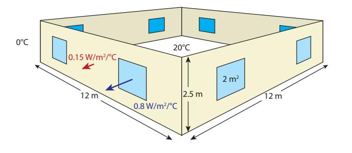
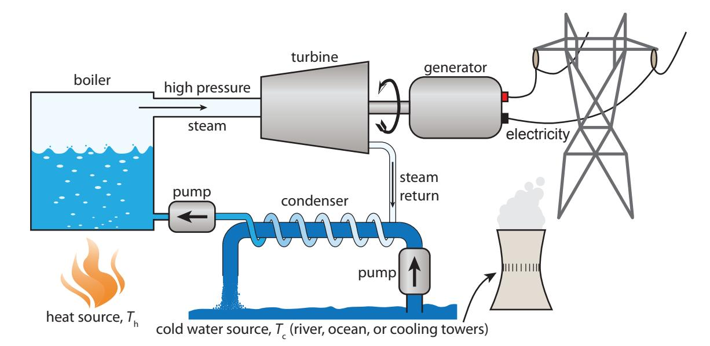
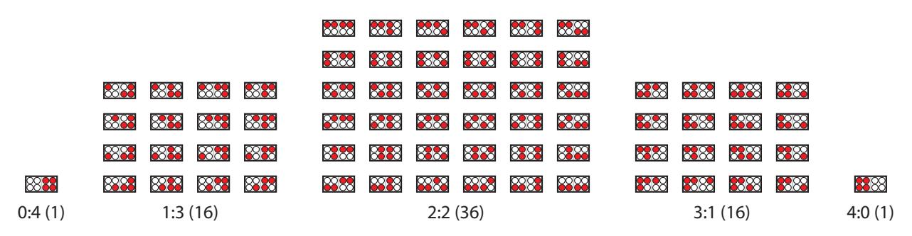
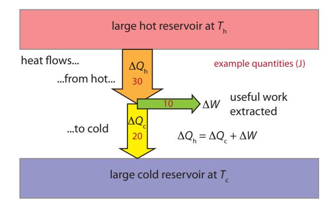
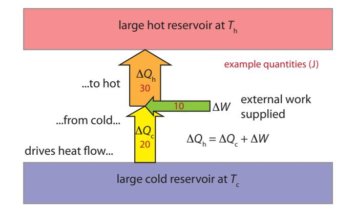
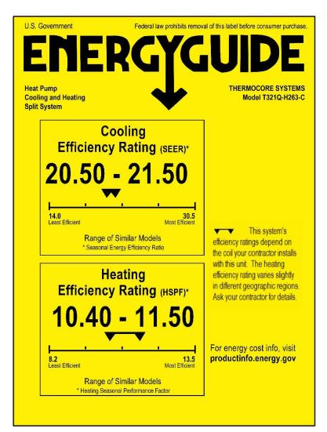

(chap:thermalenergy)= 
# Putting Thermal Energy to Work

We have already encountered [thermal energy](#page-456-0) in two contexts. The first was [infrared radiation](#page-450-0) (Eq. [1.8; p.10\)](#page-29-0), and the second was in the definition of the [kilocalorie](#page-450-1) (Sec. [5.5; p.](#page-92-0) [73\)](#page-92-0). Otherwise, heat has often been treated as a form of "waste" in a chain of energy conversion: friction, air resistance, etc. The insinuation was that heat is an unwanted byproduct of no value.

Yet 94% of the energy we use today is thermal in nature [\[34\]](#page-433-0): we *burn* a lot of stuff for energy!1 Sometimes heat is what we're after, but how can we use it to fly airplanes, propel cars, and light up our screens? This chapter aims to clarify how heat is used, and explore limits to the efficiency at which heat can perform non-thermal [work.](#page-457-0)Like the previous chapter, this topic represents a slight detour from the book's overall trajectory, which otherwise aims to build a steady narrative of what we *can't* expect to continue doing, what options we *might* use to change course, and finally how to bring about such change. Nonetheless, the way we utilize thermal energy is a key piece of the story, and relates to both current and future pathways to satisfying our energy demands.

### **6.1 Generating Heat**

Before diving in to thermal issues, let's do a quick run-down of the various ways we can generate heat.

**Example 6.1.1 Ways to Generate Heat**: Roughly arranged according to degree of sophistication:
- 1. Rub your hands together (or other forms of friction).
- 2. Harvest sunlight, possibly concentrating it, for heat; drying clothes outside and letting sunlight warm a room through a window are examples.
- 3. Access [geothermal](#page-448-0) heat in select locations.
- 4. Burn wood in a fireplace or stove.
- 5. Burn a fossil fuel for direct heat; gas is often used in homes for space heating, as well as for heating water and cooking.
- 6. Run electrical [current](#page-444-0) through a coil of wire that glows orange; seen in toaster ovens, hair dryers, space heaters.
- 7. Use electricity to run a [heat pump](#page-449-0) [\(Section](#page-114-0) [6.5\)](#page-114-0).
- 8. Allow nuclear material to undergo [fission](#page-447-0) in a controlled chain reaction.
- 9. Contrive a plasma hot enough to sustain nuclear [fusion—](#page-448-1)as the sun has done for billions of years.

[\[34\]](#page-433-0): U.S. Energy Inform. Administration (2011), *Annual Energy Review*

1: The exceptions are wind, hydroelectricity, and solar.

*© 2022 T. W. Murphy, Jr.; [Creative Commons Attribution-NonCommercial 4.0 International Lic.;](https://creativecommons.org/licenses/by-nc/4.0/) Freely available at: [https://escholarship.org/uc/energy\\_ambitions.](https://escholarship.org/uc/energy_ambitions)*

A locomotive engine as an example heat engine. Photo credit: [South Australian Govern](#page-373-0)[ment Photographer.](#page-373-0)

# **6.2 Heat Capacity**

First, we'll connect a basic thermal concept to something we already covered in [Sec.](#page-92-0) [5.5](#page-92-0) (p. [73\)](#page-92-0) in the context of the [calorie.](#page-443-0) The statement that it takes 1 [kcal](#page-450-2) to heat 1 kilogram of H2O by 1°C is in effect defining the *specific heat capacity* of water. In [SI](#page-455-0) units, we would say that H2O has a specific [heat capacity](#page-448-2) of 4,184 J/kg/°C.2 Very few substances top water's specific heat capacity. Most liquids, like alcohols, tend to be in the range of 2,000 J/kg/°C. Most non-metallic solids (and even air) come in around 1,000 J/kg/°C. Metals are in the 130–900 J/kg/°C range—lighter metals at the top, and heavier ones at the lower end.3 [Table](#page-104-1) [6.1](#page-104-1) provides a sample of specific heat capacities for common substances.Knowing the specific heat capacity of a substance allows us to compute how much energy it will take to raise its temperature. A useful and approximate guideline is to treat water as 4,000 J/kg/◦C and *all other stuff* (air, furniture, walls) as 1,000 J/kg/◦C. Mixtures, like food, might be somewhere between, at 2,000–3,500, due to high water content. If in doubt, 1,000 J/kg/◦C is never going to be *too* far off. For estimation purposes, deviate from this only for high water-content4 case or for metals.5

**Example 6.2.1** A 2,000 kg pick-up truck is transporting a one-cubicmeter container of water. How much energy will it take to raise the temperature of the whole ensemble by 5◦C?

A cubic meter of water (1,000 L) is 1,000 kg and has a heat capacity around 4,000 J/kg/◦C; the truck is mostly steel, so we might guess 500 J/kg/◦C. Multiply each specific heat capacity by the respective mass and the 5 degree change to get 20 MJ to heat the water and 5 MJ to heat the truck for a total of 25 MJ.6

**Table 6.1:** Specific heat capacities of common materials.

| Substance      | J/kg/°C     |
|----------------|-------------|
| steel          | 490         |
| rock, concrete | 750–950     |
| glass          | 840         |
| aluminum       | 870         |
| air            | 1,005       |
| plastic        | 1,100–1,700 |
| wood           | 1,300–2,000 |
| alcohol        | 2,400       |
| flesh          | 3,500       |
| water          | 4,184       |

2: For temperature changes, it is always possible to interchange per-degrees-Celsius and per-Kelvin because the two are only different by a constant offset, so that any *change* in temperature is the same measure in both.

3: The pattern here is that substances like water or alcohols containing light atoms like hydrogen have higher heat capacities than substances like metals containing heavier atoms.

4: . . . go as high as 4,000 J/kg/◦C in this

5: . . . 500 for heavier metals like steel; although light metals like aluminum are not far from 1,000 J/kg/ $\u00b0$ C

6: Notice that the water demands far more energy to heat, even though it is half the mass.

To perform computations using specific heat capacity, try an intuitive approach rather than some algorithmic formula.7 The following should just make a lot of sense to you, and can guide how to put the pieces together: it takes *more energy* to heat a *larger* mass **or** to raise the temperature by a *larger* amount. It's all proportional. The units also offer a hint. To go from specific heat capacity in J/kg/◦C to energy in J, we need to multiply by a mass and by a temperature change.

**Example 6.2.2** To compute the amount of energy it will take to heat a 30 kg piece of furniture8 by 8  $^{\circ}$ C, we will multiply the specific heat capacity by the mass—to capture the “more mass" quality—and then multiply by the temperature change—to reflect the “more temperature change" element. In this case, we get 240 kJ.
8: ... assuming 1,000 J/kg/ $^{\circ}$ C# **6.3 Home Heating/Cooling**

Our personal experience with [thermal energy](#page-456-0) is usually most connected to heating a living space and heating water or food. Indeed, about two-thirds of the energy used in residential and commercial spaces9 and fuel oil relate to thermal tasks, like heating or cooling the spaces, heating water, refrigeration, drying clothes, and cooking.

When it comes to heating (or cooling) a home, we might care about two things:

- I how long will it take to change its temperature by some certain amount; and
- I how much energy it will take to keep it at the desired temperature.

The first depends on how much stuff is in the house,10 how much Δ푇 10: . . . including walls, furniture, air you want to impart, and how much power is available to create11 The energy required is mass times Δ푇 times the catch-all 1,000 J/kg/◦C specific heat capacity. The time it takes is then the energy divided by the available [power.](#page-453-0)

**Example 6.3.1** How long will it take to heat up the interior of a mobile home from 0◦C to 20◦C using two 1,500 W space heaters? We'll assume that we must heat up about 6,000 kg of mass.12 12: Only 300 kg is in the form of air: most of

The first job is to find the energy required and then divide by power and ceiling. to get a time. We'll use the good-for-most-things specific heat capacity of 1,000 J/kg/◦C.

Multiplying the specific heat capacity by mass and temperature change results in 120 MJ of energy. At a rate of 3,000 W, it will take 40,000 s to inject this much energy, which is about 11 hours.

How much it takes to *maintain* temperature depends on how heat flows out of (or into) the house through the windows, walls, ceiling, floor, 7: Although, this would be a good opportunity for a student to make up their *own* formula, driving home the concept and the fact that equations simply capture a concept. Also, the choice of symbols is arbitrary, which the experience would reinforce.

8: ... assuming 1,000 J/kg/°C

9: . . . in the form of natural gas, electricity,

10. . . . including walls, furniture, air

11: . . . or to remove, if cooling the heat.

the mass to be heated is in the walls, floor,

Kelvin

and air gaps. But it also depends *linearly* on Δ푇—the difference between inside and outside temperatures—that is being maintained. A house can be characterized by its [heat loss rate](#page-449-1) in units of Watts per degree Celsius.13 13: . . . or equivalently, Watts per degree This single number then indicates how much power is needed to maintain a certain Δ푇 between inside and outside. [Box](#page-106-0) [6.1](#page-106-0) explores an example of how to compute the heat loss rate for a house, and [Example](#page-106-1) [6.3.2](#page-106-1) applies the result to practical situations.

**Figure 6.1:** External walls and windows for the house modeled in [Box](#page-106-0) [6.1.](#page-106-0) The floor and ceiling are not shown. The numbers in W/m2/ ◦C are [U-values,](#page-457-1) and in this case represent the very best engineering practices. Most houses will have larger values by factors as high as 2–6. Don't forget the door in a real house!

#### **Box 6.1: House Construction**

The very best practices result in a snugly-built house qualified as
a "Passive House," achieving 0.15 W/°C *for each square meter* of external-interfacing surface14 and 0.8 W/°C per square meter of windows.
  
14: ...outer walls, ceiling-to-
unconditioned attic, floor-to-crawl-spaceLet's imagine a house having a square footprint 12 m by 12 m, walls 2.5 m high, each of the four walls hosting two windows, and each window having an area of 2 m2 [\(Figure](#page-106-2) [6.1\)](#page-106-2). The floor and the ceiling are both 144 m2, and the wall measures (perimeter times height)  $48 \times 2.5 = 120$  m2. But we deduct 16 m2 for the eight windows, leaving 104 m2 for the walls. The resulting heat loss measure for the house is 13 W/°C for the windows (0.8 W/m2/°C × 16 m2), plus 59 W/°C for the walls/floor/ceiling for a total of 72 W/°C.The loss rate for a *decently*-constructed house might be about twice this, while a *typically*-constructed house (little attention to efficiency) might be 3–6 times this—several hundred W/◦C. Of course, smaller houses have smaller areas for heat flow and will have smaller loss rates.

**Example 6.3.2** Let's compare the requirements to keep three different houses at 20°C while the temperature outside is 0°C (freezing point). The first is a snugly-built house as described in [Box](#page-106-0) [6.1,](#page-106-0) where we round the [heat loss rate](#page-449-1) to a more convenient 75 W/°C. We'll then imagine a decently built house at 150 W/°C, and a more typical15 15: . . . not "thermally woke" house at 300 W/°C.The temperature difference, Δ푇, is 20◦C, so that our super-snug house

unconditioned attic, floor-to-crawl-space

The numbers used to characterize heat loss properties of walls and windows are called [U-values,](#page-457-1) in units of W/m2/°C, where low numbers represent better insulators. In the U.S., building materials are described by an inverse measure, called the [R-value,](#page-455-1) in ugly units of °F ·ft2 · hr/Btu. The two are numerically related as  $R = 5.7/U$ , so that our Passive House wall has  $R \approx 38$  and the windows have  $R \approx 7$ —both rather impressive and hard to achieve.15: ...not "thermally woke"

*© 2022 T. W. Murphy, Jr.; [Creative Commons Attribution-NonCommercial 4.0 International Lic.;](https://creativecommons.org/licenses/by-nc/4.0/) Freely available at: [https://escholarship.org/uc/energy\\_ambitions.](https://escholarship.org/uc/energy_ambitions)*

will require 75 W/◦C times 20◦C, or 1,500 W16 to keep it warm, while 16: . . . a single space heater the decent house needs 3,000 W and the shoddy house needs 6,000 W.

Once we understand how much power it takes to maintain a certain temperature ( $\Delta T$ ) in a house, we can anticipate the behavior of the house's heater. Heaters are typically either on full-blast or off. Regulation is achieved by turning the heat on and off—usually controlled by a thermostat. Given the *rating* of a heater, it is then straightforward to anticipate the [duty cycle:](#page-445-0) the percentage of time it has to be on to produce an *average* output meeting the power requirement for some particular  $\Delta T$ .17
In a sensible world, heaters are characterized by W (or kW). In the U.S., the measure for many appliances is Btu/hr. Since 1 Btu is 1,055 J and one hour is 3,600 s, one Btu/hr equates to 0.293 W.18 A whole house heater—sometimes in the form of a furnace—might be rated at 30,000 Btu/hr (about 10 kW), in which case the three outcomes in [Example](#page-106-1) [6.3.2](#page-106-1) would require the heater to be on about 15%, 30%, or 60% of the time19 to maintain  $\Delta T = 20$  [19](#page-445-0): These are [duty cycles.](#page-445-0) °C in the three houses.It is also possible to assess how much  $\Delta T$  the foregoing heater could maintain in the three houses. It should stand to reason that a house requiring 100 W/°C and having a 10,000 W heater can support a  $\Delta T$  as high as 100°C.[20](#page-107-1) Thus, the three houses from [Example 6.3.2](#page-106-1) could support  $\Delta T$  values of 133°C, 67°C, and 33°C if equipped with a 10 kW (~30,000 Btu/hr) heater. The snug house does not need such a powerful heater installed. The poorly built house can maintain a  $\Delta T = 33$ °C differential at full-blast, which means that if the temperature drops below −13°C (8.6°F) outside, it will not be able to keep the inside as high as 20°C. So a house in a cold climate should either be built to better thermal standards, or will require a bigger heater—costing more to heat the home.[21](#page-107-1)Cooling a home (or refrigerator interior, or whatever) is also a thermal place warmer. process, but in this case involves *removing* thermal energy from the cooler environment. Removing heat is harder to do, as witnessed by the length of human history that has utilized heating sources—starting with fire—compared to the relatively short amount of time when we have been able to produce cooling on demand.22 22: In fact, we've had the word "warmth" [Section](#page-114-0) [6.5](#page-114-0) will get into how this is even possible, in principle. For now, just be aware that the rating on air conditioners uses the same units as heaters: how much thermal energy can be moved (out of the cooler environment) per unit time. In [SI](#page-455-0) units, we know this as the Watt. In the U.S., it's Btu/hr.

### **6.4 Heat Engines**

Now we get to the part where thermal energy can be used to do something other than just provide direct heat to a home. It may seem odd to always

16: ... a single space heater

ered when operating at full capacity.

18: 1,055 J in 3,600 s is 0.293 J/s.

19: These are duty cycles.

Second, rather than rely on an equation, or memory about whether the 100 W/◦C and 10,000 W should be divided or multiplied, try to internalize the meaning of each, or at least use the units as a guide. Then, the appropriate math manipulation becomes more obvious.

lower internal temperature or move some-

for a long time, but have not even gotten around to inventing the word "coolth" yet.

characterize burning fuel as a purely *thermal* action, since what transpires within the cylinder of a gasoline-burning internal combustion engine seems like more of a little *explosion* than just the generation of heat. This is not wrong, but neither is it the whole story. The process still begins as a fundamentally thermal event. When the fuel-air mixture ignites, the temperature in the cylinder increases dramatically. To appreciate what happens as an immediate consequence, we turn to the ideal gas law:

$$
PV = Nk_{\rm B}T.
$$
 (6.1)

 $P$ ,  $V$  and  $T$  are pressure, volume, and temperature (in N/m2, m3, and Kelvin).  $N$  is the number of atoms or molecules, and  $k_B = 1.38 \times 10^{-23}$  J/K is the [Boltzmann constant,](#page-442-0) which we will see again in Sec. [13.2](#page-218-0) [\(p.199\).](#page-218-0) The temperature rise upon ignition is fast enough that the cylinder volume does not have time to change.[23](#page-108-0) [Eq.](#page-108-0) [6.1](#page-108-0) then tells us that the pressure must also spike when temperature does, all else being held constant. The increase in pressure then pushes the piston away, increasing the cylinder volume and performing [work.](#page-457-0)[24](#page-457-0) But it all starts thermally, via a sharp increase in temperature.

23: The moving piston allows the volume to change, but on slower timescales.

24: Work is measured as pressure times the change in volume. Pressure is force per unit

In the most general terms, thermal energy tries to flow from hot to cold—out of a pot of hot soup; or into a cold drink from the surrounding air; or into your feet from hot sand. Some part of this flow can manifest as physical work, at which point the system can be said to be acting as a [heat engine.](#page-449-2)

**Definition 6.4.1** *A [heat engine](#page-449-2) is loosely defined as any system that turns heat, or [thermal energy](#page-456-0) into mechanical energy: moving stuff.*

#### **Example 6.4.1 Example heat engines**: when heat drives motion.

- 1. Hot air over a car's roof rises, gaining both [kinetic energy](#page-450-3) and [gravitational potential energy;](#page-448-3)
- 2. Wind is very similar, in that air in contact with the sun-heated ground rises and gains [kinetic energy](#page-450-3) on an atmospheric scale;
- 3. The abrupt temperature increase in an internal combustion cylinder drives a rapid expansion of gas within the cylinder;
- 4. Steam in a power plant races though the [turbine](#page-457-2) because it is flowing to the cold condenser.

The last example deserves its own graphic, as important as this process is in our lives: almost all of our electricity generation—from all the fossil fuels and even from nuclear fission—follows this arrangement. [Figure](#page-109-1) [6.2](#page-109-1) illustrates the basic scheme. [Table](#page-108-1) [6.2](#page-108-1) indicates that 98% of our electricity involves turning a [turbine](#page-457-2) on a shaft connected to a [generator,](#page-448-4) and 84% involves a thermal process as the motive agent for the turbine—most often in the form of steam.

This is the physicist's version, which looks a little different than the chemist's  $PV = nRT$ . For a comparison, see Sec. [B.4](#page-400-0) (p. [381\).](#page-400-0)to change, but on slower timescales.

change in volume. Pressure is force per unit area, so the units work out to force times distance, as they should given the definition of [work.](#page-457-0)

**Table 6.2:** Schemes for electricity generation. Most are thermal in nature, and nearly all employ a turbine and generator. Data for 2018 from Table 8.2a of [\[34\]](#page-433-0).

| Source      | % elec. in U.S. | therm. | turb./gen. |
|-------------|-----------------|--------|------------|
| Nat. Gas    | 35.3            |        | ✓          |
| Coal        | 27.3            | ✓      | ✓          |
| Nuclear     | 19.2            | ✓      | ✓          |
| Hydroelec.  | 7.0             |        | ✓          |
| Wind        | 6.6             |        | ✓          |
| Solar PV    | 2.2             |        |            |
| Biomass     | 1.5             | ✓      | ✓          |
| Oil         | 0.6             | ✓      | ✓          |
| Geotherm.   | 0.4             | ✓      | ✓          |
| Sol. Therm. | 0.09            | ✓      | ✓          |

**Figure 6.2:** Generic power plant scheme, in which some source of heat at 푇h generates steam that flows toward the condenser—where the steam cools and reverts to liquid water, by virtue of thermal contact to a cool source at 푇c provided by a body of water or evaporative cooling towers. Along the way, the rushing steam turns a turbine connected to a generator, exporting electricity. This basic arrangement is employed for most power plants using fossil fuels, nuclear, solar thermal, or geothermal sources of heat.

### **6.4.1 Entropy and Efficiency Limits**

A deep and powerful piece of physics intervenes to limit how much useful work may be extracted out of a flow of heat from a hot source at temperature 푇h to a cold source at temperature 푇c. That piece is [entropy.](#page-446-0) You don't need to fully grasp the deep and subtle concept of entropy in order to follow the development in this chapter and understand the role entropy plays in limiting heat engine efficiency. All the same, it is a stimulating topic that we'll dip a toe into for some appreciation.

**Definition 6.4.2** *Entropy is a measure of how many ways a system might be organized at the microscopic level while preserving the same internal energy.*25 25: E.g., at constant temperature, pressure,

This definition may be an obscure disappointment to those expecting entropy to be defined as a measure of *disorder*. Consider a gas maintained at constant pressure, volume, and temperature—thus fixing the total energy in the gas. The atoms/molecules comprising the gas can arrange into a staggeringly large number of configurations: any number of positions, velocities, rotational speeds and axis orientations, or vibrational states of each molecule, for instance—all while keeping the same overall energy.

**Example 6.4.2** To illustrate, consider a tiny system containing 3 molecules labeled A, B, and C, having a total energy of 6 units split volume.

26 26: Entropy is indeed *related* to disorder, in that there are many more ways to configure matches in a mess than there are ways to neatly stack them.

between them in some way. They can all have exactly 2.0 units of energy apiece, or can have individual energies of 1.2, 1.8, and 3.0 units; or 3.2, 0.4, and 2.4; or any other of myriad combinations adding to the same thing. Entropy provides a measure of how many combinations27 binations. are possible.

27: It is far beyond the scope of this book to detail the counting scheme, but it is perhaps important to appreciate that energy levels are discrete—or *quantized*—which prevents an infinite number of possible energy com-

**Figure 6.3:** A box containing 4 atoms or molecules of one type (white) and 4 of another type (red) has many more configurations available (number in parentheses) when species are equally distributed so that left and right sides both have two of each. Entropy is related to the number of ways a system can distribute itself (at the same energy level), acting to favor disordered mixing over (improbable) orderly separation.

**Example 6.4.3** To better elucidate the connection between entropy and disorder, imagine a box of air, containing both N2 and O2 molecules. As [Figure](#page-110-0) [6.3](#page-110-0) illustrates, a thoroughly-mixed arrangement has a larger number of possible configurations, thus the highest entropy. Nature does not give rise to spontaneous organization in a closed system.28 28: It is, however, possible to see lowered

The First Law of Thermodynamics is one we already encountered as [conservation of energy:](#page-444-1)

**Definition 6.4.3** *First Law of Thermodynamics: the energy of a closed system is* conserved*, and cannot change if nothing—including energy enters or leaves the system boundaries.*

Now we are ready for the Second Law.

**Definition 6.4.4** *Second Law of Thermodynamics: the total entropy of a closed system* may never decrease*.*

It is entropy that governs *which way* heat flows (hot to cold, if left alone) and in a deep sense defines the "arrow of time."

#### **Box 6.2: The Arrow of Time**

Consider that if you were shown videos of a rock splashing into water, a coffee mug shattering on the floor, or an icicle melting, you would have no difficulty differentiating between the forward and reverse playbacks of the video.

The reverse action, you would conclude, is preposterous and can

entropy in one place if balanced by an increase elsewhere: life organizes matter, but at the expense of increased entropy in the wider universe.

never happen. Pieces of ceramic strewn about the floor will never spontaneously assemble into a mug and leap from the floor! Energy is not the barrier, because the total energy in all forms is the same29  
29: ... provided that the system boundary before and after. It's entropy: the more ordered states are less likely to spontaneously emerge. To appreciate how pervasive entropy is, imagine how easy it is to spot a "fake" video run backwards.These two laws of thermodynamics, plus a way to quantify entropy changes that we will see shortly, are all we need to figure out the maximum efficiency a [heat engine](#page-449-2) can achieve in delivering work. If we draw an amount of heat,  $\Delta Q_h$  from a hot bath30 at temperature  $T_h$ , and allow part of this energy to be "exported" as useful work,  $\Delta W$ , then we must have the remainder flow as heat ( $\Delta Q_c$ ) into the cold bath at temperature  $T_c$ . [Figure](#page-111-0) [6.4](#page-111-0) offers a schematic of the process. The First Law of Thermodynamics31 requires that  $\Delta Q_h = \Delta Q_c + \Delta W$ , or that all [conservation of energy](#page-444-1) of the extracted heat from the hot bath is represented in the external work and flow to the cold bath: nothing is lost.

So where does entropy come in? Extracting heat from the hot bath in the amount  $\Delta Q_h$  results in an entropy change in the hot bath according to [Definition](#page-111-1) [6.4.5.](#page-111-1)**Definition 6.4.5** *Entropy Change*: when energy (heat,  $\Delta Q$ , in J) is moved into or out of a thermal bath at temperature  $T$ , the accompanying change in the bath's entropy,  $\Delta S$ , obeys the relation:
$$
\Delta Q = T \Delta S. \tag{6.2}
$$

When heat is removed, entropy is reduced. When heat is added, entropy increases. The temperature,  $T$ , must be in Kelvin, and entropy is measured in units of J/K.So the extraction of energy from the hot bath results in a *decrease* of entropy in the hot bath of  $\Delta S_h$  according to  $\Delta Q_h = T_h \Delta S_h$ . Meanwhile,  $\Delta S_c$  of entropy is *added* to the cold bath according to  $\Delta Q_c = T_c \Delta S_c$ . The Second Law of Thermodynamics enforces that the *total* change ina constant temperature that is large enough not to appreciably change its temperature upon extraction of some amount of thermal energy,  $\Delta Q$ .31: ... conservation of energy

**Figure 6.4:** Heat engine energy balance. Heat flowing from the hot bath to the cold bath can perform useful work,  $\Delta W$ , in the process—subject to [conservation of energy](#page-444-1) ( $\Delta Q_h = \Delta Q_c + \Delta W$ ), where  $\Delta Q$  is a heat flow. Entropy constraints limit how large  $\Delta W$  can be. Arrow widths are proportional to energy, and red numbers are example energy amounts, for use in the text.**Table 6.3:** Thermodynamic symbols.

| Symbol        | Describes (units)    |
|---------------|----------------------|
| $T$           | temperature (K)      |
| $\Delta T$    | temp. change (K,°C)  |
| $\Delta Q$    | thermal energy (J)   |
| $\Delta W$    | mechanical work (J)  |
| $\Delta S$    | entropy change (J/K) |
| $\varepsilon$ | efficiency           |
| $\eta$        | entropy ratio        |

entropy may not be negative (it can't decrease). In equation form (symbol definitions in [Table 6.3\)](#page-111-2):32
  
32: Remember: treat equations as *sentences*.
$$
\Delta S_{\text{tot}} = \Delta S_{\text{c}} - \Delta S_{\text{h}} \ge 0,\tag{6.3}
$$

where we have subtracted  $\Delta S_h$  since it was a *deduction* of entropy, while  $\Delta S_c$  is an addition. We therefore require that
$$
\Delta S_{\rm c} \ge \Delta S_{\rm h}.\tag{6.4}
$$

Now we are in a position to ask what fraction of  $\Delta Q_h$  can be diverted to useful work ( $\Delta W$ ) within the constraints of the Second Law. We express this as an efficiency,33 denoted by the Greek epsilon:
$$
\varepsilon = \frac{\Delta W}{\Delta Q_h} = \frac{\Delta Q_h - \Delta Q_c}{\Delta Q_h}.
$$

(6.5)

The second step applies [conservation of energy:](#page-444-1)  $\Delta Q_h = \Delta Q_c + \Delta W$ .**Example 6.4.4 Actual Efficiency**: If a heat engine is observed to remove 30 J from the hot bath and deposit 20 J into the cold bath, as in [Figure](#page-111-0) [6.4,](#page-111-0) what is the efficiency of this heat engine in producing useful work?Whether we deduce that  $\Delta W = 10$  J and use the first form in [Eq. 6.5](#page-112-0) or apply the second form using the given heat flows, the answer is 1/3, or 33%.We can add a step to [Eq. 6.5](#page-112-0) to express it in terms of entropy changes:
$$
\varepsilon = \frac{\Delta W}{\Delta Q_h} = \frac{\Delta Q_h - \Delta Q_c}{\Delta Q_h} = \frac{T_h \Delta S_h - T_c \Delta S_c}{T_h \Delta S_h},
$$
(6.6)

where we have re-expressed each  $\Delta Q$  as an equivalent  $T\Delta S$  withdrawal/deposit of entropy. Now we can divide both numerator and denominator by  $\Delta S_h$  to be left with
$$
\varepsilon = \frac{T_{\rm h} - T_{\rm c} \eta}{T_{\rm h}},
$$
(6.7)

where we create  $\eta$  (eta) to represent the ratio of entropies:  $\eta = \Delta S_c / \Delta S_h$ , which we know from [Eq.](#page-112-1) [6.4](#page-112-1) cannot be smaller than one:34 34: If  $A \ge B$ , then we know that  $A/B \ge 1$ .
$$
\eta \ge 1. \tag{6.8}
$$

Looking at [Eq.](#page-112-2) [6.7,](#page-112-2) if we want the highest possible efficiency in extracting work from a flow of heat, we want the numerator to be as large as possible. To achieve this, we want to subtract as little as possible from  $Th$ . If  $\eta$  were allowed to be very large, then the numerator would be reduced. So we want the *smallest possible* value for  $\eta$ , which we know from [Eq.](#page-112-3)*©* 2022 T. W. Murphy, Jr.; [Creative Commons Attribution-NonCommercial 4.0 International Lic.;](https://creativecommons.org/licenses/by-nc/4.0/) Freely available at: [https://escholarship.org/uc/energy\\_ambitions.](https://escholarship.org/uc/energy_ambitions)expressing important concepts in precise ways—not merely as algorithmic machines to memorize for plugging in while solving problems. What does it *say*?33: This definition of efficiency captures what we care about: what fraction of the extracted heat can be turned into useful work.34: If  $A \ge B$ , then we know that  $A/B \ge 1$ .[6.8](#page-112-3) happens when 휂 = 1. We therefore derive the maximum physically allowable efficiency of a heat engine as

$$
\varepsilon_{\text{max}} = \frac{T_h - T_c}{T_h} = \frac{\Delta T}{T_h},
$$
\n(6.9)   
\nthat  $T(K) \approx T(^{\circ}C) + 273$ .

where we have designated  $\Delta T = T_h - T_c$  as the temperature difference between hot and cold baths. A major takeaway is that efficiency improves as  $\Delta T$  gets bigger, and becomes vanishingly small for small values of  $\Delta T$ .**Example 6.4.5** If operating between a hot bath at 800 K and ambient temperature around 300 K,35 35: 300 K is a convenient and reasonable a heat engine could produce a maximum efficiency of 62.5%.

**Example 6.4.6** A heat engine operating between boiling and freezing water has  $T_h \approx 373$  K and  $\Delta T = 100$  K, for a maximum possible efficiency of  $\varepsilon_{max} = 0.268$ , or 26.8%.**Example 6.4.7** A heat engine operating between human skin temperature at 35◦C and ambient temperature at 20◦C has a maximum efficiency of 휀max = 15/308 ≈ 0.05, or 5%.

If the cold bath is fixed,36 the maximum possible efficiency improves as the temperature of the hot source goes up. Conversely, for a given  $T_h$ , the efficiency improves as the cold temperature decreases and thus  $\Delta T$  increases.
[36](#page-2-1): This is a common situation, as  $T_c$  is usually set by the ambient temperature of the air or of a body of water.### **Box 6.3: At the Extreme Limit. . .**

If Tc approaches  $0 K$ [37](#page-113-0), the maximum efficiency approaches 100%. We can trace this back to the relation  $\Delta Q = T \Delta S$ , which implies that when  $T$  is very small, it does not take much heat ( $\Delta Q$ ) to meet the requirement for the amount of entropy added to the cold bath ( $\Delta S_c$ ) to be large enough to satisfy the prohibition on net entropy decrease, so the arrow width in [Figure 6.4](#page-111-0) for  $\Delta Q_c$  can be rather thin (small) allowing  $\Delta W$  to be about as thick (large) as  $\Delta Q_h$ , meaning that essentially all the energy is available to do work and the efficiency can be very high. In practice, Earth does not provide baths cold enough for this effect to kick in, but discussing it is a means to better understand how [Eq. 6.9](#page-113-0) works.
[37](#page-113-0): ... absolute zero temperature, −273°CReal heat engines like power plants [\(Figure](#page-109-1) [6.2\)](#page-109-1) or automobile engines tend to only get about halfway to the theoretical efficiency due to myriad practical challenges. A typical efficiency for an electrical power plant is 30–40%, while cars are typically in the 15–25% range. In contrast, combustion temperatures around 700–800◦C suggest a maximum theoretical efficiency around 60%.

temperature for "normal" environments, corresponding to 27◦C or 80.6◦F.

usually set by the ambient temperature of the air or of a body of water.

37: ...absolute zero temperature, \$-273^{\circ}\$C

### **6.5 Heat Pumps**

We can flip a heat engine around and call it a [heat pump.](#page-449-0) In this case, we *apply* some external work to *drive* a heat flow opposite its natural direction—like pushing heat uphill. This is how a refrigerator38 works, 38: . . . or a freezer, or air conditioner for instance. [Figure](#page-114-1) [6.5](#page-114-1) sets the stage.

38: . . . or a freezer, or air conditioner

**Figure 6.5:** Heat pump energy balance. The application of work (Δ푊; from an electrical source, for instance) can drive heat to flow counterintuitively—from a cold reservoir (like the interior of a freezer) to a hotter environment. Example 푇c → 푇h pairs might include freezer-interior → room-air; cooledinside → summer-outside; winter-outside → warmed-inside. We still must satisfy [con](#page-444-1)[servation of energy](#page-444-1) (Δ푄h = Δ푄c + Δ푊), whereΔ푄 is a heat flow. Entropy constraints limit how large Δ푄c can be for a given Δ푊 input. Arrow widths are proportional to energy, and red numbers are example energy amounts, for use in the text.

A very similar chain of logic can be applied to this configuration, invoking the Second Law to guarantee no entropy decrease. We define the efficiency according to the application and what we care about, giving rise to two different figures of merit.

**Definition 6.5.1**  $\varepsilon_{cool}$ : *For cooling applications,*[39](#page-224-1) *we care about how much heat can be removed from the cooler environment (* $\Delta Q_c$ *) for a given input of work (* $\Delta W$ *). The efficiency is then characterized by the ratio*  $\varepsilon_{cool} = \Delta Q_c / \Delta W$ .**Definition 6.5.2**  $\epsilon$ heat: For heating applications,[40](#page-279-0) we care about the heat
delivered to the hot bath ( $\Delta Q_h$ ) for a given amount of input work ( $\Delta W$ ). The
efficiency is then characterized by the ratio  $\epsilon$ heat =  $\Delta Q_h / \Delta W$ .
[40](#page-279-0): ... home heating via heat pumpThe derivation goes similarly to the one above, but now we require that the entropy *added* to the hot bath must not be smaller than the entropy *removed* from the cold bath so that the total change in entropy is not negative.41 41: Imposing this condition has the result In this case, the maximum allowed efficiencies for cooling and heating via heat pumps are:

$$
\varepsilon_{\text{cool}} \le \frac{T_{\text{c}}}{T_{\text{h}} - T_{\text{c}}} = \frac{T_{\text{c}}}{\Delta T},
$$
(6.10)

$$
\varepsilon_{\text{heat}} \le \frac{T_{\text{h}}}{T_{\text{h}} - T_{\text{c}}} = \frac{T_{\text{h}}}{\Delta T}.
$$

(6.11)

These look a lot like [Eq.](#page-113-0) [6.9,](#page-113-0) but *turned upside down*. The maximum efficiencies can be larger than unity!42 42: See [Box](#page-115-0) [6.4.](#page-115-0)

39. ...freezer, refrigerator, air conditioner

40: ...home heating via heat pump

that  $\Delta S_h \ge \Delta S_c$ ; opposite [Eq.](#page-112-1) [6.4](#page-112-1) since the direction of flow changed.and Temperature must be in Kelvin for these relations.

42: See Box 6.4.

**Example 6.5.1** What is the limit to efficiency of maintaining a freezer at −10◦C in a room of 20◦C?

First, we express the temperatures in Kelvin:  $T_c \approx 263$  K and  $\Delta T = 30$  K.[43](#page-114-3) The maximum efficiency, by [Eq.](#page-114-2) [6.10](#page-114-2), computes to  $\epsilon_{cool} \le 8.8$  (880%).
[43](#page-114-3): Note that  $\Delta T = 30$  in either K or °C.**Example 6.5.2** What is the limit to efficiency of keeping a home interior at 20◦C when it is −10◦C outside?

First, we express the temperatures in Kelvin:  $T_h \approx 293$  K and  $\Delta T = 30$  K.44 The maximum efficiency, by [Eq. 6.11](#page-114-3), computes to  $\varepsilon_{heat} \le 9.8$  (980%).
44: Note that  $\Delta T = 30$  in either K or °C.#### **Box 6.4: Is** >**100% Really Possible?**

At first, it seems to be spooky and impossible that efficiencies can be greater than 100%. [Example](#page-115-1) [6.5.1](#page-115-1) essentially says that as many as 8.8 J of thermal energy can be *moved* for a mere 1 J *input* of work! The situation bears analogy to the martial art of Jiu Jitsu, whereby the opponent's momentum is used to their detriment, requiring little work to direct its flow. In this case, we convince a bundle of thermal energy sitting in the freezer to move outside where it is hotter (uphill; against natural flow) and in the process use less energy than the amount of thermal energy residing in the bundle.

The fact that our "efficiency" metrics come out to be greater than 100% is an illusion: an artifact of how we defined 휀cool and 휀heat. Conservation of energy is not violated; we're just putting the small piece (Δ푊) in the denominator to form the efficiency metric.45 45: Following the example numbers in [Fig-](#page-114-1)In this sense, it's not the usual sort of efficiency measure, which puts the *largest* quantity (total budget) in the denominator.

In the case of heating, it is worth comparing the output of a heat pump to the application of direct heat. Let's revisit the scenarios explored in [Section](#page-105-0) [6.3.](#page-105-0)

**Example 6.5.3** If a house's thermal performance is 150 W/°C and we want to maintain 20°C inside while the outside temperature is a frigid −20°C, we would need to supply 6,000 W of energy[46](#page-293-46) to the home in the form of burning fuel (natural gas, propane, firewood) or electricity for direct-heating application.[47](#page-293-47)
But according to [Eq.](#page-114-3) [6.11,](#page-114-3) a heat pump could theoretically move 6,000 W of thermal energy by only applying 820 W without violating the Second Law, since  $\epsilon$ heat  $\leq$  293/40 = 7.3 and 6,000 J ( $\Delta Q$ h) divided by 7.3 (to get  $\Delta W$ ) is 820 J.48 48: We are solving for  $\Delta W = \Delta Q$ h/ $\epsilon$ heat,Engineering realities will prevent operating right up to the thermody-

43: Note that  $\Delta T = 30$  in either K or °C.

44: Note that  $\Delta T = 30$  in either K or °C.

Maybe the situation can be compared more understandably to money transfers, where one might pay a \$20 fee to wire \$1,000 from account A to account B. It doesn't mean that \$1,000 was created out of \$20—just that \$20 was spent (like Δ푊) to move a much larger sum into account B. But if account A belonged to somebody else, it would seem like you just turned \$20 of your own money into \$1,000 at a gain of 5,000%, even though it really came from elsewhere.

[ure](#page-114-1) [6.5,](#page-114-1) we would say that  $\epsilon_{cool}$ , defined as  $\Delta Q_c / \Delta W$ , is 2.0, and  $\epsilon_{heat}$  is 3.0.to the home in C.

ing 1,500 W

48: We are solving for  $\Delta W = \Delta Q_h/\epsilon_{heat}$ ,  
and consider the energy moved in one second in order to go from W to J.namic limit, but we might at least expect to be able to accomplish the 6,000 W goal of [Example](#page-115-2) [6.5.3](#page-115-2) for under 2,000 W. Thus the heat pump has shaved a factor of three (or more) off the energy required to provide heat inside. Heat pumps are very special.

As [Eq.](#page-114-2) [6.10](#page-114-2) and [Eq.](#page-114-3) [6.11](#page-114-3) imply, heat pumps are most efficient when Δ푇 is small. Thus a refrigerator in a hot garage must not only work harder to maintain a large Δ푇, it does so less efficiently—making it a double-whammy. For home heating, heat pumps offer the most gain in milder climates where Δ푇 is not so brutal.

### **6.5.1 Consumer Metrics: COP, EER, HSPF**

When shopping for heat pumps or air conditioners (or freezers/refrigerators), products are specified by the [coefficient of performance](#page-444-2) (COP) or [energy efficiency ratio](#page-445-1) (EER) or [heating seasonal performance factor](#page-449-3) [\(HSPF\),](#page-449-3) as in [Figure](#page-116-1) [6.6.](#page-116-1) How do these relate to our 휀heat and 휀cool values? The first one is easy.

**Definition 6.5.3** *COP***:** *Heat pumps used for heating are specified by a [coefficient of performance](#page-444-2) [\(COP\)](#page-444-2), which turns out to be familiar already:*
$$
COP = \varepsilon_{\text{heat}}.\tag{6.12}
$$

**Example 6.5.4 COP Example**: Using the red numbers in [Figure 6.5](#page-114-1), we can compute  $\varepsilon$ heat, the COP, and then determine the minimum  $T$ c theoretically permissible (resulting in maximum possible efficiency) if  $T$ h = 300 K.49 49: This corresponds to maintaining theWe go back to the original definition of  $\epsilon_{heat}$  as  $\Delta Q_h / \Delta W$ , which for our numbers works out to 30/10, or 3.0 The COP is then simply 3.0. the context of heating a house.Setting  $\varepsilon_{\text{heat,max}} = T_h / \Delta T$  equal to 3.0, we find that  $\Delta T$  is 100 K, so that the minimum permissible  $T_c = 200$  K in this case.The [EER](#page-445-1) is different, and perhaps a little odd. EER is defined as the amount of heat moved ( $\Delta Q_c$ ), in [Btu,](#page-442-1) per work input ( $\Delta W$ ), in watt-hours [\(Wh\)](#page-457-3). What?! Sometimes the world is just loopy. But we can manage this. If handed an EER (Btu/Wh), we can convert it to our same/same numerator/denominator units by converting both numerator and denominator to the same units. We could convert Btu to Wh in the numerator and be done, or convert Wh to Btu in the denominator and be done, or we could convert both numerator *and* denominator to Joules[50](#page-457-3) to get there. [50](#page-457-3): . . . or any other energy unit of choice For illustrative purposes, we'll pick the last approach. To get from Btu to Joules, we multiply (the numerator) by 1,055. To get from Wh to Joules, we multiply the denominator (or divide the EER construct) by 3,600.[51](#page-457-3) [51](#page-457-3): 1 [watt-hour](#page-457-3) (Wh) is 1 J/s times 3,600 s. The net effect is highlighted in the following definition.

**Figure 6.6:** Typical heat pump energy label in the U.S., showing an EER around 21 and a HSPF around 11. From [U.S. DoE.](#page-373-1)

hotter environment at 27◦C, for instance in

50: . . . or any other energy unit of choice

51: 1 watt-hour (Wh) is 1 J/s times 3,600 s.

**Definition 6.5.4** *EER*: *Heat pumps used for cooling are specified by the [energy efficiency ratio](#page-445-1) [\(EER\)](#page-445-1), which modifies [Eq.](#page-114-2) [6.10](#page-114-2) as follows.*
$$
\varepsilon_{\text{cool}} = \text{EER}\left(\frac{\text{Btu}}{\text{Wh}}\right) \frac{1055 \text{ J/Btu}}{3600 \text{ J/Wh}} = \text{EER} \cdot 0.293,\tag{6.13}
$$

*or the converse*
$$
EER = \frac{\varepsilon_{\text{cool}}}{0.293} \approx 3.41 \times \varepsilon_{\text{cool}}.\tag{6.14}
$$

**Example 6.5.5 EER Example**: Using the red numbers in [Figure](#page-114-1) [6.5,](#page-114-1) we can compute  $\epsilon_{cool}$ , the EER, and then determine the maximum  $T_h$  theoretically permissible (resulting in maximum possible efficiency) given a target  $T_c$  of 260 K, as we might find in a freezer.We go back to the original definition of  $\epsilon_{cool}$  as  $\Delta Q_c / \Delta W$ , which for our numbers works out to 20/10, or 2.0. The EER is then 3.41 times this amount, or 6.8.Setting  $\epsilon_{cool,max} = T_c/\Delta T$  equal to 2.0, we find that  $\Delta T$  is 130 K, so that the maximum permissible  $T_h = 390$  K in this case.Because the theoretical maximum efficiency depends on  $\Delta T$ —according to [Eq.](#page-114-2) [6.10](#page-114-2) and [Eq.](#page-114-3) [6.11](#page-114-3)—and therefore can fluctuate as outdoor temperatures change, a seasonal average is often employed, called the SEER (seasonal EER). In a similar vein, the [HSPF](#page-449-3) measures the same thing as the COP, but in units of EER52 and averaged over the heating season. 52: . . . [Btu/Wh](#page-442-1)**Definition 6.5.5** HSPF: Heat pumps used for heating are sometimes specified by the [heating seasonal performance factor](#page-449-3) [\(HSPF\)](#page-449-3), which modifies [Eq.](#page-114-3) [6.11](#page-114-3) as follows.
$$
\varepsilon_{\text{heat}} = \text{HSPF} \left( \frac{\text{Btu}}{\text{Wh}} \right) \frac{1055 \text{ J/Btu}}{3600 \text{ J/Wh}} = \text{HSPF} \cdot 0.293,\tag{6.15}
$$

*or the converse*HSPF = 
$$
\frac{\varepsilon_{\text{heat}}}{0.293} \approx 3.41 \times \varepsilon_{\text{heat}} = 3.41 \times \text{COP}.
$$
 (6.16)

**Example 6.5.6 HSPF Example**: Using the red numbers in [Figure](#page-114-1) [6.5,](#page-114-1) we can compute  $\varepsilon_{heat}$  and the HSPF.We go back to the original definition of εheat as  $\Delta Q_h / \Delta W$ , which for our numbers works out to 30/10, or 3.0. The COP is then 3.0, and the HSPF is 3.41 times this, or 10.2.Typical COP values for heat pumps range from about 2.5–4.5.[53](#page-21-11) This means an energy savings by a factor of 2.5 to 4.5 for heating a house via heat pump vs. direct electrical heating. Quite a bargain. An air conditioner EER rating is typically in the range 10–20, corresponding to 3–6 in terms of εcool—similar to the range for heat pumps in heating

[53](#page-21-11): . . . mapping to HSPF from ~8–15

53: ...mapping to HSPF from ~8-15

mode.54 Houses equipped with electric heat pumps can typically be run for both cooling and heating applications, making them a versatile and efficient solution for moving thermal energy in or out of a house.

54: [EER](#page-445-1) and [HSPF](#page-449-3) numbers are "inflated"

Heat pumps leveraging the moderate-temperature ground just below the surface as the external thermal bath are called "geothermal" heat pumps, but have nothing to do with [geothermal](#page-448-0) energy (as a source). Compared to heat pumps accessing more extreme outside air temperatures, geothermal heat pumps benefit from a smaller Δ푇, and thus operate at higher efficiency.

# **6.6 Upshot on Thermal Energy**

Sometimes we just want heat. Cooking, home heating, and materials processing all need direct heat. Burning fossil fuels, firewood, biofuels, extracting geothermal energy, or simply letting the sun warm our houses all directly utilize thermal energy. Specific [heat capacity](#page-448-2) tells us how much [thermal energy](#page-456-0) is needed to change something's temperature, using 1,000 J/kg/°C as a rough guess if lacking more specific information.55 We also saw how to estimate home heating demand using a metric of [heat loss rate,](#page-449-1) such as 200 W/°C.But it turns out that we use heat for much more than this. 84% of our electricity is produced by heat engines, using heat flow to drive a [turbine](#page-457-2) to turn a [generator.](#page-448-4) The maximum efficiency a heat engine can achieve is set by limits on entropy and amounts to 휀max &lt; Δ푇/푇h, although in practice we tend to be a factor of two or more short of the thermodynamic limit.56 56: Typical efficiencies are 20% for cars and In any case, thermal energy plays a giant role in how we run our society.

Heat pumps are like heat engines in reverse: driving a flow of thermal energy against the natural hot-to-cold direction by putting in work. Any refrigeration or cooling system is likely to use this approach.[57](#page-10-0) Because heat pumps only need to *move* thermal energy, each Joule they move can require a small fraction of a Joule to accomplish, making them extremely clever and efficient devices.# **6.7 Problems**

- 1. How many Joules does it take to heat your body up by 1◦C if your (water-dominated) mass has a specific heat capacity of 3,500 J/kg/◦C?
- 2. How long will it take a space heater to heat the air58 in an empty room by 10◦C if the room has a floor area of 10 m2 and a height of 2.5 m and the space heater is rated at 1,500 W? Air has a density59 59: Use density to get at the mass of air.

by a factor of 1/0.293 ≈ 3.41 compared to [COP](#page-444-2) due to the unfortunate choice of units for EER and HSPF.

4,184 J/kg/◦C, connected to the definition of a [kcal.](#page-450-2)

35% for power plants—compared to 60% theoretical.

ing.

58: We only consider the air for this problem, and ignore other objects—including walls and furniture—that would add substantially to the time required in real life.

59: Use density to get at the mass of air.

of 1.25 kg/m3 . Express your answer as an approximate number in minutes.- 3. When you put clothes on in the morning in a cool house at 15◦C, you warm them up to something intermediate between your skin temperature (35◦C) and the ambient environment.60 60: The inside surface of the clothing will If your clothes have a mass of 2 kg, how much energy must be deposited into the clothes? If you are emitting power at 100 W, how long will this take?
- 4. You score this massive 1 kg burrito but decide to put it in the refrigerator to eat later. It comes out at 5◦C, and you want to heat it in the microwave up to 75◦C before eating it. If the microwave puts energy into the burrito at a rate of 700 W.61 61: How long should you run the microwave for a high-water-content burrito having an effective specific heat capacity of 3,000 J/kg/◦C?
- 5. Let's say you come home from a winter vacation to find your house at 5◦C and you want to heat it to 20◦C. Let's say the house contains: 500 kg of air;62 62: . . . appropriate for a 150 m2 1,000 kg of furniture, books, and footprint other possessions; plus walls and ceiling and floor that amount to 6,000 kg of effective63 mass. Using the catch-all specific heat capacity for all of this stuff, how much energy will it take, and how long to heat it up at a rate of 10 kW? Express in useful, intuitive units, and feel free to round, since it's an estimate, anyway.
- 6. In a house achieving a [heat loss rate](#page-449-1) of 200 W/◦C equipped only with two 1,500 W space heaters, what is the coldest it can get outside if the house is to maintain an internal temperature of 20◦C?
- 7. In a house achieving a [heat loss rate](#page-449-1) of 200 W/◦C equipped a 5,000 W heater, what will the internal temperature be if the outside temperature is −10◦C and the heater is running 100% of the time?
- 8. In a super-tight house achieving 100 W/◦C equipped with a 5,000 W heater, what percentage of the time will the heater need to run in order to keep the internal temperature at 20◦C if the temperature outside is at the freezing point?64
- 9. How much will it cost per day to keep a house at 20◦C inside when the external temperature is steady at −5 ◦C using direct electric heating65 if the house is rated at 150 W/ deposition at 100% efficiency ◦C and electricity costs \$0.15/kWh?
- 10. Provide at least one example not listed in the text in which heat flows into some other form of energy.66 66: Think about motion deriving from or In the text, we mentioned hot air over a car, wind, internal combustion, and a steam turbine plant.
- 11. What is the only form of significant electricity production in the

be near skin temperature, and the outside will be near ambient temperature.

*i* Note that a microwave oven might be rated for 1,500 W, but not all the energy ends up in the burrito, so we pick 700 W to be realistic.

62: ...appropriate for a 150 m² footprint

63: *i* We only count half-thickness of exterior walls since they are not heated to the interior temperature all the way to the outside.

64: Hint: compute the average power that would be needed in this case.

65: . . . no heat pump: just straight energy

caused by heat or thermal release.

U.S. that does not involve a spinning shaft?

- 12. If a can of soda (350 mL; treat as water) cools from 20◦C to 0◦C, how much energy is extracted, and how much is the entropy (in J/K) in the can reduced using the average temperature and the relation that Δ푄 = 푇Δ푆?
- 13. What would the maximum thermodynamic efficiency be of some heat engine operating between your skin temperature and the ambient environment 20◦C cooler than your skin?
- 14. We can think of wind in the atmosphere as a giant heat engine67 67: And it really is! operating between the 288 K surface and the top of the troposphere68 at 230 K. What is the maximum efficiency this heat engine could achieve in converting solar heating into airflow?
- 15. Since the sun drives energy processes on Earth, we could explore the maximum possible thermodynamic efficiency of a process operating between the surface temperature of the sun (5,800 K) and Earth's surface temperature (288 K). What is this maximum efficiency?69
- 16. A heat engine pulls 100 J out of a hot bath at 800 K, and transfers 80 J of heat into the cold bath at 300 K. What efficiency does this heat engine achieve in producing useful work, and how does it compare to the theoretical maximum?
- 17. Human efficiency70 70: . . . in terms of converting food energy is in the neighborhood of 25%, meaning that in order to do 100 J of external work, we need to eat 400 J of energy content. To investigate whether human energy is working as a heat engine, figure out what the cold temperature, 푇c, would have to be to achieve this efficiency, thermodynamically.71 Do you conclude that our biochemistry operates as a heat engine, or no?72
- 18. A 350 mL can of soda73 at 20◦C is placed into a refrigerator having an EER rating of 10.0. How much energy will you have to spend (Δ푊) to remove the thermal energy from the soda and bring it to a frosty 0◦C?
- 19. If a refrigerator works at *half* of its theoretical 휀cool limit, how much more energy does it take to maintain an internal temperature of 0 ◦C in a 40◦C garage vs. a 20◦C house interior? Two things are going on here: even at the same efficiency, the cooling energy scales as Δ푇, but the efficiency also changes for a double-whammy.
- 20. Changing from direct electrical heating to a heat pump operating with a COP of 3 means spending one-third the energy for a certain thermal benefit. If a house averages 30 kWh/day in heating cost through the year using direct electrical heating at a cost of \$0.15/kWh, how long will it take to recuperate a \$5,000 installation cost of a new heat pump?

67: And it really is!

68: *i* Atmospheric wind and weather are confined to the lowest layer of the atmosphere, called the troposphere, extending to about 12 km high.

69: We would not expect any solar-derived process to exceed this limit in the Earth environment.

into useful work

71: *i* The hot temperature, 푇h, would be internal body temperature of 37◦C.

72: Hint: do our bodies have regular access to temperatures this cold?

73: Treat as water, and recall that the density of water is one gram per milliliter.