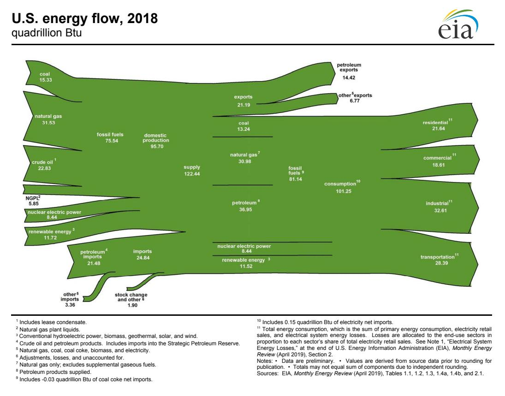
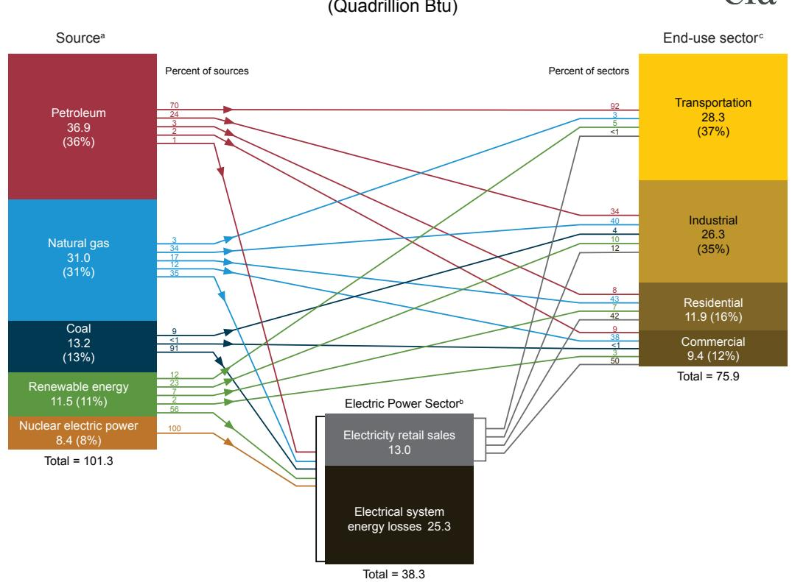
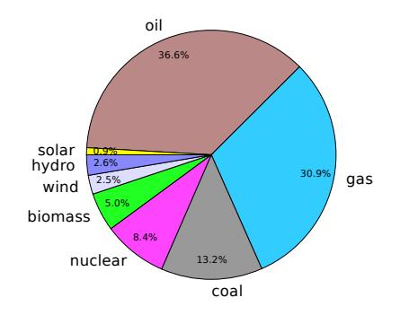
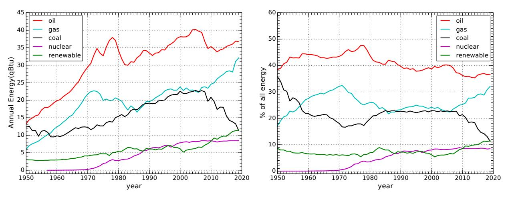
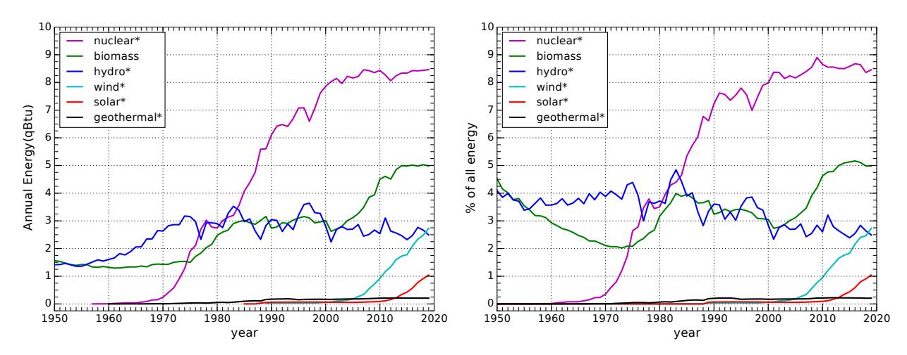
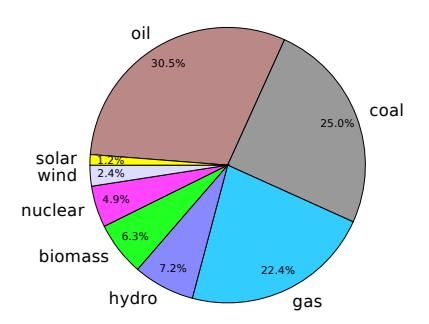
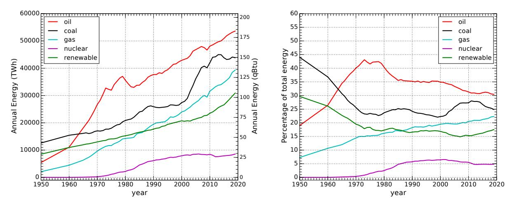
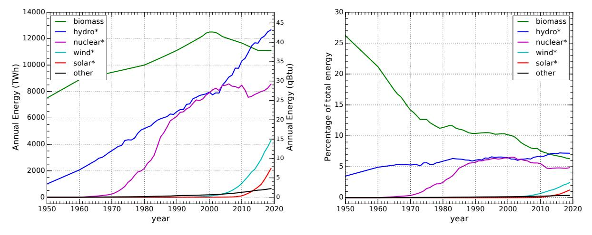
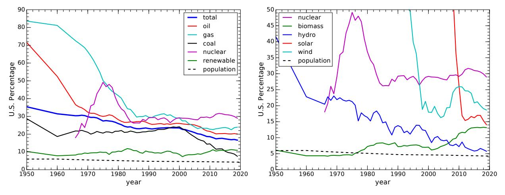

(chap:energylandscape)= 
# The Energy Landscape

Now that we have a handle on common energy units and thermal processes, we can take a look at various sources of energy data and make sense of the information, allowing meaningful cross-comparisons. In this chapter, we will do exactly that, gaining in the process a perspective on the past and present roles different energy sources play at a national and global level.

Most of the information in this chapter comes from the U.S. [Energy](#page-445-0) [Information Administration's](#page-445-0) [\(EIA's\)](#page-445-0) *Annual Energy Review* [\[34\]](#page-433-0), and from a compilation of global data owing to Vaclav Smil and the British Petroleum *Statistical Review of World Energy* [\[16\]](#page-432-0). Rather than laboriously citing each instance, it is sufficient to assume for this chapter that numbers for the U.S. come from the former and global numbers come from the latter, unless stated otherwise.

# **7.1 The Annual Energy Review**

Until 2011, the [Annual Energy Review](#page-441-0) [\(AER\)](#page-441-1) was compiled for the U.S. as an annual report. Since then, a web interface provides access to many of the same products, but not as a single document. An impressive amount of detail is available in the [AER](#page-441-1) products, and we will only scratch the surface in this book, looking at high-level overviews. Later chapters will sometimes rely on deeper information to provide state-by-state use of hydroelectric, solar, wind, etc. But for now, we stick mostly to section 1 of the [Annual Energy Review](#page-441-1) (AER), labeled *Energy Overview*.

An oil pump dominates the foreground, while wind makes a visible presence in the background. Photo credit: Tom Murphy

*© 2022 T. W. Murphy, Jr.; [Creative Commons Attribution-NonCommercial 4.0 International Lic.;](https://creativecommons.org/licenses/by-nc/4.0/) Freely available at: [https://escholarship.org/uc/energy\\_ambitions.](https://escholarship.org/uc/energy_ambitions)*

## **7.1.1 Energy Flow**

Section 1.0 of the [AER](#page-441-1) is a one-page PDF graphic that conveys at a glance the flow of energy into and out of the U.S. [Figure](#page-122-1) [7.1](#page-122-1) shows the 2018 version.

**Figure 7.1:** The flow of energy in the U.S. for 2018, as presented in [\[34\]](#page-433-0). Units are quadrillions of Btu [\(qBtu\)](#page-454-0), unfortunately. From [U.S. EIA.](#page-373-0)

From past experience, many students dislike this graphic. Firstly, it's a product of the [EIA,](#page-445-0) and not a creation of this book. Secondly, it is actually not so bad, once you get the hang of it.

Resources come in from the left. Expenditures or exports go off to the right. The format guarantees that all inputs must match all outputs.1 also see at a glance the big players vs. small players.

To understand, let's start in the middle section. To the left of center, we see that the total supply sums to 122.44[qBtu.](#page-454-0) Of this, we consume 101.25 qBtu (right of center) and export the remaining 21.19 qBtu. Now we focus on the central column to get a powerful visual and quantitative snapshot of how our energy is partitioned.2 From this, we see that 13% is coal, 31% is natural gas, 36.5% is petroleum (oil), 8% is [nuclear energy,](#page-452-0) and 11.5% is [renewable](#page-455-0) energy.31: That is, no significant amount of energy We is stored or drawn from a stockpile.

> 2: By luck, total consumption is very nearly 100 qBtu, so the amount of each source in qBtu is already approximately a percentage!

#### See how they add up?

3: Think of the three forms of [fossil fuels](#page-447-0) as solid (coal), liquid (petroleum/oil) and gas (natural gas; not the same as liquid gasoline, which is a petroleum product).

Now the right-hand side shows the [sectors](#page-455-1) into which the energy flows, finding *roughly* equal distribution between residential (homes), commercial (businesses), industrial (manufacture), and transportation (both personal and commercial/shipping). In this graphic, we lose entirely any sense for how much of each energy source contributes to each sector,4 4: For instance, we cannot tell how much but that is coming in the next section.

Finally, the left-hand side indicates the inputs, grouped as domestic [fossil fuel](#page-447-0) supply at top (out of our own ground), [nuclear energy](#page-452-0) and [renewable](#page-455-0) in the middle, and imports at bottom. From this, we can learn that we export some coal,5 that almost all of our natural gas and 100% of our nuclear is domestic, and that 62% of our petroleum comes from domestic crude oil production.

Other insights are present in the graphic as well. Don't be afraid to subtract or divide numbers to aid new discoveries.

#### **Box 7.1: 100 quads? So what?**

To put the scale into a bit of perspective, 100 [qBtu](#page-454-0) in a year for the U.S. is about 1020 J in a year. A year is 3.156 × 107 seconds long,6 meaning that the U.S. power budget is just over 3 TW ( year. 3 × 1012 W). Distributed among a little over 300 million people, the average contribution per person is about 10,000 W.7 That's a lot. As we have seen in [Sec.](#page-92-0) [5.5](#page-92-0) (p. [73\)](#page-92-0), human metabolism is about 100 W. So Americans have approximately 100 times as much energy available as their personal metabolism. The situation has been compared to each person *having 100 energy servants*! No wonder we live better than royalty of ages past. Even though the U.S. uses about 4.5 times the global energy per capita (about 20% of the world's energy and 5% of population8 ), the average citizen of Earth still has over 20 energy servants available, on average, thanks almost entirely to fossil fuels. They have been an unqualified game changer.

### **7.1.2 Source and Sector**

[Figure](#page-124-0) [7.2](#page-124-0) provides a more detailed breakdown of how energy flows from source to usage [sectors.](#page-455-1) 9 In other words out of the 101.25 qBtu consumed in 2018, we see how much comes from each source, and within each source can track how much goes to each end-use category. For example, we learn that 91% of coal and 100% of nuclear go to electricity, and that 92% of transportation is based on petroleum.

Notice the black and gray block at lower center, representing electricity. We derive electricity from all the sources on the left, and electricity is consumed in all sectors. Also, of the 38.3 qBtu going *into* making electricity, only 13.0 qBtu (34%) makes it out the door as electricity, due to thermodynamic losses that were covered in [Chapter](#page-103-0) [6.](#page-103-0)

coal is used in the industrial sector.

5: For instance, the supply of 15.33 qBtu that is mined is larger than the 13.24 qBtu we consume.

Ask yourself what else you can learn from the numbers!

6: Neat trick: roughly  $\pi \times 10^7$  seconds in a year.7: This showed up in [Table](#page-62-0) [3.4](#page-62-0) (p. [43\)](#page-62-0) and also in [Box](#page-94-0) [5.4](#page-94-0) (p. [75\)](#page-94-0).

8: American energy usage is much higher than average because of consumerism, diet, comfort standards, prevalence of detached housing, and transportation.

9: Notice that the source and end-use numbers in the boxes match the numbers in [Figure](#page-122-1) [7.1](#page-122-1) within rounding error.

# **U.S. energy consumption by source and sector, 2018**

**Figure 7.2:** Tracking of energy sources and end-use in the U.S. for 2018, from section 2.0 of the [AER.](#page-441-1) Small numbers beside the blocks represent percentages. Numbers that are not percentages are [qBtu](#page-454-0) (quads). From [U.S. EIA.](#page-373-1)

In principle, it is possible (and would be nice) to put percentages where the arrows enter and exit the electricity sector, but enough numbers are present to work this out, as [Example](#page-124-1) [7.1.1](#page-124-1) demonstrates. Without these numbers, the story is a little misleading. For instance, only 17% of natural gas goes *directly* to residential use, but some natural gas produces electricity, which then flows to residences. It is therefore not immediately obvious what percentage of residential energy ultimately comes from natural gas, but it's more than the 43% indicated in the figure.

A similar graphic combining some elements of both [Figure](#page-122-1) [7.1](#page-122-1) and [Figure](#page-124-0) [7.2](#page-124-0) is provided by Lawrence Livermore National Lab [\[35\]](#page-433-1) . 10

**Example 7.1.1** Let's work through the numbers in [Figure](#page-124-0) [7.2](#page-124-0) to elucidate what percentage of residential energy ultimately derives from natural gas. The same technique can be pursued to ask similar questions about any source-to-sector pathway, by incorporating the electricity contribution.

We start simply, by noting that 43% of the 11.9 qBtu residential energy

[\[35\]](#page-433-1): LLNL (2019), *Energy Flow Charts*

10: See also [\[36\]](#page-433-2) for a fascinating animated version.

budget comes directly from natural gas. So that's 5.1 qBtu.11 11: As a check, we note that the other side

Now, 35% of natural gas goes toward electricity, which we can compute to be 10.9 qBtu.12

So of the 38.3 qBtu total energy coming into the electricity block, 10.9 qBtu (28%) is from natural gas.13

Assuming the 34% efficiency14 of electricity production applies equally across all sources (close to the truth), we can say that 28% of the electricity output comes from gas: 28% of 13.0 qBtu (electricity output) is 3.7 qBtu.But not all of this goes into homes. The home gets 42% of its 11.9 qBtu from electricity, or 5.0 qBtu. We can assume that 28% of the 5 qBtu of electricity flowing into the home derives from natural gas, as decided above. So that's 1.4 qBtu of gas-derived electricity flowing into the home.

We can add this 1.4 qBtu of gas-derived electricity to the 5.2 qBtu15 of direct gas-to-home to learn that 6.6 qBtu of residential input is sourced from natural gas—either directly or via electricity. Compared to the 11.9 qBtu total for residences, natural gas therefore contributes 55% of the energy used in homes, not just 43% as listed. Now we know.  
15: ... averaging the two estimates from### **7.1.3 Detailed Mix**

Delving a bit further into the [AER,](#page-441-1) Section 1.3 provides a more detailed breakdown of consumption, now separating out the ["renewable"](#page-455-0) category into its constituent parts, as seen in [Table](#page-125-1) [7.1](#page-125-1) and [Figure](#page-125-2) [7.3.](#page-125-2)

In sum, 80% of the U.S. energy in 2018 came from fossil fuels. Less than 2.5% came from wind, and less than 1% was solar in origin—the other 16% mainly in the form of nuclear, biomass, and hydroelectricity. Most of the renewable energy is from biomass—like burning wood. The wider world is pretty similar, in that about 80% of energy is from fossil fuels. It's still our main squeeze. [Table](#page-126-1) [7.2](#page-126-1) breaks out electricity sources separately.

#### **Box 7.2: Thermal Equivalent**

Note that the [EIA—](#page-445-0)and thus [Table](#page-125-1) [7.1—](#page-125-1)habitually applies a thermal conversion factor to some energy sources in order to more meaningfully compare one source to another. Fossil fuel energy is characterized by its *thermal* content, which makes sense as they are burned for thermal energy. Often—but not always—the thermal energy is turned into electrical energy. Meanwhile, some sources, like solar, hydroelectric, wind, nuclear, and geothermal are almost exclusively used for electricity production and are most easily meaof the blue arrow has 17% of 31.0 qBtu, or 5.3 qBtu leaves the gas block for homes: close enough to the 5.1 qBtu we got on the other side (essentially the same, to rounding error).

12: 35% of 31.0 qBtu

13: Wouldn't it be nice if [Figure](#page-124-0) [7.2](#page-124-0) printed a blue 28 where the blue arrow comes into the electricity block?

14: 13.0 qBtu of electricity is produced from 38.3 qBtu energy input.

before

**Table 7.1:** U.S. energy consumption for 2018 in [thermal equivalent](#page-456-0) terms.

| Resource      | qBtu  |
|---------------|-------|
| Petroleum     | 36.88 |
| Natural Gas   | 31.09 |
| Coal          | 13.25 |
| Nuclear       | 8.44  |
| Biomass       | 4.98  |
| Hydroelectric | 2.77  |
| Wind          | 2.48  |
| Solar         | 0.92  |
| Geothermal    | 0.21  |
| Total         | 101.0 |

sured by electrical *output*, not thermal input (which is meaningless for solar, wind, and hydro).

Multiplying the electrical output by a factor of about 3 recovers the [thermal equivalent.](#page-456-0)16 The interpretation is: how much fossil fuel (thermally) would have been necessary to achieve the same result? As a consequence, when [Table](#page-125-1) [7.1](#page-125-1) says the solar contribution is 0.92 qBtu, and therefore about 1% of the total, the *actual* solar energy was smaller by a factor of three, but the practice is fair because now we can directly compare solar to the fossil fuels. Reporting electrical output alongside thermal inputs would make the renewables appear to have a smaller contribution than they effectively do, against fossil fuels.

| Region | Coal | Gas  | Oil | Nuclear | Hydro | Wind | Solar | Bio | Geo |
|--------|------|------|-----|---------|-------|------|-------|-----|-----|
| U.S.   | 27.3 | 34.9 | 0.6 | 19.2    | 7.0   | 6.5  | 2.3   | 1.5 | 0.4 |
| World  | 38.0 | 23.0 | 2.9 | 10.1    | 16.2  | 4.8  | 2.1   | 2.4 | 0.5 |

electrical conversion efficiency discussed above (34%, so 1/0.34). The conversion efficiency adopted by the [EIA](#page-445-0) has slowly increased over time, and is tracked in Appendix A6 of the [AER—](#page-441-1)now at 37.5%, leading to a conversion factor of 2.67.

**Table 7.2:** Percentages of **electricity** derived from various sources in the U.S. and globally in 2018. Bio includes burning wood and waste, and Geo means geothermal. Data are from Table 7.2a of [\[34\]](#page-433-0) and from [\[37\]](#page-433-3).

**Figure 7.4:** Recent history of primary energy consumption in the U.S. The three fossil fuels and nuclear are shown separately, and then all renewable sources are grouped together. Note that at the end of the plot, coal has sunk into a tie with renewable resources. The plot on the right shows percentages of total energy. Most of the lines are fairly flat, although in recent years the main story is gas replacing coal.

## **7.1.4 Energy Trends**

It is worth looking at trends to understand not only the state of affairs today, but what happened over past decades and trends that may carry into the near future. Section 1.3 of the [AER](#page-441-1) includes data going back to 1950 on the categories in [Table](#page-125-1) [7.1.](#page-125-1)

[Figure 7.4](#page-126-2) shows the trends for the fossil fuels over the last 70 years, along with the slow rise of the sub-dominant non-fossil sources. Recent news touted the fact that the renewable sources[17](#page-126-2) surpassed coal as an energy source in the U.S. Indeed, the lines basically meet on the [17](#page-126-2): The term “renewable,” will be more fully explained in Chapter 10.fully explained in [Chapter](#page-183-0) [10.](#page-183-0)

right-hand side of the plot, and the trends suggest a clear reversal of rank going forward. Note, however, that this result is largely due to natural gas replacing coal at electrical power plants. The sharp rise in natural gas nearly mirrors the decline in coal, while the rise in renewable resources is more modest. So this is really more a story of trading gas for coal than renewables replacing coal. [Figure](#page-126-2) [7.4](#page-126-2) also shows each source as a percentage of all energy. For a few decades (1980–2010), coal and gas were essentially tied, while oil sat at almost double these two. Lately, gas is approaching oil while coal plummets.

**Figure 7.5:** Recent history of non-fossil energy consumption in the U.S. Nuclear, hydroelectric, and biomass have dominated, while wind and solar are rising to join as players. Asterisks indicate [thermal equivalents,](#page-456-0) as described in [Box](#page-125-3) [7.2.](#page-125-3) The same data are plotted at right as a percentage of total energy. Aside from the rapid rise of nuclear in the middle years of the plot, the recent entry of wind and solar (though still only a few percent) are the most interesting developments.

The non-fossil consumption in [Figure](#page-127-2) [7.5](#page-127-2) clarifies the breakdown of the "renewables" curve in [Figure](#page-126-2) [7.4,](#page-126-2) alongside nuclear. From this, we see that nuclear dominates non-fossil energy, rising quickly from 1970 to 2000 and holding steady since then. Hydroelectric has been pretty stable over the last 50 years as other sources surpass it and lower its rank. The surge in biofuels around 1980 appears to be largely driven by increased burning of wood, while the next surge (2000–2010) was due to biofuels—mostly [ethanol.](#page-447-1) Wind is approaching a 3% contribution to our total ∼100 qBtu consumption budget, edging up about 0.2% per year. Solar is also on the move, reaching the 1% level recently and rising more slowly than wind. [Geothermal](#page-448-0) is and will continue to be a paltry contributor.

# **7.2 Global Energy**

Not surprisingly, the global story is not dramatically different from the story in the U.S., as [Figure](#page-127-1) [7.6](#page-127-1) and [Figure](#page-128-0) [7.7](#page-128-0) show. Fossil fuels dominate, with oil at the top. Coal has held a lead over natural gas in the wider world, unlike the U.S. Also, while nuclear and renewables are

**Figure 7.6:** 2018 Energy sources for the world. [Figure](#page-125-2) [7.3](#page-125-2) shows the U.S.

comparable in the U.S., this is not true globally, for reasons discussed shortly. Note that different assessments of global energy may report different percentage contributions depending on whether or not thermal equivalents are used (see [Box](#page-125-3) [7.2\)](#page-125-3).

**Figure 7.7:** Recent history of primary energy consumption in the world. The three fossil fuels and nuclear are shown separately, while renewable sources are grouped together. The plot on the right shows the same data as a percentage of the whole.

For non-fossil contributions, [Figure](#page-128-1) [7.8](#page-128-1) shows the evolution of recent decades. Here, we see that a large part of the reason why renewables exceed nuclear energy globally is because of biomass. This makes sense, as countries having a lower standard of living are more likely to burn wood and less likely to have nuclear power.

**Figure 7.8:** Recent history of non-fossil global energy consumption. Asterisks indicate thermal equivalents, as described in [Box](#page-125-3) [7.2.](#page-125-3) The plot at right shows each source as a percentage of the total energy. Biomass accounted for a quarter of global energy in 1950.

#### **Box 7.3: TWh vs. qBtu**

You may have noticed that as soon as we departed from the [AER](#page-441-1)

*© 2022 T. W. Murphy, Jr.; [Creative Commons Attribution-NonCommercial 4.0 International Lic.;](https://creativecommons.org/licenses/by-nc/4.0/) Freely available at: [https://escholarship.org/uc/energy\\_ambitions.](https://escholarship.org/uc/energy_ambitions)*

data, which expressed energy in qBtu, the units on the plot [\(Fig.](#page-128-0) [7.7\)](#page-128-0) changed to terawatt-hours (TWh). It means what it sounds like: tera is  $10^{12}$ , so this is  $10^{12}$  [watt-hours](#page-457-0) [\(Wh\)](#page-457-0). We use kWh more often than Wh, so a TWh is the same as a giga-kWh, or GkWh (can you do that?). One kWh is  $3.6 \times 10^{6}$  J, so 1 TWh is  $3.6 \times 10^{15}$  J. Meanwhile, 1 qBtu is  $1.055 \times 10^{18}$  J, facilitating a conversion. The figures for global power also put qBtu on the right side for easier comparison between plots.The source of numbers for this section mix thermal and electrical output, so the plots have multiplied some entries (asterisks in plot legends) by 3.06 for reasons described in [Box 7.2](#page-125-3). [\[16\]](#page-432-0): Smil (2017), *Energy Transitions: Global*### **7.2.1 U.S. Global Share**

A final overview to help frame a number of discussions in this textbook looks at the U.S. share of consumption of various energy resources compared to the global total. The evolution seen on the left side of [Figure](#page-129-1) [7.9](#page-129-1) contains a crucial insight into geopolitics. In 1950, the U.S. used an astounding 84% of global natural gas and 72% of petroleum. At only 6% of the world's population at the time, Americans used more than ten times the global average oil and gas, and substantially more than the rest of the world combined. Since energy per year is the definition of [power,](#page-453-0) we can understand how the U.S. was a literal *superpower* during this era. Parroting Bill Clinton: It's the resources, stupid. that era is not likely to materialize.

*and National Perspectives*

This may be a factor in nostalgia for what some Americans see as the "glory days" of the 1950s. To the extent that U.S. energy share played a role, longing for a return to

**Figure 7.9:** The left figure combines [Figure](#page-126-2) [7.4](#page-126-2) and [Figure](#page-128-0) [7.7](#page-128-0) to show the percentage of energy resources consumed by the U.S. over time. The overall picture is of a world catching up to an early leader. The U.S. was a literal "superpower" in the middle of the twentieth century. The dashed line at bottom represents the fraction of U.S. population in the world, so that energy use above this line means a greater-than-average share, which is true for all sources. The plot at right combines [Figure](#page-127-2) [7.5](#page-127-2) and [Figure](#page-128-1) [7.8](#page-128-1) to show the percentage of renewable and nuclear energy resources consumed by the U.S. over time. Solar and wind are characteristic of a nation known for innovation: first on the scene.

The thicker dark blue line in the left panel of [Figure](#page-129-1) [7.9](#page-129-1) represents all sources of energy, combined. Around 1950, Americans used a third of all the global energy, corresponding to almost 8 times0mm the global

0mm: The math is 35% over 6% of population compared to 65% over 94% of population:  $(35/6)/(65/94) \approx 8.4$ .average per non-American. Today, the ratio is closer to 4.

The right side of [Figure](#page-129-1) [7.9](#page-129-1) similarly explores U.S. share of renewables. The only up-trending resource is biomass, due to mandates for ethanol usage.18 But it is a minor player in the scheme of things. Solar and wind 18: More on biofuels in [Chapter](#page-246-0) [14.](#page-246-0) are interesting, in that the U.S. initially held a large global share as pioneers of the technology before the rest of the world joined in.

# **7.3 Upshot: Go to the Source**

The purpose of this chapter was twofold: first to introduce students to sources of reliable information on national and global energy production; and second to communicate the landscape of energy use. What emerges is a picture of a world still firmly in the grip of fossil fuels, whose annual usage continues to increase. Wind and solar are making inroads, but only at the few-percent levels thus far. The U.S. has played an outsized role in global energy relative to its population, especially in the mid-twentieth century.

# **7.4 Problems**

- 1. Referring to [Figure](#page-122-1) [7.1](#page-122-1) and [Figure](#page-124-0) [7.2,](#page-124-0) figure out the following measures:
	- a) What percentage of energy consumption in the U.S. is from petroleum?
	- b) What percentage of transportation is powered by petroleum?
	- c) What percentage of petroleum goes directly to transportation? Not the same as previous question.
	- d) What percentage of petroleum goes directly to industrial processes (ignoring via electricity)?
- 2. The electricity block at the bottom center of [Figure](#page-124-0) [7.2](#page-124-0) is said to be 38.3 qBtu in size. Using the qBtu numbers in the sources at left, and the percentages of each going to electricity, figure out how many qBtu each line connecting to the left side of the electricity block represents.19 What is the total, and does it match the 38.3 qBtu expectation, within reasonable rounding errors?
- 3. Building off the result in [Problem](#page-130-2) [2,](#page-130-2) calculate the percentages20 20: Verifying that they add to 100% is a of contributions coming into the left side of the electricity block in [Figure](#page-124-0) [7.2?](#page-124-0) Which is the dominant input?
- 4. Following a similar approach as for [Problem](#page-130-2) [2,](#page-130-2) the output side of electricity production22 22: 13.0 qBtu delivered; implying 34% conand figure out how many qBtu are delivered to each sector on the right-hand side of the figure, based on input percentages to each of the four sectors

19: [Example](#page-124-1) [7.1.1](#page-124-1) may offer guidance.

good check.

21 21: See also [Example](#page-124-1) [7.1.1.](#page-124-1) concentrate on

version efficiency from primary sources to delivered electricity

and their total qBtu amounts. Treat "< 1%" as 0.5%. Do these add to 13 qBtu, as they should, within rounding error?23 23: This is a great way to check the correct-

- 5. [Figure](#page-124-0) [7.2](#page-124-0) hides contributions of sources to end sectors behind the "electric black box."24 Following similar logic to that in the margin, and using results from [Problem](#page-130-3) [4,](#page-130-3) figure out "corrected" values for what percentage of coal provides energy to each of the four end-sectors (re-distributing the 91% going to electricity into end-sectors).25
- 6. [Figure](#page-124-0) [7.2](#page-124-0) makes it look as if residential demand is satisfied without coal or nuclear, but 42% of residential demand comes from electricity, which *does* depend in part on coal and nuclear. Using numbers derived in [Problem](#page-130-4) [3,](#page-130-4) and following a logic similar to that in [Problem](#page-131-0) [5](#page-131-0) and [Example](#page-124-1) [7.1.1,](#page-124-1) redistribute this 42% residential contribution from electricity into its primary sources to ascertain what fraction of residential demand comes from each of the five source categories. For instance, petroleum would be the direct 8% plus 42% times the fraction (or percentage) of electricity coming from petroleum.26 26: Make sure your five numbers add to
- 7. While no energy source is free of environmental harm, arguably the last four entries in [Table](#page-125-1) [7.1](#page-125-1) are the cleanest, requiring no burning and no evidently problematic "waste." What percentage of the total U.S. energy is in this "clean" form, at present?
- 8. Let's say that in the course of one year a county in Texas produces 5 million kWh of electrical output from wind, and also pumps 100,000 [barrels](#page-442-0) of oil from the ground containing a (thermal) energy content of about 6 GJ per barrel. What percentage of total energy production came from wind, if scaling wind in terms of thermal equivalent, as explained in [Box](#page-125-3) [7.2?](#page-125-3)
- 9. Referring to [Figure](#page-126-2) [7.4,](#page-126-2) what is the fastest-growing energy source in the U.S., and is it one of the fossil fuels?
- 10. If the approximately linear trends for recent increases in solar and wind seen in [Figure](#page-127-2) [7.5](#page-127-2) were to continue at the current (linear) pace, future; just explain your approach. approximately how long would it take for the pair of them to cover our current ∼ 100 qBtu per year demand?27 27: We can hope to see faster-than-linear
- 11. If the downward trend in U.S. coal use continues at its current pace, approximately what year would we hit zero?
- 12. Globally, do any of the resources appear to be phasing out, as coal is in the U.S. (as in [Problem](#page-131-1) [11\)](#page-131-1)? If so, how long before we would expect to reach zero usage, globally, based on simple extrapolation?
- 13. Globally, would you say that renewable energy sources are climbing faster than the combined fossil fuels, or more slowly? Can we therefore confidently project a time when renewables will overtake

ness of your answers.

24: For example, the figure indicates that 17% of natural gas goes directly to residential end-users. But a substantial fraction of natural gas (35%) also goes to electricity, and 38.5% of electrical output goes toward residential use—a result of [Problem](#page-130-3) [4.](#page-130-3) So the fraction of natural gas ending up satisfying residential demands is the direct 17% *plus* 38.5% of 35%, adding to 30.5%.

25: The four numbers you get should add to 100%, within rounding error.

100%, within rounding error.

*i* Keep it simple, as there is no single correct way to extrapolate this far into the

expansion in renewables, but this question asks what *would* happen without dramatic changes to the recent trends.

fossil fuels, based on trends to date?

- 14. As explored in [Problem](#page-131-1) [11,](#page-131-1) the U.S. usage of coal is falling precipitously. According to the left plot in [Figure](#page-129-1) [7.9,](#page-129-1) is the U.S. usage of coal greater or less than the global per-capita average?
- 15. Is the U.S. per-capita usage of *any* energy source lower than the global average, according to [Figure](#page-129-1) [7.9?](#page-129-1)