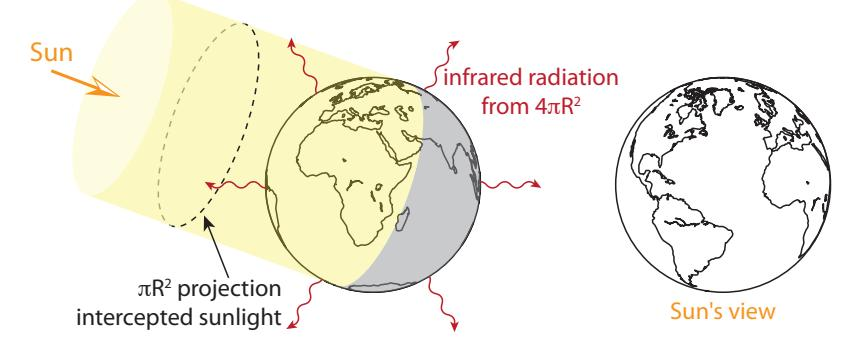
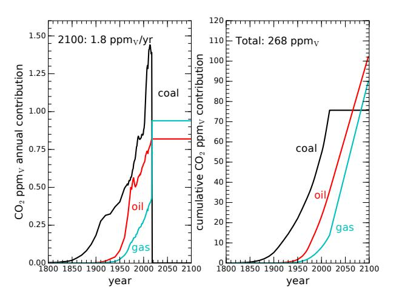

(chap:climatechange)=
# Climate Change

Climate change stands tall among the global scale problems created by our energy appetite—caused by the accumulation of carbon dioxide (CO2) in our atmosphere from the burning of fossil fuels. This chapter aims to provide a no-nonsense account of the basis for climate change that leaves little room for the kind of uncertainty often injected by (alarmingly successful) disinformation campaigns. While the *response* of our complex climate system is more difficult to predict in detail, the core physics is unassailable. We will see that the rise in CO2 is not at all mysterious, stemming from fossil fuels. We will also explore a few scenarios and connect the CO2 rise to temperature consequences.

# **9.1 The Source of** CO2

The climate change forces at play today are primarily due to increased concentration of CO2 in our atmosphere as a result of burning fossil fuels.

The chemistry is unambiguous (Eq. [8.1; p.121\)](#page-140-0): energy is released when fossil fuels are combusted with oxygen (O2) to get CO2 and H2O. [Table](#page-157-1) [9.1](#page-157-1) extends properties of fossil fuels first presented in [Chapter](#page-133-0) [8,](#page-133-0) adding CO2 attributes.

**Table 9.1:** Combustion properties of fossil fuels, including CO2 emission per gram of input and per MJ of energy out.

| Fuel        | Representative | molar mass | kJ/mol | kJ/g | kcal/g | CO2 g/g | CO2 g/MJ |
|-------------|----------------|------------|--------|------|--------|------------|-------------|
| coal        | C              | 12         | 393.5  | 32.8 | 7.8    | 3.67       | 112         |
| natural gas | CH4            | 16         | 890.3  | 55.6 | 13.3   | 2.75       | 49          |
| petroleum   | C8H18          | 114        | 5,471  | 48.0 | 11.5   | 3.09       | 64          |

Of chief interest in [Table](#page-157-1) [9.1](#page-157-1) for this chapter are the last two columns:

Elephants doing their best. Photo courtesy of [O'Connell & Rodwell.](#page-373-0)

*© 2022 T. W. Murphy, Jr.; [Creative Commons Attribution-NonCommercial 4.0 International Lic.;](https://creativecommons.org/licenses/by-nc/4.0/) Freely available at: [https://escholarship.org/uc/energy\\_ambitions.](https://escholarship.org/uc/energy_ambitions)*

- 1. **mass ratio**: how many grams of CO2 are produced per gram1 of input fuel;
- 2. **carbon intensity**: how many grams of CO2 are produced per unit of energy delivered.

While all forms produce a mass ratio of *approximately* **3 units of** CO2 **for every unit of fossil fuels**, the lower energy density of coal together with its slightly higher mass ratio2 make it *more than twice* as carbon-intense as natural gas.

**Example 9.1.1** Roughly how much CO2 is produced from each full tank of gasoline in a car?

A typical tank might hold about 50 L of gasoline (13 gallons). The density of gasoline is 0.75 kg/L, so that one tank has a gasoline mass of about 38 kg. Applying the simple and convenient factor-of-three ratio of CO2 mass to input fuel mass, we see that one tank of gasoline will produce something like 110 kg of CO2—not a small amount!

#### **9.1.1** CO2 **Measurements**

Beginning in 1958, Dave Keeling of the Scripps Institution of Oceanography began recording CO2 concentration in the atmosphere from the top of Mauna Loa in the middle of the Pacific ocean.[3](#page-157-1) In addition to seeing annual variation due to the seasonal cycle of photosynthesis,[4](#page-157-1) he began to see a steady year-by-year increase in the level. The measurements have continued to the present, now known as the "Keeling Curve," shown in [Figure](#page-158-1) [9.1.](#page-158-1)

1: . . . or any mass/weight measure you prefer

2: Coal produces more CO2 per gram of fuel because the other fossil fuels also contain mass in the form of hydrogen, which not only adds to energy production but also does not end up in CO2.

4: Plants seasonally absorb and then release CO2 as leaves grow and then die.

**Figure 9.1:** In blue (left axis), CO2 measurements from Mauna Loa (Hawaii) for the last 60 years, showing a relentless and accelerating upward trend now at abut 2.6 ppmv per year [\[50\]](#page-434-0). Seasonal variations due to photosynthesis are seen on top of this trend. Pre-industrial levels were around 280 ppmv, so that we have added about 130 [parts per](#page-453-0) [million](#page-453-0) (ppm). Red dots (right axis) show global average mean temperature records over the same period [\[51\]](#page-434-1). Thus far, global average temperature has risen about 1◦C. Note that the Kyoto Protocol in 1997 and Paris Agreement in 2015 (Box [19.4; p.](#page-339-0) [320\)](#page-339-0) do not visibly curb the upward trajectory of CO2 emissions.

*© 2022 T. W. Murphy, Jr.; [Creative Commons Attribution-NonCommercial 4.0 International Lic.;](https://creativecommons.org/licenses/by-nc/4.0/) Freely available at: [https://escholarship.org/uc/energy\\_ambitions.](https://escholarship.org/uc/energy_ambitions)*

When the measurements started, the atmosphere consisted of less than 320 [parts per million by volume](#page-453-1) (ppmv), or &lt; 0.032%. By now, we are beyond 410 ppmv.

Measurements of trapped air bubbles in the Greenland ice sheet going back about 100,000 years and the Antarctic ice sheet going back 800,000 years indicate that CO2 has fluctuated between 180–280 ppmv, reaching the higher end of the range during the warmer periods between ice ages (interglacial periods). For at least the last thousand years before the Fossil Fuel Age, CO2 held steady around 280 ppmv.

#### 1800 1850 1900 1950 2000 year 0 2 4 6 8 10 12 14 16 TWcoal oil gas 1800 1850 1900 1950 2000 year 0 1 2 kW/personcoal oil gas

**9.1.2** CO2 **Expectations**

We saw in [Figure](#page-137-0) [8.2—](#page-137-0)repeated as [Figure](#page-159-1) [9.2—](#page-159-1)a history of fossil fuel usage for the world, in coal, oil, and natural gas. Meanwhile, [Table](#page-157-1) [9.1](#page-157-1) indicates how much CO2 each fuel contributes per kilogram or Joule used. These two pieces can be combined to make an estimate of how much CO2 is emitted globally each year, and to track total CO2 emission over time. [Table](#page-160-0) [9.2](#page-160-0) and [Box](#page-159-2) [9.1](#page-159-2) elucidate how to go from the fossil fuel power figures (TW) in [Figure](#page-159-1) [9.2](#page-159-1) to CO2 atmospheric concentrations.

#### **Box 9.1: Computing** CO2 **ppm**v **from TW**

We will use oil as an example. In [Figure](#page-159-1) [9.2,](#page-159-1) we appear to get about 6 TW from oil (5 TW from coal, 4 TW from natural gas). Multiplying by  $10^{12}$  puts this in Watts (J/s) and by 3.156  $\times$   $10^7$  seconds per year results in the annual global energy from oil in Joules: 1.9  $\times$   $10^{20}$  J/yr. [Table](#page-157-1) [9.1](#page-157-1) indicates that oil contains about 11.5 kcal/g, so the number of grams of oil used per can be determined by first converting J to kcal*© 2022 T. W. Murphy, Jr.; [Creative Commons Attribution-NonCommercial 4.0 International Lic.;](https://creativecommons.org/licenses/by-nc/4.0/) Freely available at: [https://escholarship.org/uc/energy\\_ambitions.](https://escholarship.org/uc/energy_ambitions)*

**Figure 9.2:** Historical use of fossil fuels worldwide, repeated from [Figure](#page-137-0) [8.2](#page-137-0) [\[16\]](#page-432-0). On the left is the raw usage rate expressed in terawatts, while the right is a per-capita measure. The three fossil fuel types are stacked on top of one another, so that gas makes the smallest contribution, not the largest. For instance, on the right-hand-edge of the left panel, coal goes from 0 to 5 TW, oil from 5 to 11 (thus 6 TW from oil), and gas from 11 to 15, indicating 4 TW from gas. The left-hand panel makes clear that fossil fuel use is still rising dramatically, and thus CO2 emissions.

| Table 9.2: Stepwise procedure to convert    |
|------------------------------------------------|
| TW to ppmv of CO2. FF means fossil fuel, |
| which can be coal, oil, or gas—each com        |
| puted separately using the various values      |
| provided on the right.                         |
|                                                |

(divide by 4,184), yielding  $4.5 \times 10^{16}$  kcal/yr, and thus  $3.9 \times 10^{15}$  g/yr of oil, or  $3.9 \times 10^{12}$  kg/yr.5 [Table](#page-157-1) [9.1](#page-157-1) shows that each kilogram of oil combusted produces 3.09 kg of CO2, translating to  $1.2 \times 10^{13}$  kg/yr of CO2 from oil. Incidentally, we get the same answer using 64 g/MJ from [Table](#page-157-1) [9.1](#page-157-1) and  $1.9 \times 10^{14}$  MJ/yr from a few lines up. The remainder of the work, converting to [parts per million,](#page-452-0) is covered in the text and the lower part of [Table](#page-160-0) [9.2.](#page-160-0)Operation Resulting Units Coal Oil Gas

÷ 푥 kcal/g FF g/yr 푥 = 6.5 푥 = 11.5 푥 = 13.3

× 푦 CO2 kg/kg CO2 kg/yr 푦 = 3.67 푦 = 3.09 푦 = 2.75

÷44/29 CO2 ppmv/yr total emissions ÷ ∼ 2 CO2 ppmv/yr stays in atmosphere

Starting value TW ×1012 W/TW W (J/s)

÷ 4,184 J/kcal kcal/yr

÷ 1,000 g/kg FF kg/yr

÷5 × 1018 kg CO2 frac/yr ×106 CO2 ppmm/yr

s/yr J/yr

×3.16 × 107

The mass of the atmosphere is about  $5 \times 10^{18}$  kg, obtained by multiplying 10,000 kg of air6 sitting over every square meter by the  $4 \pi R_{\oplus}^2$  surface area of the earth. Dividing the  $1.2 \times 10^{13}$  kg7 of oil-generated CO2 by the mass of the atmosphere yields  $2.4 \times 10^{-6}$ , or 2.4 parts per million.8 We are almost there. The quantity we have calculated is [parts per million](#page-453-2) [by mass](#page-453-2) (ppmm), not the conventional [parts per million by volume](#page-453-1) (ppmv). Since air9 averages 29 g/mol, and CO2 is 44 g/mol, the mass concentration of CO2 is higher than the volume occupation in air by a factor of 44/29, or 1.52. Thus we divide our 2.4 ppmm result by 1.52 to get 1.6 ppmv. A final correction is that only half of this stays in the atmosphere, so that today we are putting 0.8 ppmv into the atmosphere each year from oil.[Figure](#page-161-0) [9.3](#page-161-0) shows the result of this computation as a function of time in terms of annual rate and cumulative emission. We find that even though oil and coal deliver about the same global annual energy now, the carbon-intensity of coal is much higher so that its CO2 emission dominates10 10: Why do we keep using coal if it's the over the other sources. In fact, coal *always* has been the dominant CO2 producer, seen by the fact that the black curve in the left-hand panel of [Figure](#page-161-0) [9.3](#page-161-0) has always been higher than the other two CO2 sources. In total, this estimate suggests that we should see CO2 levels rising by 2.6 ppmv per year, a little over half of which is due to coal (1.4 ppmv/year).

Summing up the rising contributions over time, this method of estimation suggests that we have increased the atmospheric CO2 by 123 ppmv,[11](#page-161-0) and that 75 ppmv of this (61%) is attributed to coal (right-hand panel of [Figure 9.3\)](#page-161-0).5: At 120 kg per barrel, this turns into the expected 30 billion [barrels](#page-442-0) per year as a check to see that we're on the right track.

6: This is a close approximation to the actual value, obtained by dividing standard atmospheric pressure of 101,325 Pa by 푔 ≈ 9.8 m/s2 .

7: . . . the result of [Box](#page-159-2) [9.1](#page-159-2)

8: Just multiply by one million, or 106 to get [ppm.](#page-453-0)9: Air is about 75% N2 at 28 g/mol plus 25% O2 at 32 g/mol.

Can you validate this number in the left panel of [Figure](#page-161-0) [9.3](#page-161-0) for oil?

worst? Because replacement infrastructure is very expensive, and fossil fuel extraction does not work like a bank account allowing withdrawals at an arbitrary rate. We could not suddenly switch over and continue to satisfy demand, even if everyone wanted to—which they don't.

11 11: . . . very close to the ∼130 ppmv we ob-

0

10

cumulativeCO2ppmVcontribution

20

30

40

50

60

70

80

1800 1850 1900 1950 2000 year

Total Added: 123 ppmV

coal

oil

gas

coal

oil

gas

1800 1850 1900 1950 2000 year

Total Rate Now: 2.6 ppmV/yr

0.00

0.25

CO2ppmVannualcontribution

0.50

0.75

1.00

1.25

1.50

The curve computed from fossil fuel use overlaps the Keeling Curve so faithfully that little mystery is left as to where the excess CO2 in our atmosphere originates. The chemistry and historical use of fossil fuels are not in dispute. The only "fudge" is in what fraction of the CO2 emitted from fossil fuel combustion remains in the atmosphere vs. being absorbed by the ocean and other "sinks." Empirically, about half stays in the atmosphere, while the rest disappears into the ocean,13 13: . . . acidifying the ocean's water and into plant matter that gets buried in the ground. If unaware of the oceanic and land absorption mechanisms, we would have *overestimated* the amount of CO2 due to fossil fuels by a factor of two (see [Box](#page-161-2) [9.2\)](#page-161-2).

**Figure 9.3:** Estimated CO2 contributions from known fossil fuel expenditures based on chemistry and the assumption that half of CO2 stays in the atmosphere, while the rest is absorbed by the ocean and land. Units are [parts per million by volume.](#page-453-1) The left-hand panel shows the annual addition, adding to 2.6 ppmv per year and accounting for the slope in [Figure](#page-158-1) [9.1.](#page-158-1) The right-hand panel is the cumulative emission to date as a function of time—essentially adding up all the annual emissions from the left-hand panel. These curves are not stacked as are the ones in [Figure](#page-159-1) [9.2,](#page-159-1) so each can be read directly from the vertical axis. Note that oil and gas are still on the rise in the left-hand panel: we emit more CO2 each year than we did the year before.

12: ...actual CO₂ measurements

**Figure 9.4:** Fossil fuel contribution to CO2 (red) on top of CO2 measurements (blue). The red curve uses a starting point of 285 ppmv and has 49% of CO2 emissions staying in the atmosphere. The overlap is remarkably good and convincing.

13: ...acidifying the ocean's water

#### **Box 9.2: If We Ignored Oceans**

Reflect on what our reaction might have been had we not corrected for oceanic and land absorption: we would conclude that we have *no trouble* quantitatively accounting for the CO2 rise based on fossil fuels, and would be left asking why we don't see an even *larger* rise. In other words, it is no stretch to account for the cause of excess CO2—making it far from mysterious. If our CO2 increase were *not* due to humans,14 we would be left with a *real* mystery: then where is 14: . . . via fossil fuels all of the *known* CO2 emission from burning fossil fuels disappearing to?

#### **9.1.3 Chief Contributors**

Climate change is a global phenomenon. Even if all emissions came from one country or region, atmospheric circulation would spread the result around the globe—albeit more slowly across the equator. It is, therefore, a global problem. All the same, it is interesting to look at chief emitters.

[Figure](#page-162-2) [9.5](#page-162-2) indicates that the U.S. is the single country bearing the largest responsibility for cumulative CO2 emissions: roughly twice that of the second-largest (China) [\[52\]](#page-434-2). Today, China is the largest emitter, at 9.4 Gt per year, while the U.S. is in second place at 5.15 Gt/yr. [Table](#page-162-3) [9.3](#page-162-3) lists the top six emitters lately, accounting for about 60% of the 34 Gt per year [\[53\]](#page-434-3).
[\[52\]](#page-434-2): Ritchie (2019), *Who has contributed most to global CO2 emissions*
[\[53\]](#page-434-3): Rapier (2019), *The World's Top 10 Carbon Dioxide Emitters*# **9.2 Warming Mechanism**

The presence of excess CO2 in our atmosphere is undeniably from fossil fuel combustion. But how does this alter our climate? How can such a minor constituent of the atmosphere (now 0.04%) cause so much trouble? The answer lies in [infrared radiation](#page-450-1) [\[54\]](#page-434-4) . Recall from Sec. [1.3](#page-29-0) [\(p.10\)](#page-29-0) that radiation and planetary temperature"

14: ... via fossil fuels

**Table 9.3:** Leading CO2 emitters, 2018. Gt means gigatons, or 1012 kg, as 1 ton is 1,000 kg.

| Country     | Gt/yr | % share |
|-------------|-------|---------|
| China       | 9.43  | 27.8    |
| U.S.        | 5.15  | 15.2    |
| India       | 2.48  | 7.3     |
| Russia      | 1.55  | 4.6     |
| Japan       | 1.15  | 3.4     |
| Germany     | 0.73  | 2.1     |
| Top 6 Total | 20.49 | 60.4    |
| World       | 34    | 100     |

**Figure 9.5:** Cumulative contributions to CO2 emissions to date, grouped by continent. Major contributing countries are called out explicitly, and the remaining contributions from each continent are grouped as a "rest of" category [\[52\]](#page-434-2).

*to global* CO2 *emissions*

*Carbon Dioxide Emitters*

[\[54\]](#page-434-4): Pierrehumbert (2011), "Infrared

this is the mechanism by which energy leaves the earth, the power of which is governed by the [Stefan–Boltzmann law](#page-456-0)  $P = A_{surf}\sigma T^4$ , where the [Stefan–Boltzmann constant,](#page-456-1)15  $\sigma = 5.67 \times 10^{-8} \text{ W/m}^2\text{/K}^4$ , and  $T$  is the temperature of the radiating surface, in Kelvin. 15: ... easy as 5-6-7-8

The sun delivers energy to the *top* of the earth's atmosphere at a rate16 of 1,360 W/m2. About 30% of this light—29.3%, to be precise—is immediately reflected by clouds, snow, and to a lesser extent water and terrain. The remaining 70.7% of the light intercepts the earth in a projected disk of area  $A_{proj} = \pi R_{\bigoplus}^2$  [\(Figure 9.6\)](#page-163-0). But the total surface area of the earth is four times this, all of it contributing to infrared radiation to space. In perfect balance,17 energy absorbed equals energy radiated: 
16: This is called the [solar constant](#page-455-0) [\[4\]](#page-431-0), and will appear again in Chapter 10 and Chapter 13.
17: An imbalance would mean energy is ac-
$$
0.707 \times 1360 \,\mathrm{W/m^2} \times \pi R_\oplus^2 = 4\pi R_\oplus^2 \sigma T^4. \tag{9.1}
$$

The  $\pi R_{\oplus}^2$  factors cancel, and we can rearrange to isolate temperature:
$$
T^{4} = \frac{0.707 \times 1360 \,\mathrm{W/m^{2}}}{4\sigma},\tag{9.2}
$$

solving to  $T \approx 255$  K, or −18°C (about 0°F). This is about 33°C colder than the 288 K (15°C; 59°F) we actually observe as the average temperature of Earth. The 33°C difference18 is due to [greenhouse gases—](#page-448-0)mostly H2O—impacting the thermal balance by preventing most radiation from escaping directly to space.We understand this mechanism perfectly. Being at a temperature of 288 K, the surface emission peaks at a [wavelength](#page-457-0) around  $10 \mu m$ . The atmosphere is not transparent at all wavelengths, its various absorption features depicted in [Figure](#page-164-0) 9.7. The blue curve at upper right in this figure is the emission spectrum associated with infrared radiation.Of the greenhouse gases contributing to absorption as pictured in [Figure 9.7](#page-164-0), water vapor is the dominant player, followed by CO2. Notice that the blue solid portion in the figure20 is mirrored in white in the total
escapes to space
absorption panel just below,21 and that the window is mostly defined by
water vapor. But the right-hand—longer wavelength—side of the water
window is stepped on by the CO2 absorption feature, seen more clearly
in [Figure 9.8](#page-164-1). This CO2 feature is responsible for the sharp cutoff on the**Figure 9.6:** Earth intercepts sunlight across the projected area of the Earth's disk ( $\pi R^2$ ), while radiating from the entire surface area, which is four times larger ( $4\pi R^2$ ).will appear again in [Chapter 10](#page-183-0) and [Chapter](#page-216-0) [13.](#page-216-0)cumulating or being lost, leading to warming or cooling. Even under present conditions, the balance is good to within 1 W/m2.Verify for yourself. Two square roots in a row accomplish a fourth root.18: Life on Earth is adapted to and reliant upon this 33°C greenhouse effect. Abruptly changing it is what causes problems.19 The 19: We will see how/why in [Section 13.2](#page-218-0) (Eq. [13.5; p. 199](#page-218-1)).20: . . . the infrared radiation that directly  
escapes to space21: Thus the white portions indicate the open "windows."5: . . . easy as 5-6-7-8

right side of the solid blue22 shape in [Figure](#page-164-0) [9.7.](#page-164-0) As CO2 concentration 22: . . . escaped radiation in the atmosphere increases, this absorption feature gets wider, cutting deeper into the right edge of the escaping radiation (solid blue feature), allowing less radiation to escape.

If some portion of the infrared radiation does not escape to space but is absorbed by the atmosphere, the planet does not cool as effectively, adding some offset to [Eq.](#page-163-1) [9.2](#page-163-1)—in Earth's case 33°C. It is like the earth is wearing a blanket that raises its temperature by 33°C. [Figure](#page-165-0) [9.9](#page-165-0) illustrates the mechanism. Water vapor is responsible for ~20°C of this 33°C, and CO2 is responsible for another ~8°C, leaving ~5°C for ozone, methane, and other minor contributors [\(Table](#page-164-2) [9.4\)](#page-164-2). Incidentally, methane (CH4) is about 80 times more potent than the same amount of CO2 as a greenhouse gas, but is at a far lower concentration than CO2, and also shorter-lived in the atmosphere before being chemically destroyed.23 We focus on CO2 because this is what human activity is changing rapidly by burning fossil fuels. The vast ocean–air interface means water concentration is impossible to control, and simply responds to temperature due to the fact that warmer air holds more moisture—becoming an important [feedback](#page-447-0) agent. Water is not the *driver* of climate**Figure 9.7:** Atmospheric transmission/absorption [spectra](#page-455-1) [\[55\]](#page-434-5). The top panel shows solar input in red and infrared (thermal) radiation output in blue. The smooth curves are the theoretical [blackbody](#page-442-1) [Planck spectra](#page-453-3) at solar and terrestrial temperatures. Thus the smooth red curve represents the distribution of solar energy arriving at the top of Earth's atmosphere, while the solid red filled feature is what survives the path to the ground. The smooth blue curve (middle of the set of three) represents radiation from the ground, but only a small fraction (blue filled region) passes directly through the atmosphere—the rest absorbed by [green](#page-448-0)[house gases.](#page-448-0) The lower panels detail where light gets absorbed or scattered. Gray regions indicate absorption and scattering, so that white portions can be thought of as the transmitted part—often called "windows." Key contributors (greenhouse gases) are broken out in panels below the total absorption panel. Notice that ozone blocks ultraviolet (UV), and Rayleigh scattering is what makes the sky blue—by being effective at scattering blue light from the sun (blue is on the left side of the band labeled "Visible," while red is on the right). Created by [Robert Rohde.](#page-373-1)

**Figure 9.8:** Another view of just the water and carbon dioxide absorption [spectra,](#page-455-1) better showing the overlapping role of each in the 10 휇m window. From [Robert Rohde](#page-373-2) [\(NASA\).](#page-373-2)

**Table 9.4:** Greenhouse contributions [\[56\]](#page-434-6).

| Molecule            | $\Delta T$ (°C) |
|---------------------|-----------------|
| H2O                 | 20              |
| CO2                 | 8.6             |
| O3 (ozone)          | 2.6             |
| CH4 (methane)       | 1.5             |
| N2O (nitrous oxide) | 0.5             |
| Total               | 33              |

23: Methane emission becomes important via leaks from drill sites and also permafrost melt.

#### change, but a hefty *passenger*.

Naïvely speaking, going from 280 ppmv to 420 ppmv (an increase by a factor of 1.5), might be expected to turn the 8.6 °C greenhouse effect from CO2 into 12.9 °C (1.5×) for a 4.3 degree human-caused warming.[24](#page-454-0) But [24:](#page-454-0) This is not how it works. the CO2 absorption feature at ~ 15 μm is *saturated*, so as CO2 is added, it becomes *wider*, but logarithmically rather than linearly as a function of CO2 concentration. Climate scientists often express the impact of various influences as a [radiative forcing,](#page-454-0) measured in W/m2.**Definition 9.2.1** *[Radiative forcing](#page-454-0)* is used to describe the areal [power](#page-453-4) (in  $W/m^2$ ) of absorbed solar energy and infrared radiation to space. Various influences or constituents each contribute their own radiative forcing. In equilibrium, a balance exists so that the net25 radiative forcing is zero. 25: ... sum of all: positive and negativeThe average solar forcing is

$$
RF_{\odot} = 1360 \,\mathrm{W/m^2} \times 0.707/4 \approx 240 \,\mathrm{W/m^2},\tag{9.3}
$$

sharing substantial overlap with [Eq.](#page-163-1) [9.2—](#page-163-1)the factors having been explained in that context. Without adding to the pre-industrial set of [greenhouse gases](#page-448-0) [\(GHGs\)](#page-448-1), we would solve for temperature 26 as 26: . . . adding the baseline 33°C GHG con-
$$
T = \left(\frac{RF_{\odot}}{\sigma}\right)^{0.25} + 33,\tag{9.4}
$$

evaluating to 288 K, or about 15°C. If we add (or deduct) radiative forcing from another source, it would add (subtract) in the numerator of [Eq. 9.4.](#page-165-1) The addition of CO2 over the original amount (CO2,orig; 280 ppmv) generates a radiative forcing of
$$
RF_{\rm CO_2} = 5.35 \ln \left( \frac{\rm CO_2}{\rm CO_{2, orig}} \right) W/m^2, \tag{9.5}
$$

where the ln() function is the natural logarithm.27 At our present ~420 ppmv, the ratio of current CO2 to CO2,orig is 1.5 and RFCO2 ≈ 2.2 W/m2, so that the new temperature (adding the new forcing to [Eq. 9.4](#page-165-1)) is
$$
T = \left(\frac{RF_{\odot} + RF_{\rm CO_2}}{\sigma}\right)^{0.25} + 33 \approx 288.6,\tag{9.6}
$$

**Figure 9.9:** In the absence of [greenhouse](#page-448-0) [gases,](#page-448-0) infrared radiation has no difficulty escaping to space (left). When [greenhouse](#page-448-0) [gases](#page-448-0) (GHGs) are present (right), most of the infrared radiation is absorbed by [GHG](#page-448-1) molecules. These molecules later release the absorbed energy as new infrared radiation, but in a randomized direction, so that some energy is returned to the ground, thereby keeping the surface warmer than it would be without greenhouse gases.

24: ❗ This is not how it works.

25: ... sum of all: positive and negative

tribution

ing of the width of the CO2 absorption feature at 15 휇m in [Figure](#page-164-0) [9.7](#page-164-0)

*© 2022 T. W. Murphy, Jr.; [Creative Commons Attribution-NonCommercial 4.0 International Lic.;](https://creativecommons.org/licenses/by-nc/4.0/) Freely available at: [https://escholarship.org/uc/energy\\_ambitions.](https://escholarship.org/uc/energy_ambitions)*

which is about 0.6°C larger than it was before increasing the amount of CO2. We can express this as a *sensitivity*: how much  $\Delta T$  do we get for a given imbalance in radiative forcing? In this case, 0.6°C from a 2.2 W/m2 increase is 0.27°C per W/m2. But when the known [feedback](#page-447-0) mechanisms are included—most of them in the positive direction—the temperature sensitivity becomes 0.8°C for every W/m2 of additional forcing: called the [climate sensitivity parameter.](#page-443-0)28**Definition 9.2.2** *The [climate sensitivity parameter](#page-443-0) connects the amount of warming expected for a given amount of [radiative forcing.](#page-454-0) Current understanding puts this at 0.8* $^{\circ}$ C *per* W/m2 *of radiative forcing.*Therefore, our current 2.2 W/m2 of additional (fossil-fuel added) radiative forcing translates29 to a 1.7 $^{\circ}$ C temperature increase [\(Figure 9.10\)](#page-166-0), which is about three times what the non-feedback calculation would provide.  
29: Just multiply 2.2 W/m2 by 0.8  $^{\circ}$ C per W/m2.**Example 9.2.1** If we double our CO2 concentration from pre-industrial levels, what would we expect the temperature increase to be?Pre-industrial CO2 was 280 ppmv, so doubling it adds 280 ppmv for a total of 560 ppmv. The radiative forcing is then  $5.35 \ln(2) \approx 3.7$  W/m2. Multiply this by the climate sensitivity of 0.8°C per W/m2 to get a temperature increase of about 3.0°C (would be 1°C without feedback).The [positive feedbacks](#page-453-5) are important, and include factors like:- 1. A warmer planet means less ice (glaciers, Arctic cap), resulting in less reflected sunlight, increasing the 0.707 absorption factor in [Eq.](#page-165-2) [9.3](#page-165-2) to increase solar forcing.
- 2. Warmer air can hold more water vapor—the principal greenhouse gas, thus driving up the nominal 33◦C greenhouse gas contribution.
- 3. A warmer environment leads to additional CO2 loss from drying forests, desertification, and accelerated decomposition of plant matter and peat.

A few [negative feedback](#page-452-1) mechanisms30 exist as well, but are outweighed by the positive feedback terms.  
30: By far the most important negativeGlobal temperature increase is already about 1.0°C [\[58\]](#page-434-8). Note that even if we never added another CO2 molecule to the atmosphere, the temperature would continue to rise as the ocean31 slowly catches up to the new equilibrium. We would expect the temperature to stabilize around 1.7°C higher for today's CO2 excess, according to the calculation above. Thus the climb is about 55% done. Of course, more CO2 will be added, so the eventual temperature rise is destined to be higher still.28: See [\[57\]](#page-434-7) for a good synopsis and references to primary material within.29: Just multiply 2.2 W/m2 by 0.8 °C per W/m2.

**Figure 9.10:** As CO2 concentration increases, the [radiative forcing](#page-454-0) (left axis) increases, driving the temperature (right axis) up. We are now at 420 ppmv, corresponding to a radiative forcing of 2.2 W/m2 and 1.7◦C of ultimate temperature increase (red star). Presently, the temperature has only increased by 1.0◦C (red circle), but will catch up to a new equilibrium once oceans warm and ice melts.

feedback mechanism is the [infrared radia](#page-450-1)[tion](#page-450-1) itself, increasing dramatically as temperature increases (as  $T^4$ ), thus opposing the temperature rise by a cooling influence. Here, we mean negative feedback influences *in addition to* this main one.[\[58\]](#page-434-8): National Oceanic and Atmospheric Administration (NOAA) (2019), *Global Climate Report*31: . . . lots of thermal mass, or [heat capacity](#page-448-2)# **9.3 Possible Trajectories**

Launching from the data used to generate [Figure](#page-161-0) [9.3,](#page-161-0) we can now play a few games to understand what our future might hold in terms of total CO2 rise and corresponding Δ푇 increases by the year 2100 under various contrived scenarios.32

standing. First, let's imagine that we suddenly arrest the upward climb characteristic of fossil-fuel usage to date[33](#page-167-0) and maintain present-day levels of fossil fuel use from now until 2100. [Figure](#page-167-1) [9.11](#page-167-1) shows what happens. The total added CO2 rises to 2.75 times the current excess, to 339 ppmv[34](#page-167-0) above pre-industrial levels. The associated radiative forcing would be 4.25 W/m2 and result in a 3.4 °C temperature increase. [Table](#page-167-2) [9.5](#page-167-2) summarizes this scenario and the three to follow.

| Scenario        | ΔCO2 (ppmv) | vs. today | CO2 (ppmv) | RFCO2 (W/m²) | ΔT (°C) |
|-----------------|----------------|-----------|---------------|-----------------|------------|
| Arrest FF climb | 339            | 2.75 ×    | 620           | 4.25            | 3.4        |
| Arrest; no coal | 268            | 2.18 ×    | 548           | 3.6             | 2.9        |
| Curtail by 2100 | 235            | 1.91 ×    | 515           | 3.3             | 2.6        |
| Curtail by 2050 | 169            | 1.37 ×    | 450           | 2.5             | 2.0        |

We're already seeing serious problems emerging today, at about 1◦C increase, so this 3.4◦C scenario is not desirable.35 35: On the other hand, we may not have And reflect for a moment how unlikely it is that we can even arrest the climb of fossil fuel use so suddenly. It would seem that the *rate* of CO2 emission is destined to climb higher than it is today: we have not yet found the peak!

The second scenario focuses on eliminating coal, since it is the highest intensity CO2 emitter,[36](#page-161-0) as [Figure](#page-161-0) [9.3](#page-161-0) makes clear. What if natural gas—the fossil fuel having the lowest carbon intensity—could replace all coal applications? This is already happening—gradually—in the electricity generation sector. Countless advocates encourage such a transition as rapidly as can be accomplished. The pretend world of
[36](#page-161-0): ... based on its lower energy density32: None of the scenarios we will fabricate are *realistic*, exactly, but help us establish boundaries of possible outcomes. Mathematical models need not capture all the nuances to still be useful guides to under-

[Figure](#page-161-0) [9.3](#page-161-0)

34: . . . resulting in about 620 ppmv; up

Verify yourself following a procedure like [Example](#page-166-1) [9.2.1](#page-166-1) as good practice.

**Figure 9.11:** CO2 rise if fixing fossil fuel use at today's levels for the rest of the century, following the conventions of [Figure](#page-161-0) [9.3.](#page-161-0) We would still add 2.6 ppmv per year from now until the end of the run in 2100, and would have accumulated a total rise of 339 ppmv, or 2.75 times the problematic amount already accumulated to date. The associated temperature rise would be 3.4◦C. For this and all subsequent scenarios, the plots show only the half of emitted CO2 that remains in the atmosphere.

**Table 9.5:** Summary of scenario outcomes.

enough fossil fuel resource to realize this scenario, in which case it can be treated as an upper limit.

(5–8 kcal/g vs. 13 for natural gas) and its higher CO2-to-fuel mass ratio (3.67 vs. 2.75 for natural gas)simulation allows us to evaluate the best-case (and unrealistic) scenario of *instant*, complete replacement, to put a limit on how much benefit such a move brings. [Figure](#page-168-0) [9.12](#page-168-0) shows what happens. The rate of CO2 emission would immediately drop to 1.8 ppmv/year.37 37: This would be about 70% the present That definitely helps, but the total emission by 2100—if carrying on at today's energy demand via fossil fuels—would climb to 268 ppmv. The effect would more than double the 123 ppmv that we've *already* contributed to the atmosphere, and would approximately double the pre-industrial CO2 level in the atmosphere, leading to a forcing of 3.6 W/m2 and Δ푇 ≈ 2.9 ◦C (summarized in [Table](#page-167-2) [9.5\)](#page-167-2). So as beneficial as the termination of coal would be, any path that involves carrying our fossil fuel use forward at today's levels—even substituting the best form for the worst form—does not look promising.

The emphasis, then, should be to taper off fossil fuel use so that we wean ourselves of dependency. The transition could be fast or slow. A slower version might target the year 2100 for a full termination of fossil fuels. [Figure](#page-169-1) [9.13](#page-169-1) shows an idealization of what this might look like. Notice that the resulting curves are *roughly* symmetric, in that the downslope is not terribly different from the upslope. Let's pause to reflect on how incredible and fast the rise of fossil fuels has been. A descent as steep as the rise represents change at an astounding pace—which would be pretty disruptive in the best circumstances. In the absence of suitable substitutions, this would be a tremendously difficult journey, but one we may be forced to make by any number of paths.38 In any case, the eventual added CO2 would end up at 235 ppmv—almost doubling what we have already emitted, and nearly doubling the pre-industrial CO2 level in the atmosphere. The forcing in this case would be 3.3 W/m2 and  $\Delta T \approx 2.6$  °C.
38: . . . driven by policies, markets or—
Again, follow along for good practiceReducing fossil fuel use even more quickly, tapering to zero by 2050, results in [Figure](#page-169-2) [9.14.](#page-169-2) The descent is alarmingly steep, and difficult to imagine happening in practice unless major disruptions39 force this upon us. In any case, should we manage such a feat, our total CO2 [39](#page-169-2): ...resource wars, devastating climate change repercussionsrate of 2.6 ppmv per year.

See if you can replicate these numbers!

**Figure 9.12:** CO2 rise if instantly substituting coal (worst CO2 intensity) with natural gas (best CO2 intensity) and then maintaining current levels for the rest of this century. Our annual contribution would drop from 2.6 ppmv/yr to 1.8 ppmv/yr based on this substitution, and the total accumulation would be 268 ppmv by century's end (2.2 times the accumulation to date). The associated temperature rise would be 2.9◦C.

more certainly—resource limits

Again, follow along for good practice.

change repercussions

**Figure 9.13:** CO2 rise if immediately reversing fossil fuel use in an ambitious decline reaching zero by the year 2100. The accumulation would come to 235 ppmv at the end, which is almost twice the current level (1.9 times). The associated temperature rise would be 2.6◦C.

**Figure 9.14:** CO2 rise if we mounted a superaggressive weaning of fossil fuels, completed by the year 2050. In this extreme case, the total CO2 emission would be 169 ppmv, or 37% more than we have produced to date. The associated temperature rise would be 2 
oC.contribution to the atmosphere would be an increase of 169 ppmv, which is 37% more than we have emitted to date. Adding another ~ 40%, then, seems like the best we could hope to see, but possibly accompanied by serious hardships in adapting. The radiative forcing associated with this scenario is 2.5 W/m2, corresponding to  $\Delta T \approx 2$  °C.# **9.4 Climate Change Consequences**

Turning up the thermostat on the planet results in too many effects to chronicle here. Obviously, the climate is impacted—in terms of storm frequency and intensity, rainfall, snowfall and water supply, season durations, and the ability of plant and animal species to adapt to the changes. The timescale over which we are changing the climate is far faster than evolution can track, except for microbial life and maybe insects, whose shorter generational turnover permits a more dynamic response. Humans are late arrivals to a long evolutionary sequence, which laid a foundation to support our lives in complex interconnected

Try replicating!

ways that we are not close to fully understanding. Climate change messes with the system in such a way to prevent accurate prediction of the long-term consequences of one species or another disappearing from the web of life.The consequences of climate change are elaborated in many sources that are not difficult to find. Rather than try to add to the general awareness, this section—in the spirit of the book—aims to provide students with some tools40 to be able to quantitatively understand how the physical world reacts to changes in [radiative forcing.](#page-454-0) Specifically, we concentrate on the process of heating up41 elements of the planet, and on [sea level](#page-455-2) [rise.](#page-455-2)
40: ... and make connections to earlier content.
41: For amusement, try substituting the#### **9.4.1 Heating Up**

Recall that the radiative forcing of 2.2 W/m2 arising from a 50% enhancement to the pre-industrial CO2 concentration[42](#page-2-1) is expected to result in 1.7 °C of eventual warming. But measurements indicate only 1.0 °C of warming so far. Is our understanding wrong?

[42](#page-2-1): ... from 280 ppmv to 420 ppmv.As we saw in [Sec.](#page-104-0) [6.2](#page-104-0) (p. [85\)](#page-104-0), it takes energy to change something's temperature. When the *rate* of energy input[43](#page-104-1) is limited, it takes *time* to accomplish a temperature rise.[44](#page-104-1)
[43](#page-104-1): ... which we know as [power](#page-453-4)
[44](#page-104-1): A burrito in the microwave does notEarth is by-and-large in thermodynamic equilibrium. The sun deposits energy onto Earth at a rate of 240 W/m2, when averaged over the surface [\(Eq. 9.3\)](#page-165-2). Prior to the modern increase in CO2 concentration, we had no additional radiative forcing from CO2 and had an average surface temperature of 288 K (15 °C), as in [Eq. 9.4](#page-165-1). Because it was in equilibrium, we know that the infrared radiation from Earth must have *also* totaled 240 W/m2 to match the solar input.40: ... and make connections to earlier contentphrase "climate change" with "hotting up."42: ... from 280 ppmv to 420 ppmv

heat up instantly, for instance.

**Figure 9.15:** Four steps to illustrate (in a grossly simplified way) the process of Earth adapting to an increase in [greenhouse gas](#page-448-1) [\(GHG\)](#page-448-1). Starting from the left within each panel, solar input is held constant at 240 W/m2. Most of the radiation leaving the ground—quantitatively adhering to  $\sigma T^4$ —is absorbed by GHGs (fraction absorbed indicated in GHG "cloud"), the rest escaping directly to space. Half the absorbed energy is radiated up (escaping) and half back down. The dashed arrow at right is the net radiation escaping. Integer numbers are in W/m2, and arrow widths are scaled accordingly. Ground temperature is indicated at bottom. See text for narrative sequence.[Figure 9.15](#page-170-1) sums up the story.[45](#page-170-1) The **first panel** shows the pre-industrial equilibrium condition, in which 77% of the [infrared radiation](#page-450-1) from the ground was intercepted by the [greenhouse gases,](#page-448-0) while 23% (90  $W/m^2$ )
45: Note that in each panel, adding the
two top arrows or subtracting the two bot-
tom ones both yield the same number-
matching the dashed arrow on the right.two top arrows or subtracting the two bottom ones both yield the same number matching the dashed arrow on the right.directly escaped. The 77% absorbed (300 W/m2) is re-radiated equally up and down (150 W/m2 each). The net outgoing radiation matches the 240 W/m2 solar input [46](#page-9-1) exactly, signaling equilibrium.
46: In reality, the solar absorption can alsoPretend that we suddenly increased the CO2 concentration to 420 ppmv in one instant,47 which takes us to the **second panel** of [Figure](#page-170-1) 9.15. The ground has not had time to change temperature yet, but the added [GHG](#page-448-1) absorbs more of the outgoing radiation (78%). Now the numbers are not balanced. Only 238 W/m2 radiates away, leaving a 2 W/m2 net influx of energy. This is what we have been calling the [radiative forcing.](#page-454-0)After some time (**third panel**; representing our current status, roughly), the extra input energy starts to heat up the earth environment to 289 K (16°C),[48](#page-448-1) which cranks up the radiation leaving the ground according to the  $\sigma T^4$  radiation law. At the same time, the higher temperature drives some positive feedback effects, putting more [GHG](#page-448-1) into the atmosphere[49](#page-448-1) and raising the absorption fraction. Meanwhile, the imbalance has moderated to 1 W/m2 as the system edges toward a new equilibrium.Finally, equilibrium is re-established in the **last panel** of [Figure](#page-170-1) [9.15,](#page-170-1) at which point outgoing energy and incoming energy are again matched at 240 W/m2. The feedback mechanisms essentially tripled the change in [GHG](#page-448-1) absorption: initially a 1% bump ultimately becoming 3%. Without this effect, the system would equilibrate at 288.6 K (15.6°C),50 in which 50: ... just as in [Eq.](#page-165-3) [9.6](#page-165-3) case 393 W/m2 leaves the ground, and 153 W/m2 is re-radiated from the atmosphere.### **9.4.2 Heating Earth's Skin**

Let's now understand a bit more about the process of heating up the Earth's air, water, land, and ice during the time when outgoing energy does not match incoming energy.51 We know from [Sec.](#page-104-0) [6.2](#page-104-0) (p. [85\)](#page-104-0) that it 51: . . . middle two panels of [Figure](#page-170-1) [9.15](#page-170-1) takes energy to change something's temperature. For instance, it takes 4,184 J to raise the temperature of a kilogram (liter) of water by 1◦C, or about 1,000 J for many other substances like air and rock. Also relevant, and not introduced before, is that it takes a substantial amount of energy to melt ice.

**Definition 9.4.1** *The [heat of fusion](#page-449-0) of ice is 334 J per gram, meaning that every gram of ice that goes from just below freezing to just above*52 requires *an input of 334 J.*
52: . . . e.g., from −0.001°C to +0.001°CTo put this in context, that same 334 J would heat a gram of liquid water by 80◦C, but gets eaten up in the phase change without changing the temperature really at all.53

Using the properties of various constituents in [Table](#page-172-0) [9.6,](#page-172-0) we can construct [Table](#page-172-1) [9.7](#page-172-1) to describe how much energy is needed to “charge up” different planetary components to a different temperature.54 Note that the ocean47: Obviously, it took time, but this approach is illustrative.

48: . . . as a result of no longer being in tem-

Try re-creating the upward radiation numbers using 휎푇 4

49: H2O, CH4, for example.

50: ... just as in Eq. 9.6

51: ...middle two panels of Figure 9.15

*requires* C

53: This is why ice in a glass of water does not all melt suddenly—keeping the water around it basically right at 0◦C as the ice slowly melts, limited by the rate of heat transfer.

54: Two entries in the table are blank, because it does not make much sense to talk about heating just a layer of the atmosphere, or heating the "whole" ground: how deep makes sense?

| Component  | area (1012 m2) | volume (1015 m3) | mass (1018 kg) | density (kg/m3) | thermal (J/kg) |
|------------|-------------------|---------------------|-------------------|--------------------|-------------------|
| Atmosphere | 510               | 4,000               | 5.3               | 1.3                | 1,000/°C          |
| Land/Rock  | 150               | —                   | —                 | 2,000              | 1,000/°C          |
| Ocean      | 360               | 1,400               | 1,400             | 1,000              | 4,184/°C          |
| Ice        | 16                | 29                  | 2.6               | 917                | 334,000           |

takes about 1,000 times more energy than the atmosphere to heat it up by the same amount.

| Component  | charge per meter (1021 J/m) | total charge (1024 J) |
|------------|--------------------------------|--------------------------|
| Atmosphere | -                              | 0.0053/°C                |
| Land/Rock  | 0.3/°C                         | -                        |
| Ocean      | 1.5/°C                         | 5.9/°C                   |
| Ice        | 4.9                            | 8.8                      |

**Example 9.4.1** We will use the ocean as an example of how to interpret and use [Table](#page-172-1) [9.7.](#page-172-1) The two numbers tell us what it takes to heat up the ocean per meter of depth and to heat the entire volume.If we ask how much energy it would take to raise the temperature of the upper 10 m of the ocean by 2.5°C, we multiply  $1.5 \times 10^{21}$  J/m/°C by 10 m and 2.5°C to get  $3.75 \times 10^{22}$  J. Heating the entire volume of the ocean by 0.5°C would require  $5.9 \times 10^{24}$  J/°C times 0.5°C for  $3 \times 10^{24}$  J of energy.Similarly—but without any temperature element—it would take ~  $49 \times 10^{21}$  J to melt 10 m of Earth's ice, and would take  $8.8 \times 10^{24}$  J to melt it all.We are now in a position to appreciate how long it can take to change temperatures on a planetary scale for a certain imbalance in [radiative](#page-454-0) [forcing.](#page-454-0) If, for instance, the imbalance is 1 W/m2,55 then Earth receives an extra  $5.1 \times 10^{14}$  J each second, or  $1.6 \times 10^{22}$  J in a year.56 We can compare this annual surplus energy to the values in [Table](#page-172-1) [9.7](#page-172-1) to understand how deeply the components would be heated or melted per year for a 1 W/m2 radiative forcing imbalance.**Example 9.4.2** If we could direct *all* of the annual surplus  $1.6 \\times 10^{22}$  J arising from a 1 W/m2 imbalance into one component only,[57](#page-277-1) we could ask: to what depth will each component be heated by 1 °C or melt the ice?**Table 9.6:** Properties of surface mass components of Earth. About 90% of the ice volume is in the Antarctic ice sheet, 10% in the Greenland ice sheet, and less than half percent in glaciers [\[59,](#page-434-9) [60\]](#page-434-10). The volume of air corresponds to what it would be if compressed to uniform (sea-level) density. The last column captures specific [heat capacity,](#page-448-2) or [heat of fusion](#page-449-0) for ice.**Table 9.7:** Energy requirements to heat up (thermally "charge") Earth components, derived from [Table](#page-172-0) [9.6.](#page-172-0) The energy investment for the first three components depends on the temperature change sought, while melting ice is independent of temperature change.55: . . . as it roughly is now; third panel in56: 1 W/m2 times the  $5.1 \times 10^{14}$  m2 area of Earth, then  $3.16 \times 10^{7}$  seconds in a year.

| component | math                                                                        | depth (m) |
|-----------|-----------------------------------------------------------------------------|-----------|
| land      | $1.6 \times 10^{22} J/(0.3 \times 10^{21} J/m/\degree C \cdot 1 \degree C)$ | 54        |
| ocean     | $1.6 \times 10^{22} J/(1.5 \times 10^{21} J/m/\degree C \cdot 1 \degree C)$ | 11        |
| ice       | $1.6 \times 10^{22} J/(4.9 \times 10^{21} J/m)$                             | 3.3       |

From this, we see that land is more easily heated, and ice is most resistant—only shaving about 3 m per year if somehow the entire wrath of radiative imbalance were directed upon it.  
If the radiative forcing imbalance is larger or smaller than  $1 W/m^2$ , the effect will be proportionally deeper or shallower. Like-wise if we ask about a temperature increaseLikewise, we can explore how long it would take to raise the temperature of *entire* components—or melt *all* of the ice—for an imbalance of 1 W/m2.**Example 9.4.3** If we could direct *all* of the annual surplus  $1.6 \times 10^{22}$  J arising from a 1 W/m2 imbalance into one component only,[58](#page-514-1) we could ask: how much will the temperature rise of the entire body be per year, or how much ice would melt? [58](#page-514-1): not how it really works

| component  | math                           | ΔT (°C) | years to 1°C |
|------------|--------------------------------|---------|--------------|
| atmosphere | 1.6 × 1022 J/(5.3 × 1021 J/°C) | 3.0     | 0.33         |
| ocean      | 1.6 × 1022 J/(5.9 × 1024 J/°C) | 0.0027  | 367          |
| ice        | 1.6 × 1022 J/(8.8 × 1024 J)    | 0.185%  | 545 to melt  |

The atmosphere is a wimp: it takes very little to change its temperature. The ocean, however, is very sluggish to change temperature. For ice, we look at fractional loss per year instead of temperature increase. As before, this pretends that the entire ra-

What we learn from the examples is that the ocean and ice are both substantial thermal brakes on fast heating. Even though ice has a much larger energy cost per kg,59 its total mass is substantially smaller than that of the entire ocean—the two effects roughly balancing. In reality, we might expect oceanic circulation patterns to concentrate heating in the upper layers rather then distributing uniformly to the full depth. So the upper layer of the ocean—which then controls air temperature—can reach a 1°C increase well before 367 years elapse. Indeed, we are already seeing warming at this scale in less than a century.  
  

59: ... 334 kJ vs. ~4 kJ to heat water by 1°CThe way things *really* work is that the excess  $1.6 Imes 10^{22}$  J annually associated with a radiative excess of 1 W/m2 gets distributed into lots of channels at once. If ice only gets 3% of the attention in proportion to its area, only  $5 Imes 10^{20}$  J goes into the ice in a year. Dividing by  $4.9 Imes 10^{21}$  J/m (from [Table 9.7](#page-172-1)), we find that we might expect 0.1 m of ice to disappear each year. Since the ocean is roughly 25 times larger than the ice areas,[60](#page-172-1) the associated sea level rise from redistributing the ice melt across the entire ocean surface would be about 25 times less, or about 4 mm/yr.[61](#page-172-1)
[60](#page-172-1): Ice covers 3% of the globe, while the ocean covers 71%.
[61](#page-172-1): This is not far from reality, as will beMeanwhile, the constant, swirling contact between water and air, and between air and land, keeps all three in sync with each other: one will not race off to get hot without the others. And in this case, the ocean—with its giant thermal mass and extensive air-water interface—is the limiting© *2022 T. W. Murphy, Jr.;* [\*Creative Commons Attribution-NonCommercial 4.0 International Lic.;\*](https://creativecommons.org/licenses/by-nc/4.0/) *Freely available at:* [\*https://escholarship.org/uc/energy\\_ambitions.\*](https://escholarship.org/uc/energy_ambitions)If the radiative forcing imbalance is larger  
or smaller than 1 W/m2, the effect will be  
proportionally deeper or shallower. Likewise, if we ask about a temperature increase  
larger than 1°C, the depth would be smaller  
in proportion.

As before, this pretends that the entire ra-  
diative imbalance is directed upon a single  
component, in turn. If the radiative imbal-  
ance is larger or smaller than 1 W/m2, the  
effect will be proportionally more or less  
severe.59:... 334 kJ vs. ~4 kJ to heat water by 1°C

Tip: don't treat sections like this as the textbook "telling" you stuff. It is far more productive to follow the logic, reasoning, and numbers yourself as an active participant in the story. Otherwise, OMG is it boring! The value is empowerment: bestowing tools for transparent understanding of fundamental processes.60: Ice covers 3% of the globe, while the
ocean covers 71%.

61: This is not far from reality, as will be
seen in [Section](#page-174-0) [9.4.3.](#page-174-0)factor on how fast things can heat up. If we confine ocean heating to the top 300 m62 of water, the excess  $1.6 \times 10^{22}$  J per year leads to an annual temperature rise of about 0.035°C per year, or about 30 years to climb 1°C (at a 1 W/m2 imbalance).Although this section may seem to be long, convoluted, and perhaps even boring, it accomplished a number of things for us:

- 1. it showed how a change in [GHG](#page-448-1) absorption fraction leads to a [radiative forcing](#page-454-0) imbalance;
- 2. it indicated how a radiative imbalance changes the surface temperature until the earth re-establishes a new equilibrium (balance) at a higher temperature, including feedback effects;
- 3. it assessed energy requirements for heating up relevant masses of material and melting ice via straightforward physics;
- 4. it showed that the two most important thermal masses on the planet are the ocean (first) and the ice sheets (second);
- 5. it established approximate timescales over which we might expect temperature to climb, and why the ocean in particular is important in slowing down the consequences.

An additional insight is that even if we stopped CO2 emissions today, Earth's temperature will continue to climb as the oceans slowly adjust to the new radiative reality imposed by 420 ppmv of CO2 in the atmosphere.

### **9.4.3 Sea Level Rise**

The previous section covered the energetics of melting ice sheets. The resulting melt-water flows to the ocean63 63: Ice floating on the ocean is already disand contributes to [sea level](#page-455-2) [rise.](#page-455-2) Besides melting ice, sea level also rises as a consequence of [thermal](#page-456-2) [expansion](#page-456-2) of water as it warms up. [Figure](#page-174-1) [9.16](#page-174-1) shows the recent history.

placing water, so its melting does not impact sea level.

**Figure 9.16:** Satellite measurements of sea level since 1993, showing a rise of 3.6 mm per year. Melting ice is the largest contribu-

tion, although [thermal expansion](#page-456-2) plays a role as well [\[61\]](#page-434-11). From [NOAA.](#page-373-3) [\[61\]](#page-434-11): Lindsey (2020), *Climate Change: Global*

Melting ice contributes about 2.4 mm/yr of rise, while thermal expansion accounts for about 1.2 mm/yr for a total rate of 3.6 mm/yr [\[61\]](#page-434-11) . Since *Sea Level*

*© 2022 T. W. Murphy, Jr.; [Creative Commons Attribution-NonCommercial 4.0 International Lic.;](https://creativecommons.org/licenses/by-nc/4.0/) Freely available at: [https://escholarship.org/uc/energy\\_ambitions.](https://escholarship.org/uc/energy_ambitions)*

See if you can replicate this result.

62: The ocean is such a dominant thermal player that the rate at which temperature rises depends critically on how well and deeply mixed the thermal influence is.

1880, sea level has risen about 230 mm At the *current* rate, we would expect a comparable addition by 2100 for a total of 0.5 m.

But the current rate is not likely to be the right measure, since warming air temperatures result in a faster rate of ice melting. Positive feedbacks also accelerate ice melt. For instance, melted pools of water on top of the ice are darker than ice, increasing the rate at which solar energy is absorbed.

We can get a quick handle on how much sea level rise might possibly be in store, based on the fact that the vast majority of "permanent" ice on the planet is in Antarctica and Greenland. These two ice sheets constitute 2.7% and 0.3% of the globe's surface area, respectively. From there, it is easy to estimate sea level rise, because the ocean (71% of the globe) has an area 26 times bigger than the Antarctic ice sheet and 210 times larger than the Greenland ice. What this means is that it takes 26 meters of ice melting from Antarctica64 to raise sea level by 1 meter, and 210 meters off Greenland to do the same.65 See [Figure](#page-175-0) [9.17](#page-175-0) to understand the logic here.

Now if we just knew the average thickness of each ice sheet, we could figure out how much sea level would rise if all the ice melted. The Greenland ice sheet is estimated to be 2.85 million cubic kilometers, translating to an average depth of 1.7 km.66 210 m goes into this 8 times, so we might expect something like 8 m of sea level rise if all the ice in Greenland melts. For Antarctica, the 26.5 million cubic kilometers corresponds to an average ice thickness of 1.9 km, which is about 70 of our 26 meter units, so we would expect about 70 meters of sea level rise in the extreme case of Antarctica losing all of its ice.

#### **Box 9.3: A more rigorous estimate. . .**

It is relatively easy to find references estimating sea level rise potential from complete melting of Greenland and Antarctica. One such [\[60\]](#page-434-10) [\[60\]](#page-434-10): Davies (2020), *Calculating glacier ice volumes and sea level equivalents* arrives at a 7.4 m rise from Greenland melting, 58 m from Antarctica, and 0.3 m from glaciers.

So why did we go through the crude estimation process? The goal was to remove the mystery.67 Once we have an estimate of the depth and a ratio of surface areas, it is within our grasp to estimate the rise ourselves.

64: . . . if uniformly distributed across the continent

65: In the spirit of an approximate estimate, we ignore the 10% difference in the density of ice vs. water and assume that one cubic meter of ice displaces one cubic meter of water.

**Figure 9.17:** If sea area is  $x$  times that of an ice-covered island, water level will rise by  $1/x$  times the ice thickness if it all melts. The diagram shows a way to think about this, for  $x = 3$ : by slicing the ice into  $x = 3$  layers to redistribute the volume on top of the water. In this case, a 30 m ice sheet would raise sea level by 10 m if melted.The preceding paragraph and [Table](#page-172-0) [9.6](#page-172-0) have enough information (absolute and relative areas and volumes) to figure out.

66: Divide volume by area.

volumes and sea level equivalents

67: One goal of this book is to empower students to independently check more authoritative sources—much like 2+2 = 4 can be personally verified and is not a matter of faith.

Coastal cities are already struggling to deal with the present ∼0.25 m rise. This may not sound like much, and on normal days does not cause problems. But the low pressure associated with storms results in a local swell in water level,68 68: High pressure elsewhere squeezes waso that a storm plus high tide plus heavy waves adds to the climate-change rise to destroy human structures that otherwise may have escaped harm. Even if CO2 emissions ceased today, the warming that has already happened will continue melting ice. Temperatures will also continue to climb as increased forcing from the already-present CO2 continues to heat the ocean as we creep toward equilibrium—a slow process. So sea-level rise may turn out to be the gift that keeps on giving for centuries more.

Sea level in the distant past—tens of millions of years ago—has been as high as 200 m over where it is now [\[62\]](#page-434-12). And 20,000 years ago, during the last glacial maximum, sea level was 120 m lower than it is today [\[62\]](#page-434-12): Lambeck et al. (2014), "Sea level and global ice volumes from the Last Glacial Maximum to the Holocene" So Earth is no stranger to large fluctuations in sea level. By contrast, many coastal cities do not know how to handle even a one meter rise—which is within the projections for 2100 in a number of models.# **9.5 What Can Be Done?**

So far, we have simply described the climate change phenomenon as an unambiguous consequence of our fossil fuel habit, but have not addressed what we might do to combat it. In this section, the author will not attempt to conceal his personal take on the matter, and will keep it short.

First, clever geo-engineering ideas ring of hubris, and seem like solving a problem of hurtling toward the ground by digging a hole ahead of the fall fast enough to keep up. Our whole problem is that we have convinced ourselves that we can outsmart nature.69 69: See Sec. [D.6](#page-427-0) (p. [408\)](#page-427-0) in [Appendix](#page-411-0) [D](#page-411-0) for You would stop going to a doctor who tried to treat your illness by applying superficial remedies to a resulting skin condition without addressing the underlying cause.

In this case, the underlying cause is very simple: unchecked[70](#page-70-0) human ambitions. The combination of fossil fuels, an incessant drive for growth, destruction of forests and habitat,[71](#page-70-0) population pressures, and an industrial approach to agriculture all play a role. This is why it has been hard to combat: it's us. It pervades all the things we do. We are our own adversaries. How do we fight ourselves? To do so requires honesty and even a collective willingness to sacrifice and prioritize planetary health over narrow short-term human interests. What is more important: that individuals attempt to fulfill all their dreams now, or that civilization endures for the long haul? Are we willing to dial back our own desires so that billions of future humans who we will never meet and countless other species on the planet can also enjoy life? We have never had to make such a difficult choice as a global whole, so it is hard to say if *Homo sapiens* can pull it off.ter into the low pressure areas.

global ice volumes from the Last Glacial Maximum to the Holocene"

an extended discussion of this notion.

message: "Check."

promising nature's ability to adapt

The last chapters in this book, beginning with [Chapter](#page-323-0) [18,](#page-323-0) deal with human factors that contribute to our prospects, ending at [Chapter](#page-347-0) [20](#page-347-0) discussing mitigation strategies at the individual level. It's not geoengineering, but behavioral adaptation leading to reduction can have a huge impact, if broadly adopted.

## **9.6 Upshot: Climate Change is Serious**

Despite the ease with which we can demonstrate that the measured CO2 is from fossil fuels, and the straightforward physics governing the equilibrium temperature in the face of greenhouse gases, it is astounding that we are not fully embracing reality. But perhaps it should not be surprising. Climate change is a clear-and-present affront to some economic and political ideologies that wish we would let markets set our path, with no consequence. But operating in denial and insisting that we keep to the way things worked in the past is not our smartest play. Climate change is a stark indication that we can't just do whatever makes us the most money. Alternatives to fossil fuels are expensive and less convenient. Climate change is bad for business, and also threatens capitalism by imposing limits on our ambitions. It is little wonder that the U.S. has been among the most resistant to accepting climate change realities, being the most proud capitalist country, boasting an enormous per-capita energy demand, and having contributed the most to global CO2 emissions throughout history [\(Figure](#page-162-2) [9.5\)](#page-162-2).

As real as climate change is, it is less clear whether it represents an existential threat to civilization.[72](#page-10-72) As costly as it may be to adapt,[73](#page-10-73)
the changes are gradual enough on a human timescale to possibly be manageable—though decidedly less than fun.Resource74 disruptions, however, can send markets into free-fall and stimulate global military actions that could be far more devastating on a shorter timescale. We are in a sort of a race to see which causes the biggest problem the soonest. With luck, a third option presents itself that does not involve such hardship. But just keep in mind that human society is a highly nonlinear construct that could become unrecognizably disrupted on a much faster scale than will be the case for the physics-governed unfolding of climate change.## **9.7 Problems**

1. If you were asked to characterize a typical carbon cost of fossil fuels, in grams of CO2 emitted per gram of input fuel, what single simple number would be a good approximation to all three types, referring to [Table](#page-157-1) [9.1?](#page-157-1)

72: Is it apocalyptic, or just very painful?

grating away from unsurvivable climate regions, reducing population to deal with decline of agricultural resources, adapting to new ecosystems robbed of some species

74: . . . e.g., energy, water, food, mined substances

- 2. How many kilograms of CO2 are produced from consuming a 40 L tank of gasoline? Compare the result to typical human mass. Gasoline is about 0.75 kg/L.
- 3. Typical household electricity use in the U.S. is about 30 [kilowatt](#page-450-2)[hours](#page-450-2) [\(kWh\)](#page-451-1) per day. If the electricity is produced by a natural gas plant operating at 40% efficiency, each household requires 75 kWh of energy from natural gas each day. Converting this to [Joules,](#page-450-3) and using the intensity of 49 g/MJ from [Table](#page-157-1) [9.1,](#page-157-1) how much CO2 is produced daily to supply a house with electricity from a natural gas source?
- 4. Americans use energy at an average rate of 10,000 W. Convert this to Joules in a day, then MJ, then use a representative number75 75: . . . considering that we use a mix in the right-hand column of [Table](#page-157-1) [9.1](#page-157-1) to estimate an approximate CO2 emission per American *per day*, in kg. Compare this to the mass of a typical person.
- 5. Getting more specific, Americans, on average, get about 320 MJ per person from oil each day, 265 MJ from gas, and 110 MJ from coal. Based on the CO2 mass per energy column in [Table](#page-157-1) [9.1,](#page-157-1) how much mass, in kg, of CO2 does an American produce per day from each of these sources, and in total? Compare this daily emission to the mass of a person.
- 6. If carbon dioxide emission is a chief concern, switching from a coal-fired electricity plant to natural gas input is still a use of fossil fuels, but natural gas produces less CO2 per energy unit than coal [\(Table](#page-157-1) [9.1\)](#page-157-1). By what factor would CO2 emissions be reduced if replacing all energy76 we now get from coal with energy from 76: E.g., Even swap, MJ for MJ natural gas?
- 7. Divide the total CO2 increase by the annual CO2 increase in [Figure](#page-161-0) [9.3](#page-161-0) to get a timescale in years. Compare this timescale to the period over which we have been burning fossil fuels (e.g., [Figure](#page-159-1) [9.2\)](#page-159-1). Do they agree? If not, what reason would you offer?
- 8. The right-hand panel of [Figure](#page-161-0) [9.3](#page-161-0) is an accumulation of the values on the left-hand side—representing the area under the left-hand curve, for instance. Since the gas trend on the left looks like a triangle, it is easy to approximate its area.77 77: Multiplying ppmv/yr (height) times Does the result match the right-most value for gas in the right-hand plot?
- 9. According to the fossil fuel history shown in [Figure](#page-159-1) [9.2,](#page-159-1) the world currently gets energy from coal at a rate of 5 TW. From this, figure out how many ppmv/year we add in CO2 from coal, following the outline in [Table](#page-160-0) [9.2](#page-160-0) and [Box](#page-159-2) [9.1.](#page-159-2) Use a typical coal energy density of 6.5 kcal/g and a mass ratio of 3.67 CO2 g/g.78 The result should 78: . . . or equivalently, 135 g/MJ match information gleaned from [Figure](#page-161-0) [9.3.](#page-161-0)
- 10. What is the most direct and convincing response to a "climate

75: ...considering that we use a mix

76: E.g., Even swap, MJ for MJ

years (base) gives units of ppmv, matching the plot on the right.

78: ... or equivalently, 135 g/MJ

skeptic" who names many natural sources of CO2 and says we should not be too quick to label the CO2 rise as *anthropogenic*?

- 11. What letter grade would you give to the performance of the red curve in [Figure](#page-161-1) [9.4](#page-161-1) for its faithful tracking of the measured CO2 blue curve? Describe reasons why you might deduct any points.
- 12. The allocation of CO2 emissions among countries in [Figure](#page-162-2) [9.5](#page-162-2) differs pretty markedly from the distribution in [Table](#page-162-3) [9.3.](#page-162-3) What does this tell us about past and present activity among countries?
- 13. Use a modified version of [Eq.](#page-163-1) [9.2](#page-163-1) to compute what the earth's temperature would be if it had no greenhouse gases and absorbed 100% of incident solar energy.80 Is this warmer or cooler than the actual average surface temperature (given [GHG](#page-448-1) and ∼30% reflection)?81
- 14. Based on Figures [9.7](#page-164-0) and [9.8,](#page-164-1) is the atmosphere transparent or opaque at a wavelength of 1.0 휇m? What about at 6 휇m? And how would you characterize the situation at 2 휇m?
- 15. If enough ice on Earth melted and resulted in 25% reflectance instead of 29.3%, what would the equilibrium temperature become, still applying the nominal 33 K [GHG](#page-448-1) contribution? How much temperature rise is this compared to the equilibrium temperature at 29.3% reflection?
- 16. [Table](#page-164-2) [9.4](#page-164-2) has H2O as the leading greenhouse gas, and all of them adding to 33 ◦C of warming effect on Earth. Should it be our goal to reduce all of these effects to the lowest numbers possible?82 82: For instance, if we could cut them all in Why or why not? How would you characterize the greenhouse half, would that be good? effect and why it is of concern to us?
- 17. Treating [Figure](#page-165-0) [9.9](#page-165-0) somewhat literally, in which one out of every four infrared photons escapes without being absorbed by a greenhouse gas molecule, what would the effective upward radiation be if 400 W/m2 left the ground, and re-radiation of the absorbed fraction was split equally between upward radiation and radiation returning to the ground?83 83: Hint: [Figure](#page-170-1) [9.15](#page-170-1) offers clues.
- 18. If the "bad" news that we are about halfway through the fossil fuels is wrong, and we are only one-quarter of the way through, and we end up using all of it, what would the ultimate CO2 concentration be in ppmv, extrapolating the increase so far? How many degrees would this turn into based on our understanding of [radiative](#page-454-0) [forcing](#page-454-0) and the [climate sensitivity parameter?](#page-443-0)
- 19. Using [Eq.](#page-165-4) [9.5](#page-165-4) and CO2,orig = 280 ppmv, together with a [climate](#page-443-0) [sensitivity parameter](#page-443-0) of 0.8◦C per W/m2 , how much would you predict Earth's temperature to rise for CO2 levels of 330, 380, 430, 480, 530, and 580 ppmv? 84 The inputs increase by steps of 50 the radiative forcing as one column.

79 79: . . . of human origin

80: . . . i.e., dark and no bright clouds/snow

81: Hint: the fourth root can be obtained by taking two square roots one after the other, or raising to the 0.25 power using the 푦 button.

82: For instance, if we could cut them all in
half, would that be good?

83: Hint: Figure 9.15 offers clues.

84: A table would make sense, including

(linearly). Is the corresponding temperature trend linear?85 85: . . . ; same-size steps? A plot might help

- 20. Which of the following are positive vs. negative feedback effects for climate change as a result of warming, and why?
	- a) warming tundra releases methane trapped in the permafrost
	- b) more water in the atmosphere creates more clouds and increases the amount of sunlight reflected from Earth
	- c) an increase in forest fire activity burns lots of carbon-based material and leaves a blackened earth
	- d) snow covers less of the land each winter as temperatures rise
- 21. Coal is, and always has been, the worst offender of the fossil fuels in terms of CO2 emission. Based on the scenarios summarized in [Table](#page-167-2) [9.5,](#page-167-2) what is the percentage reduction in final temperature rise (Δ푇) based on emissions out to 2100 (in the case that we hold steady at today's fossil fuel levels) if we substitute natural gas for all uses of coal vs. if we keep things the same?
- 22. Which of the scenarios in [Section](#page-167-0) [9.3](#page-167-0) do you deem to be most realistic, and why? Given this, how much more eventual warming is likely in store compared to the 1◦C to date?
- 23. Verify for each panel in [Figure](#page-170-1) [9.15](#page-170-1) that the sum of the upper two arrows in the middle of each panel *and* the difference of the lower two arrows in the middle match the effective (dashed) arrow at the right (a total of 8 comparisons).
- 24. Construct your own panel in the manner of [Figure](#page-170-1) [9.15](#page-170-1) corresponding to the third case in [Section](#page-167-0) [9.3](#page-167-0) in which we curtail fossil fuel use by 2100, resulting in a final equilibrium Δ푇 of 2.6◦C (thus 290.6 K ground temperature). Characterize the final equilibrium state, when net upward radiation equals solar input. After balancing the books, figure out what the [GHG](#page-448-1) fractional absorption must be (the number in the "cloud" in [Figure](#page-170-1) [9.15\)](#page-170-1).
- 25. On a sunny day after a big snowfall, the (low winter) sun might put 500 W/m2 onto the ground. Snow reflects most of it, but let's say that it absorbs 5% of the incoming energy. How much snow (ice) will melt in an hour from the absorbed energy if a cubic meter of snow has a mass of 100 kg?
- 26. If the ocean absorbs an additional 3 W/m2 of forcing,86 86: . . . 3 J deposited every second in each how long would it take to heat the ∼4 km deep column of water directly under a particular square meter (thus 4 × 106 kg) by 1◦C?
- 27. Based on [Table](#page-172-1) [9.7,](#page-172-1) if we could magically turn off [infrared radiation](#page-450-1) to space, how long would it take for the sun's 240 W/m2 average to heat the entire ocean by 1◦C? in a year to get Joules of input. It is fine to assume that the ocean covers the whole globe, for this limiting-case calculation.
- 28. Let's say annual excess energy input from imbalanced radiative

elucidate.

Comparing first two scenarios

Tips: Upgoing radiation from the ground is computed from 휎푇 4 . Verify that you can match the first or last (equilibrium) panel of [Figure](#page-170-1) [9.15](#page-170-1) by the same technique to know if you are doing it right.

Hint: It is easiest just to consider a single square meter of surface and figure out what fraction of a cubic meter (thus what fraction of a meter-depth) melts. Ignore any effect of air temperature.

square meter

87 87: Hint: use kcal (4,184 J) and solve for the temperature increase in one year, then figure out how many years for that to accumulate to 1◦C.

Hint: multiply by area of Earth and seconds

forcing is 3 × 1022 J per year. How much would the temperature of the top 10 m of ocean rise in one year at this level?

- 29. If we somehow maintained a steady 2 × 1022 J/yr of unbalanced input indefinitely, how long would it take to:
	- a) raise the entire ocean temperature by 1◦C?
	- b) melt all the ice?
	- c) raise the entire atmosphere's temperature by 1◦C?
	- d) heat up the top 100 m of earth's land area?

The sum of all these is how long it would take to get all of these tasks done, even though they would be happening in parallel.

- 30. On a planet 60% covered in ocean, and 5% covered in a 3 km thick ice sheet on top of land, how much would the sea level rise if all the ice melted?
- 31. On a planet two-thirds covered in ocean, and 1% covered by an ice sheet melting at a rate of 1 meter per year, how fast would sea level be rising?
- 32. How might you express the tradeoffs between the available fossil fuel resource and climate change? In other words, if it turns out that we don't have nearly as much fossil fuel as we think, what does this mean for climate change vs. our economic/geopolitical stability and viability? On the other hand, if we have centuries of fossil fuels left, what does that mean? Which scenario is least disruptive?
- 33. If it were certain that the only way to provide a comfortable existence to future generations involved substantial cutbacks toward a lifestyle having far fewer energy and material comforts today, do you think humanity would voluntarily do so? Can we leave treats on the shelf, within easy reach? If so, is it only uncertainty that prevents us? If not, what do you see as the barriers?

*i* In practice, this is not how things will go. The ocean will heat up more near the surface, allowing air to get hotter and ice to melt faster while the deep ocean stubbornly resists warming for centuries.

# **Part III**

# **Alternative Energy**

*The options have not changed in 50 years. There is nothing new under the sun.*