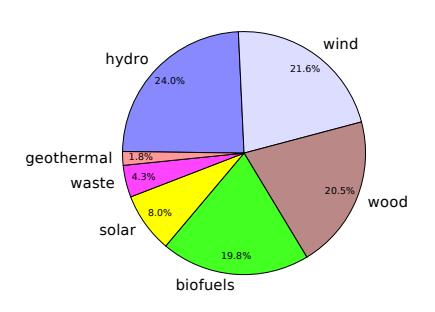

(chap:renewableoverview)=
# Renewable Energy Overview

We now understand that the path human civilization has traveled to this point—a path paved by fossil fuels—cannot lead very much farther before a new path must take over. One distinct possibility is a trek back toward a low-tech existence, but most people would consider such a development to be a failure. What would success look like, then? Sec. [D.5](#page-423-0) (p. [404\)](#page-423-0) in the Appendices takes a look at the big picture of long-term human success, but for present purposes we will focus on the critical issue of energy: where could we get enough energy to replace the prodigious one-time gift of fossil fuels?

This chapter is very brief, only setting the stage for upcoming chapters that go into alternative energy sources in greater detail. At the end of this effort, [Chapter](#page-308-0) [17](#page-308-0) summarizes the potential of all the energy resources. For now, we describe the origins and scales of Earth's energy inputs, and finish with a reminder of how much energy we get from these sources today.

## **10.1 The Players**

Before launching into detailed attributes of energy sources beyond fossil fuels, it is helpful to list the cast of characters.

- I **Hydroelectric** energy [\(Chap.](#page-192-0) [11\)](#page-192-0) traps water from a river behind a dam, forced to flow through a [turbine](#page-457-0)1 make electricity.
- I **Wind** energy [\(Chap.](#page-203-0) [12\)](#page-203-0) spins a turbine2 that makes electricity via a [generator.](#page-448-0)

*164*

that spins a [generator](#page-448-0) to 1: A turbine is basically a set of fan blades.

2: Wind turbines are sometimes called rotors or windmills.

The remnant of a fallen tree—called a nurselog—provides nutrition for a row of new trees, arranged in a colonnade. Photo credit: Tom Murphy

- I **Solar** energy [\(Chap.](#page-216-0) [13\)](#page-216-0) can provide direct heat or make electricity via [photovoltaic](#page-454-0) (PV) panels or in a utility-scale [solar thermal](#page-455-0) installation.
- I **Biological** energy [\(Chap.](#page-246-0) [14\)](#page-246-0) can range from food to firewood, or [biofuels.](#page-442-0) These are generally a source of [thermal energy,](#page-456-0) via burning, able to drive [heat engines.](#page-449-0)
- I **Nuclear Fission** [\(Chap.](#page-258-0) [15\)](#page-258-0) relies on mining a finite supply of radioactive elements in the Earth's crust whose fission (splitting) generates heat that can make steam to run a [heat engine](#page-449-0) and [generator](#page-448-0) to make electricity.
- I **Nuclear Fusion** [\(Chap.](#page-258-0) [15\)](#page-258-0), if successful, would use abundant hydrogen resources from water to build helium nuclei—a process that would release heat to make steam for running a [heat engine](#page-449-0) and [generator](#page-448-0) to make electricity.
- I **Geothermal** energy [\(Chap.](#page-294-0) [16\)](#page-294-0) originates in Earth's hot interior, and can be used for heating or to make steam to run a [heat engine](#page-449-0) and [generator](#page-448-0) to make electricity.
- I **Tidal Capture** [\(Chap.](#page-294-0) [16\)](#page-294-0) is very similar to hydroelectricity, but based on trapped tidal basins instead of dammed rivers.
- I **Ocean Currents** [\(Chap.](#page-294-0) [16\)](#page-294-0) behave much like wind, and can be used similarly to produce electricity, but underwater.
- I **Waves** [\(Chap.](#page-294-0) [16\)](#page-294-0) bring energy to shorelines that can drive specialized [generators](#page-448-0) to make electricity.

One prevalent theme connects most of these entries: lots of electricity, often by way of heat engines and/or generators. Indeed, alternatives to fossil fuels tend to excel at electricity production. But as we saw in Fig. [7.2](#page-124-0) [\(p. 105\),](#page-124-0) electricity makes up only 38% of energy demand in the U.S., and only 17% of the energy *delivered* to the four end-use [sectors.](#page-455-1)3 One lesson is that current energy uses that are *not* electricity-based—like transportation and industrial processing4—will be more difficult to replace by the alternatives above.3: While 38.3 qBtu of the 101.3 qBtu total energy input in the U.S. is dedicated to electricity production, only 13.0 qBtu emerges from the process, which is 17% of the 76 qBtu total flowing into these end-use sectors.

4: . . . which requires a lot of heat

### **10.2 Alternatives vs. Renewables**

Before going further, we should clarify the difference between "alternative" and "renewable" resources.

**Definition 10.2.1** *Alternative Energy is a* non-fossil *source of energy. Solar, wind, and nuclear would be examples.*

**Definition 10.2.2** *Renewable Energy is a source of energy that is replenished by nature, so that its use may be sustained "indefinitely," without depletion. Solar energy, for instance is not "used up" by placing a panel in the sunlight.*

The sun will continue to shine no matter how many solar panels we set out. Wind is replenished daily by the sun heating the land and driving air currents. Solar energy drives the [hydrological cycle,](#page-449-1) refilling the reservoirs behind hydroelectric dams. Plants grow back to replace harvested ones—again thanks to the sun. Ocean currents and waves are also driven by the sun, via wind.

Nothing, of course, lasts forever, but the sun will continue to operate in its current mode for billions of years more, and this is long enough to count as indefinite, for our purposes. [Table](#page-185-0) [10.1](#page-185-0) classifies various sources as to whether they are alternatives or renewables, along with justifications. The items with asterisks are *technically* not renewable, but last long enough that we can treat them as such in a practical sense (see [Box](#page-185-1) [10.1\)](#page-185-1).

| Resource        | Chapter | Alternative? | Renewable? | Reason                                              |
|-----------------|---------|--------------|------------|-----------------------------------------------------|
| Petroleum       | 8       | No           | No         | finite supply in ground                             |
| Natural Gas     | 8       | No           | No         | finite supply in ground                             |
| Coal            | 8       | No           | No         | finite supply in ground                             |
| Hydroelectric   | 11      | Yes          | Yes        | Sun generates rain and refills reservoirs           |
| Wind            | 12      | Yes          | Yes        | Sun generates daily by heating Earth surface        |
| Solar           | 13      | Yes          | Yes        | Sun will last billions of years                     |
| Biomass (wood)  | 14      | Yes          | Yes        | Sun grows more                                      |
| Nuclear Fission | 15      | Yes          | No         | finite supply of fissile material in ground         |
| Nuclear Fusion  | 15      | Yes          | Yes*       | billions of years of deuterium; not tritium/lithium |
| Geothermal      | 16      | Yes          | Yes*       | finite, but large; rate-limited                     |
| Tidal Capture   | 16      | Yes          | Yes*       | can drive Moon away eventually                      |
| Ocean Currents  | 16      | Yes          | Yes        | Sun/wind-driven                                     |
| Waves           | 16      | Yes          | Yes        | Sun/wind-driven                                     |

**Table 10.1:** Energy classification. Asterisks indicate non-replenished, but long-lasting sources.

Just because a resource is renewable does not mean it is *limitless*. [5](#page-20-5) We only have so much land, nutrients, and fresh water to grow biomass, for example. Cutting trees down faster than they grow back would result in depleting the resource—possibly permanently if the land is altered severely enough that trees do not grow back. Installing turbines throughout the ocean to capture ocean currents[6](#page-20-6) would eventually create enough impediment to the flow that it could stop altogether.#### **Box 10.1: About Those Asterisks. . .**

The items sporting asterisks in [Table](#page-185-0) [10.1](#page-185-0) deserve additional explanation as to why they are not technically renewable, even if the depletion timescales are extremely long.

Capturing all available tidal energy would end up accelerating the moon's egress from Earth,7 eventually causing loss of the resource.8

About half of the [geothermal](#page-448-1) energy store represents a one-time p. [402\)](#page-421-0).

5: Ultimately, only so much sunlight strikes the earth.

6: This would be a hugely expensive and impractical undertaking, but helps illustrate the point that renewable does not mean unlimited.

#### 7: . . . now at 3.8 cm/year

8: It would take hundreds of millions of years to "accomplish" this (see Sec. [D.4;](#page-421-0) deposit of heat left over from the collapse/formation of the earth,[9](#page-448-2) the other half coming from radioactive decays of elements ultimately tracing to ancient astrophysical cataclysms.[10](#page-448-2) For both the formation and radioactive contributions, the supply is not replenished after its use, although the timescale for the radioactive decays to fade away is billions of years.  
9: ... a conversion of gravitational potential [energy](#page-448-2)  
10: ... primarily supernova explosions and neutron star mergersNuclear fusion needs deuterium and tritium.11 Roughly one out of every 10,000 hydrogen atoms is deuterium, so ocean water ( $H_2O$ ) will have enough deuterium to last billions of years. Tritium, however, is not found naturally and must be synthesized from lithium, in finite supply. Details will follow in [Chapter 15.](#page-258-0)
11: Eventually it is hoped that only deuterium could be used.## **10.3 Renewable Energy Budget**

Notice that all of the unqualified12 "Yes" entries in [Table](#page-185-0) [10.1](#page-185-0) originate
from the sun. For that matter, fossil fuels represent captured ancient
solar energy, stored for all these years. The sun sends energy toward the
earth at a rate of 1,360 W/m2. Multiplying this by the projected area13 of
the earth ( $\pi R_{\oplus}^2 \approx 1.28 \times 10^{14} \text{ m}^2$ ) results in 174,000 TW of solar power
intercepting the earth. This number *absolutely dwarfs* the 18 TW societal
energy budget of all humans on Earth. [Figure](#page-186-2) [10.1](#page-186-2) shows graphically
what happens to this energy input.
12: . . . i.e., no asterisk
13: See [Example](#page-186-1) [10.3.1.](#page-186-1)

**Example 10.3.1 Solar Input**: Because we will encounter solar power flux many times in this textbook, this is a good opportunity to spell out some key numbers and concepts.

First, sunlight arriving at the top of Earth's atmosphere delivers energy at a rate of 1,360 Joules per second per square meter (1,360 W/m2 ), which is known as the [solar constant](#page-455-2) [\[4\]](#page-431-0) .

9: . . . a conversion of [gravitational potential](#page-448-2)

neutron star mergers

terium could be used.

2: . . . i.e., no asterisk

13: See Example 10.3.1.

**Figure 10.1:** Energy inputs to the earth, ignoring the radiation piece (since that is an output channel). About 70% of incoming solar energy is absorbed by the atmosphere and land, while about 30% is immediately reflected back to space (mostly by clouds). About half of the energy absorbed at the surface goes into evaporating water, while smaller portions drive winds, photosynthesis (land and sea), and ocean currents. Additional non-solar inputs are geothermal and tidal in origin [\[63–](#page-435-0)[65\]](#page-435-1).

[\[4\]](#page-431-0): Kopp et al. (2011), "A new, lower value of total solar irradiance: Evidence and climate significance"

Treating Earth as a sphere of radius  $R$ , it has surface area  $4\pi R^2$ , but the sun doesn't “see” the whole surface at once. In fact, from the vantage point of the rays of sunlight intercepting Earth, what matters is the *projection* of Earth,[14](#page-14-1) which just looks like a disk of area  $\pi R^2$ . Averaging the solar input across the entire planet therefore reduces the 1,360 W/m2 by a factor of 4 to 340 W/m2.Not all the sunlight arriving at the top of the atmosphere makes it to the surface, so in practice, a typical location will receive an average[15](#page-450-0) of about 200 W/m2. This is a number that comes up often as a typical [insolation,](#page-450-0) so is worth remembering.
Clouds and ice (mostly) reflect almost 30% of incoming sunlight, leaving 123,000 TW to be absorbed by land, water, and atmosphere in various forms (see [Table](#page-187-0) [10.2\)](#page-187-0). Virtually all of the energy hitting the surface goes to direct thermal absorption,16 16: That is, heating (see [Example](#page-187-1) [10.3.2\)](#page-187-1); much of which then flows into evaporation of water—the starting point of the [hydrological cycle.](#page-449-1) A tiny portion of the absorbed energy gives rise to wind, some of which will drive waves. An even smaller portion contributes to photosynthesis and supports essentially all life (biology) on the planet. And finally, a tiny fragment of the absorbed energy drives ocean currents. [Table](#page-187-0) [10.2](#page-187-0) tracks where the incoming solar energy goes, in several stages, also listing non-solar geothermal and tidal contributions. For comparison, the current energy scale of human activity is approximately 18 TW, while human metabolism,17 times 8 billion people is 800 GW, or 0.8 TW. is about 0.8 TW.

uated across the room. The area the sphere takes up on the photo is  $\pi R^2$ , not the total curved surface area of  $4\pi R^2$ . See also Fig. [9.6](#page-163-0) [\(p. 144\).](#page-163-0)15: ... averaging over day, night, sun angles,
and weather conditions.

note that solar panels could intercept part of this energy flow.

17: Recall Ex. [5.5.2](#page-93-0) (p. [74\)](#page-93-0). 100 W per person

**Table 10.2:** Earth's energy input budget. Symbols , ⊕, and \$represent Sun, Earth, and Moon, respectively. The second group breaks out the solar input into three pieces that add to the total in the row above. The third group all comes from absorbed energy—mostly at Earth's surface. The last group is not from radiant solar energy, so that percentages are in parentheses as they do not belong to the solar budget [\[63–](#page-435-0)[65\]](#page-435-1).

| Category            | Power (TW) | % solar  | source                                                                                        | Comments                                               |
|---------------------|------------|----------|-----------------------------------------------------------------------------------------------|--------------------------------------------------------|
| total solar input   | 174,000    | 100      | ☉                                                    | the next 3 inputs come from here                       |
| surface absorption  | 83,000     | 47.9     | ☉                                                    | heats surface; evaporates H2O, powers life, wind, etc. |
| reflection to space | 51,000     | 29.3     | ☉                                                    | from clouds, ice; uncaptured energy                    |
| atmos. absorption   | 40,000     | 22.6     | ☉                                                    | heats atmosphere, some to wind                         |
| evaporation         | 44,000     | 25.4     | ☉ → ☊ surf. | from surface absorption; hydrological cycle            |
| wind                | 900        | 0.5      | ☉ absorp.                                            | from absorptions above, also makes waves               |
| photosynthesis      | 100        | 0.06     | ☉ → ☊ surf. | fuels biology (life) on the planet                     |
| ocean currents      | 5          | 0.003    | ☉ → ☊ surf. | moves water around                                     |
| geothermal          | 44         | (0.025)  | ☊                                                    | half original heat, half radioactive decays            |
| tides               | 3          | (0.0018) | ☼ , ☉       | gravitational; mostly from Moon, some from Sun         |

**Example 10.3.2 Solar Heating**: How much would a black table18 18: . . . parameters defined below warm up sitting in full sun for ten minutes?

A nice round-number approximation of full overhead sunlight is that it delivers 1,000 W/m2 to the ground. If we situate a table whose top surface area is 1 m2, has a mass of 20 kg, and a specific [heat capacity](#page-448-3)18: ...parameters defined below

of 1,000 J/kg/◦C under full sun, we can proceed as follows.

The table will absorb 1,000 J per second,19 and therefore receives 600,000 J over the course of ten minutes. Multiplying the specific heat capacity by the table mass means the table absorbs 20,000 J for every 1°C of temperature rise, and therefore would climb 30°C in 10 minutes, in this case. That's a little unrealistically high, because a real table would also have cooling influences from the air and [infrared radiation.](#page-450-1) But the main point is to show how absorbed sunlight heats things up—like the Earth. [19: Because a Watt is a Joule per second and the table area is 1 m2; the black property essentially means that it absorbs all light that hits it.](#page-457-1)#### **Box 10.2: Making New Fossil Fuels**

We know from [Chapter](#page-133-0) [8](#page-133-0) that fossil fuels get their energy from ancient photosynthesis trapped in buried plant matter.20 20: In some cases, animals ate the plants We also now have a figure for how much solar power goes into photosynthesis: 100 TW.

We can compare this to the power that goes into making *new* fossil fuels right now by noting that the entire fossil fuel resource contains roughly[21](#page-146-0)  $10^{23}$ J (page [127](#page-146-0)), and formed over something like 100 million years, or about  $3 \times 10^{15}$  seconds. Dividing the two gives a power of about  $3 \times 10^7$  W, or 30 MW.[22](#page-146-0)
Three neat insights come out of this. First, we currently burn fossil fuels at a rate of about 15 TW, which is 500,000 times faster than they are being replaced! It's like short-circuiting a battery in a dramatic explosion of power. Imagine charging a phone for 2 hours and discharging it 500,000 times faster: in 0.014 seconds! Now look at the extravagant lights of Las Vegas: should we be proud of the blaze of glory or appalled?23 23: Also coming to mind is the Big Bay

Secondly, out of the total 100 TW photosynthetic budget on Earth, only 30 MW gets captured as fossil fuels, which is one part in three-million. Therefore, the chances that any given living matter on the planet today eventually ends up converted to fossil fuels is exceedingly slim.

Finally, if we only used fossil fuels at a rate of 30 MW,24 24: This amount of power could supply , then we *could* consider fossil fuels to be a renewable resource, as the sun/geology will slowly make more! So whether or not something is renewable also relies on the *rate* of use not exceeding the rate at which it is replenished.

## **10.4 Renewable Snapshot**

Table [7.1](#page-125-0) [\(p.106\)](#page-125-0) already gave an account of the mix of energy use in the U.S., including many of the renewables. This section revisits those numbers, in slightly more detail.

19: Because a **Watt** is a **Joule** per second and the table area is 1 m2; the black property essentially means that it absorbs all light that hits it.first, but the energy starts in plants.

numbers for this exercise.

consumes energy at about this rate.

Boom in San Diego, July 4, 2012, when the entire fireworks display that was meant to last 15–20 minutes all went off in a few dazzling seconds. LMAO. Best ever!

only a single campus-sized consumer on Earth.

| Source               | qBtu  | TW thermal equiv. | % of renewables | % of total |
|----------------------|-------|-------------------|-----------------|------------|
| hydroelectricity     | 2.77  | 0.093*            | 24              | 2.7        |
| wind                 | 2.49  | 0.083*            | 22              | 2.5        |
| wood                 | 2.36  | 0.079             | 21              | 2.3        |
| biofuels             | 2.28  | 0.076             | 20              | 2.3        |
| solar                | 0.92  | 0.031*            | 8               | 0.9        |
| waste (incineration) | 0.49  | 0.016             | 4               | 0.5        |
| geothermal           | 0.21  | 0.007             | 2               | 0.2        |
| total                | 11.52 | 0.382             | 100             | 11.4       |

In 2018, roughly 11% of energy in the U.S. came from renewable resources. [Table](#page-189-1) [10.3](#page-189-1) lists the contributions from each, the data coming from the [Annual Energy Review](#page-441-0) published by the U.S. [Energy Information](#page-445-0) [Administration](#page-445-0) for 2018. As introduced in Box [7.2](#page-125-1) [\(p.106\),](#page-125-1) the [EIA](#page-445-0) adopts the practice of assigning a [thermal equivalent](#page-456-1) for each source, in [qBtu,](#page-454-1) even if the source had nothing to do with a thermal process. The rationale is to put everything on the same footing as fossil fuels, for more direct quantitative comparisons. In doing so, they implicitly use the average thermal-to-delivered energy efficiency for fossil fuels of 37.5%.25 In other words, it takes 100 units of thermal fossil energy to produce 37.5 units of useful work. If, then, a solar panel delivers 37.5 units of energy over some amount of time, it will be *called* 100 units of "input" (thermal equivalent), even though it only delivered 37.5 units.26Four forms dominate [Table 10.3](#page-189-1) (and [Figure 10.2](#page-189-2)), each roughly equal in contribution. Lumping wood and biofuels into a generic ["biomass"](#page-442-1) puts this aggregate category in the clear lead, accounting for nearly half of our renewable energy.27 As noted, the entries in [Table 10.3](#page-189-1) are in qBtu of thermal equivalent, and these have been converted to TW, for easy comparison to [Table 10.2](#page-187-0).28 A key take-away is how *tiny* the renewable energy numbers are compared to the natural flows in Earth's energy budget.
  

27: . . . the other half, roughly, coming from
  

28: The items with asterisks in [Table](#page-189-1)## **10.5 Upshot: Our Path Forward**

We are now ready to plunge into learning about renewable energy resources. The topics are arranged according to ease of understanding the associated physics, which will be new to many students. So while solar is the most potent of the resources, its chapter follows those of hydroelectricity and wind, since its scheme for generating electricity29 is likely the least intuitive of the three. Biologically-derived energy comes next—sharing its direct sunlight origin with solar. Following a foray into nuclear energy, a number of minor contributors that are unlikely to be important are relegated to a single chapter of misfits, for completeness.After this, we will be in a position to assess the entire landscape of alternative energy options [\(Chapter](#page-308-0) [17\)](#page-308-0). The book will then take a turn **Table 10.3:** U.S. Renewable energy consumption in 2018. The last column compares to the 101.3 qBtu total U.S. consumption in 2018 [\[34\]](#page-433-0). Asterisks denote [thermal equiva](#page-456-1)[lent](#page-456-1) conversions. While the second column of numbers would be more naturally expressed in GW, the choice of TW is deliberate to emphasize how small renewable usage is compared to the available resource.

**Figure 10.2:** Same info as [Table](#page-189-1) [10.3](#page-189-1) in pie chart form.

25: 37.5% is the 2018 number from Appendix A6 of the [AER.](#page-441-1)

26: Alternatively, it would have taken 100 units of fossil fuel energy to match the 37.5 units of energy delivered by the solar panel.

hydroelectricity and wind

[10.3](#page-189-1) will not match production numbers in later chapters for non-thermal resources that are not expressed in thermal-equivalent terms.

in common with conventional power generation schemes, in that they use turbines and generators.

away from physics and address how all this new information might fit into future plans at societal and personal levels.

#### **10.6 Problems**

- 1. Based on what you already know or suspect about the alternative energy sources listed in [Section](#page-183-0) [10.1,](#page-183-0) which ones do you suspect30 30: Don't worry about correctness, as this is are pollution free (no emissions, no waste)? understanding.
- 2. Based on what you already know or suspect about the alternative energy sources listed in [Section](#page-183-0) [10.1,](#page-183-0) which ones do you suspect31 31: Don't worry about correctness, as this is understanding. have *no* negative environmental impacts? Explain your reasoning.
- 3. Which of the truly renewable ("Yes" without asterisk) entries in [Table](#page-185-0) [10.1](#page-185-0) are limited (finite) in terms of the scale32 32: . . . not how long it can last; how much we could achieve on Earth (explain the nature of the limit), and which are not limited (and why)?
- 4. Which four entries in [Table](#page-185-0) [10.1](#page-185-0) do not ultimately trace entirely to solar energy input to Earth?
- 5. If, for some terrible reason, the sun ceased shining and humans managed to survive for 1,000 years longer,33 33: It's nearly impossible to imagine that what options would be left for obtaining energy?
- 6. About 30% of the 1,360 W/m2 solar power arriving at Earth is immediately bounced back without a trace. Of the part that remains, when distributed/averaged around the whole sphere,34 34: account for projected vs. total surwhat is the average energy deposition rate per square meter into face area the earth system?
- 7. Based on the numbers in [Table](#page-187-0) [10.2,](#page-187-0) [Figure](#page-186-2) [10.1,](#page-186-2) and in the text, what fraction (in percent) of all biological activity on Earth do (all) humans represent, from a metabolic energy standpoint?
- 8. Based on the numbers in [Table](#page-187-0) [10.2,](#page-187-0) [Figure](#page-186-2) [10.1,](#page-186-2) and in the text, what fraction (in percent) is human societal energy production (all activities; fossil fuels, etc.) compared to all biological activity on the planet?
- 9. What fraction (in percent) of the solar energy *that is absorbed by Earth's surface* goes into evaporation (the hydrological cycle; refer to [Table](#page-187-0) [10.2,](#page-187-0) and [Figure](#page-186-2) [10.1\)](#page-186-2)?
- 10. If we add up the five smallest pieces in [Table](#page-187-0) [10.2,](#page-187-0) what fraction (in percent) does this set of energy flows represent in comparison to the total solar energy *absorbed by the earth system*?
- 11. The percentages of absorption and reflection in [Figure](#page-186-2) [10.1](#page-186-2) represent averages over weather conditions. On a clear day with the

an opportunity to think and gauge current

an opportunity to think and gauge current

[power](#page-453-1) is available

survival is at all realistic in this dire situation.

sun overhead, a solar panel has access to more light than the 48% depicted reaching the ground. If we can also capture the portion that on average is reflected by the ground and clouds,35 what 35: Recall, it's a clear day; no clouds. might we expect for the rate of energy reaching the ground (in  $W/m^2$ ) if the input at the top of the atmosphere is 1,360  $W/m^2$ ?- 12. Similar to [Example](#page-187-1) [10.3.2,](#page-187-1) how much warmer would you expect a 10 cm deep puddle of water36 to get after an hour in full sun, if the water absorbs all the energy and does not lose it to the environment?
- 13. Comparing [Table](#page-187-0) [10.2](#page-187-0) and [Table](#page-189-1) [10.3,](#page-189-1) what is the most striking mismatch,37 in terms of large potential vs. small contribution to U.S. energy consumption?
- 14. In one day, a typical residential solar installation might deliver about 10 [kilowatt-hours](#page-450-2) of energy. Meanwhile, a gallon of gasoline contains about 37 kWh of thermal energy. But the two ought not be directly compared, as burning the gasoline inevitably loses a lot of energy as heat. Correcting the solar output to a thermal equivalent,38 38: how many gallons per day of gasoline could it displace?
- 15. The U.S. occupies about 2% of Earth's surface area, thus collecting only part of the 83,000 TW absorbed at the surface. Compare the amount of solar power received by the U.S. to the *total* renewable power in [Table](#page-189-1) [10.3.](#page-189-1) 39 39: . . . since it's almost all solar in ultimate By what factor are we "underutilizing" the solar input, under the simplifying assumption that we could use all of it?

35: Recall, it's a clear day; no clouds.

36: *i* Water has a density of 1,000 kg per cubic meter and a specific heat capacity of 4,184 J/kg/◦C. Make up whatever area you want; the answer should be the same for any pick.

37: In other words, for those sources that can be matched within the tables, which stands out as the most underutilized relative to its input numbers?

*i* Use the 37.5% factor discussed in the text.

origin