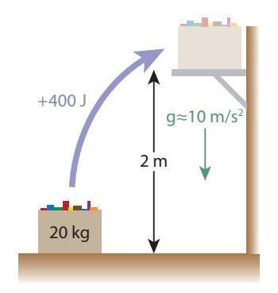
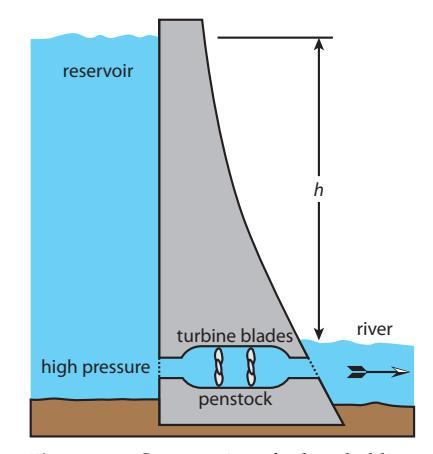
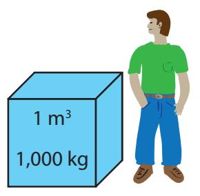
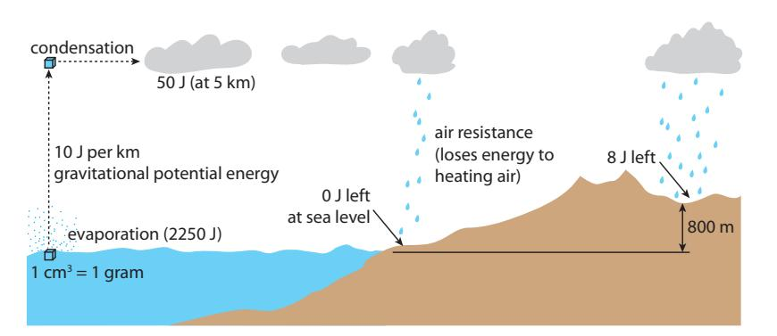
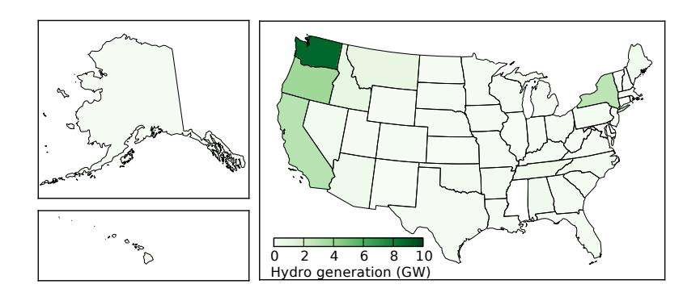
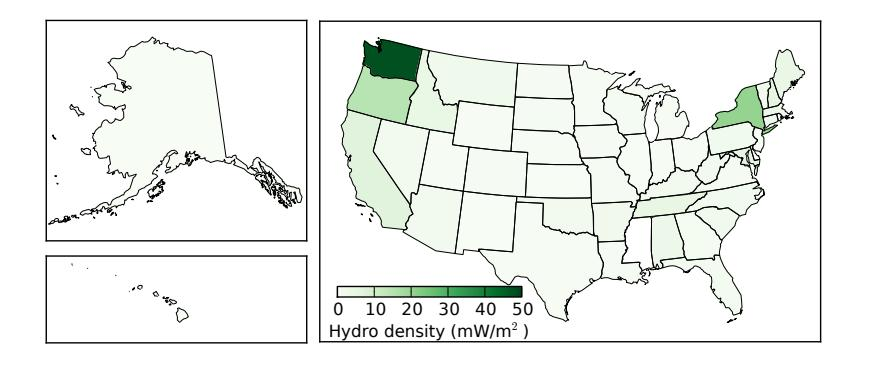
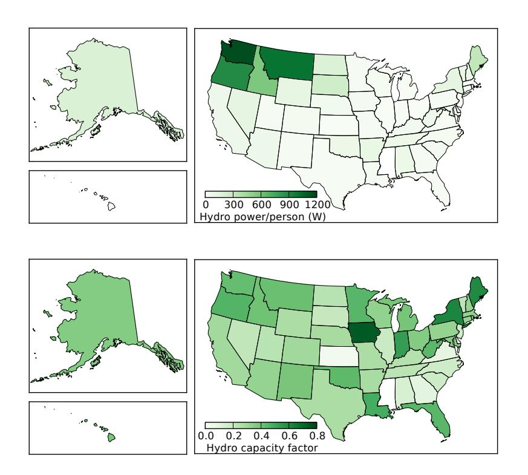
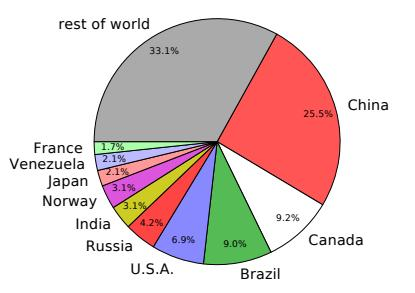

(chap:hydroelectricenergy)= 
# Hydroelectric Energy

Energy has been harnessed from flowing water for ages. Milling operations were often located on streams so that water could turn a wheel attached to grinding machinery. Today, captured water flow is a significant contributor to electricity worldwide in the form of hydroelectricity. The U.S. gets about 2.8% of its current energy (and 7% of electricity) from hydropower. Globally, hydropower accounts for about 9% of energy, or 16% of electrical production (Table [7.2; p.107\)](#page-126-0).

Hydroelectricity taps into the solar-driven evaporation cycle, relying on the gravitational energy embodied in water lifted onto the land from lower bodies of water. In other words, solar energy lifts water, giving it [gravitational potential energy,](#page-448-0) which is captured and converted to electrical energy.

While hydroelectric power is a simple and low-tech form of renewable energy that has been heavily exploited for over a hundred years, it is not one that is easy to expand beyond its current level of usage. This chapter will provide a better understanding of this mainstay of the renewable portfolio and its likely role in our future.  
Tidal power works in exactly the same way## **11.1 Gravitational Potential Energy**

Gravitational force is incredibly weak. It may not seem so from daily experience, but consider the fact that a magnet held in your hand can lift a paperclip—overwhelming the gravitational pull of the *entire* earth! By comparison, electromagnetic forces are forty orders-of-magnitude stronger than gravitational force. We don't tend to notice because electric charges tend to balance out so that gravity is the most obvious force in our daily lives.1

as hydroelectricity, but is a niche player and will be deferred to [Section](#page-299-0) [16.2.](#page-299-0)

1: Somewhat ironically, we only *feel* gravity because of a much stronger electromagnetic force that prevents us from falling through the floor. Electrons in the atoms in the floor and our feet repel each other to prevent freefall—a weightless state in which gravity can't be felt!

Boulder Dam. Photo Credit: Tom Murphy

*© 2022 T. W. Murphy, Jr.; [Creative Commons Attribution-NonCommercial 4.0 International Lic.;](https://creativecommons.org/licenses/by-nc/4.0/) Freely available at: [https://escholarship.org/uc/energy\\_ambitions.](https://escholarship.org/uc/energy_ambitions)*

We know intuitively that lifting a massive object requires [work,](#page-457-0) and thus [energy.](#page-446-0) In fact, since work is defined as a force times distance,2 and the force of gravity on an object follows Newton's second law,  $F = ma$ ,3 the force we need to exert on an object to lift it against gravity is called its weight, and is  $W = mg$ , where  $g = 9.8 \text{ m/s}^2 \approx 10 \text{ m/s}^2$  is the acceleration due to gravity on the surface of the earth. Thus, to lift an object through height,  $h$ , requires an energy input of this force,  $W$ , times the height,  $h$ . We call this [gravitational potential energy](#page-448-0) since the energy put in to lift something can be released later if the mass is allowed to fall or be lowered. An early use of gravitational potential energy was in the form of weights on chains in old clocks.
2: Recall Def. 5.1.1 (p. 68).
3: Force is mass times acceleration.**Definition 11.1.1** *[gravitational potential energy](#page-448-0) is computed as*
$$
G.P.E. = mgh,
$$

(11.1)

where  $m$  is the mass in kg,  $g \approx 10 \text{ m/s}^2$  is the acceleration due to gravity,[4](#page-4-4) and  $h$  is the height to which the mass is raised, in meters. The result is in Joules.Most commonly, gravitational potential energy is converted to [kinetic](#page-450-0) [energy](#page-450-0) as an object falls: slowly at first but accelerating as more potential energy is converted to kinetic energy while the object gains speed (see Fig. [5.1; p.](#page-89-0) [70\)](#page-89-0). Only the vertical distance matters in computing gravitational potential energy: sideways motion does not operate against the gravitational force. Sliding a crate across a flat, level floor does take work to overcome friction, but that energy is converted to heat and cannot be later returned in useful form.5 In this case, the crate has gained no gravitational potential energy, since its height never changed.**Example 11.1.1** Lifting a 20 kg box of books, whose weight is therefore  $W = mg \approx 200$  N,6 from the floor to a high shelf through a vertical distance of 2 m involves an energy expenditure of  $mgh \approx 400$  J [\(Figure 11.1\)](#page-193-2). We would say the box gained 400 J of potential energy.If the person doing the work is exerting energy at a rate of 200 W (200 J/s), it will take two seconds to complete the action.If the box later falls off the shelf and hits a 1.5 m tall person on the head, the box has *lost* 100 J (20 kg × 10 m/s2× 0.5 m) of potential energy (now kinetic) by the time it hits the person's head.## **11.1.1 Comparison to Other Forms**

To give a flavor of how weak gravitational potential energy is compared to other familiar forms of energy storage, we will consider the energy content in a standard AA alkaline battery and in a similar volume of gasoline. So we're talking about something approximately the size of#### 2: Recall [Def.](#page-68-0) [5.1.1](#page-68-0) (p. [68\)](#page-68-0).

3: Force is mass times acceleration.4: Some may remember it more pedantically as 9.8 m/s2, but for the purposes of this book, 10 m/s2 will do nicely. Note that choosing this number implies that we are concerned only with gravitational energy on the earth's surface.5: We often say in this case that the energy is "lost." But energy is strictly conserved—not created or destroyed—so it is never *really* lost, it just escapes into a non-useful form.6: . . . again using  $g \approx 10 \text{ m/s}^2$ 

**Figure 11.1:** Diagram for [Example](#page-193-1) [11.1.1.](#page-193-1)a small finger. We want to know how much mass must be lifted to yield the same amount of gravitational potential energy as is contained in a battery or equivalent volume of gasoline. In the comparison, we will imagine having a hoist that can lift a large mass7 4 m high—about 7: . . . a rock, for instance house-height.

A standard AA battery cell has a charge rating of 2.5 Ah8 and operates at about 1.5 V. Following the development in Sec. 5.8 (p. 76), we multiply these two numbers to get 3.75 Wh, translating to 13.5 kJ. Equating this to  $mgh$ , where we know  $g \approx 10 \text{ m/s}^2$  and  $h = 4$  m, we find that  $m \approx 340$  kg. That's really heavy—about the mass of 4–5 people.9 Meanwhile, the AA battery is a puny 0.023 kg. Reflect for a moment on this comparison, visualizing 340 kg lifted 4 m above the ground providing the same amount of energy as a AA battery held in your hand.Gasoline is even more extreme. At an [energy density](#page-446-1) around 34 kJ per mL of volume, filling a AA-sized cup10 with gasoline yields about 250 kJ of energy. Performing the same computation, we would need to lift over 6,000 kg (6 metric tons) to a height of 4 m to get the same energy content. Typical cars have masses in the 1,000–2,000 kg range, so we're talking about something like 4 cars! One caveat is that we are not typically able to convert the thermal energy in gasoline12 into useful work at much better than 25%, while gravitational potential energy can be converted at nearly 100%. Still, being able to lift 1,500 kg13 to a height of 4 m using the energy in 7 mL of gasoline is rather impressive, again emphasizing that gravitational potential energy is pretty weak. It only amounts to significance when the masses (volumes) of water are rather large.11  

10: ... just over 7 mL  

11: Thus, gasoline is nearly 20 times as energy-dense as a AA battery by volume. Usually, we will discuss [energy density](#page-446-1) by *mass*, in which case the ~5× denser battery provides nearly 100× less energy per gram than does gasoline.  

12: ... via combustion; see Sec. 6.4 (p. 88)  

13: ... now just one car, rather than four; it means this small volume of gasoline can propel a car up a 4 m hill8: The number is usually given as, e.g., 2,500 mAh (milli-amp-hours).

9: Amuse yourself by picturing 4–5 people slung haphazardly into a net and hoisted to roof height—a very odd (and grumpy?) replacement for a AA battery.

#### 10: . . . just over 7 mL

energy-dense as a AA battery *by volume*. Usually, we will discuss [energy density](#page-446-1) *by mass*, in which case the ∼5× denser battery provides nearly 100× less energy per gram than does gasoline.

12: . . . via combustion; see [Sec.](#page-107-0) [6.4](#page-107-0) (p. [88\)](#page-107-0)

13: . . . now just one car, rather than four; it means this small volume of gasoline can propel a car up a 4 m hill

## **11.2 Hydroelectric Energy**

The basic idea behind hydroelectricity is that water in a reservoir behind a dam [\(Figure](#page-194-1) [11.2\)](#page-194-1) creates pressure at the base of the dam that can force water to flow through a [turbine](#page-457-2) that drives a [generator](#page-448-1) to make electricity—sharing elements of [Fig.](#page-109-0) [6.2](#page-109-0) (p. [90\)](#page-109-0) but spinning the turbine by water flow instead. The amount of energy available works out to be the gravitational potential energy corresponding to the height of water at the lake's surface relative to the water level on the other side. It's as if dropping the water from the surface to the turbine and asking how much potential energy it gave up in the process. In reality, water is not dropping from the lake surface, but the force on the water at the turbine is determined by the height of water above it: the "pressure head," as it is called. The process is highly efficient, approaching 90% capture of the potential energy in the water delivered as electrical power from the generator.

**Figure 11.2:** Cross section of a dam, holding back a reservoir of water at height, ℎ, over the downstream river.

#### **Box 11.1: Why So Efficient?**

Achieving 90% efficiency is superb! Electric motors and generators14 can be > 90% efficient in converting between mechanical energy tion. (rotation) and electrical energy. When coupled with low-friction turbines, dams just have very little loss—unlike thermal sources where most of the energy is unavoidably lost (for reasons covered in Sec. [6.4; p.](#page-107-0) [88\)](#page-107-0).

**Example 11.2.1** To compute the [power](#page-453-0) available from a hydroelectric plant, we need to know the *height* of the reservoir and the *flow rate* of water—usually measured in cubic meters per second. The density of water is, conveniently, 1,000 kg/m3 [\(Figure](#page-195-0) [11.3\)](#page-195-0), so that if we consider a dam having a flow rate of 2,000 m3/s and a reservoir height of 50 m, we can see that every second of time will pass 2 × 106 kg of water,15 and the associated potential energy is 푚 푔 ℎ ≈ 109 J. If each second delivers 1 GJ of energy, the power available is 1 GJ/s, or 1 GW. At an efficiency of 90%, we get to keep 900 MW of electrical power.

The largest hydroelectric facility in the world is the Three Gorges Dam in China, rated at an astounding 22.5 GW. The largest in the U.S. is the Grand Coulee on the Columbia River, producing a maximum of 6.8 GW. The iconic Boulder Dam (a.k.a. Hoover Dam) is just over 2 GW.

Note that flow rates vary seasonally with rainfall, so that dams cannot always operate at full capacity. In fact, the U.S. has about 80 GW of *capacity* installed, but operates at an annual average of about 33 GW. This implies a typical ["capacity factor"](#page-443-0) around 40%.

**Definition 11.2.1** *A [capacity factor](#page-443-0) is the ratio of actual performance over time to the peak possible performance—or average output divided by maximum output, expressed as a percentage.*

**Example 11.2.2** Boulder (Hoover) Dam on the Colorado River is listed in [\[66\]](#page-435-0) as having a capacity of 2,080 MW and an annual production of 4.2 TWh. What is its capacity factor?

We just need to turn the 4.2 TWh in a year into an average delivered [power.](#page-453-0) Following the definition of a [watt-hour,](#page-457-3) we note that all we really have to do is divide 4.2 × 1012 Wh16 16: 1 TWh is 10 by the number of hours in 12 [Wh.](#page-457-1) a year: 24 times 365, or 8760.

4.2 ×  $10^{12}$  Wh/8760 h ≈ 480 MW average power. Dividing this by 2,080 MW (max capacity) gives a 23% capacity factor.As we saw in Fig. [7.5](#page-127-0) [\(p.108\)](#page-127-0) and Table [10.3](#page-189-0) [\(p.170\)](#page-189-0), hydroelectricity in the U.S. accounts for 2.7% of the nation's total energy consumption, corresponding to about 33 GW of production. Globally, hydroelectric production averaged 477 GW in 2017. By comparison, Table [10.2](#page-187-0) [\(p.168\)](#page-187-0)14: Fundamentally, motors and generators are nearly identical in concept and construc-

**Figure 11.3:** One cubic meter of water has a mass of 1,000 kg.

15: Flow rate times density gives mass per second: 2,000 m3/s times 1,000 kg/m3 = 2 × 106 kg/sLook at the Wikipedia page on largest hydroelectric power stations [\[66\]](#page-435-0) for a complete list.

16: 1 TWh is 10¹² Wh.

indicates that 44,000 TW of solar input goes into evaporation and the [hydrological cycle.](#page-449-0) Why, then, are we only able to use 0.477 TW (0.001%) of this bounty? Is this a great, untapped renewable resource?

## **11.2.1 Theoretical Potential**

To understand the giant mismatch between solar input and hydroelectric development, we first need to study evaporation.

**Definition 11.2.2** *The [heat of vaporization](#page-449-1) of water is about 2,250 J per gram, meaning that every gram of water that goes from liquid to gas (vapor) requires an energy input of* ∼*2,250 J.*

### **Box 11.2: Vaporization is Serious Energy**

To put this in perspective, it takes 100 [calories](#page-443-1) (418 J) to bring one gram of water from freezing to boiling temperature. Then it takes another 2,250 J to evaporate the water, which is a far larger quantity. This is why water in a pot does not all flash into steam once the water reaches 100◦C, as it would if the evaporation energy was very small. Instead, a boiling pot will retain water for a good while as energy continues to be applied before all boiling away.

**Figure 11.4:** The [hydrological cycle.](#page-449-0) Sunlight evaporates water from the surface, at a cost of 2,250 J per gram. Each kilometer of height the gram of water gains in forming clouds costs an additional 10 J. When rain falls on terrain, most of the gravitational potential energy is spent, but on average retains 8 J—based on an average land elevation of 800 m. The 2,250 J of evaporation energy is released as heat when the water condenses into clouds.

So let's follow the energetics of a gram of water17 on its journey to a 17: . . . one cubic centimeter hydroelectric dam—most of which is represented in [Figure](#page-196-1) [11.4.](#page-196-1) First, the sun injects 2,250 J to evaporate that gram. Then let's say it gets lofted to 5 km.18 The [gravitational potential energy,](#page-448-0) 푚 푔 ℎ, comes to 18: . . . typical cloud height 0.001 × 10 × 5000 = 50 J. That's only 2% of the amount that went into evaporation.19 19: The sun must, in total, supply 2,300 J to

When the water condenses in the cloud, it *releases* 2,250 J of thermal energy into the cloud/air, then falls back to the ground as rain, offering 50 J of still-available energy. If it falls on the ocean, where it presumably started, it gives up all 50 J of gravitational potential energy into useless forms.[20](#page-2-1) But if it falls on land—higher than sea level—it retains some gravitational potential, based on how high that land is above sea level.
only 50 J of the 2,300 J is kept as potential energy.
[20](#page-2-1): . . . heat through air resistance and collision with the ocean surface
18: . . . typical cloud height

evaporate and lift the gram of water, and only 50 J of the 2,300 J is kept as potential energy.

lision with the ocean surface

On average, terrain is about 800 m above sea level, so each gram that falls on land has an average of 8 J left as available energy. But only 29% of the earth's surface is land, so that the gram of water we're tracking preserves about 2 J of energy, on average.21 21: . . . reduced from 8 J since most rain falls

We're down to only 0.1% of the input solar energy—2 J out of 2,300 J input—so that the theoretical hydroelectric potential might be about 44 TW: reduced from the 44,000 TW input. But only a small fraction of rain flows into rivers suitable for damming. And once dammed, a typical dam height is in the neighborhood of 50 m, knocking us down even further. Much of the journey from terrain to reservoir involves losing elevation in streams too small to practically dam, or just seeping through the ground. In the end, perhaps it is not surprising that we end up in the sub-TW regime globally.

Detailed assessments [\[67\]](#page-435-1) of hydroelectric potential globally estimate a *technically* feasible potential22 around 2 TW, but only half of this is deemed to be economically viable. Recall that 477 GW, or about 0.5 TW, is delivered globally, which is therefore about half of what we believe to be the practical limit of  $\sim$ 1 TW. Thus we might not expect more than a factor-of-two expansion of current hydroelectricity as possible/practical. The low-hanging fruit has been plucked already, capturing about half of the total practical resource. [\[67\]](#page-435-1): (1997), *Study on the Importance of*Compared to the 18 TW global scale of energy use, hydroelectricity is not poised to assume a large share at this level, unless the overall scale of energy use is reduced substantially. Let's say this more visibly: **hydroelectric power cannot possibly come close to satisfying present global power demand.**

## **11.3 Hydropower in the U.S.**

Hydroelectric power is not available to the same degree everywhere. Geography and rainfall are key factors. This brief section serves to present a snapshot of the distribution and qualities of hydroelectric power generation in the United States. We start with [Figure](#page-198-0) [11.5,](#page-198-0) showing the average hydroelectric power generated in each state, the top four states being listed in [Table](#page-197-1) [11.1.](#page-197-1) These four states account for 56% of hydroelectricity in the U.S., and the next states on the ranked list drop to 1 GW or lower. Most of the California generation is in the northern part of the state, effectively as part of the Pacific Northwest region.

To get a sense for how concentrated different sources are, we will make a habit of examining power density for renewable resource implementations. [Figure](#page-198-1) [11.6](#page-198-1) indicates the state-by-state density of hydroelectric power generation,23 just dividing generation by state area. No state exceeds 0.05 W/m2, which can be contrasted to [insolation](#page-450-1) values (see Ex. [10.3.1; p.167\)](#page-186-0) of  $\sim$ 200 W/m2. Globally, total land area is about
23: ... based on actual generation, not installed capacityback onto ocean

The 90% efficiency of a hydroelectric dam is now contextualized a bit better. That last step is pretty efficient, but the overall process is extremely inefficient. Still, it takes relatively little effort to exploit, and provides real power. Efficiency is not everything.

*Harnessing the Hydropower Resources of the World*

22: . . . if cost is no barrier

| Table 11.1: Top hydroelectric states. |                 |
|------------------------------------------|-----------------|
| State                                    | Production (GW) |
| Washington                               | 8.9             |
| Oregon                                   | 3.8             |
| California                               | 3.0             |
| New York                                 | 2.9             |
| U.S. Total                               | 33              |

stalled capacity

1.25 × 1014 m2, so that a total hydroelectric potential of 2.5 TW[24](#page-3-1) would yield 0.02 W/m2. Therefore, the state of Washington stands out as unusual, having *already developed* a generation capacity 2.5 times larger than the upper-end global average expectation. In other words, most of the world cannot emulate what nature has provided in Washington.[25](#page-3-1)
Not all places have the same available resources.
[24](#page-3-1): This is higher than estimated potential developed resources, but mathematically convenient here.
[25](#page-3-1): Washington's hydroelectric dominance owes largely to the presence of the mighty

Next, we look at hydroelectric generation per capita. [Figure](#page-199-2) [11.7](#page-199-2) shows the result. In this view, the states of the Pacific Northwest really pop up, and New York dims relative to its by-area showing. The contrast between [Figure](#page-198-1) [11.6](#page-198-1) and [Figure](#page-199-2) [11.7](#page-199-2) is effectively reflecting population density: large, sparsely-populated states26 show up more prominently 26: Montana, Idaho, even Alaska on the per-capita map than the per-area map.

Finally, for completeness, we look at the [capacity factors](#page-443-0) of hydroelectric installations, by state. The total installed capacity in the database used for these plots is 77.6 GW spread among 1,317 dams, while producing an annual average of 28.1 GW—corresponding to an overall capacity factor of 0.36. [Figure](#page-199-3) [11.8](#page-199-3) shows how this distributes around the country. Since the Pacific Northwest dominates in installed hydroelectric power, it largely determines the overall capacity factor. Iowa stands out as having a high capacity factor, but only has 0.153 GW of installed capacity.27 Contrast this to Washington, having an installation capacity of 20.7 GW.28

**Figure 11.5:** Average U.S. hydroelectric power delivered for each state, showing strongly along the west-coast, plus New York. And yes, Alaska really is that big.

developed resources, but mathematically convenient here.

owes largely to the presence of the mighty Columbia River, rather than human factors.

**Figure 11.6:** U.S. hydroelectric power per area delivered for each state, giving a sense of how concentrated the resource is. The units are milliwatts per square meter, peaking at 48 mW/m2 for Washington.26: Montana, Idaho, even Alaska

27: . . . delivering an average of 0.114 GW in 8 dams, dominated by the 0.125 GW Keokuk dam

28: . . . delivering an average of 8.9 GW spread across 65 dams

## **11.4 Global Hydropower**

This section provides a brief snapshot of hydroelectric production globally, which we saw at the end of [Section](#page-196-0) [11.2.1](#page-196-0) amounts to 477 GW. [Figure](#page-199-4) [11.9](#page-199-4) shows which countries have the most hydroelectricity, the corresponding numbers appearing in [Table](#page-199-5) [11.2—](#page-199-5)including the percentage of electricity derived from hydroelectric sources within the country. Notice that Norway, Venezuela, Brazil, and Canada derive more than half their electricity demand from hydroelectricity. Keep in mind that electricity is not the whole energy story for a country, as Fig. [7.2](#page-124-0) [\(p.105\)](#page-124-0) made clear.

| Rank | Country | GW  | % elec. | Rank | Country   | GW | % elec. |
|------|---------|-----|---------|------|-----------|----|---------|
| 1.   | China   | 122 | 19      | 6.   | India     | 15 | 10      |
| 2.   | Canada  | 44  | 58      | 7.   | Norway    | 15 | 96      |
| 3.   | Brazil  | 43  | 63      | 8.   | Japan     | 10 | 8       |
| 4.   | U.S.    | 33  | 6.5     | 9.   | Venezuela | 10 | 68      |
| 5.   | Russia  | 20  | 17      | 10   | France    | 8  | 12      |

# **11.5 Upshot: Pros and Cons of Hydro**

The two lists below provide some pros and cons to hydroelectric power that are relevant to our assessment of its value to our mix of renewable energy options. First, the positive attributes:

*© 2022 T. W. Murphy, Jr.; [Creative Commons Attribution-NonCommercial 4.0 International Lic.;](https://creativecommons.org/licenses/by-nc/4.0/) Freely available at: [https://escholarship.org/uc/energy\\_ambitions.](https://escholarship.org/uc/energy_ambitions)*

**Figure 11.7:** U.S. hydroelectric power per population within each state, indicating which residents receive the most hydroelectric power. The Pacific Northwest wins.

**Figure 11.8:** U.S. hydroelectric [capacity fac](#page-443-0)[tors](#page-443-0) by state. The national average (weighted by generation) is about 0.4, meaning that over the course of a year the dams deliver 40% of their rated capacity—subject to seasonal water flow.

**Figure 11.9:** Global allocation of hydroelectric power.

**Table 11.2:** Top ten hydroelectric producers in the world, accounting for two-thirds of the hydroelectricity production worldwide.

- I Natural source, solar-driven, without waste products or pollution;29 29: . . . aside from construction and decom-
- missioning aspects I Technologically simple, therefore straightforward to implement and maintain;
- I High efficiency, turning 90% of available energy into useful electricity;
- I Good baseline of steady power over daily timescales;30 30: . . . no imposed short-term fluctuations
- wind I Life-cycle CO2 [emissions](#page-451-0) only 4% that of traditional fossil fuel electricity [\[68\]](#page-435-2);
- I Facilities31 31: . . . the dam itself, at least; turbines and can last a century or longer;
- I While not directly related to energy, dams can provide flood control and reliable water supplies.

And some of the downsides that may discourage further development:

- I Silt can build up behind dams displacing the reservoir, eventually rendering them useless and dangerous;
- I Requires the semi-permanent flooding of an ecological habitat, of varying quality and value;
- I Seasonal variability of available power, often by a factor of ten;
- I Defunct or poorly maintained facilities represent a dam-burst danger to downstream residents;
- I Blocks salmon runs and impacts the health of both oceanic and forest ecosystems;
- I As the distribution maps show, hydroelectric is not a viable option everywhere: the combination of terrain32 32: . . . mountains or canyons to hold the and rainfall is needed.

On balance, our society has embraced hydroelectricity as a clean and reliable resource. One can view it as nature's low-hanging fruit, partly evidenced by how early it was adopted on a large scale. It is likely to remain an attractive form of energy as we face increasing pressures to migrate away from carbon-based fuels.33 It will not, however, be able to provide an avenue for wholesale replacement of fossil fuels given its limited scale and electric-only nature. Only if our overall energy demand is reduced substantially will it form a large fraction of our portfolio.  
33: ... whether due to resource limits or# **11.6 Problems**

- 1. If a 70 kg person climbs 10 flights of stairs, each flight 3 m high, how much potential energy have they gained?
- 2. If an 80 kg person is capable of delivering external mechanical energy at a rate of 200 W sustained over several minutes,34 how 34: It is hard to keep up 200 W for too long. high would they be able to climb in two minutes?
- 3. A 10 kg box is lifted 2 m off the floor and placed on a frictionless horizontal conveyor to take it 30 m across a warehouse. At the end of the conveyor, it is lowered 1 m where it ends up on a shelf.35

29: . . . aside from construction and decom-
missioning aspects

in available power, as happens for solar or

generators will need periodic replacement

reservoir

climate change action

34: It is hard to keep up 200 W for too long.

35: The shelf is therefore 1 m off the same (original) floor.

How much *net* gravitational potential energy was given to the box from the start to the end of the process?

- 4. A standard AA battery cell stores about 13.5 kJ of energy. At a mass of 23 g each, how high would you have to lift the battery to get the same amount of gravitational potential energy?
- 5. A gallon of gasoline contains about 130 MJ of [chemical energy](#page-443-2) at a mass of around 3 kg. How high would you have to lift the gallon of gasoline to get the same amount of gravitational potential energy? Compare the result to the radius of the earth.
- 6. [Problem](#page-201-0) [5](#page-201-0) used one gallon of gasoline to compute the equivalent height for gravitational potential energy. Does the result depend on what volume of gasoline we selected? Make an airtight argument as to why or why not. Solving symbolically36 may be a helpful 36: . . . using variables/symbols route—but not the only one.
- 7. A typical American household uses approximately 30 kWh per day of electricity. Convert this to Joules and then imagine building a water tank 10.8 m above the house37 37: Pretend all the water is at this height. to supply one day's worth of electricity.38 38: Assume 100% conversion efficiency for How much mass of water is this, in kg? At a density of 1,000 kg/m3 , what is the volume in cubic meters, and what is the side length of a cube39 having this volume? Take a moment to 39: . . . cube root of volume visualize (or sketch) this arrangement.
- 8. The biggest hydroelectric installation in the U.S. is the Grand Coulee dam on the Columbia River. The enormous flow rate reaches its maximum at 4,300 m3/s, and the dam (reservoir) height is 168 m. At an efficiency of 90%, at what rate is this dam capable of producing hydroelectric power (in GW40 electrical power. )? Don't forget the density of water and that 푔 ≈ 10 m/s 2 .
- 9. The Hoover Dam (also called Boulder Dam) on the Colorado River is rated at 2.08 GW when the flow is at its maximum rate of 1,280 m3/s. How high is the reservoir if the efficiency of the installation is 90%?
- 10. A dam 50 meters high is constructed on a river and is delivering 180 MW at some moment in time. What is the flow rate of water, in cubic meters per second, if the facility converts gravitational potential energy into electricity at 90% efficiency?
- 11. A hydroelectric facility is built to deliver a peak power of 1 GW, which it manages to do for three months of the year during the spring snow-melt. But for three months in summer, it drops to 700 MW, This stepwise behavior is not exactly realthen 500 MW for three months in fall. In winter, it drops way down to 200 MW for three months. Using the concept of the [capacity factor](#page-443-0) [\(Definition](#page-195-1) [11.2.1\)](#page-195-1), what is the annual average capacity factor for this facility?

*i* The result emphasizes how weak gravitational potential energy is.

*i* The result emphasizes how weak gravitational potential energy is.

Hint: the energy density in MJ per kg is a property of the gasoline.

36: . . . using variables/symbols

37: Pretend all the water is at this height.

mathematical convenience.

39: ... cube root of volume

40: *i* For comparison, a large nuclear reactor typically produces about 1 GW of

istic, but need not be to apply the concept correctly.

- 12. While the Chief Joseph Dam on the Columbia River can generate as much as 2.62 GW (2.62 × 109 W) of power at full flow, the river does not always run at full flow. The average annual production is 10.7 TWh per year (10.7 × 1012 Wh/yr). Hint: Multiplying peak power by hours in What is the [capacity factor](#page-443-0) of the dam: the amount delivered vs. the amount if running at 100% capacity the whole year?
- 13. The Robert Moses Niagara dam in New York is rated at 2,429 MW41 41: . . . peak power capacity and has a high capacity factor of 0.633. How many kWh does it produce in an average day, Hint: Convert average power to kW then and how many homes would this serve at the national average of 30 kWh/day?
- 14. The Robert Moses Niagara dam from [Problem](#page-202-0) [13](#page-202-0) is 30 m high. What is the peak flow rate, in m3/s, if it can produce full capacity power (2.43 GW electrical output) while converting gravitational potential energy to electricity at 90% efficiency?
- 15. It takes 2,250 J to evaporate each gram of water, while only taking about 330 J to raise the temperature of water from room temperature to the boiling point. If it takes 10 minutes to bring a pot of water from room temperature to boiling, how much additional time will it take to boil off (evaporate) all the water if injecting energy at the same rate the whole time?
- 16. Starting at 44,000 TW of solar input to the hydrologic cycle, parallel the development in [Section](#page-196-0) [11.2.1](#page-196-0) by computing the power remaining at each stage42 42: Each stage will knock down the number if, for each gram of water:
	- a) water is evaporated and lifted to 5 km height;43
	- b) 30% of the water falls on land where collection is possible;
	- c) the typical land height is 800 m;
	- d) only 20% of the water makes it to dammable locations;
	- e) only 50 m of height (of the original 800 m average) is left for the dam.

By this analysis, how much hydroelectric power is theoretically possible, globally?

17. Fig. [10.1](#page-186-1) [\(p.167\)](#page-186-1) indicated that about 44,000 TW globally goes into evaporating water. We can turn this into an estimate of how much rain we expect per year, on average. The simplest way to do this is to think of a single square meter of ocean surface, receiving an average evaporation input power of 120 W.44 Each millimeter of of water depth across our square meter has a volume of 1 L, or a mass of 1 kg. At a steady input of 120 W,45 how many millimeters of water are drawn off in a year? That same amount will come back down *somewhere* as precipitation.a year will result in units similar to Wh/yr for direct comparison.

41: ...peak power capacity

multiply by hours.

further; report each in TW.

43: This is the largest jump, keeping only 50 J out of every 2,300 J.

44:  $44,000\times10^{12}$  W divided by  $3.7\times10^{14}$  m2
of ocean surface is 120 W/m2.*i* The steady 120 W is already accounting for day/night: this is a time average.