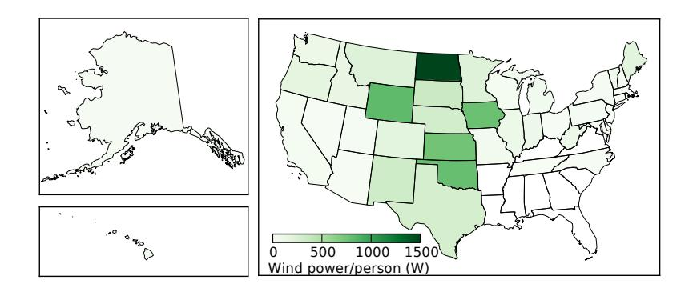

(chap:windenergy)= 
# Wind Energy

Wind energy has made significant inroads for electricity production in the U.S. and globally. Today, the U.S. gets about 2.5% of its energy (and 6.5% of electricity) from wind. Globally, wind accounts for about 2.6% of energy, or 4.8% of electrical production (Table [7.2; p.107\)](#page-126-0).

The basic technology of harnessing wind power is rather old, powering ships, milling operations, and water pumps for centuries. Today, the predominant use of wind drives [generators](#page-448-0) to make electricity.

Just as hydroelectric power is related to the very basic form of [grav](#page-448-1)[itational potential energy,](#page-448-1) wind is connected to another simple and easy-to-understand form: [kinetic energy.](#page-450-0) This chapter first develops familiarity with kinetic energy, then explores how we get energy from wind, how much we get, and future prospects.

# **12.1 Kinetic Energy**

An object in motion carries [kinetic energy](#page-450-0) equal to one-half its mass times the velocity squared.

**Definition 12.1.1** *The [kinetic energy](#page-450-0) of a mass,* 푚*, moving at velocity,* 푣*, is* 1

$$
K.E. = \frac{1}{2}mv^2.
$$
 (12.1)

**Example 12.1.1** A 70 kg person walking at a brisk 2 m/s would have a kinetic energy of 140 J.  

For examples like these, framed as state-Pushing a 50 kg ice skater from rest at a power of 75 W for 3 seconds would impart 225 J of kinetic energy, resulting in a speed of 3 m/s.

ments and not questions, you can practice solving several types of problems by covering up one number and then solving for it using still-available information. So they provide several examples in one!

Photo credit: Tom Murphy

*© 2022 T. W. Murphy, Jr.; [Creative Commons Attribution-NonCommercial 4.0 International Lic.;](https://creativecommons.org/licenses/by-nc/4.0/) Freely available at: [https://escholarship.org/uc/energy\\_ambitions.](https://escholarship.org/uc/energy_ambitions)*

Often, we use energy sources to *deliver* kinetic energy, as in moving planes, trains and automobiles.

**Example 12.1.2** A 1,500 kg car moving at freeway speeds (30 m/s) has a kinetic energy around 675 kJ.

Getting up to this speed from rest in 5 seconds would require a power of 135 kW,1 equating to 180 horsepower.2

acceleration. But we can also go the other direction and convert kinetic energy into different forms of energy3 for versatile use. Most commonly, we turn 3: See [Table](#page-89-0) [5.2](#page-89-0) (p. [70\)](#page-89-0), for examples. kinetic energy into electrical potential energy (a voltage) that can drive a circuit. At this point, the energy can be used to toast a bagel, charge a phone, or wash clothes.

The method for converting kinetic energy into electricity is usually accomplished by transferring kinetic energy in a moving fluid4 into rotation of a shaft by way of a [turbine—](#page-457-0)essentially fan blades. The spinning shaft then turns an electric [generator,](#page-448-0) which consists of the relative motion between magnets and coils of wire, and is essentially the same construction/concept as an electric motor run in reverse.

Hydroelectric installations do the same thing—turning a shaft via blades of a turbine—even though we framed the energy source as one of gravitational potential energy. Within the dam's turbine, the water acquires kinetic energy as it flows from the reservoir to the outlet. Wind energy acts in much the same way, converting kinetic energy in the moving air into rotational motion of a fan/turbine whose shaft is connected to a generator located behind the blades.

# **12.2 Wind Energy**

It is tempting to think of air as "empty" space, but at sea level air has a density of 1.25 kg per cubic meter (휌air ≈ 1.25 kg/m3 ). Let this sink in visually: imagine a cubic meter sitting next to you (as in [Figure](#page-204-1) [12.1\)](#page-204-1). The air within has a mass of 1.25 kg (about 2.75 lb). Now draw a square meter on the ground—either literally or in your imagination. The many kilometers of air extending vertically over the top of that square meter has a mass of ∼10,000 kg! For context, figure out how many cars that would be (typ. 1,500 kg ea.), or what kind of animal would be this massive.

What this means is that air in motion can carry a significant amount of [kinetic energy,](#page-450-0) since neither its mass nor velocity are zero. If the entire earth's atmosphere moved at 5 m/s—a noticeable breeze—at a total mass5 of  $5 \times 10^{18}$  kg, we'd have  $6 \times 10^{19}$  J of kinetic energy in air currents. If we somehow pulled all this energy out of the air—stopping its motion entirely—we might expect the atmosphere to revive its normal wind

**Figure 12.1:** The mass of a cubic meter of air is 1.25 kg, and the mass of atmosphere over one square meter is an astounding 10 metric tons.

5: 104 kg per square meter times the surface area of Earth (4휋푅 2 ⊕ )

1: Do the calculation yourself to follow along.

2: Recall that 1 hp is 746 W. Indeed, it takes a powerful engine to provide this level of

3: See Table 5.2 (p. 70), for examples.

4: In this sense, "fluid" is a general term that can mean a liquid or even air.

patterns over the course of 24 hours: a full day of the driving solar input around the globe. The associated power works out to 700 TW. Notice that the value for wind in Table [10.2](#page-187-0) [\(p.168\)](#page-187-0) is pretty-darned close to this, at 900 TW.6 As the margin note indicates, we should be pleased to get within a factor of two for so little work and very off-the-cuff assumptions about global average air speed (see [Box](#page-205-0) [12.1](#page-205-0) for related thoughts). [Figure](#page-205-1) [12.2](#page-205-1) shows the annual average wind velocity at a height of 80 m (typical wind turbine height) for the U.S. Note that the 5 m/s we used above falls comfortably within the 4–8 m/s range seen in the map.

#### See if you can confirm; own it yourself!

6: In the first draft of this textbook, a different data source was used for [Table](#page-187-0) [10.2](#page-187-0) that had wind at 370 TW. Even so, the 700 TW estimate corroborated the orderof-magnitude scale and was deemed a satisfactory check: within a factor of two.

**Figure 12.2:** Average wind velocity at a height of 80 m across the U.S. [\[69\]](#page-435-0). Boundaries between colored boxes are every 0.5 m/s from 4.0 m/s to 10.0 m/s. Nothing on this map exceeds 9 m/s, and the deepest green is below 4 m/s. The plains states are the hot ticket. Note that Alaska is not to scale. From [NREL.](#page-373-0)

#### **Box 12.1: The Value of Estimation/Checking**

Calculations like the one above offer a way to see if something at least checks out and seems plausible. If we had found that the whole atmosphere would have to be moving at 50 m/s to get the 900 TW figure in Table [10.2](#page-187-0) [\(p. 168\),](#page-187-0) we would suspect a problem, and either distrust the 900 TW number—seeking another source to confirm—or re-evaluate our own understanding. If we could get to 900 TW by only having wind speeds of 0.1 m/s,7 we would also have cause for skepticism. When crude estimates of this type land in the general vicinity8 of a number we see in a table, we can at least be assured that the number is not outlandish, and that our basic understanding of the phenomenon is okay. Checking understanding against presented data is excellent practice!  
  
7: ... or requiring weeks rather to re-establish, once sapped  
8: ... say, within a factor of tenBut we can't capture the *entire* atmospheric wind, because doing so would require wind turbines throughout the volume, up to 10 km high! In fact, some estimates [\[70\]](#page-435-1) of practical global wind installations come in as low as 1 TW—well below our 18 TW demand. Wind alone is unlikely [\[70\]](#page-435-1): Ca
Power Po
Limits"7: . . . or requiring weeks rather than a day to re-establish, once sapped

8: ...say, within a factor of ten

[\[70\]](#page-435-1): Castro et al. (2011), "Global Wind Power Potential: Physical and Technological able to replace the energy currently derived from fossil fuels.

### **12.2.1 Wind Turbines**

To understand practically-available energy, we back up and consider how much air hits a wind turbine whose rotor diameter is 푅. [Figure](#page-206-1) [12.3](#page-206-1) illustrates the concept. If the wind speed is 푣, the air travels a distance 푣Δ푡 in time interval Δ푡. 9

The cross-sectional area of the wind turbine (rotor) is defined as the area swept out by the blades, so  $\pi R^2$ . Thus the volume of the cylinder of air interacting with the turbine over time interval  $\Delta t$  is the "base" (circular) area of the cylinder times its "height" (straight length,  $v\Delta t$ ), or  $V = \pi R^2v\Delta t$ . We know the density of the air,[10](#page-453-0) so the mass of the cylinder is  $m = \rho_{air}V = \rho_{air}\pi R^2v\Delta t$ . The kinetic energy *contained* in this cylinder of air is therefore K.E.  $= \frac{1}{2}mv^2 = \frac{1}{2}\rho_{air}\pi R^2v^3\Delta t$ . Now let's get rid of that pesky  $\Delta t$ . Think for a moment what happens if we divide both sides by  $\Delta t$ : it will definitely get rid of the  $\Delta t$  on the right-hand-side, but what does the left-hand side mean: energy over time? Hopefully, this is familiar by now as the concept of [power.](#page-453-0)
[10](#page-453-0):  $\rho_{air} \approx 1.25 \text{ kg/m}^3$ **Definition 12.2.1** *The power delivered by a wind turbine of radius* 푅 *in wind speed* 푣 *and operating at efficiency* 휀 *is*

$$
P_{\text{wind}} = \frac{1}{2} \varepsilon \rho_{\text{air}} \pi R^2 v^3. \tag{12.2}
$$

*where*  $\rho$ air  $\approx$  1.25 kg/m3 *at sea level. Efficiency has been inserted as*  $\epsilon$  *and tends to be 40–50% for modern turbines.*Notice that the delivered power scales, sensibly, with the area of the wind turbine's blade path, but more importantly and perhaps surprisingly as the velocity *cubed* [\(Table](#page-206-2) [12.1\)](#page-206-2). The cubed part should make you sit

9: We can pick any value for Δ푡: a long interval makes a very long cylinder, while a small Δ푡 results in a short, stubby cylinder. In the end, the value we chose for Δ푡 will cancel out, so as not to matter.

**Figure 12.3:** Wind power concept. In time interval Δ푡 at wind speed 푣, a volume of air encounters the rotor having the shape of a cylinder of radius 푅 and length 푣Δ푡. Note that most wind turbines are designed to pivot about a vertical axis to face into the wind, whatever the direction.

$$
10: \rho_{\text{air}} \approx 1.25 \,\text{kg/m}^3
$$

**Table 12.1:** Wind power scales as the cube of wind speed.

| Speed | Power |
|-------|-------|
| 0     | 0     |
| 1     | 1     |
| 2     | 8     |
| 3     | 27    |
| 4     | 64    |
| 5     | 125   |
| :     | :     |
| 10    | 1,000 |

up straight: that's a very strong function of velocity! It means that if the wind changes from a gentle 5 m/s to a brisk 10 m/s, the power available goes up by a factor of 8. A strong wind at 20 m/s has 64 times as much power as the 5 m/s breeze.11 11: Now it may be easier to understand why We can understand the three powers of velocity thusly: two powers come from kinetic energy, and one from the length of the cylinder. As wind speed increases, not only does the oncoming air have more kinetic energy per fixed volume, but also a larger volume encounters the turbine in a given time.

Setting  $\varepsilon$  = 1 in [Eq.](#page-206-3) [12.2](#page-206-3) corresponds to the *total* power present in the wind. But we can't be greedy and grab *all* of it. In fact, if we did, it would mean *stopping* the air at the wind turbine: pulling out all the kinetic energy means no velocity is left. If we did this, newly arriving air would divert around the stopped mass of air, and the turbine would no longer have access to oncoming energy. The theory has all been worked out:12 a turbine is limited to  $\varepsilon \le 16/27$  (59%) of the available energy, known as the [Betz limit](#page-442-0) [\[72\]](#page-435-3). This is not a technological limitation, but comes from the physics of fluid flow. A second consideration enters for low-speed rotor motion, known as the Glauert limit [\[73\]](#page-435-4), resulting in diminishing efficiency as wind speed drops.
  

12: A recent derivation is in [\[71\]](#page-435-2).
  

[\[72\]](#page-435-3): Betz (1926), "Wind-Energie und ihre Ausnützung durch Windmühlen"
  

[\[73\]](#page-435-4): Glauert (1993), *The elements of airfoil and airscrew theory*

[Figure](#page-207-0) [12.4](#page-207-0) shows these theoretical limits, along with design limits from various rotor configurations. Curves reflect an optimum rotor speed for each design: speeding up produces more generator output until it gets fast enough that air drag on the blades starts to dominate. The most common modern turbine is the 3-blade design,[13](#page-207-0) able to get roughly 50% of the energy out of the wind. Notice that the tip speed can be quite high: 6–8 times the wind speed. This can be quite alarming to birds in the area, whose cruising speed is nearer wind speed, and they
13: Not only is the three-blade design the most efficient, its lower tip speed is less dangerous than for 2 or 1-blade designs, according to [Figure](#page-207-0) [12.4](#page-207-0).

hurricanes can be so destructive, if their power scales as the cube of wind velocity, and velocities exceed 50 m/s.

Ausnützung durch Windmühlen"

*and airscrew theory*

**Figure 12.4:** Theoretical and practical wind turbine efficiencies (휀, or cp in the plot), for various designs. The parameter 휆 is the ratio of tip speed to wind speed: higher 휆 means a faster tip speed [\[74\]](#page-435-5). All designs must be below the [Betz limit](#page-442-0) (horizontal line near top). At slower speeds, the Glauert limit confines performance to occupy the region to the right of the curve marked 2. Each of the 7 designs shown have arched curves, achieving maximum efficiency at a particular tip speed. Too slow, and the turbine is not transmitting much energy; too fast and drag/friction begins to dominate. Adapted from ©[2010 WIT Press.](#page-373-1)

most efficient, its lower tip speed is less dangerous than for 2 or 1-blade designs, according to [Figure](#page-207-0) [12.4.](#page-207-0)

have never met something so fast before. For a modern derivation of the [Betz limit](#page-442-0) and how efficiency depends on tip speed, see [\[71\]](#page-435-2) [\[71\]](#page-435-2): Ragheb et al. (2011), "Wind Turbines . The largest turbines—having 150 m diameter rotors—are rated for up to 10 MW of electrical power production.

**Example 12.2.1** How much power could you expect a small (4 m *diameter*) 3-blade wind turbine situated atop your house to deliver in a respectable 5 m/s breeze?The radius is 2 m and we'll pick a middle-of-the-road efficiency of 45%:  $P = \frac{1}{2} \cdot 0.45 \cdot (1.25 \text{ kg/m}^3) \cdot \pi \cdot (2 \text{ m})^2 \cdot (5 \text{ m/s})^3$  comes to about 450 W.[14](#page-21-1)
[14](#page-21-1): Not too impressive: hard to get muchBesides the limit on how much power can be pulled out of the air by a single turbine, we also find limits on how *densely* they may be populated in a given area: how much space is required between turbines so that one does not disrupt the other. Obviously, it would not serve to put one turbine directly behind another, as they would at best split the available power arriving as wind. Even side by side, it is best to leave room between windmills so that additional rows are not deprived of wind power. A rule of thumb is to separate turbines by at least 5–8 diameters side-to-side, and 7–15 diameters[15](#cite_note-15) along the (prevailing) wind direction. For the sake of illustration, [Figure](#page-208-0) [12.5](#page-208-0) shows a spacing on the denser side of the range, but otherwise we adopt the more recent recommendations and use 8 diameters side-to-side and 15 diameters deep [\[75\]](#page-435-6). This works out to a 0.65% ["fill factor,](#page-447-0)" meaning that 0.65% of the land area contains an associated rotor cross section.[16](#cite_note-16)
15: An older "rule of thumb" was 5 side-to-side and 7-8 deep, but newer work suggests as much as 8 diameters side-to-side and 15 diameters deep.

16: ... one  $\pi R^2$  rotor area for every  $8D \times 15D = 120D^2 = 120 \times (2R)^2 = 480R^2$  of land area.

In order to compare to other forms of renewable energy, we can evaluate a power per unit land area (in W/m2 ) by the following approach:

$$
\frac{\text{power}}{\text{area}} = \frac{\frac{1}{2}\varepsilon\rho_{\text{air}}\pi R^{2} v^{3}}{480R^{2}} = \frac{\pi}{960}\varepsilon\rho_{\text{air}}v^{3}, \quad (12.3)
$$

employing the rule-of-thumb 8 × 15 turbine placement scheme. Using an efficiency of 40% and  $v = 5$  m/s,17 we get 0.2 W/m2--which is 1,000 times smaller than solar's ~200 W/m2 [insolation](#page-450-1) (Ex. [10.3.1; p.167](#page-186-0)).
A final general note about wind generation is somewhat obvious: the

Theory - The Betz Equation and Optimal Rotor Tip Speed Ratio"

wind power on a household scale, although 10 m/s would give 3.6 kW.

side and 7–8 deep, but newer work suggests as much as 8 diameters side-to-side and 15 diameters deep.

16: . . . one 휋푅 2 rotor area for every 8퐷 × 15퐷 = 120퐷2 = 120 × (2푅) 2 = 480푅 2 of land area

**Figure 12.5:** Overhead view of wind farm turbine locations, for the case where separations are 10 rotor-diameters along the wind direction, and 5 rotor diameters in the crosswind direction—a geometry that yields 1.6% area ["fill factor.](#page-447-0)" Current recommendations are for 15 and 8 rotor diameters, which is significantly more sparse than even this depiction, leading to 0.65% area fill. Note that most wind turbines can turn to face the wind direction, for times when its direction is not the prevailing one.

global wind power estimates lining up with Table [10.2](#page-187-0) [\(p.168\).](#page-187-0)

wind is not always blowing, and its speed varies over wide ranges. In this sense, wind is an *intermittent* power source. Just as for hydroelectric installations, wind resources are characterized by a regionally-dependent [capacity factor,](#page-443-0) which is the ratio of energy delivered to what would have been delivered if the generation facility operated at full capacity at all times. Typical capacity factors for wind in the U.S.18 18: [Capacity factors](#page-443-0) for wind are smaller are around 33%, and [Figure](#page-209-0) [12.6](#page-209-0) provides a visual sense for how this manifests in the real world: pretty erratic.

For very low wind speeds,[19](#page-448-0) wind turbines do not have enough wind to turn at all and sit still at zero output. Furthermore, a turbine is rated at some maximum power output, which occurs at some moderately high wind speed,[20](#page-448-0) beyond which the [generator](#page-448-0) risks damage—like "redlining" a car's engine. When the wind climbs above this maximum-rated speed, the turbine is pegged at its maximum power—no longer following a  $v^3$  relation—and deliberately twists its blades[21](#page-448-0) to be *less* efficient as the wind speed grows so that it maintains constant (maximum) power output. When the wind speed becomes large enough to endanger the [turbine,](#page-457-0) it will twist its blades parallel to the wind to allow the air to pass without turning the rotor at all, so that it no longer spins while it "rides out" the high winds.[22](#page-448-0)  
19: . . . less than about 3 m/s; called the "cut-in" velocity  
20: . . . usually around 12–15 m/s  
21: The blades are like long airplane wings and are mounted so that they can be rotated on an axis running the length of the blade, allowing them to engage the wind at any angle, thus varying efficiency.  
22: A typical shut-off wind speed for tur-

[Figure](#page-209-1) [12.7](#page-209-1) shows a typical power curve for a 2 MW turbine, on top of which are drawn a cubic function of velocity at the theoretical Betz limit (red curve), a cubic (blue) at 44% efficiency (휀 = 0.44), and the green manufacturer's curve [\[77\]](#page-435-8) stability study towards forecasting" . Notice that the turbine performance

than for hydroelectricity due to wind being more variable than river flow.

**Figure 12.6:** One month of wind generation from a 20 MW wind farm, illustrating the intermittent nature and why capacity factors are low [\[76\]](#page-435-7). The facility saturates at maximum power late in the month, selflimiting to avoid damage to the turbines. ©[2010 Springer.](#page-373-2)

"cut-in" velocity

20: ... usually around 12–15 m/s

and are mounted so that they can be rotated on an axis running the length of the blade, allowing them to engage the wind at any angle, thus varying efficiency.

bines is 20–30 m/s.

**Figure 12.7:** Actual data (thickly-clustered black circles) of power delivered by a turbine rated at 2 MW, as a function of wind velocity. The red curve represents the theoretical Betz limit of 59%, appearing as a cubic function of velocity—as [Eq.](#page-206-3) [12.2](#page-206-3) dictates. The better-matching blue curve corresponds to an overall efficiency 휀 = cp = 0.44 (44%), and the green curve—which rolls over from the cubic function and saturates at higher velocities—is the manufacturer's expectation for the unit [\[77\]](#page-435-8). The "cut-in" velocity for this turbine is around 3.5 m/s: note the small step up from zero output in the green curve. This turbine saturates around 12 m/s: the green curve flattens out and no black circles appear above the cutoff. From ©[2017 Wiley.](#page-373-3)

[\[77\]](#page-435-8): Fischer et al. (2017), "Statistical learning for windpower: a modeling and demonstrates the aspects covered in the previous paragraph: "cutting in" just above 3 m/s and maxing out (saturating) beyond about 12 m/s. In between, it closely follows a cubic function at an overall efficiency of 44% (blue curve).

# **12.3 Wind Installations**

Global wind installations are rising rapidly, currently (as of 2020) above 600 GW of installed capacity.23 [Table](#page-210-1) [12.2](#page-210-1) lists the major players, in to the [capacity factor.](#page-443-0) terms of installed capacity, average generation, fraction of total energy,24 capacity factor, and share of global wind generation. The amount of wind energy in each country depends on a combination of how much wind is available in the country, how fast electricity demand is growing, electrical infrastructure, and political interest in renewable energies.

23: A small fraction of this is realized, due

24: To compare wind to total energy, we follow the thermal equivalent convention discussed for Table [10.3](#page-189-0) [\(p.170\)](#page-189-0)

**Table 12.2:** Global wind installations in 2018 [\[78](#page-435-9)[–84\]](#page-436-0). The top six countries capture 85% of the global total.

| Country     | GW installed | GW average | cap. fac. (%) | energy fraction (%) | global share (%) |
|-------------|--------------|------------|---------------|---------------------|------------------|
| China       | 184          | 41.8       | 22.7          | 3.0                 | 33               |
| U.S.        | 97           | 31.4       | 32.4          | 2.7                 | 25               |
| Germany     | 59           | 12.7       | 21.4          | 8.3                 | 10               |
| India       | 35           | 6.5        | 18.5          | 2.3                 | 5.2              |
| Spain       | 23           | 5.4        | 23.5          | 8.3                 | 4.3              |
| UK          | 21.7         | 6.5        | 30.0          | 6.9                 | 5.2              |
| World Total | 592          | ~ 125      | 21.1          | 2.0                 | 100              |

In 2018, the U.S. had about 94 GW of *installed* wind capability.25 This 25: From tables 1.14.B and 6.2.B in [\[85\]](#page-436-1) number has recently surpassed hydroelectric installed capacity (about 80 GW). Both are impacted by [capacity factors,](#page-443-0) which for wind averages 33% in the U.S., while hydropower is just over 40%. The net effect is that the generation for the two is pretty comparable.26 Where is the wind 26: . . . as we also saw in Table [10.3](#page-189-0) [\(p.170\)](#page-189-0) power in the U.S. installed? [Figure](#page-210-2) [12.8](#page-210-2) shows that Texas wins, at 8.7 GW. Oklahoma is a distant second at 3.2 GW, Iowa at 2.5 GW. California is in fifth place at 1.6 GW.

**Figure 12.8:** Wind power by state, in terms of average generation, in GW, in 2018. The color scale may seem unhelpful, but the unavoidable truth is that many states don't have a lot going on, and Texas is so dominant as to render other states almost insignificant. A logarithmic color scale could help, but then the important lesson on the gross disparity might go unappreciated.

25: From tables 1.14.B and 6.2.B in [85]

26: ... as we also saw in Table 10.3 (p. 170)

Following the flow we used in Sec. [11.3](#page-197-0) [\(p.178\),](#page-197-0) we show wind generation as a function of area [\(Figure](#page-211-0) [12.9\)](#page-211-0), to get a sense for how concentrated the installations are. Oklahoma and Iowa jump in front of Texas by this measure. Texas has more total generation than all others, but is a very large state in terms of area. Iowa, for instance produces about 30% as much wind power as Texas, but at only 20% the size. The numbers, reaching about 0.017 W/m2 are a bit smaller than those for hydroelectricity, where two states exceeded this value.27 We can compare these numbers to the 0.2 W/m2 *fully-developed* potential we estimated in the paragraph following [Eq.](#page-208-1) [12.3](#page-208-1) to conclude that in principle we could expand wind by a large factor.28
  
27: . . . 0.05 W/m2 is

Next, we look at wind generation per capita in states, in [Figure](#page-211-1) [12.10.](#page-211-1) Now North Dakota blows away the rest, at 1.6 kW per person, followed by four states at about half of this value. We can put this in context by noting that the average power consumption in the U.S. per capita is around 10 kW.

Finally, [Figure](#page-212-1) [12.11](#page-212-1) shows wind capacity factors, indicating where the wind is most reliable. It peaks around 41% in Kansas, but all of the plains states in general do well. The southeastern U.S. has almost no wind development,29 29: Lack of wind makes it a poor fit: see as is evident in any one of these figures.

**Figure 12.9:** Average wind power by state, divided by state area to indicate a density of the developed resource, in milliwatts per square meter (based on 2018 data). We might expect some resemblance to [Figure](#page-205-1) [12.2,](#page-205-1) based on where the resource is most favorable.

in Washington; followed We can compare by New York at 0.02 W/m2

> 28: . . . about 10 times, in the case of Iowa, but bear in mind the 0.2 W/m2 estimate was based on 5 m/s, while Iowa scores a bit higher, according to [Figure](#page-205-1) [12.2](#page-205-1)

> **Figure 12.10:** Average wind power generation by state divided by state population for an average power per person (based on 2018 data).

> also [Figure](#page-205-1) [12.2.](#page-205-1)

## **12.4 Upshot: Wind is not Overblown**

Wind has surged tremendously in the last decade (Fig. [7.5; p.108\)](#page-127-0), proving to be an economically viable and competitive resource. But how much could we expect to get from wind?

Putting a few of the previous results together, If the entire contiguous U.S. (area ∼1013 m2) were developed for wind at an estimated power density of 0.2 W/m2—which was based on a 5 m/s average wind speed—and a capacity factor of 33%, the U.S. could theoretically produce 0.7 TW30[\[30\]](#page-10-1) from wind—roughly 20 times what is produced today. We should take this crude estimate as an extreme upper end, since it is inconceivable that we would develop wind so fully as to never be more than a few hundred meters—a few rotor diameters—away from a wind turbine, no matter where we go. Also, many areas are sub-threshold and would not support investment in wind development. 30: We're fudging things a bit here forEven so, the inflated 0.7 TW estimate falls short of the current 3.3 TW energy demand in the U.S., has major intermittency problems, and is not in a form that can be well-used in all [sectors,](#page-455-0) like transportation and industrial processing. While wind *alone* cannot replace fossil fuels at the current level of demand, it *can* doubtless be a significant contributor.

Globally, estimates for wind potential tend to be in the few-terawatt range, though can be as low as 1 TW for a number of practical reasons. As was the case for hydroelectricity, wind is a viable player in the renewables mix, but is unable to shoulder the entire load. [\[70\]](#page-435-1): Castro et al. (2011), “Global WindWind energy is not free of environmental concerns, disturbing landscapes and habitats. Its impact on birds31 31: Domestic cats turn out to kill far more and bats is most worrisome, as the rotors move far faster than anything to which the wildlife is habituated. Still, compared to the environmental toll from fossil fuels, it is fairly clean—similar to the impact of hydroelectric power.

A pros and cons list will help summarize. First, the positive attributes:

I Wind is replenished on the planet daily by solar illumination;

**Figure 12.11:** Capacity factor for wind installations by state (based on 2018 data).

the sake of simplicity. If turbines are built for 12 m/s, the capacity factor already has some averaging built in, so using 5 m/s *and* a capacity factor of 0.33 is unfair. On the other hand, much of the country spends substantial time below the cut-in speed for turbines, and the cruel cubic function of velocity greatly suppresses much of the land area as impractical for wind development. So the approach is a compromise that might balance out reasonably.

Power Potential: Physical and Technological Limits"

birds than wind turbines do, currently.

- I Harnessing wind is relatively low-tech and straightforward;
- I Wind has decent efficiency—typically 40–50%—in extracting energy from the oncoming wind;
- I Life-cycle CO2 [emissions](#page-451-0) for wind is only 2% that of traditional fossil fuel electricity [\[68\]](#page-435-10) [\[68\]](#page-435-10): (2020), *Life Cycle GHG Emissions* ;
- I Growth in the wind sector points to economic viability;
- I Wind is able to scale up to cover a meaningful fraction of energy demand.

And the downsides:

- I Wind is intermittent: power when nature allows, not when people demand;
- I Wind is regionally variable: many places do not produce enough wind to support development;
- I Wind can cause environmental disruption to habitats—especially dangerous to birds and bats;
- I Esthetic objections to noise and degradation of scenery hamper expansion.

# **12.5 Problems**

- 1. A modest slap32 might consist of about 1 kg of mass moving at 32: . . . how painful can a few Joules be? 2 m/s. How much kinetic energy is this?
- 2. A *hard* slap might consist of about 1 kg of mass moving at 10 m/s. How much kinetic energy is this, and how much warmer would 10 g of skin33 33: . . . corresponding to a volume of 10 mL get if the skin has the [heat capacity](#page-448-2) properties of water, as in the definition of a [calorie](#page-443-1) (Sec. [5.5; p.](#page-92-0) [73](#page-92-0) and [Sec.](#page-104-0) [6.2;](#page-104-0) p. [85](#page-104-0) are relevant)?
- 3. A 10 kg bowling ball falls from a height of 5 m. Using the convenient 푔 ≈ 10 m/s 2 , how much gravitational potential energy does it have? Just before it hits the ground, all of this potential energy has gone into kinetic energy.34 34: . . . neglecting any energy flow to air What is the speed of the bowling ball when it reaches the ground, based on kinetic energy?
- 4. Did the final answer for the speed of the bowling ball at the end of its drop depend on the mass?35 Write out the math symbolically36 and solve for velocity, 푣. Does the result depend on mass?
- 5. [Thermal energy](#page-456-0) is just randomized kinetic energy on a microscopic scale. To gain some insight into this, consider one liter (1 kg) of water, and figure out how much energy it would take to heat it from absolute zero temperature37 to 300 K assuming that the definition of the [calorie](#page-443-1) (Sec. [5.5; p.](#page-92-0) [73\)](#page-92-0) applies across this entire range. If this same amount of energy went into kinetic energy—hurling the water across the room—what would the corresponding velocity be?

32: . . . how painful can a few Joules be?

appropriate to a slap area of 10 cm by 10 cm and to a depth of 1 mm

resistance

35: Try it using a different mass.

36: . . . using variables/symbols

37: . . . 0 K, when the kinetic energy is effectively frozen out, or stopped

*i* As large as the number is, it is representative of the speeds of individual molecules within the water, and is, not coincidentally, similar to the speed of sound in water.

- 6. A typical house may have a floor area around 150 m2 (1,600 square feet). If the floor–to-ceiling distance is typically 2.5 m, how much mass is in the air within the house? Could you lift this much mass if handed to you as bags of rocks?
- 7. Atmospheric pressure is about 105 N/m2 , meaning that a 100,000 N weight of air—corresponding to a mass of 10,000 kg—sits atop very square meter of the ground (at or near sea level). If the air density were constant at 1.25 kg/m3—rather than decreasing with height as it actually does—how high would the atmosphere extend to result in this weight (mass)?
- 8. Comparing the pale green region in the southeastern U.S. to the purple region of the plains states in [Figure](#page-205-1) [12.2,](#page-205-1) how much more power would we expect out of the same rotor placed in the plains than in the southeast (by what factor is it bigger in the plains)?
- 9. How much more powerful is a hurricane-strength wind of 50 m/s hitting your house than is a light breeze of 5 m/s?
- 10. How much *power* would a moderate-sized 50%–efficient wind turbine produce whose radius is 10 m at wind speeds of 5 m/s, 10 m/s, 15 m/s, and 20 m/s? Express the answers in kW or MW, depending on what is most natural.
- 11. The [Betz limit](#page-442-0) says that we get to keep no more than 59% of the available wind power. If 59% of the kinetic energy in a lump of air moving at speed 38 푣 is removed, how fast is it going afterwards,39 39: This relates to wind speed just behind as a fraction of the original speed? a wind turbine
- 12. The largest wind turbines have rotor *diameters*40 around 150 m. 40: not radius Using a sensible efficiency of 50%, what power does such a jumbo turbine deliver at a maximum design wind speed of 13 m/s?
- 13. A recent news article announces the largest wind turbine yet, measuring 220 m in *diameter* and having a maximum power output of 13 MW. Using a reasonable efficiency, calculate the velocity of the wind at which maximum power is reached.
- 14. Compare the tip speed of a three-blade turbine operating at its optimal efficiency (as per [Figure](#page-207-0) [12.4\)](#page-207-0) in a moderate wind of 7 m/s to typical freeway driving speeds in the same units.
- 15. Traveling down the road, you carefully watch a three-bladed wind turbine, determining that it takes two seconds to make a full revolution. Assuming it's operating near the peak of its efficiency curve41 41: Hint: focus on tip speed. according to [Figure](#page-207-0) [12.4,](#page-207-0) how fast do you infer the wind speed to be if the blade length42 42: . . . corresponding to radius of the rotor appears to be 15 m long?
- 16. Building from the result in [Problem](#page-214-0) [15,](#page-214-0) how much power is this windmill delivering if its efficiency is about 50%?

*i* This is called the *scale height* of the atmosphere, ℎ0, which you may wish to compare to the tallest mountains on Earth or the height at which airplanes fly. The actual density of the atmosphere decreases exponentially as a function of height, with ℎ0 being the characteristic scale.

38: Make up your own velocity or solve in symbols/variables: same either way.

39: This relates to wind speed just behind
a wind turbine

41: Hint: focus on tip speed.

42: ...corresponding to radius of the rotor

Reflect on the fact that just estimating the rotor blade length and timing its revolution is enough for you to produce an estimate of power being generated!

- 17. In a way similar to [Figure](#page-208-0) [12.5,](#page-208-0) replicate the statement in the text that the fraction of land covered per rotor area is 0.65% if turbines are separated by 15 rotor diameters along one direction and 8 rotor diameters along the cross direction.
- 18. Check that the units of [Eq.](#page-208-1) [12.3](#page-208-1)43 43: . . . essentially 휌푣 indeed are equivalent to [Watts](#page-457-1) per square meter (W/m2 ).
- 19. Provide a clear explanation of why the area under the blue curve in [Figure](#page-209-0) [12.6](#page-209-0) compared to the area of the whole rectangular box is an appropriate way to assess the [capacity factor](#page-443-0) of the depicted wind farm?
- 20. What [capacity factor](#page-443-0) would you estimate for the wind farm performance depicted in [Figure](#page-209-0) [12.6?](#page-209-0) In other words, what is the approximate area under the curve compared to the entire box area, as explored in [Problem](#page-215-0) [19?](#page-215-0) An approximate answer is fine.
- 21. Referring to [Figure](#page-209-1) [12.7,](#page-209-1) examine performance at 5 m/s and at 10 m/s, picking a representative power for each in the middle of the cluster of black points, and assigning a power value from the left-hand axis. What is the ratio of power values you read off the plot, and how does this compare to theoretical expectations for the ratio going like the cube of velocity?
- 22. [Figure](#page-209-1) [12.7](#page-209-1) surprisingly has all the information required to deduce the rotor diameter! The turbine appears to produce 1,400 kW when the wind velocity is 10 m/s, and we also know it appears to operate at 휀 = 0.44. What is the rotor diameter?
- 23. Considering that wind turbines are rated for the maximumtolerable wind speed around 12 m/s, and tend to operate at about 30% [capacity factor,](#page-443-0) how much *average* power44 44: Hint: compute power at 12 m/s then would a 100 m diameter turbine operating at 45% efficiency be expected to produce?
- 24. [Table](#page-210-1) [12.2](#page-210-1) shows Germany having more than twice the wind capability as Spain, yet each gets 8.3% of its power from wind. What do you infer the difference to be between the countries?

3

apply capacity factor

Hint: no external research necessary: what do the numbers mean?