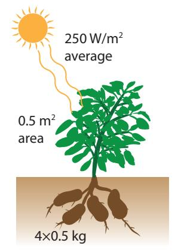

(chap:biologicalenergy)= 
# Biological Energy

The renewable energy options discussed thus far have been rather different from the chemically-stored [thermal energy](#page-456-0) provided by fossil fuels. These sources—hydroelectricity, wind, and solar—are good at making electricity, but are intermittent to various degrees and are not directly suitable for transportation, except via bulky batteries.

Biologically-based energy is more similar to fossil fuels in that it is a form of [chemical energy](#page-443-0) burned to create [thermal energy.](#page-456-0) We will focus on two major forms: solid [biomass](#page-442-0) and liquid [biofuels.](#page-442-1) The latter is well-suited to transportation: one of the few renewable energies that can make this claim. In some cases, the same plant can produce either food or bio-energy—depending on whether it is eaten by another biological form or by a machine.

Ultimately, biologically-based energy is a form of solar energy, creating chemical storage by means of [photosynthesis.](#page-453-0) Fossil fuels are also an ancient form of biofuel, deriving from photosynthetic energy captured millions of years ago. So sunlight is the actual energy source, and photosynthesis is the mechanism by which the energy is stored in chemical form.

# **14.1 Photosynthesis**

This textbook will not focus on the complex mechanisms responsible for [photosynthesis,](#page-453-0) but rather will describe the net result and efficiency. Photosynthesis involves the absorption of individual solar [photons](#page-453-1) that ultimately facilitate the movement of electrons in order to change bonding structures, forming sugars, cellulose, and other materials used to construct a plant. The fundamental chemical reaction is depicted in

**Figure 14.1:** Cartoon version of photosynthesis, providing a graphical representation of [Eq.](#page-247-0) [14.1.](#page-247-0) Water, CO2, and sunlight are inputs. The leaf "exhales" oxygen and keeps sugar (only part of the final sugar molecule is pictured here).

Photo Credit: [Rudy and Peter Skitterians.](#page-374-0)

*© 2022 T. W. Murphy, Jr.; [Creative Commons Attribution-NonCommercial 4.0 International Lic.;](https://creativecommons.org/licenses/by-nc/4.0/) Freely available at: [https://escholarship.org/uc/energy\\_ambitions.](https://escholarship.org/uc/energy_ambitions)*

[Figure](#page-246-1) [14.1](#page-246-1) and represented as a formula in [Eq.](#page-247-0) [14.1,](#page-247-0) in which the product is a basic unit of a larger sugar molecule, like glucose (C6H12O6).

$$
CO_{2} + H_{2}O + light \rightarrow CH_{2}O + O_{2}
$$
  $(14.1)$ 

In sentence form: energy from light transforms carbon dioxide and water into a building block of sugar and releases oxygen back to the air.

## **Box 14.1: Where Do Plants Get Their Mass?**

A valuable question to ponder: where do plants get their mass? Is it from the soil? Is it from water? Is it from the air? Take a moment to think about it. We can rule out soil on the observation that massive trees are not sitting in holes of excavated earth. Yes, the roots displace some of the soil, but a fallen tree reveals little root volume compared to the trunk and branches. And while living plant material contains significant water, completely dry plant matter1 has plenty of mass 1: . . . dry wood, for instance without water.

Plant matter contains substantial carbon content,2 and we now connect the knowledge that plants' leaves "breathe in" CO2 and release O2, as in [Eq. 14.1.](#page-247-0) Every time this happens, the plant steals a carbon atom from the air, spitting the oxygen right back out. The carbon is stuck into a sugar or other structural molecule and stays in the plant. Thus plants obtain their dry mass out of "thin air."In terms of efficiency, plants tend to convert sunlight into stored [chemical](#page-443-0) [energy](#page-443-0) at a rate of 0.01–6%. The range is rather large due to limitations in water and nutrients. A well-watered and fertilized corn field might reach 1.5% efficiency. Algae tend to top the charts at 5–6%. Dry climates might have ample sunlight, but too little water for efficient use of the available light. [Box](#page-247-1) [14.2](#page-247-1) provides an example of how one might estimate what fraction of incident solar energy is turned into chemical storage by a potato plant.

## **Box 14.2: Example Photosynthetic Efficiency**

Let us consider a potato plant [\(Figure](#page-247-2) [14.2\)](#page-247-2) as an example by which to estimate photosynthetic efficiency. The potato plant might have a leafy footprint of 0.5 m2—a square roughly 0.7 m on a side or a circle about 0.8 m in diameter—and produce four 0.5 kg potatoes, or 2 kg of starchy material. Carbohydrates have an [energy density](#page-446-0) of 4 kcal/g, so the potato plant has stored 8,000 [kcal,](#page-450-0) or about 32 MJ.3 3: Recall 4,184 J per [kcal.](#page-450-0)If the typical five-month growing-season ( $\sim 1.25 \times 10^7$  s) has [inso](#page-450-1)[lation](#page-450-1)4 of 250 W/m2, the plant collects 125 W5 times  $1.25 \times 10^7$  s, or  $1.6 \times 10^9$  J, while making 32 MJ of spuds. The photosynthetic1: ...dry wood, for instance

2: . . . which we combust when burning wood

**Figure 14.2:** The potato plant in [Box](#page-247-1) [14.2.](#page-247-1)

3: Recall 4,184 J per kcal.

4: . . . summer, averaging day/night and weather

5: 250 W/m2 times the plant areaefficiency is calculated as the ratio of output to input: about 2% in this case.

## **14.2 Biomass**

Biological mass, or [biomass,](#page-442-0) has long been utilized to supplement our energy needs, via controlled use of fire starting hundreds of thousands of years ago. Burning wood or other plant matter, and in some places dried animal feces6 counts as utilization of biomass. Wood provides about 4 [kcal](#page-450-0) of energy per gram when burned, or about 16 MJ/kg—much like proteins or carbohydrates7 in our diet. Burning of biomass is most typically used for heating and cooking within individual homes.
  

6: ...such as cow dung
  

7: Fats and hydrocarbons are 2–3 times more energ**Example 14.2.1** A 10 kg bundle of dry firewood is used to heat a home that requires 4,000 W to stay warm. How long will the wood last?8 8: . . . assuming a wood stove or other effi-

Every gram of wood has 4 [kcal](#page-450-0) or about 16 kJ of energy. We get 4,000 W escaping through the chimney by burning one gram every 4 seconds: 16 kJ/4 s is 4 kW. Each kilogram will therefore take about 4,000 s (a little over an hour) and the whole bundle will be gone after 11 hours.

In the U.S. in 2018, 2.36 [qBtu](#page-454-0) of the 101.25 qBtu total came from burning wood, and an additional 0.5 qBtu came from incinerating waste products [\[34\]](#page-433-0): U.S. Energy Information Administration. Thus about 2.8% (0.1 TW) of U.S. energy comes from biomass. Out of the 11.41 qBtu of all renewables in 2018, biomass accounted for 25% of the U.S. renewable budget.9 ... while 23% was hydro; 22% was wind;Globally, biomass use is estimated to be more important, at 6%,10 was geothermal; see Table [10.3](#page-189-0) [\(p.170\)](#page-189-0) constituting more than a third of global renewable resources ([Fig.](#page-128-0) [7.8;](#page-128-0) [p.109](#page-128-0)). The high use of biomass in the wider world is a reflection on the difference between developed countries like the U.S. and developing countries that are more likely to rely on more primitive forms of energy like firewood and animal dung. Since most biomass around the world is burned for individual use, emissions controls are essentially non-existent, resulting in high levels of pollution—smoke and harmful chemicals that would be scrubbed out of a power plant's exhaust.11  
10: ...down considerably from ~25% in 1950  
11: Note that CO2 is common to both, and### **Box 14.3: Life is Thin and Precious**

The total mass of living organisms on Earth is estimated to be about 2 trillion tons [\[94\]](#page-436-0) [\[94\]](#page-436-0): Elhacham et al. (2020), "Global . Having a density similar to that of water, 2×1015 kg, if spread uniformly around the planet, would stack to 4 mm high! Put another way, a random line projecting upward from the surface of the earth would go through about 4 mm of living matter, on average. That's a pretty thin shell of life!

If we tried to substitute our 18 TW global power demand by burning

6: ... such as cow dung

7: Fats and [hydrocarbons](#page-449-0) like fossil fuels are 2–3 times more energy dense.

cient device to prevent most heat from just

(2011), *Annual Energy Review*

20% were biofuels, 8% was solar, and 2%

10: . . . down considerably from ∼25% in 1950

is *not* scrubbed out of power plant exhaust, comprising the bulk of the emissions.

human-made mass exceeds all living biomass"

*© 2022 T. W. Murphy, Jr.; [Creative Commons Attribution-NonCommercial 4.0 International Lic.;](https://creativecommons.org/licenses/by-nc/4.0/) Freely available at: [https://escholarship.org/uc/energy\\_ambitions.](https://escholarship.org/uc/energy_ambitions)*

biological matter,12 12: About a quarter of the biomass is "dry" we would run through *all* the currently-living mass—land and sea—in a short 15 years!

Can you imagine burning through all of Earth's forests and animals in 15 years? That's the rate at which we use energy today—illustrating the disparity between the biological resources on the planet and our staggering energy appetite. We can't expect to maintain our pace based on biomass and biofuels, and still have a vibrant natural planet.

# **14.3 Biofuels**

[Biofuels](#page-442-1) deserve their own category because the origins and end uses are different enough to warrant distinction. While the [biomass](#page-442-0) sources from [Section](#page-248-0) [14.2](#page-248-0) tend to be in solid form, biofuels—as treated here—are *liquid*. Liquid fuels are instantly a big deal because they have the energy density and versatility to be used in transportation applications. An airplane can't very well fly on firewood, hydroelectricity, solar, wind, ocean currents, geothermal, or nuclear energy. Biofuels therefore occupy a special place in the pantheon of renewable resources as the most obvious viable replacement for petroleum—the dominant fossil fuel responsible for 92%14 of transportation in the U.S.13
  
13: See, for instance, Box [13.3](#page-231-0) (p. [212](#page-231-0)) and Box 17.1 (p. 290).
  
14: Another 5% is from biofuels, usually blended into gasoline.In the U.S. in 2018, 2.28 [qBtu](#page-454-0) (2.3%; 0.08 TW) came from biofuels [\[34\]](#page-433-0), which is very similar to the amount from biomass (wood, waste). Out of the 11.41 qBtu of all renewables, biofuels account for 20% of the U.S. renewable budget (Table [10.3; p. 170](#page-189-0)).
  
[\[34\]](#page-433-0): U.S. Energy Inform. AdministrationMost prominently, [ethanol](#page-447-0) is the chief biofuel, accounting for about 80% of the total. It is an alcohol that can be produced by fermenting the photosynthetically-produced sugars in the plant and then distilling the result.15 Structurally, ethanol is very similar to ethane16 except that the terminating hydrogen on one end of the chain is replaced by a hydroxyl group (OH; shown in [Figure](#page-249-1) 14.3).Though it is not necessary to fully understand the chemistry,17 combus-
tion of ethanol—for comparison to the fossil fuel reactions in [Eq. 8.1](#page-140-0)
([p. 121](#page-140-0))—goes according to
17: [Appendix B](#page-394-0) provides some background
$$
C_2H_5OH + 2O_2 \to 2CO_2 + 3H_2O + 29.7 \text{kJ/g.}
$$
 (14.2)

In other words, ethanol combines with oxygen via combustion (burning) producing carbon dioxide and water, also releasing energy. It is almost like the photosynthesis reaction [\(Eq.](#page-247-0) [14.1\)](#page-247-0) in reverse.

The [energy density](#page-446-0) works out to 7.1 [kcal/](#page-450-0)g, which is considerably lower than octane (representing gasoline) at 11.5 kcal/g (Table [8.2; p.121\)](#page-140-1). In terms of CO2 production, the reaction generates 88 g of CO2 for each 46 g of ethanol, coming to 1.9 g/g—which is lower than the 3.09 factor

*© 2022 T. W. Murphy, Jr.; [Creative Commons Attribution-NonCommercial 4.0 International Lic.;](https://creativecommons.org/licenses/by-nc/4.0/) Freely available at: [https://escholarship.org/uc/energy\\_ambitions.](https://escholarship.org/uc/energy_ambitions)*

combustible material, at about 4 [kcal/](#page-450-0)g.

Box [17.1](#page-309-0) (p. [290\).](#page-309-0)

14: Another 5% is from biofuels, usually

(2011), *Annual Energy Review*

15: . . . also how "moonshine" alcohol is

16: . . . C2H6: the second in the alkane sequence of methane, ethane, propane, butane, . . . , octane, etc.

on chemical reactions and associated energy.

**Figure 14.3:** Ethanol is similar to ethane, but replacing the hydrogen at the end with hydroxyl (OH).

for octane. In terms of CO2 energy intensity, ethanol produces 64 g of CO2 for every 1 MJ of energy: exactly the same as petroleum [\(Table](#page-140-1) [8.2\)](#page-140-1). Generally speaking, [biofuels—](#page-442-1)and other forms of [biomass—](#page-442-0)are often considered to be carbon-neutral,18 18: In practice, fossil fuels are used in the as the carbon released upon burning was taken in from the atmosphere in the process of photosynthesis, making it a cycle.

Most of the ethanol in the U.S. is blended into gasoline into E10, E15, or E85 products meaning 10%, 15%, or 85% ethanol. Not all vehicles are equipped to handle the more corrosive ethanol, and those that are ("flex-fuel" vehicles) might expect lower energy performance due to the fact that ethanol has lower [energy density](#page-446-0) than gasoline.

Both the lower energy density and lower carbon mass per input fuel mass can be attributed to the oxygen atom hosted by the ethanol molecule.19 19: See Sec. [B.3](#page-398-0) (p. [379\)](#page-398-0) for more insight Ethanol can derive from a number of plants. In the U.S., corn is the into chemical reactions and energy content. most common feedstock. Brazil uses sugar cane, which requires tropical climates.

## **14.3.1 EROEI**

Before going further, we introduce a crucial metric for evaluating the merit of any energy source: the [EROEI.](#page-447-1)

**Definition 14.3.1** *[EROEI](#page-447-1), or Energy Returned on Energy Invested, is a measure of how profitable an energy source is in terms of energy, expressed as a ratio. For instance, a 9:1 EROEI means 9 units were extracted or produced for an investment of 1 unit, leaving a net gain of 8 units of energy. 1:1 is break-even, deriving no net energy benefit*

By and large, energy does not come for free. Oil has to be actively drilled; hydroelectricity requires construction of a dam; solar panels are fabricated in an industrial process requiring energy input. So the question is: how much energy do we *get out* compared to the amount we had to *put in*? If we extract less energy than we invest, we *lose* net energy and probably should not bother.20 20: In some cases, it may still make sense to If we only get a little more out, we still may question the investment.

**Example 14.3.1** Let's say an oil drilling operation uses petroleum products (like gasoline) as its only energy input for drilling and extracting oil. In one year, the operation pumps 12,000 barrels of oil, and in the effort uses 800 barrels of oil as energy input. What is the EROEI?

In this case, we just have to arrange output to input as 12,000:800, and reduce to 15:1.

Early oil wells were shallow and under pressure, producing "gushers" that exceeded 100:1 in EROEI. To understand what this means, imagine

19: See Sec. B.3 (p. 379) for more insight
into chemical reactions and energy content.

EROEI (sometimes just EROI) is one level above *efficiency*. Efficiency asks how much of a source is converted into a form useful to us. EROEI asks about what went into *obtaining* that source in the first place. It's still an efficiency, of sorts. Maybe a pre-efficiency.

pursue EROEI < 1 resources if the resulting form is otherwise hard to obtain, like food energy. As another example, we might use coal to process biofuels, in effect converting a less useful solid to a more useful liquid, even if losing energy in the process. But such desperate measures will not be favored if alternatives exist.

using oil as the energy source for the original exploration, building the equipment, running the drill, and collecting/storing the product. An EROEI of 100:1 means that for every barrel of oil that goes *into* the process, 100 barrels come *out*. That's a good deal. A high EROEI means *nearly* "free" energy: low effort for high reward.

As we progress to more challenging oil resources,21 the EROEI drops— 21: . . . deep water, [fracking,](#page-447-2) tar sands  
now around 10–15:1 for conventional oil and as low as 3:1 for tar sands [\[95\]](#page-436-1). [Table 14.1](#page-251-0) provides one set of EROEI estimates for various sources. Note that estimates vary due to difficulties in proper accounting of all energy inputs, so don't take these numbers literally—just as approximate guides. [\[95\]](#page-436-1): Hall et al. (2014), “EROI of different fuels and the implications for society”

| Source             | EROEI Est. | Source                 | EROEI Est. |
|--------------------|------------|------------------------|------------|
| Hydroelectric      | 40+        | Solar PV               | 6          |
| Wind               | 20         | Soy Biodiesel          | 5.5        |
| Coal               | 18         | Nuclear Fission        | 5          |
| Oil                | 16         | Tar Sands              | 3–5        |
| Sugar Cane Ethanol | 9          | Heavy Oil (Can., Ven.) | 4          |
| Natural Gas        | 7          | Corn Ethanol           | 1.4        |

If life were a video game, we would look at [Table](#page-251-0) [14.1,](#page-251-0) decide that hydroelectric and wind are "the best," cursor over to them and "plus" those two up until we're getting all our energy from these low-energyinvestment sources. But of course the world is constrained, placing real limits to what is possible. We saw in [Chapter](#page-192-0) [11](#page-192-0) and [Chapter](#page-203-0) [12](#page-203-0) that hydroelectricity and wind cannot be expected to provide more than a few terawatts, leaving a large shortfall. Meanwhile, solar has the largest raw potential. In other words, it is useful to appreciate the EROEI of various resources, but EROEI is not the sole determining factor of what is practical. A low EROEI can be tolerable if abundance makes up for it.

For resources whose energy investment is mostly up-front, before production begins, the resulting EROEI depends critically on *how long* the resource will provide energy. After all, the energy return gets larger the longer the facility can operate, while the investment part may be essentially done and unchanging. It can be difficult to predict how long a resource will last, which is part of why EROEI estimates are just that: approximate guidelines.

**Example 14.3.2** Let's say a particular wind turbine achieves a 20:1 EROEI after operating for a 40 year lifetime. How many years-worth of its energy output went into constructing and installing it?

Each year the turbine produces some amount of energy, which we can call  $E$  (in Joules, for instance). In this case, it will produce  $40E$  Joules in its lifetime. Since EROEI is 20:1, it must have taken  $40E/20 = 2E$  Joules of input energy to create.[22](#page-22-1) At a rate of  $E$  per year, it will produce  $2E$ 
21: ... deep water, fracking, tar sands

fuels and the implications for society"

**Table 14.1:** EROEI estimates for various sources [\[96\]](#page-436-2). For example, Wind has an estimated EROEI of 20:1. See [Table](#page-125-0) [7.1](#page-125-0) [\(p.106\)](#page-125-0) for a refresher on how much energy we get from various sources. Canada and Venezuela tend to have heavy oil deposits.

times the input energy

in 2 years, therefore taking two years to produce as much as went into its manufacture—paying for itself, energetically.

In a self-supporting sense23 23: . . . if the energy extracted is then used the *net* energy is 푥 − 1 for an EROEI of 푥:1. In other words, an EROEI of 1.25:1 only "really" produces 0.25 units of exportable energy for every one unit invested, if that one invested unit *comes from* the 1.25 units extracted in a closed system. In this case, for every one unit netted,24 4 units went in and 5 came out–only 1 of the 5 24: . . . multiplying the 0.25 net by 4 free and clear.

**Example 14.3.3** A self-contained operation to produce ethanol manages to only use its own ethanol to run the entire operation of growing, harvesting, and processing the crops to produce ethanol. In one year, the operation produced a total of 250,000 L of ethanol at an EROEI of 1.25:1. How much ethanol were they able to export/sell from the operation?

The 1.25 number is associated with *total* production, which is 250,000 L in this case. Multiplying both sides of the 1.25:1 ratio by 200,000 results in an output:input ratio of 250,000:200,000 meaning that the operation required 200,000 L of input. Thus the operation was able to deliver 50,000 L to market.

Low EROEI cuts into the effective available resource, demanding investment of precious energy. As conventional resources are exhausted, forcing us to lower-EROEI deposits, even if we keep up with energy demand in absolute terms,25 25: . . . e.g., same number of barrels of oil the net energy available will decline as a greater fraction of the harvest must go back into extraction.

**Example 14.3.4** What would have happened to an early agricultural society if the EROEI of growing food26 slipped below 1:1, if all of the 26: . . . a form of energy energy used to harvest the food came from workers and animals fed by the same food?

At 1:1, every unit of energy extracted requires one unit of investment. Then 100% of the energy is spent acquiring energy, leaving no energy for other functions of the society (shelter, defense, etc.). Such a marginal existence could not be maintained, so some minimum exists below which the society becomes non-viable.

Note that many of the entries in [Table](#page-251-0) [14.1](#page-251-0) have low numbers, translating to a tough life in which a substantial fraction of the total energy resource is dedicated to continued energy procurement. Biological forms of energy are not superstars in this regard.

### **Box 14.4: Eating Our Fossil Fuels**

Relatedly, and in a familiar context, the food industry in the U.S. today expends about 10 [kcal](#page-450-0) of mostly fossil-fuel energy for every 1 kcal of

as the input to extract more

24: ...multiplying the 0.25 net by 4

produced each year

26: . . . a form of energy

food energy consumed [\[97\]](#page-437-0). In a sense, we are *eating*27 our fossil fuels! It also points to an EROEI of 0.1:1, which is well below break-even. Obviously in times prior to fossil fuels, when we used human and animal labor in our agricultural pursuits, an EROEI less than 1:1 would spell starvation: more energy going in than was recouped from the land. Today, fossil fuels give us a temporary exception, so that we can afford to lose useful energy in the bargain, turning 10 units of fossil fuel energy into one unit that we eat. We might view this as a negative aspect of the [Green Revolution](#page-448-0).
## **14.3.2 EROEI of Biofuels**

Various estimates exist for the EROEI for different biofuels. Unfortunately for the U.S., the corn ethanol industry is estimated to have an EROEI of anywhere from 0.8:1 to 1.6:1. The former would mean it's a net loss of energy, and that we would have more energy available if we did not spend any of it trying to get ethanol from corn. Biodiesel (a non-ethanol biofuel produced from vegetable oils or animal fat) is estimated to have an EROEI of 1.3:1 [\[98\]](#page-437-1). Sugar cane may be anywhere from 0.8:1 to 10:1 [\[99\]](#page-437-2) (see [Table](#page-253-1) 14.2).To explore an example of how this all plays out, let's say that corn ethanol provides an EROEI of 1.2:1—in the middle of the estimated range. This means that in order to get 1.2 units of energy out, one unit has to go in. Or for every 6 units out, 5 go in. If we use *that same* resource as the energy input—in other words, we use corn ethanol as the energy input to grow, harvest, distill, and distribute corn ethanol—then we get to "keep" one unit for external use out of every 6 units produced. For the U.S. to replace its 37 [qBtu/](#page-454-0)yr oil habit with corn ethanol, it would take six times this much, or 220 qBtu ( $2.3 \times 10^{20}$  J) of corn ethanol production each year. If the growing season is 5 months, the solar input is 250 W/m2 on average, and the corn field is 1.5% efficient at turning sunlight into [chemical](#page-443-0) [energy,](#page-443-0) then each square meter of corn-land produces  $4.9 \times 10^{7}$  J of energy28 and we would therefore need about  $5 \times 10^{12}$  m2 of land for corn. This is an area 2,200 km on a side [\(Figure](#page-253-2) [14.4\)](#page-253-2)! The U.S. does not possess this much arable land (estimated at about 30% of this). About  $4 \times 10^{11}$  m2 of land in the U.S. is currently used for corn production, which is 8% of what would be needed. And of course we must still feed ourselves. In 2018, 31% of U.S. corn production went into ethanol. We would somehow need to ramp corn ethanol production up by a factor of 40 to derive our current liquid fuels from corn in a self-sufficient way. Don't expect to see this fantasy materialize.## **Box 14.5: Why Do Corn Ethanol?**

If corn ethanol has such low EROEI, why is it pursued in the U.S.?

27: . . . or at least subsidizing the energy

**Table 14.2:** Summary: EROEI of biofuels.

| Source             | EROEI     |
|--------------------|-----------|
| sugar cane ethanol | 0.8–10    |
| soy bean biodiesel | 5.5       |
| biodiesel          | 1.3       |
| corn ethanol       | 0.8–1.6   |
| algae-derived      | 0.13–0.71 |

[\[98\]](#page-437-1): Pimentel et al. (2005), "Ethanol production using corn, switchgrass, and wood; biodiesel production using soybean

[\[99\]](#page-437-2): Murphy et al. (2011), "Order from Chaos: A Preliminary Protocol for Determining the EROI of Fuels"

**Figure 14.4:** Area of corn growth needed to displace U.S. petroleum demand if at EROEI of 1.2:1. This is far larger than agriculturally productive land in the U.S.

28: 150 days times 86,400 seconds per day times 250 W/m2 times 0.015 gives Joules per square meter produced.

## Why do we have mandates to introduce ethanol into fuel blends?

Don't assume that the world is always scientifically rational and run by "adults" whose interests extend beyond personal gain. Many political factors enter: votes from midwestern swing-states,[29](#page-10-29) job
dependencies, influences from a powerful industry, the appearance
of "green" (carbon-neutral) energy[30](#page-10-30) all play a role.
[29](#page-10-29): ... where corn is grown
[30](#page-10-30): ... compromised by low EROEI if usingA fundamental reason why the EROEI for biofuels tends to be low is that processing the material into ethanol requires a fair amount of energy input in the form of heat. Burning biomass, by contrast, does not have this requirement. Also, burned biomass is often gathered from untended (natural) environments that required little deliberate energy input on the parts of humans. Therefore, low EROEI is more a problem for biofuels than biomass.

# **14.4 Upshot for Biomass and Biofuels**

Wood has always provided a source of heat for people, and will continue to do so. Its use occupied a much higher fraction of energy resources hundreds of years ago before being supplanted by fossil fuels. Still, several percent of U.S. energy comes from wood (and over 5% globally). Wood represents a renewable resource that can often be locally obtained, and will likely continue steady use,31 31: . . . subject to availability in the face of potentially assuming a greater fraction again if overall energy expenditure declines.

Biofuels are special due to their liquid nature, as a potential replacement for oil to drive transportation. Because photosynthesis is not terribly efficient, and the [EROEI](#page-447-1) of biofuels tends to be on the low side, the amount of land needed to replace petroleum is anywhere from daunting to prohibitive. This is even before addressing the crunch an extensive expansion would place on water resources or food supply, or the degradation of arable land that may result from depleting nutrients in the soil. Algae may represent another approach, but so far the process appears to be well below break-even in terms of EROEI (from 0.13–0.71:1 [\[100\]](#page-437-3)). It is difficult to see a meaningful path forward for wholesale replacement of liquid fuels using biological resources.
[\[100\]](#page-437-3): Saad et al. (2019), "Algal Biofuels:
Current Status and Key Challenges"A final perspective is that the total biological scale on the planet is estimated to be 100 TW (Table [10.2; p.168\)](#page-187-0), which is not outrageously more32 than the current 18 TW scale of the human endeavor. Can we really imagine commandeering 20% of all life on Earth to serve our energy needs? It would actually need to be substantially more than this, given EROEI limits. It may be that Earth does not possess enough biology to offer a substitute for our current fossil fuel appetite—even if we *tried* to use it *all*. 32: . . . compared to solar or wind budgets,29: ... where corn is grown

fossil-fuel inputs to run production

deforestation

Current Status and Key Challenges"

for instance, which are 5,000 times and 50 times our demand–not just 5 times as is the case for all biology

We conclude by listing some pros and cons for biologically-derived energy, beginning with the advantageous aspects:

- I Biofuels offer a possible liquid fuel substitute to support transportation needs;
- I Biological energy relies on dependable solar input, replenished as harvested stocks grow back;
- I Biofuels represent a form of storage of solar energy, mitigating intermittency;
- I Methods for growing and harvesting crops are well established;
- I Burning biomass is low-tech and likely to remain part of our energy portfolio.

And the less savory aspects:

- I It is difficult to scale biological energy to meaningful multi-terawatt levels;
- I Heavy reliance on biological energy co-opts earth's biology and displaces natural habitat;
- I Cultivating biofuels competes with food production for water and land resources;
- I Low [EROEI](#page-447-1) for biofuels reduces net energy available;
- I Smoke and other pollutants from burning biomass can be problematic.

# **14.5 Problems**

- 1. A large tree might have a trunk 0.5 m in diameter and be 40 m tall. Even though it branches out many times, pretend all the wood fits into a cylinder maintaining this 0.5 m diameter for the full height of the tree. Wood floats,33 so let's say it has a density around 800 kg/m3 . Hint: carbon dioxide is 44/12 times the mass How many kilograms of CO2 did this tree pull out of the atmosphere to get its carbon, if we treat the tree's mass as 50% carbon?
- 2. Using the geometry and density of the tree in [Problem](#page-255-1) [1,](#page-255-1) if the resulting wood has an energy density similar to carbohydrates (4 [kcal/](#page-450-0)g), and the tree spent 50 years accumulating this bulk while receiving an average of 250 W/m2 of solar input over 5 months each year in a leafy area averaging 200 m2 to receive sunlight, what is the net photosynthetic efficiency of the tree?
- 3. The U.S. gets 2.4 [qBtu](#page-454-0) per year of energy from burning biomass (mostly firewood). At an [energy density](#page-446-0) of 4 [kcal](#page-450-0) per gram, and a population of 330 million, how many 5 kg logs per year does this translate to per person?

33: *i* Water has a density of 1,000 kg/m3 .of plain carbon.

Now if you could just think of a way to put the answer on a *log* scale, ha ha.

- 4. How many logs of firewood per day (whose parameters are specified in [Problem](#page-255-2) [3\)](#page-255-2) would you need to burn to provide 5,000 W of heating to a house?
- 5. Replicate the conclusion of [Box](#page-248-1) [14.3](#page-248-1) by assuming one-quarter of the 2 trillion tons (5 × 1014 kg) of mass is combustible at [4kcal/](#page-450-0)g. How long—in years—would this amount of energy last if burning at 18 TW?
- 6. Given the [energy densities](#page-446-0) of ethanol vs. octane (gasoline), how many liters of ethanol does it take to replace one liter of gasoline, if the densities are 789 g/L for ethanol and 703 g/L for octane?
- 7. If 50 kJ of energy are spent to extract 1 MJ of energy content in the form of coal, what is the EROEI?
- 8. Re-express an EROEI of 1.5:1 in terms of how many total units of energy must be produced in order to extract one unit of *net* energy in a self-supporting operation.
- 9. Imagine that the extraction of a low-EROEI biofuel is performed using energy derived from that biofuel alone—in other words, a self-contained operation not using any other (external) form of energy. We can think of the situation thusly: for each hectare of land producing fuel for external use, some additional land must be dedicated to raising the energy used to perform the extraction operation—like an overhead. If the EROEI is 1.5:1,34 34: You can always multiply both sides by how much *total* land area would need to be devoted to the endeavor for every hectare (or any area unit you wish) that contributes to net production? See [Problem](#page-256-0) [8](#page-256-0) for a related scenario.
- 10. It takes a certain energy investment to fabricate a solar panel. Referring to [Table](#page-251-0) [14.1,](#page-251-0) figure out how many years of the panel's output energy it takes to "pay off" the investment if the EROEI estimate assumed operation for 30 years.
- 11. Our modern food industry has an EROEI of 0.1:1. In pre-industrial settings, when energy investment for food production was in the form of muscle power (animal and human), why would a 0.1:1 EROEI for food have been untenable? Next, describe the conditions for an exact break-even food EROEI of 1:1. What would this mean in terms of where effort/energy goes? What would this leave for building shelters, cathedrals, or esthetic pursuits?
- 12. Parallel the development in the text for the land required for corn ethanol if it is self-sufficient35 35: . . . i.e., relying on its own energy to in the case for EROEI of 1.5:1—near the optimistic end of the range. How much larger is this than the area now devoted to corn, and how does it compare to total arable land in the U.S.?
- 13. Using the setup for [Problem](#page-256-1) [12,](#page-256-1) how large would the required corn

the same factor to make both sides integers, if this is easier to understand.

re-invest in its extraction

area be in terms of the side length of a square in units of kilometers. Draw this to approximate scale on a crude representation of the contiguous U.S. And this is at the optimistic end.

14. What fraction of the earth's 100 TW biological budget (all life on the planet) do you think is justifiable to use in service of human energy needs? Explain your reasoning. What does this become in TW, and how does it compare to our 18 TW current appetite?

If the EROEI is less than 2:1 (as it is for many biofuels), we would cut your estimate in TW by more than half to account for the diverted energy used for extraction.