(chap:nuclearenergy)= 
# Nuclear Energy

Most of the energy forms discussed thus far derive from sunlight either contemporary input or fossilized storage. The *fuel* for [nuclear](#page-452-0) [energy](#page-452-0) is truly ancient, predating the solar system. The heavy elements participating in fission were produced by astrophysical cataclysms (most likely merging neutron stars), while the hydrogen building blocks for fusion originated in the [Big Bang](#page-442-0) itself. In brief, [fission](#page-447-0) involves the splitting of heavy nuclei into smaller pieces, while [fusion](#page-448-0) builds larger nuclei from smaller ones.

While only fission has been successfully implemented as a source of societal energy, both types essentially boil down to the same thing: a source of heat to make steam and drive a [heat engine.](#page-449-0) How and why nuclear material generates heat will be a primary focus of this chapter. Many practical concerns surround nuclear power, such as safety, weapons, waste, and [proliferation](#page-454-0) of dangerous material. Self-pride for the impressive accomplishment of mastering nature well enough to implement nuclear power may not adequately justify continued reliance upon it—even if it is not a direct emitter of CO2.

Understanding nuclear energy requires a longer journey than was needed for hydroelectricity, wind, and solar [photovoltaics.](#page-453-0) We first learn about the [nucleus](#page-452-1) and its many configurations, how nuclei transform from one to another through [radioactive decay,](#page-454-1) the role  $E = mc^2$  plays, and finally dig into the workings of [fission](#page-447-0) and [fusion.](#page-448-0)# **15.1 The Nucleus**

First, what is a [nucleus?](#page-452-1) Every (neutral) atom consists of a positivelycharged nucleus surrounded by a cloud of negative [electrons](#page-446-0) [\(Figure](#page-259-0) [15.1\)](#page-259-0).

Cooling towers of the decommissioned Satsop nuclear power plant in Washington. Photo credit: Tom Murphy

*© 2022 T. W. Murphy, Jr.; [Creative Commons Attribution-NonCommercial 4.0 International Lic.;](https://creativecommons.org/licenses/by-nc/4.0/) Freely available at: [https://escholarship.org/uc/energy\\_ambitions.](https://escholarship.org/uc/energy_ambitions)*

: ... which defines the size of the atom

The nucleus is about 100,000 times smaller than the electron cloud,1 but 1: . . . which defines the size of the atom contains 99.97% of the atom's mass in a super-dense nugget composed of [protons](#page-454-2) (positive [charge\)](#page-443-1) and [neutrons](#page-452-2) (no [charge\)](#page-443-1). While electromagnetic forces vehemently resist the close congregation of positivelycharged protons, the [strong nuclear force](#page-456-0) overpowers this objection and sticks the protons and neutrons together in a stable existence.

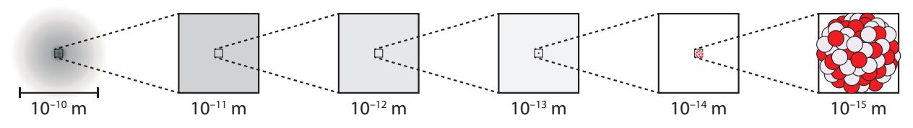

**Figure 15.1:** Zooming in on an atom in steps of 10×. At left, we see the entire extent of the atom's electron cloud. For a while, no nucleus is visible, being 100,000 times smaller than the atom itself. The nucleus within an atom is like a small dust grain in a bedroom.

By convention, the number of protons is labeled as  $Z$  and the number of neutrons as  $N$ . The total number of [nucleons](#page-452-3)2 is called the [mass number:](#page-451-0)  $A = Z + N$ . It's just counting.Picking carbon as an example, all carbon atoms have  $Z = 6$ : six protons.[3](#page-450-0) Most carbon atoms (98.93%) have  $N = 6$ , making  $A = 12$ . But some [isotopes](#page-450-0) carry a different number of neutrons. In natural carbon samples, 1.07% have  $N = 7$ , making  $A = 13$ . We label such an isotope as 13C ( $A = 13$ ), or sometimes   6 13 C ( $A = 13; Z = 6$ ), or even in some cases the fully-described   6 13 C7 ( $A = 13; Z = 6; N = 7$ ). The latter two forms are somewhat redundant—though sometimes appreciated/helpful—because *all* carbon atoms have  $Z = 6$ , and  $N = A - Z$  always. Therefore, 13C says it all, provided you can easily find or remember the  $Z$  number for carbon.[4](#page-450-0) The general pattern for an isotope of element X is ZAXN. Other common designations are, for example, C12, C13, U238, or C-12, C-13, U-238 as alternatives to 12C, 13C, and 238U, respectively.**Example 15.1.1** Write down all the various ways of designating the isotope of plutonium (Pu; 94 protons) that has mass number 퐴 = 239.

First, the math.  $A = 239$  and  $Z = 94$  so  $N = A - Z = 145$ . Starting at the simple end and working up, we can label this Pu239, Pu-239, 239Pu, 94239Pu, and finally 94239Pu145.The physicist's version of the periodic table is called the [Chart of the](#page-443-0) [Nuclides,](#page-443-0) and contains a wealth of information. The basic layout idea is introduced in [Figure](#page-259-1) [15.2,](#page-259-1) for the extreme low-mass end of [nuclides.](#page-452-4)

**Definition 15.1.1** *A [nuclide](#page-452-4) is any unique combination of [nucleons,](#page-452-3) so that every nucleus is one of the possible nuclides. For example, the*  ${}^{12}C$  *nucleus is one nuclide, while*  ${}^{13}C$  *is a distinct, different nuclide.*[Figure](#page-260-0) [15.3](#page-260-0) provides a full view of the chart layout: neutron number, 푁, runs horizontally and proton number, 푍, runs vertically. Stable nuclei are indicated by black boxes at some particular integer value of 푁 and

*© 2022 T. W. Murphy, Jr.; [Creative Commons Attribution-NonCommercial 4.0 International Lic.;](https://creativecommons.org/licenses/by-nc/4.0/) Freely available at: [https://escholarship.org/uc/energy\\_ambitions.](https://escholarship.org/uc/energy_ambitions)*

2: . . . a name describing *either* protons or neutrons: any nuclear constituent

3: One might say this is what *defines* the

4: ... just the sequential number labeling boxes in the periodic table: Fig. [B.1](#page-394-0) (p. [375](#page-394-0))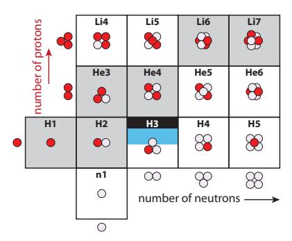

**Figure 15.2:** Lower left start of the [Chart of](#page-443-0) [the Nuclides,](#page-443-0) shown pictorially in terms of the number of protons (red) and number of neutrons (lavender) in each nuclide. Gray boxes are stable nuclides, and H3 (tritium) is semi-stable for a decade or so.

푍. Notice how they bend away from the 푁 = 푍 line, preferring to be neutron-rich. This can be traced to the fact that protons repel each other due to their electric [charge,](#page-443-1) so the nucleus can be more tightly bound if fewer protons than neutrons are present—balanced against another penalty for being too far away from 푁 = 푍.

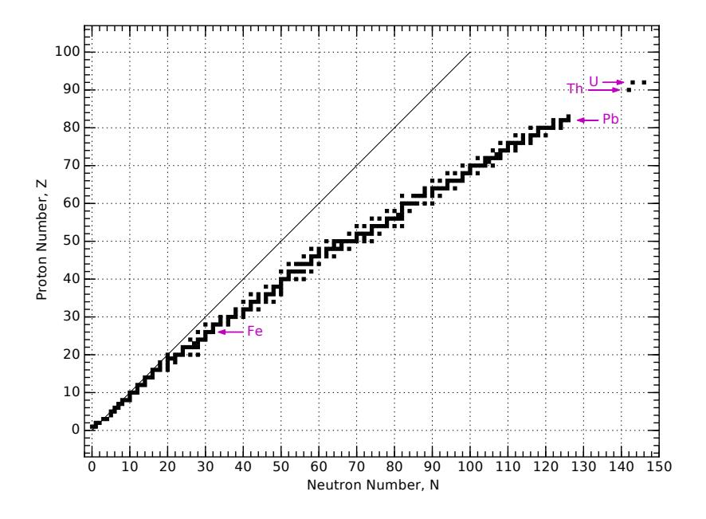

[Figure](#page-261-1) [15.4](#page-261-1) shows the lower-left corner of the chart in much greater detail.5 For each element (horizontal row), properties of all known isotopes are listed—even those that are [radioactive](#page-454-3) and do not persist for even a small fraction of a second before decaying. Stable isotopes are denoted by gray boxes. The mass of each, in [atomic mass units](#page-441-0) [\(a.m.u.\)](#page-441-1)—defined so that the neutral 12C atom is exactly 12.0000 a.m.u.—is given, and the natural abundance as found on Earth, in percent. The Chart of the Nuclides lets us peak inside the periodic table in great detail, as [Example](#page-260-1) [15.1.2](#page-260-1) suggests.**Example 15.1.2** From the Boron row (Z = 5) in [Figure](#page-261-1) [15.4](#page-261-1), we can see that 19.9% of boron is found in the form of 10B, while the other 80.1% is 11B.The weighted composite mass is therefore 0.199×10.0129370+0.801× 11.0093055, yielding 10.81103 [a.m.u.,](#page-441-1) which is the number presented as the [molar mass](#page-451-1) on the periodic table.6 6: . . . and in the summary information in

Because the [Chart of the Nuclides](#page-443-0) has neutron number,  $N$ , increasing from left to right, and proton number,  $Z$ , increasing vertically, nuclei having the same mass number,  $A = Z + N$ , are arranged on diagonals. Notice that in the region shown in [Figure](#page-261-1) [15.4,](#page-261-1) we never find more than one stable element at each mass number (constant  $A$ ).**Figure 15.3:** Layout of the [Chart of the](#page-443-0) [Nuclides,](#page-443-0) showing positions of naturallyoccurring nuclei (stable or long-lived enough to be present on Earth). Stable nuclei tend to have more neutrons than protons—especially for heavier nuclei. This is why the track of stable nuclei bends away from the 푁 = 푍 diagonal line. Arrows point to important elements of iron, lead, thorium, and uranium at 푍 values of 26, 82, 90, and 92, respectively.

5: Even this level of detail is short of what can be found in the actual [Chart of the Nu](#page-443-0)[clides,](#page-443-0) which also provides quantitative values for neutron absorption, nuclear spins, excited states, additional decay paths and associated energies.

the blue box at the left of each row

Follow 퐴 = 12, for instance, from O12 through Be12, crossing through C12 as the only stable element of this mass.

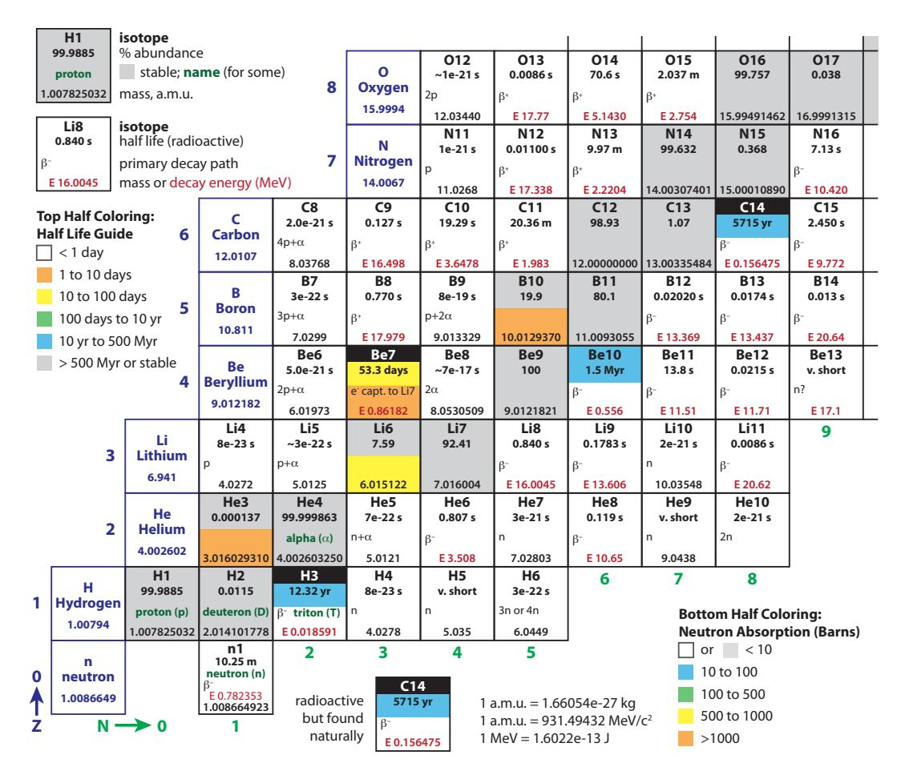

**Figure 15.4:** [Chart of the Nuclides](#page-443-0) for the low-mass end. Neutron number, 푁, increases toward the right (green numbering at bottom) and proton number, 푍, increases vertically (blue numbering at left). Scientific notation is expressed as, e.g., 8e–23, meaning 8 × 10−23. A wealth of information is included: spend some time studying the surrounding guides to learn what data each box contains.

# **15.2 Radioactive Decay**

When one [nuclide,](#page-452-4) or [isotope](#page-450-0) changes into another, it does so by the process of[radioactive decay.](#page-454-1) Stable nuclides have no incentive to undergo such decays, but unstable nuclides will seek a more stable configuration through the decay process.

The black squares in [Figure](#page-260-0) [15.3,](#page-260-0) or gray squares in [Figure](#page-261-1) [15.4](#page-261-1) are *stable*, 7 nature leaving all others as *unstable*, 8 meaning that they will undergo [radioactive decay](#page-454-1) to a different nucleus after some time interval that is characterized by the nuclide's [half life.](#page-448-1)

**Definition 15.2.1** *The [half life](#page-448-1) of a nuclide is the time at which the probability of decay reaches 50%. A large sample of such nuclides will be reduced to half the original number after one half-life. Each subsequent half-life interval removes another half of what remains.*

7: . . . or long-lived enough to be found in

8: Nuclides are unstable if a lower energy (more stable) configuration is within easy reach, better balancing desire for  $N = Z$  against the cost of proton repulsion.[Figure](#page-261-1) [15.4](#page-261-1) lists a half-life9 for each unstable [nuclide.](#page-452-4) For example, the half-life for a neutron (n1 in [Figure](#page-261-1) [15.4\)](#page-261-1) is 10.25 minutes, meaning that a lone neutron has a 50% chance of surviving this long. The process is statistical, so an individual neutron might only last 3 seconds, or might still be around in 15 or even 60 minutes. The predictive power is sharpened the larger the sample is: half will remain after 10.25 minutes.**Example 15.2.1** If starting with 16 million separate neutrons, we would expect 8 million to still be present after 10.25 minutes, 4 million after 20.5 minutes, 2 million after 30.75 minutes, and down to 1 million neutrons in 41 minutes.

Correspondingly, a single isolated neutron has a 50% chance of still being around in 10.25 minutes, a 25% chance of lasting 20.5 minutes, and a 6.25% chance of surviving 41 minutes. Every half-life interval cuts the probability of survival in half again.

[Table](#page-262-1) [15.1](#page-262-1) summarizes these results, adding jumps to 10 and 24 half lives for illustration, ending at one neutron.

Luckily,[radioactive decays](#page-454-1) don't go just any which way, but stick to a very small menu of possible routes.When a decay happens, the nucleus always spits *something* out, which could be an electron, a [positron,](#page-453-1) a helium nucleus (called an [alpha particle\)](#page-441-2), a [photon,](#page-453-2) or more rarely might spit out one or more individual [protons](#page-454-2) or [neutrons.](#page-452-2) Because these particles can emerge at high speed (high energy), they are like little bullets firing at random times and directions into their surroundings. These bullets are potentially damaging to materials and biological tissues—especially DNA, able to cause mutations and/or initiate cancerous growth. The primary decay mechanisms pertaining to the vast majority of decays are listed below and accompanied by [Figure](#page-262-2) [15.5.](#page-262-2)

9: . . . in units of seconds, minutes, hours, days, or years

**Table 15.1:** Decay of 16 million (M) [neutrons,](#page-452-2) having a [half life](#page-448-1) of 10.25 minutes, mirroring [Example](#page-262-0) [15.2.1.](#page-262-0) Time is in minutes. The number remaining at each step is given, as well as the probability of any particular neutron surviving this long. After about four hours, only one would be expected to remain (and not for much longer).

| Time (min) | Half Lives | Remain | Prob. |
|---------------|---------------|--------|-------|
| 0             | 0             | 16 M   | 100%  |
| 10.25         | 1             | 8 M    | 50%   |
| 20.5          | 2             | 4 M    | 25%   |
| 30.75         | 3             | 2 M    | 12.5% |
| 41.0          | 4             | 1 M    | 6.25% |
| 102.5         | 10            | 15,625 | 0.1%  |
| 246           | 24            | ~1     | 1/16M |

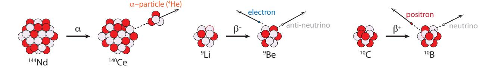

**Figure 15.5:** [Radioactive decay](#page-454-1) mechanisms for  $\alpha$ ,  $\beta$ −, and  $\beta$ +. Protons are colored red, and neutrons light purple. The total nucleon counts are correct for the two [beta decays,](#page-442-1) but only schematic for the larger 144Nd nucleus used to illustrate [alpha decay,](#page-441-3) which is predominantly seen only in heavier nuclei (aside from 5Li and 8Be). The [positron](#page-453-1) is an anti-electron: a positively-charged antimatter counterpart to the electron. [Neutrinos](#page-452-5) are sometimes called "ghost" particles for their near-complete non-interactivity with ordinary matter.1. **[Alpha decay](#page-441-3)** (훼), in which a foursome of two protons and two neutrons—essentially a He 4 nucleus—leaps out.10 10: Helium is found mixed in with natural When this happens, the nucleus reduces its 푁 by two, reduces its 푍 by two, and therefore 퐴 by 4. On the chart of the nuclides, it moves two squares left and two squares down (see [Figure](#page-263-0) [15.7\)](#page-263-0). For example, Be 8 decays this way, essentially splitting into two He 4 nuclei;

gas, and derives from [alpha particle](#page-441-2) decay of elements in the earth's interior.

Follow along on [Figure](#page-261-1) [15.4.](#page-261-1)

- 2. **Beta-minus** (훽 −) decay is a manifestation of the [weak nuclear force,](#page-457-0) in which a [neutron](#page-452-2) within the nucleus converts to a [proton,](#page-454-2) and in the process spits out an [electron](#page-446-0) (훽 − particle, really just 푒 −) to conserve total electric charge, and a [neutrino—](#page-452-5)which we will ignore.11 11: Perhaps it is fair to ignore neutrinos The mass number, 퐴 is unchanged, but 푁 goes down one and 푍 goes up one (gaining a proton and losing a neutron). Thus on the chart of nuclides the motion is one left, one up. It's like a chess move [\(Figure](#page-263-0) [15.7\)](#page-263-0);
- 3. **Beta-plus** (훽 +) decay, like 훽 −, is a manifestation of the [weak nuclear](#page-457-0) [force,](#page-457-0) in which a [proton](#page-454-2) within the nucleus converts to a [neutron,](#page-452-2) emitting a [positron](#page-453-1) (훽 +, or 푒 +, or anti-electron; a form of antimatter) again maintaining charge conservation, and an ignored [neutrino.](#page-452-5) Similar to 훽 − decay, 퐴 is unchanged, but 푍 is reduced by one and 푁 gains one. On the chart, the move is diagonal: down one and right one [\(Figure](#page-263-0) [15.7\)](#page-263-0).
- 4. **[Gamma decay](#page-448-2)** (훾) happens when a nucleus is in an excited energy state, having been rattled by some other decay or bombardment, and it emits a high-energy [photon,](#page-453-2) called a [gamma ray,](#page-448-3) as it settles into a lower energy state [\(Figure](#page-263-1) [15.6\)](#page-263-1). For 훾 decays, 푍, 푁, and 퐴 do not change, so the nucleus does not morph into another flavor, and thus does not move on the [Chart of the Nuclides.](#page-443-0)

[Figure](#page-263-0) [15.7](#page-263-0) demonstrates the motion of each of these decays on the Chart of the Nuclides, and [Table](#page-263-2) [15.2](#page-263-2) summarizes the nucleon arithmetic.

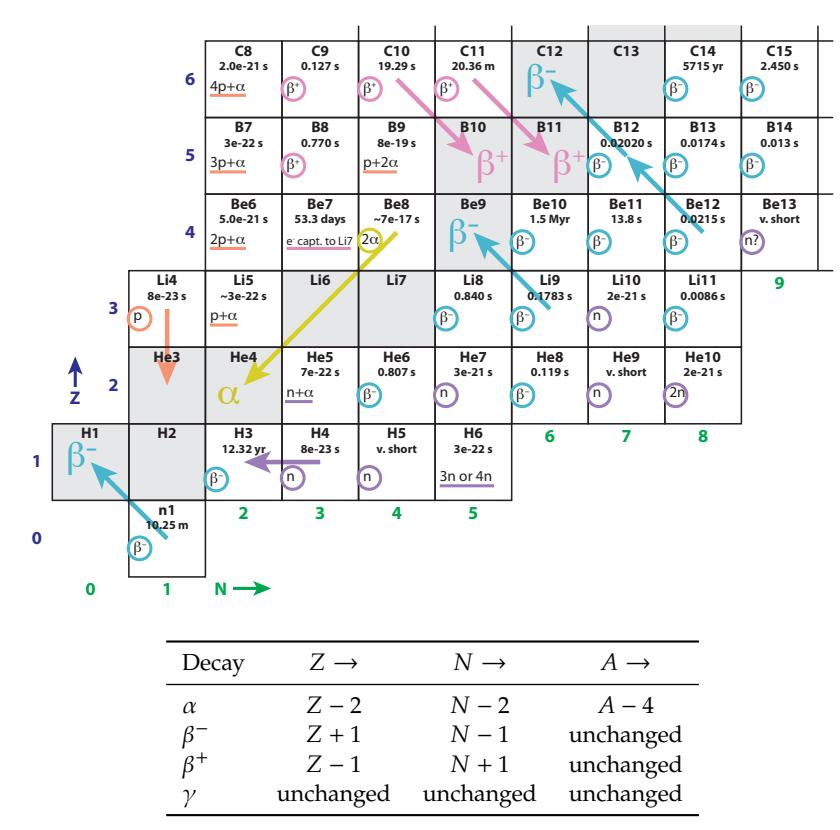

since they ignore us. Neutrinos interact so infrequently with matter that a neutrino could fly through light years of rocky (Earth-like) material before being expected to hit something (interact). This extreme non-interactivity earns it the title of "ghost" particle.

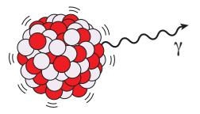

**Figure 15.6:** [Gamma decay](#page-448-2) of an excited nucleus.

**Figure 15.7:** [Radioactive decays](#page-454-1) shown as moves on the "chess board" of the [Chart of](#page-443-0) [the Nuclides.](#page-443-0) The different decay types are color-coded to match [Figure](#page-264-0) [15.8,](#page-264-0) and are only shown in a few representative squares. Decays frequently occur in a series, one after the other (a [decay chain\)](#page-444-0), as hinted by the double-sequence starting at Be12 and ending on C12. Note that the square of every unstable nuclide indicates a decay type, even if arrows are not present.**Table 15.2:** Summary of decay math on nucleon counts.

*© 2022 T. W. Murphy, Jr.; [Creative Commons Attribution-NonCommercial 4.0 International Lic.;](https://creativecommons.org/licenses/by-nc/4.0/) Freely available at: [https://escholarship.org/uc/energy\\_ambitions.](https://escholarship.org/uc/energy_ambitions)*

#### **Example 15.2.2** What will the fate of He 8 be, according to [Figure](#page-261-1) [15.4?](#page-261-1)

We can play this chess game! According to the chart, the primary decay mechanism of He8 is  $\beta^-$  with a half-life of about a tenth of a second. It will become 8Li, which hangs around for about a second before undergoing another  $\beta^-$  decay to 8Be. This one lasts almost no time at all ( $\sim 10^{-16}$  s) before  $\alpha$  decay into two [alpha particles](#page-441-2) (two 4He). Such a sequence is called a [decay chain.](#page-444-0)As is evident in [Figure](#page-264-0) [15.8,](#page-264-0) unstable isotopes *above* the stable track in [Figure](#page-260-0) [15.3](#page-260-0) tend to undergo 훽 + decays to drive toward stable nuclei, while those *below* the track tend to experience 훽 − decays to drive up toward the stable track. The 훼 decays are more common for heavy nuclei (around uranium), which drive toward the end of the train of stable elements in [Figure](#page-260-0) [15.3,](#page-260-0) ending up around lead (Pb). We can understand the abundance of lead as a byproduct of heavy-element decay chains.

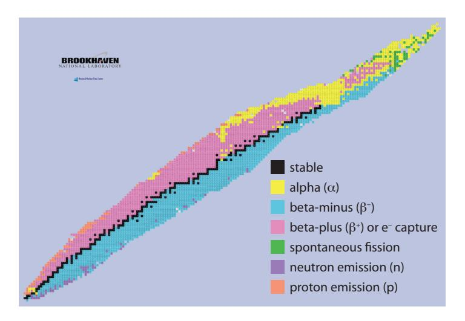

**Figure 15.8:** Another view of the [Chart of](#page-443-0) [the Nuclides,](#page-443-0) color coded to indicate prevailing decay modes as a function of position on the chart. Note that 훽 + sometimes captures an [electron](#page-446-0) rather than emitting a [positron,](#page-453-1) but amounting to the same thing, essentially. From [U.S. DoE.](#page-374-0)

#### **Box 15.1: The Weak Nuclear Force**

An aside worth making is that having discussed [beta decays,](#page-442-1) governed by the [weak nuclear force,](#page-457-0) we have now covered all four known forces of nature: gravity, electromagnetism, the weak nuclear force, and the [strong nuclear force.](#page-456-0) That's it: a small menu, really. The latter three are unified into a Standard Model of Physics, but gravity—described by General Relativity—has defied all attempts at "grand unification," or a "theory of everything" trying to unite all four forces under a single theoretical framework. One implication is that known physics offers no other "magic" solutions to our energy needs. No new forces have come to light in more than half-a-century, despite dramatic advances in tools to probe the fundamental nature of physics.

# **15.3 Mass Energy**

Energy—whatever the form—*has mass* and actually changes the weight of something, although almost imperceptibly. A hot burrito has more mass than the exact same burrito—atom for atom—when it's cold.12 Most of us are familiar, at least casually, with the famous relation  $E = mc^2$ . 12: The burrito is also ever-so-slightly more Most of us are familiar, at least casually, with the famous relation  $E = mc^2$ . More helpfully, we might express it as
$$
\Delta E = \Delta mc^{2},
$$
 (15.1)

where the Δ symbols indicate a *change* in energy or mass, and  $c \approx 3 \times 10^8$  m/s is the speed of light. Using kilograms for mass results in Joules for energy. Because  $c^2$  is such a large number (nearly 1017), the mass change associated with daily/familiar energy quantities is negligibly small. [Box](#page-265-1) [15.2](#page-265-1) explains why  $E = mc^2$  is valid for all energy exchanges—not just nuclear ones—but generally results in mass changes too small to measure in non-nuclear contexts. Earlier, we discussed [conservation of energy.](#page-444-1) More correctly, we observe [conservation of mass](#page-444-2)[energy.](#page-444-2) That is to say, a system *can* actually gain or lose net energy if the mass changes correspondingly. In the case of nuclear energy release, the "new" energy comes at the expense of *reduced mass*.# **Box 15.2:** 퐸 = 푚푐2 **Everywhere**

Physics is not selective about when we might apply  $E = mc^2$ . It always applies, to every situation. It's just that outside of nuclear reactions it does not result in significant mass differences.For example, after we eat a 1,000 [kcal](#page-450-1) burrito to fuel our metabolism, we expend the energy13 and lose mass according to  $\Delta m = \Delta E/c^2$ . Since  $\Delta E \sim 4$  MJ (1,000 kcal), we find the associated mass change is  $4.6 \times 10^{-11}$  kg, which is ten orders-of-magnitude smaller than the mass of the burrito itself.14 So we'd never notice, even though it's really there.  
13: ... ultimately given off as [thermal en](#page-456-1)ergy to our environment  
14: This amount of mass corresponds toWhen we wind up a mechanized toy, coiling a spring, we put energy into the spring and the toy *actually gets more massive*! But for every Joule we put in, the mass only increases by about 10−17 kg. Forgive us for not noticing. Only in nuclear contexts are the energies large enough to produce a measurable difference in mass.

**Example 15.3.1** Since mass and energy are intimately related, it is common to express masses in *energy* terms. How would we express 12.0 [a.m.u.](#page-441-1) in [MeV](#page-451-2) (a unit of energy; see Sec. [5.9; p.](#page-97-0) [78\)](#page-97-0)?

1 [a.m.u.](#page-441-1) is equivalent to 1.66 × 10-27 kg (last row of [Table](#page-266-0) [15.4\)](#page-266-0), so 12 a.m.u. is 1.99×10-26 kg. To get to energy, apply  $E = mc^2$ , computing to 1.8 × 10-9 J of energy. Since 1 [MeV](#page-451-2) is 1.6 × 10-13 J, we end up with\*reative Commons Attribution-NonCommercial 4.0 International Lic.;

massive if it has kinetic energy, gravitational potential energy, or any form of energy. A battery is more massive when charged, even if no atoms or electrons are added. Incidentally, charging a battery does not mean literally adding electrical [charges](#page-443-1) (adding particles), but amounts to rearranging electrons among the atoms within the battery.

[ergy](#page-456-1) to our environment

that of a tiny length of hair that is shorter than it is wide.

*© 2022 T. W. Murphy, Jr.; [Creative Commons Attribution-NonCommercial 4.0 International Lic.;](https://creativecommons.org/licenses/by-nc/4.0/) Freely available at: [https://escholarship.org/uc/energy\\_ambitions.](https://escholarship.org/uc/energy_ambitions)*

#### 11,200 MeV corresponding to 12 a.m.u. (1 a.m.u. is 931.5 MeV).

In practice, and perhaps surprisingly, atoms (nuclei) weigh *less* than the sum of their parts due to binding energy. In order to rip a nucleus completely apart and move all the nucleons far from each other, energy must be *put in* (left part of [Figure](#page-266-1) [15.9\)](#page-266-1). And any change in energy is accompanied by a change in mass, via  $\Delta E = \Delta mc^2$ . All the energy that must be injected to completely dismantle the nucleus *weighs something*! So the mass of the individual pieces after dismantling the nucleus is effectively the mass of the original nucleus *plus* the mass-equivalent of all the energy that was put in to tear it apart (middle panel of [Figure](#page-266-1) [15.9\)](#page-266-1). Therefore, binding energy effectively *reduces* the mass of a nucleus, which we will now explore quantitatively.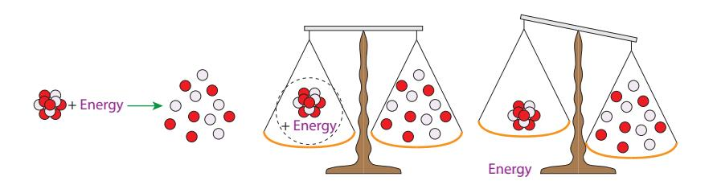

A careful look at [Figure](#page-261-1) [15.4](#page-261-1) reveals that lighter stable nuclei (graysquares) at the lower left of the chart have a mass a little larger than the corresponding mass number, but by the upper right—around oxygen the mass has edged just lower than 퐴. [Table](#page-266-2) [15.3](#page-266-2) shows this trend, confirmable in [Figure](#page-261-1) [15.4](#page-261-1) for the first four nuclides in the table. The difference between mass and 퐴 is most negative around iron, then turns around and becomes positive again for heavy elements like uranium.

What is going on here? If the mass of a nucleus were just the sum of its parts, we would expect the total mass to just track linearly as we add more pieces. In fact, if we try to build a neutral carbon atom out of 6 protons, 6 neutrons, and 6 electrons, the sum, according to [Table](#page-266-0) [15.4,](#page-266-0) should be 12.099 a.m.u., not 12.000. The discrepancy is due to [nuclear](#page-452-6) [binding energy,](#page-452-6) as was introduced in [Figure](#page-266-1) [15.9.](#page-266-1)

| Particle | a.m.u.     | 10-27 kg  | MeV/ <i>c</i> 2 |
|----------|------------|-----------|-----------------|
| proton   | 1.0072765  | 1.6726219 | 938.2720882     |
| neutron  | 1.0086649  | 1.6749275 | 939.5654205     |
| electron | 0.00054858 | 0.000911  | 0.510999        |
| (a.m.u.) | 1.0000000  | 1.660539  | 931.494102      |

[Nuclear binding energy](#page-452-6) is *incredibly* strong15 and is able to overpower the natural electric repulsion between positively charged protons and stick them together in an unwilling bunch. The [strong nuclear force](#page-456-0) only acts over a tiny range within about  $10^{-15}$  m:16 it is very powerful
  
15: . . . relating to what we call the [strong](#page-456-0) [nuclear force](#page-456-0)
  
16: The whole atom is around  $10^{-10}$  m in**Figure 15.9:** One must add energy to overcome [nuclear binding energy](#page-452-6) in order to bust up a nucleus into its constituent [nu](#page-452-3)[cleons](#page-452-3) (left). Thus, the collective mass of a nucleus *plus* the mass associated with the energy it takes to break it apart (via  $E = mc^2$ ) must be equal to the sum of the masses of the constituent parts (middle). Therefore, if we compare the mass of the nucleus *alone* (removing the energy's mass from the scale) it must be less than the mass of the loose collection of nucleons (right).**Table 15.3:** Example mass progression.

| Nuclide | A   | mass (a.m.u.) |
|---------|-----|---------------|
| 2H      | 2   | 2.014         |
| 4He     | 4   | 4.003         |
| 12C     | 12  | 12.000        |
| 16O     | 16  | 15.995        |
| 56Fe    | 56  | 55.935        |
| 235U    | 235 | 235.044       |

**Table 15.4:** Constituent masses of atomic building blocks, expressing the same basic thing in three common units systems.

[nuclear force](#page-456-0)

scale

on short length scales, but ceases to operate much beyond the confines of the nucleus. Think about binding energy this way: if we tried to pry a proton or a neutron [\(nucleon,](#page-452-3) generically) away from a nucleus, we would encounter a very powerful force opposing the action. But let's say we persist, and *do [work](#page-457-1)* in extracting the nucleon by the usual recipe of force times distance. It is *so much* work, in fact, that Δ퐸 = Δ푚푐2 becomes relevant, measurably altering the mass.

[Table](#page-267-1) [15.5](#page-267-1) walks through some example calculations, one of which is traced in [Example](#page-267-0) [15.3.2.](#page-267-0) Because the 1H nuclide is just a lone proton, it has no binding energy.

| Nucleus | $\Sigma m_{p,n,e}$ | actual $m$ | $\Delta m$ | $\Delta mc^2$ (MeV) | MeV per nucleon |
|---------|--------------------|------------|------------|---------------------|-----------------|
| 1H      | 1.007825           | 1.007825   | 0          | 0                   | 0               |
| 2H      | 2.016490           | 2.014102   | 0.002388   | 2.22                | 1.11            |
| 4He     | 4.032980           | 4.002603   | 0.030377   | 28.29               | 7.07            |
| 12C     | 12.09894           | 12.000000  | 0.098940   | 92.16               | 7.68            |
| 56Fe    | 56.46340           | 55.934942  | 0.528447   | 492.25              | 8.79            |
| 235U    | 236.9590           | 235.043920 | 1.915065   | 1783.85             | 7.59            |

**Example 15.3.2** Following the entry in [Table](#page-267-1) [15.5](#page-267-1) for Fe 56 , we first multiply the individual proton, neutron, and electron masses from [Table](#page-266-0) [15.4](#page-266-0) by the 26 protons, 30 neutrons, and 26 electrons comprising Fe 56 to get a sum-of-parts value of 56.46340 [a.m.u..](#page-441-1)

The *actual* mass, as it appears for Fe 56 in the [Chart of the Nuclides](#page-443-0) is 55.934942 a.m.u., which is smaller by 0.528447 a.m.u.18 18: These numbers also appear in [Table](#page-267-1)

Since 1 [a.m.u.](#page-441-1) is  $1.660539 \times 10^{-27}$  kg, we can convert this mass difference into kilograms, then multiply by  $c^2$ , where  $c = 2.99792458 \times 10^8$  m/s to get the associated energy in units of Joules. Traditionally, nuclear physics adopts a more convenient scale of [electron-volts,](#page-446-1) and in particular, the [MeV.](#page-451-2)19 To get our mass-energy difference from Joules to [MeV,](#page-451-2) we divide by  $1.6022 \times 10^{-13}$  J/MeV, and this is the 492 MeV number appearing in the  $\Delta mc^2$  column of [Table](#page-267-1) [15.5.](#page-267-1)
19: 1 MeV is  $10^6$   $10^{-19}$  J (Sec. 5.9; pFinally, we divide by the number of nucleons in the nucleus—퐴 = 56 in this case—to determine how much binding energy is present *per nucleon*—the significance of which will soon become clearer.

Therefore, the difference between the sum-of-parts mass and actual nucleus mass in [Table](#page-267-1) [15.5](#page-267-1) provides a measure of how much binding energy holds the nucleus together.20 20: . . . thus how much energy would need

Notice that the first entry in [Table 15.5](#page-267-1) for the single-proton hydrogen atom has *no* binding energy in the nucleus: the lonely proton has no other nucleon to which it might bind. But [deuterium](#page-445-0) ( ${}^{2}$ H) has a proton and a neutron, held together by 2.2 MeV of binding energy. The binding entire nucleus, as in [Figure 15.9](#page-266-1)*© 2022 T. W. Murphy, Jr.; [Creative Commons Attribution-NonCommercial 4.0 International Lic.;](https://creativecommons.org/licenses/by-nc/4.0/) Freely available at: [https://escholarship.org/uc/energy\\_ambitions.](https://escholarship.org/uc/energy_ambitions)*

Grab a calculator and follow [Example](#page-267-0) [15.3.2](#page-267-0) yourself!

**Table 15.5:** Example [nuclear binding energy](#page-452-6) calculations. The second column is the simple sum of masses of protons, neutrons, and electrons, per [Table](#page-266-0) [15.4.](#page-266-0) Next is measured mass, then the difference. The difference is re-cast in [MeV,](#page-451-2) representing the *total* binding energy of the nucleus, inexorably rising with the size of the nucleus. The final column divides by the mass number to get binding energy per nucleon, which peaks around iron. See [Example](#page-267-0) [15.3.2](#page-267-0) to understand how these numbers are computed.

17 17: Find this in [Table](#page-267-1) [15.5.](#page-267-1)

[15.5.](#page-267-1)

eV, and 1 [eV](#page-447-1) is 1.6022 × 10−19 J (Sec. [5.9; p.](#page-97-0) [78\)](#page-97-0).

to be supplied to completely *unbind* the

energy per nucleon in the last column of [Table](#page-267-1) [15.5](#page-267-1) starts out small, but soon settles to the 7–9 range for most of the entries. It is extremely insightful to plot the binding energy per nucleon as a function of the nucleon mass number, 퐴, which we do in [Figure](#page-268-1) [15.10.](#page-268-1)

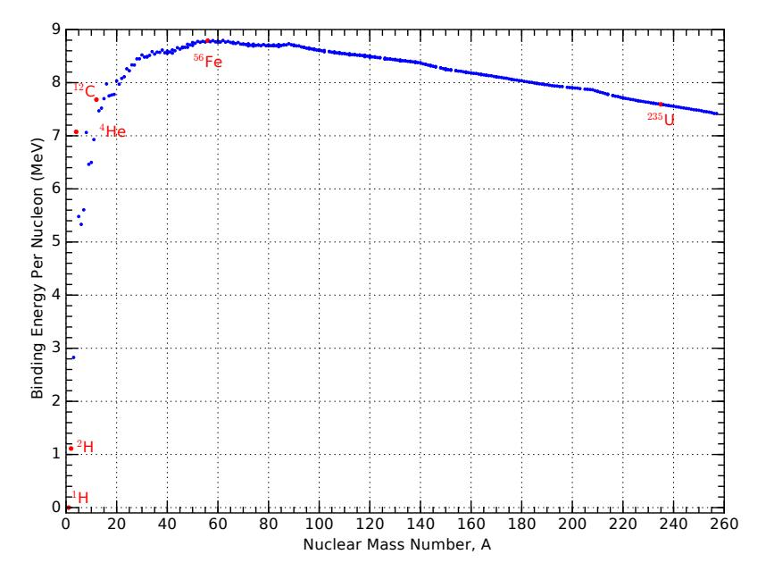

**Figure 15.10:** Binding energy per nucleon as a function of total mass number, 퐴. The nuclei featured in [Table](#page-267-1) [15.5](#page-267-1) are indicated as red points. Note in particular that Fe 56 sits at the peak of the curve. [Fusion](#page-448-0) operates from left to right, building larger nuclei, and [fission](#page-447-0) goes from right to left, tearing apart nuclei. Only actions that *climb* this curve are energetically favorable, meaning that fusion is profitable on the the left-hand side, and fission makes sense on the right: each driving toward the peak binding energy per nucleon.

The value of [Figure](#page-268-1) [15.10](#page-268-1) is hard to over-emphasize. Key take-aways are:

- 1. Most nuclei are at around 8 MeV per nucleon, meaning that it would take an average of about 8 MeV of energy to rip out each member (proton or neutron) from a nucleus;
- 2. The peak is at Fe 56 , 21 meaning that this is the most tightly bound nucleus;22
- 3. The slope on the left side is *much* steeper than the slope on the right side, after the peak, which speaks to why fusion (building from small to big) is more potent than fission (tearing apart very massive nuclei);
- 4. Fusion in stars does not build elements beyond the peak around iron, since to go beyond the peak is not energetically favorable.

It can be helpful to think of [Figure](#page-268-1) [15.10](#page-268-1) upside-down, as in [Figure](#page-268-2) [15.11,](#page-268-2) turning the iron "peak" into a trough. A ball will roll toward and settle near the bottom of the trough, which is what both fusion and fission do, but from opposite directions.

# **15.4 Fission**

Having covered some fundamentals, we are ready to tackle aspects of nuclear energy. Really it is very simple. Enough nuclear material in a 21: Actually, Ni 62 wins by a hair at 8.795 MeV/nuc, but is somewhat overlooked because it is only 0.006% as abundant as Fe 56 whose binding energy per nucleon is essentially tied for the top at 8.790 MeV/nuc.

22: A peak exists because nucleons initially find advantage in binding together, but ultimately the increasing number of mutuallyrepelling protons makes the environment less appealing for larger nuclides.

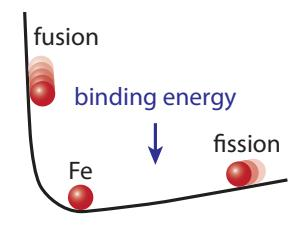

**Figure 15.11:** Turning the binding energy curve upside-down makes it easier to conceptualize fusion and fission driving toward the most tightly bound point (iron), like a ball might roll.

small space will get hot, for reasons detailed below. The heat is used to boil water into high-pressure steam, which then turns a [turbine](#page-457-2) and [generator](#page-448-4) [\(Figure](#page-269-1) [15.12\)](#page-269-1). Note that a nuclear fission plant has much in common with a coal-fired power plant, as evidenced by the similarity of [Figure](#page-269-1) [15.12](#page-269-1) to [Fig.](#page-109-0) [6.2](#page-109-0) (p. [90\)](#page-109-0). Only the source of heat is much different in origin.

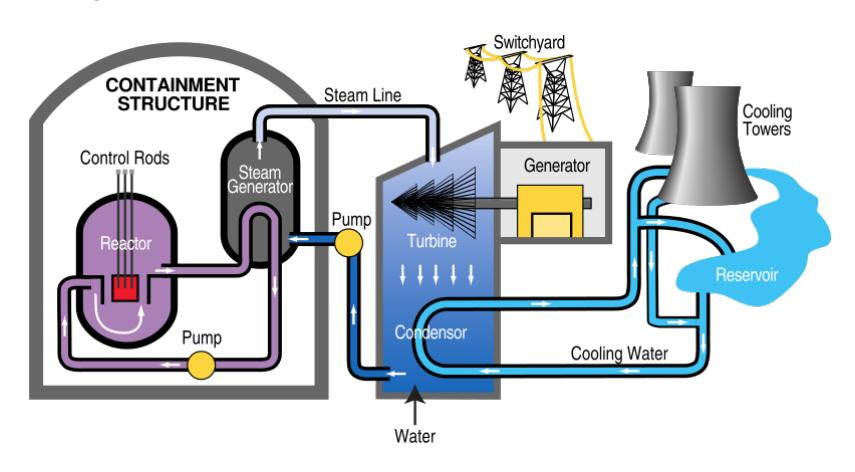

**Figure 15.12:** Typical nuclear power plant design, bearing much resemblance to the generic scheme from [Figure](#page-109-0) [6.2.](#page-109-0) Details on the reactor core will follow in [Section](#page-274-0) [15.4.4.](#page-274-0) Source: [TVA.](#page-374-1)

## **15.4.1 The Basic Idea**

Out of all the nuclides, three are amenable for use in a fission reactor. Two are isotopes of uranium:  ${}^{233}\text{U}$  and  ${}^{235}\text{U}$ ; and one is plutonium:  ${}^{239}\text{Pu}$ . Of these, only  ${}^{235}\text{U}$  is found in nature, so we will concentrate on this one, returning later to the other two when we talk about [breeder](#page-442-2) [reactors](#page-442-2) in Section [15.4.4.2.](#page-277-0)What makes 235U (and the other two) special is that a slow23 neutron—one just bumping around at a speed governed by the local temperature, and thus called a [thermal neutron—](#page-456-2)can walk up to and stick24 to the nucleus and cause it to split into two large chunks—depicted in [Figure](#page-269-2) [15.13.](#page-269-2) Other nuclei would not break up, just accepting the new neutron and possibly converting a neutron to a proton via β− decay.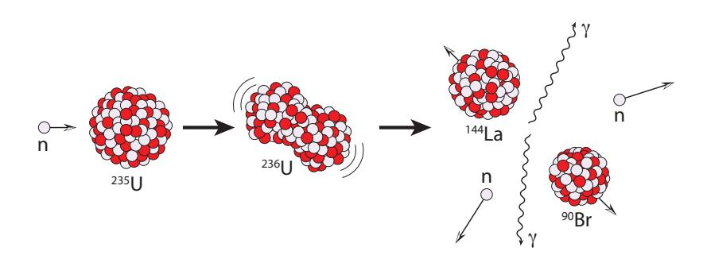

When the nucleus breaks up, the pieces fly out at high speed, carrying kinetic energy that will be deposited in the local material as they bump tends to bounce rather than stick to the nucleus.

24: No forces prevent a neutron from approaching a nucleus. Happening to hit the tiny nucleus is the only barrier.

**Figure 15.13:** Fission schematic for 235U, showing one of many possible outcomes—in this case 90Br and 144La plus two neutrons (an example case treated in detail in the text). The intermediate state, 236U, created when 235U absorbs a neutron, is highly unstable and will spontaneously break into (always) two different-size large fragments (“daughter” nuclei) and perhaps some extra neutrons. Gamma rays and kinetic energy (high-velocity fragments) are also released. Note that at each stage, the total number of nucleons is always 236.their way to a halt. [Gamma rays](#page-448-3)25 are also released. By catching all of 25: . . . very high energy [photons](#page-453-2) this energetic output, the surrounding material gets very hot and can be used to make steam.

### **15.4.2 Chain Reaction**

As we have seen, in order to get fission to happen, we need  ${}^{235}U$  and some wandering neutrons. Once fission commences, the breakup of the nucleus usually “drips” a few spare neutrons, like crumbs left after cutting a piece of bread. The left-over neutrons provide a replenished source of neutrons ready to initiate more fission events. Now the door is open for a [chain reaction](#page-443-2), in which the neutrons produced by the fission events are the very things needed to stimulate additional fission events.When the nucleus splits, any extra neutrons come out "hot" (high speed), which tend to bounce off uranium nuclei without sticking. They need to be slowed down, which is accomplished by a [moderator:](#page-451-3) basically light atoms26 that can receive the neutron impact as a sort of damping medium. Then the main trick is to prevent a runaway that could occur if *too many* neutrons become available; in which case it's a party that can get out of control. So nuclear plants employ [control rods](#page-444-3) containing materials particularly effective at absorbing (trapping) neutrons. The colors of the lower halves of some squares in the [Chart of the Nuclides](#page-443-0) ([Figure](#page-261-1) [15.4\)](#page-261-1) indicate neutron capture cross section. Boron ( $^{10}B$ ) is a favorite choice to soak up neutrons and tame (or even halt) the reaction. The goal is to maintain a [chain reaction](#page-443-2) that produces a net balance of **exactly one** unabsorbed slow neutron per fission event, available to attach itself to a waiting 235U nucleus.### **15.4.3 Fission Accounting**

The nucleus (uranium in the present discussion) always breaks up into two largish pieces, possibly accompanied by a few liberated spare neutrons. Because of the way the track of stable elements curves on the [Chart of the Nuclides,](#page-443-0) the resultant pieces are likely to be neutron rich, to the right of the stable nuclei. To understand this, refer to [Figure](#page-271-0) [15.14](#page-271-0) and the associated caption.

The math always has to add up: [nucleons](#page-452-3) are not created or destroyed during a fission event. They just rearrange themselves, so the total number of neutrons stays the same, as does the total number of protons. *After* the split, 훽 − decays will carry out flavor changes, but we'll deal with that part later.

25: ...very high energy photons

form of graphite

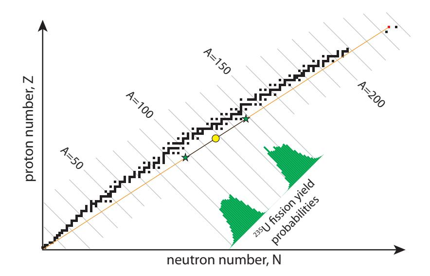

**Example 15.4.1** If one of the two fragments from the fission of a  ${}^{235}U$  nucleus ( $Z = 92$ ) *after adding* a thermal neutron winds up being  ${}^{90}Br$  ( $Z = 35$ ), what is the other nucleus going to be?The other fragment will preserve total proton count, so  $Z = 92 - 35 = 57$ , and as such is destined to be the element lanthanum. Which [isotope](#page-450-0) of lanthanum is produced depends on how many neutrons escape the split. [Table](#page-271-1) [15.6](#page-271-1) summarizes the particle counts of the various players.If no spare neutrons are left over, the lanthanum must have  $N = 144 - 55 = 89$  neutrons,[27](#page-269-2) in which case its mass number will be  $A = 146$ , so 146La. If two neutrons are set free, then the lanthanum will only keep 87 neutrons and be 144La, as depicted in [Figure 15.13](#page-269-2).Typically, about 2–3 neutrons are left out of the final fragments, and can go on to promote additional fission events in the [chain reaction.](#page-443-2)

|   | 235U | 90Br | 146La | 145La | 144La | 143La |
|---|------|------|-------|-------|-------|-------|
| A | 235  | 90   | 146   | 145   | 144   | 143   |
| Z | 92   | 35   | 57    | 57    | 57    | 57    |
| N | 143  | 55   | 89    | 88    | 87    | 86    |
| n | 1    |      | 0     | 1     | 2     | 3     |

Being a probabilistic (random) process, each fission can result in a large set of possible "daughter" nuclei—only one set of which was explored in [Example](#page-271-2) [15.4.1.](#page-271-2) As long as the masses all add up, and the two-hump probability distribution in [Figure](#page-271-0) [15.14](#page-271-0) is respected, anything goes. In other words, we have no control over exactly what pieces come out. [Figure](#page-272-0) [15.15](#page-272-0) provides a graphic illustration of four different possible pairs of daughter fragments. The counting requirement is satisfied by having the products located diametrically opposite from the 235U midpoint (yellow circle). The positions of the stars will distribute along  $A$ -values© *2022 T. W. Murphy, Jr.;* [\*Creative Commons Attribution-NonCommercial 4.0 International Lic.;\*](https://creativecommons.org/licenses/by-nc/4.0/) *Freely available at:* [\*https://escholarship.org/uc/energy\\_ambitions.\*](https://escholarship.org/uc/energy_ambitions)**Figure 15.14:** Fission of 235U (small red square, upper right) tends to produce two neutron-rich fragments. If it split exactly in two, the result would lie at the midpoint of the orange line connecting 235U to the origin, at the yellow circle. In practice, an equal split is highly unlikely, as one fragment tends to be around  $A \sim 95$  and the other around  $A \sim 140$ , as depicted by the probability histogram in green. The two green stars separated along the orange line represent a more likely outcome for the two fragments. As long as the green stars are located so that the yellow circle is exactly between them, the accounting of proton and neutron number is satisfied. Because the orange line lies to the right of the stable nuclei, the fission products tend to be neutron-rich and undergo a series of radioactive  $\beta^-$  decays before reaching stability, which could take a very long time in some cases.27: 235U had 퐴 − 푍 = 235 − 92 = 143 neu-

**Table 15.6:** Possible outcomes for [Example](#page-271-2) [15.4.1](#page-271-2) if we set one of the daughter particles to be bromine-90, forcing the other daughter to be lanthanum. Different isotopes of lanthanum will result for differing numbers of spare neutrons left after the break-up (last row).according to the probability distribution (multi-colored histogram). Note the completely distinct peaks, conveying that virtually *every* fission event results in just two fragments: one bigger and one smaller. At least that aspect of fission is predictable, even if we can't say precisely which nuclei will be left after an individual fission event.

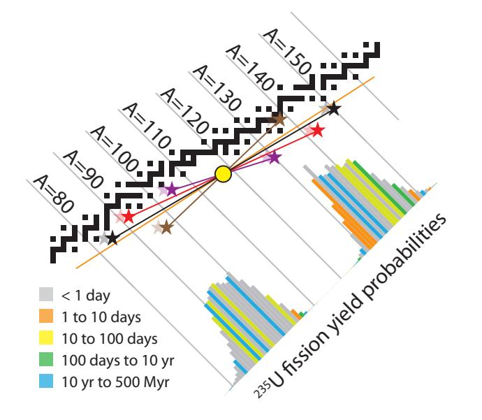

Let us now examine the energetics, using the result from [Example](#page-271-2) [15.4.1,](#page-271-2) in which 235U breaks into 90Br and 144La, plus two spare neutrons.28 To be explicit, the reaction we will trace is
28: . . . also matching the scenario in [Figure](#page-269-2)
$$
^{235}U + n \rightarrow {}^{90}Br + {}^{144}La + 2n. \tag{15.2}
$$

| Constituent/Stage | mass (a.m.u.) | mass (MeV/ $c^2$ ) |
|-------------------|---------------|--------------------|
| 235U              | 235.04392     | 218,942.0          |
| n                 | 1.00866       | 939.6              |
| input mass        | 236.05259     | 219,881.6          |
| 90Br              | 89.93069      | 83,769.9           |
| 144La             | 143.91955     | 134,060.2          |
| 2n                | 2.01733       | 1,879.1            |
| output mass       | 235.86757     | 219,709.3          |
| mass change       | 0.18502       | 172.3              |

The masses of each piece, according to the [Chart of the Nuclides,](#page-443-0) appear in Table 15.7. Again, we find that the mass sums don't equal: the final parts are lighter than the inputs. The fission managed to lose 0.185 a.m.u. of mass, corresponding to 172 MeV of energy (via  $E = mc^2$ ; see Example 15.3.1). That's a 0.08% change in the mass, and converts to an energy density of roughly 17 *million* kcal/g, making the process over a million*© 2022 T. W. Murphy, Jr.; [Creative Commons Attribution-NonCommercial 4.0 International Lic.;](https://creativecommons.org/licenses/by-nc/4.0/) Freely available at: [https://escholarship.org/uc/energy\\_ambitions.](https://escholarship.org/uc/energy_ambitions)*

**Figure 15.15:** Various fission product outcomes are possible, indicated here by four sets of colored star pairs and connecting lines. The average position of each pair is the yellow circle (the stars are diametrically opposite the circle), which guarantees that the total number of neutrons and protons is unchanged from the parent nucleus to the daughter nuclei. To the extent that additional neutrons are left behind like crumbs, the stars will displace to the left of their indicated positions a bit, as hinted by the lighter-shaded "ghost" stars, whose offsets from the nominal star positions will also vary depending on how many neutrons are left out of the two final fragments. The coloring of the histogram indicates radioactive lifetime for the decay chain of a neutron-rich fragment at each mass number, matching the half-life color scheme used in [Figure](#page-261-1) [15.4.](#page-261-1)

[15.13](#page-269-2) and the penultimate column of [Table](#page-271-1) [15.6](#page-271-1)

**Table 15.7:** Mass details of [Eq.](#page-272-1) [15.2,](#page-272-1) tracking before and after masses in both [a.m.u.](#page-441-1) and [MeV](#page-451-2) units. The input mass of around 236 a.m.u. is reduced by about 0.185 a.m.u., or 0.08%.

times more energy–dense than our customary ∼ 10 kcal/g chemical [energy density.](#page-446-2) See [Box](#page-273-0) [15.3](#page-273-0) for an example of how to compute this.

#### **Box 15.3: Nuclear Energy Density**

The example corresponding to [Table](#page-272-2) [15.7](#page-272-2) is said to correspond to 17 million [kcal](#page-450-1)/g, but how can we get here? The mass change of 0.185 [a.m.u.](#page-441-1) corresponds to a mass in kilograms of 3.07  $\times$  10-28 kg, according to the conversion that 1 a.m.u. is 1.6605  $\times$  10-27 kg ([Table](#page-266-0) [15.4](#page-266-0)). Multiply this by  $c^2$  to get energy in Joules, yielding 2.76  $\times$  10-11 J.29 In terms of [kcal](#page-450-1), we divide by 4,184 J/kcal to find that this fission event yields 6.6  $\times$  10-15 kcal.
29: This result, by the way, is the same as 172.3 MeV in [Table](#page-272-2) [15.7](#page-272-2) using the conversion that 1 MeV is 1.6022  $\times$  10-13 J.We now just need to divide by how many grams of "fuel" we supplied, which is 236.05 a.m.u. [\(Table](#page-272-2) [15.7\)](#page-272-2), equating to  $3.92 \times 10^{-25}$  kg, or  $3.92 \times 10^{-22}$  g. Now we divide  $6.6 \times 10^{-15}$  kcal by  $3.92 \times 10^{-22}$  g to get  $16.8 \times 10^{6}$  kcal/g. Blows a burrito out of the water.**Example 15.4.2** Considering that the average American uses energy at a rate of 10,000 W, how much U 235 per year is needed to satisfy this demand for one individual?

Since we have just computed the [energy density](#page-446-2) of 235U to be 17 × 106 [kcal/](#page-450-1)g [\(Box](#page-273-0) [15.3\)](#page-273-0), let's first put the total energy in units of Joules, multiplying 104 W by 3.155 × 107 seconds in a year and then dividing by 4,184 J/kcal to get [kilocalories.](#page-450-2) The result is 75 million kcal, so that an American's annual energy needs could be met by 4.5 g30 of 235U. That translates to about a quarter of a cubic centimeter, or a small pebble, at the density of uranium. Pretty amazing!We can take a graphical shortcut to all of [Section](#page-270-1) [15.4.3,](#page-270-1) which hopefully will tie things together in an instructive way.

**Example 15.4.3** Refer back to [Figure](#page-268-1) [15.10](#page-268-1) (and/or [Table](#page-267-1) [15.5\)](#page-267-1) to see that 235U has a binding energy of about 7.6 MeV per nucleon. Where we end up, around  $A \approx 95$  and  $A \approx 140$ , the binding energies per nucleon are around 8.7 and 8.4 MeV/nuc at these locations, respectively.Multiplying the binding energy per nucleon by the number of nucleons provides a measure of *total* binding energy: in this case 1,790 MeV for 235U, about 825 MeV for the daughter nucleus around  $A \approx 95$ , and 1,175 MeV for  $A \approx 140$ .[31](#page-272-2) Adding the latter two, we find that the fission products have a total binding energy around 2,000 MeV, which is greater[32](#page-272-2) than the 235U binding energy by about 210 MeV—somewhat close to the 172 MeV computed for the particular example in [Table](#page-272-2) [15.7.](#page-272-2)  
[31](#page-272-2):  $7.6 \times 235$ ;  $8.7 \times 95$ ; and  $8.4 \times 140$   
[32](#page-272-2): Binding energy *reduces* mass, so larger binding energy means lighter overall mass.The graphical method got us pretty close with little work, and hopefully led to a deeper understanding of what is going on. The rest of this

172.3 MeV in [Table](#page-272-2) [15.7](#page-272-2) using the conversion that 1 MeV is 1.6022 × 10−13 J.

kcal/g is 4.5 g.

31: 7.6 x 235; 8.7 x 95; and 8.4 x 140

binding energy means lighter overall mass.

paragraph explains the discrepancy, but should be considered nonessential reading. The fission process typically results in a few spare neutrons. Each left-over (unbound) neutron deprives us of *at least* 8 MeV in unrealized binding potential,33 33: Each missing neutron deprives us of *and* the subsequent 훽 − decays from the neutron-rich daughter nuclei to stable nuclei also release energy not accounted in [Table](#page-272-2) [15.7.](#page-272-2) Both of these contribute to the shortfall in comparing 172 MeV to 210 MeV, but even without this, we got a decent estimate just using the graph in [Figure](#page-268-1) [15.10.](#page-268-1)

### **15.4.4 Practical Implementations**

As we saw above, nuclear fission involves getting [fissile](#page-447-2) nuclei—generally U 235 —to split apart by the addition of a neutron. The following criteria must be met:

- 1. presence of nuclear fuel ( U 235 );
- 2. presence of [neutrons,](#page-452-2) provided as left-overs from earlier fission events;
- 3. a [moderator](#page-451-3) to slow down neutrons that emerge from the fission events at high speed;
- 4. a high enough concentration of nuclear fuel that the slowed-down spare neutrons are likely to find fissile nuclei;
- 5. neutron absorbers in the form of [control rods](#page-444-3) that can be lowered into the reactor and act as the main "throttle" to set reaction speed (thus power output), and also prevent a runaway [chain reaction;](#page-443-2)
- 6. a containment vessel to mitigate radioactive particles [\(gamma](#page-448-3) [rays,](#page-448-3) high-speed [electrons](#page-446-0) and [positrons\)](#page-453-1) from escaping to the environment.

[Figure](#page-274-1) [15.16](#page-274-1) shows a typical configuration.

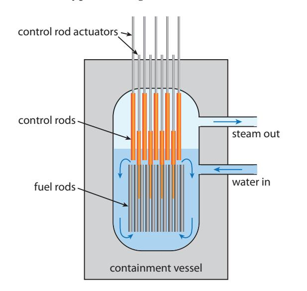

**Figure 15.16:** Typical [boiling water reactor](#page-442-3) design. A thick-walled containment vessel holds water surrounding 235U [fuel rods.](#page-447-3) The water acts as the [moderator](#page-451-3) to slow neutrons and also circulates around the rods to carry heat away, boiling to form steam that can run a standard power plant. [Control rods](#page-444-3) set the pace of the reaction based on how far they are inserted into the spaces between fuel rods. Extra control rods are poised above the reactor core ready to drop quickly into the core in case of emergency—suddenly bringing the [chain](#page-443-2) [reaction](#page-443-2) to a halt.

more than the standard ∼8 MeV per nucleon, as neutrons have no penalty for repulsive electric charge. The 8 MeV per nucleon is an average over protons and neutrons.

In the design of [Figure](#page-274-1) [15.16,](#page-274-1) called a [boiling water reactor,](#page-442-3) the water acts as both the neutron [moderator](#page-451-3) and the thermal conveyance medium. Nuclear fuel (uranium) is arranged in [fuel rods,](#page-447-3) providing ample surface area and allowing water to circulate between the rods to slow down neutrons and carry the heat away. Neutron-absorbing [control rods](#page-444-3) usually containing boron—set the reaction speed by lowering from the top.34 An emergency set of control rods can be dropped into the core in a big hurry to shut down the reactor instantly if something goes wrong. When the emergency rods are in place, neutrons have little chance of finding a 235U nucleus before being gobbled up by boron.34: . . . always this direction, so that gravityAs of 2019, the world has about 455 operating nuclear reactors, amounting to an installed capacity of about 400 GW.35 35: From this, we glean that reactors aver-The average *produced* power not all are running all the time—was just short of 300 GW. The [thermal](#page-456-3) [equivalent](#page-456-3) would be approximately three times this, or 1 TW out of the 18 TW we use in the world. So nuclear is a relevant player. See [Table](#page-275-0) [15.8](#page-275-0) for a breakdown of the top several countries, Fig. [7.7](#page-128-0) [\(p.109\)](#page-128-0) for nuclear energy's trend in the world, and Fig. [7.4](#page-126-0) [\(p.107\)](#page-126-0) for the U.S. trend.

| Country     | # Plants | GW inst. | GW avg. | % elec. | global share (%) |
|-------------|----------|----------|---------|---------|------------------|
| U.S.        | 95       | 97       | 92      | 20      | 31               |
| France      | 56       | 61       | 44      | 71      | 15               |
| China       | 49       | 47       | 38      | 5       | 13               |
| Russia      | 38       | 28       | 22      | 20      | 8                |
| Japan       | 33       | 32       | 8       | 8       | 3                |
| S. Korea    | 24       | 23       | 16      | 26      | 5                |
| India       | 22       | 6        | 5       | 3       | 2                |
| World Total | 455      | 393      | 295     | 11      | 100              |

Nuclear plants only last about 50–60 years, after which the material comprising the core becomes brittle from exposure to damaging radioactivity and must be decommissioned. The median age of reactors in the U.S. is 40 years, and all but three are over 30 years old. Additional challenges will be addressed in the sections that follow.

When nuclear energy was first being rolled out in the 1950s, the catch phrase was that it would be "too cheap to meter," a sentiment presumably fueled by the stupendous [energy density](#page-446-2) of uranium, requiring very small quantities compared to fossil fuels. The reality has not worked out that way. Today, a 1 GW nuclear power plant may cost \$9 billion to build [\[102\]](#page-437-1) [\[102\]](#page-437-1): Union of Concerned Scientists (2015), . That's \$9 per Watt of output power, which we can compare to the cost of a solar panel, at about \$0.50 per W (Fig. [13.16; p.](#page-234-0) [215\)](#page-234-0), or utility-scale installation at \$1 per Watt [\[89\]](#page-436-0). While it seems that solar36 36: Recall, for context, that solar is not wins by a huge margin, the low [capacity factor](#page-443-3) of solar reduces average power output to 10–20% of the peak rating, depending on location. Meanwhile, nuclear reactors tend to run steadily 90% of the time—the off-time used for maintenance and fuel loading. So nuclear fission costs about \$10 per delivered Watt, while solar panels are \$2.5–5 per delivered

does the pulling rather then relying on some other drive force

age roughly 1 GW each.

**Table 15.8:** Global nuclear power in 2019 [\[101\]](#page-437-0), listing number of operational plants, installed capacity, average generation for 2019 (Japan currently has stopped a number of its reactors), percentage of *electricity* (not total energy), and fraction of global production (these 7 countries accounting for over 75%). Notice the close match between number of plants and GW installed for most countries, indicating that most nuclear plants deliver about 1 GW.

*The Cost of Nuclear Power*

among the *cheaper* energy resources. Like solar, nuclear power is dominated by up-front costs, rather than fuel cost.

Watt and installed utility-scale systems are \$5–10 per Watt. In short, nuclear power is not an economic slam dunk.

#### **15.4.4.1 Uranium**

So far, we have ignored a crucial fact. Only 0.72% of natural uranium on Earth is the fissile 235U flavor. The vast majority, 99.2745%, is the benign 238U.[37](#page-276-0) The ratio is about 140:1, so for every 235U atom pulled out of the ground, 140 times this number of uranium atoms must be extracted. The origin of the disparity is a story of astrophysics and eons, covered in [Box](#page-276-0) [15.4.](#page-276-0)  
37: A trace amount, 0.0055%, is in 234U.#### **Box 15.4: Origin of Uranium**

The [Big Bang](#page-442-0) that formed the [universe](#page-457-3) produced only the lightest nuclei. By-and-large, the result was 75% hydrogen (1H) and 25% helium (4He). Deuterium (2H) and 3He were produced at the 0.003% and 0.001% levels, respectively, and then the tiniest trace of lithium. No carbon or oxygen emerged, which must be "cooked up" via fusion in stars.Fusion in stars does not "climb over" the peak of the binding-energy curve in [Figure](#page-268-1) [15.10,](#page-268-1) so stops in the vicinity38 38: Iron has 푍 = 26; stars tend not to proof iron. From where, then, did all of the heavier elements on the periodic table derive? Exploding stars called supernovae and merging neutron stars appear to be the origin of elements beyond zinc.

The relative abundance of 235U and 238U on Earth can be explained by their different half-lives of 0.704 Gyr and 4.47 Gyr, respectively. Even if starting at comparable amounts, most of the 235U will have decayed away by now. Solving backwards[39](#page-39-1) to when they would have been present in equal amounts yields about 6 Gyr, which is older than the age of the solar system (4.5 Gyr) and younger than the universe (13.8 Gyr). This is a reasonable result for how old the astrophysical origin might be—allowing a billion years or so for the material to coalesce in our forming solar system.

Uranium is not particularly abundant. [Table](#page-277-1) [15.9](#page-277-1) provides a sense of how prevalent various elements are in the earth's crust. Uranium is more abundant than silver, but the *useful* 235U isotope is four times rarer than silver, and only about 5 times as abundant as gold. [Proven reserves](#page-454-4) of uranium [\[103\]](#page-437-2) amount to 7.6 million (metric) tons available, and we have used 2.8 million metric tons to date. The implication is that we could continue about 3 times longer than we have gone so far on [proven](#page-454-4) reserves. But nuclear energy has played a much smaller role than fossil fuels, so maybe this isn't so much. [\[103\]](#page-437-2): (2020), *List of Countries by Uranium* ReservesEvaluating the uranium reserves in energy terms is the most revealing

37: A trace amount, 0.0055%, is in \$^{234}\$U.

duce elements beyond zinc ( $Z = 30$ ) by fusion.and process as carbon-14 [radioactive](#page-454-3) dating, but using much longer [half life](#page-448-1) nuclei to date Earth's building blocks!

*Reserves*

| Element  | Abund.  | Element | Abund. | Element | Abund. |
|----------|---------|---------|--------|---------|--------|
| silicon  | 282,000 | carbon  | 200    | thorium | 9.6    |
| aluminum | 82,300  | copper  | 60     | uranium | 2.7    |
| iron     | 56,300  | lithium | 20     | silver  | 0.075  |
| calcium  | 41,500  | lead    | 14     | 235U    | 0.02   |
| titanium | 5,650   | boron   | 10     | gold    | 0.004  |

approach. First, we take 0.72% of the 7.6 million tons available to represent the portion of uranium in the form of 235U. [Enrichment](#page-446-3) (next section) will not separate *all* of the 235U, and the reactor can't burn all of it away before the fuel rod is essentially useless. So optimistically, we burn half of the mined 235U in the reactor. Multiplying the resulting 27,300 tons of *usable* 235U by the 17 million kcal/g we derived earlier yields a total of  $2 \times 10^{21}$  J. [Table](#page-277-2) [15.10](#page-277-2) puts this in context against fossil fuel proven reserves from page [127.](#page-146-0) We see from this that proven uranium reserves give us only 20% as much energy as our proven oil reserves, and about 5% of our total remaining fossil fuel supply. If we tried to get all 18 TW from this uranium supply, it would last less than 4 years! This does not sound like a salvation.Proven uranium reserves would last 90 years at the *current* rate of use, so really it is in a category fairly similar to that of fossil fuels in terms of finite supply. To be fair, [proven reserves](#page-454-4) are always a conservative lower limit on [estimated total resource](#page-447-4) availability. And since fuel cost is not the limiting factor for nuclear plants, higher uranium prices can make more available, from more difficult deposits. Still, even a factor of two more does not transform the story into one of an ample, worry-free resource.#### **15.4.4.2 Breeder Reactors**

In its native form, 235U is too dilute in natural uranium—overwhelmingly dominated by 238U—to even work in a nuclear reactor. It must be [enriched](#page-446-4) to 3–5% concentration to become viable.[40](#page-446-4) Enrichment is difficult to achieve. Chemically, 235U and 238U behave identically. The masses are so close—just 1% different—that mechanical processes have a difficult time differentiating. Centrifuges are commonly used to allow heavier 238U to sink faster[41](#page-446-4) than 235U. But it's inefficient and usually requires many iterations to work up higher concentrations. The process is also lossy, in that not all of the 235U finds its way to the enriched pile.[42](#page-446-4)
[40](#page-446-4): Uranium bombs need at least 20% 235U concentration, but typically aim for 85% to be considered weapons grade.
[41](#page-446-4): ... in gaseous form.
[42](#page-446-4): Depleted uranium is defined as contain-But what if we could use the *bulk* uranium, 238U, in reactors and not only save ourselves the hassle of enrichment, but also gain access to 140 times more material, in effect? Doing so would turn the [proven](#page-454-4) [reserves](#page-454-4) of uranium into about 7 times more energy supply than all of our remaining fossil fuels. Well, it turns out that despite its not being**Table 15.9:** Example material abundances in the earth's crust, in [parts per million by](#page-453-3) [mass.](#page-453-3)

**Table 15.10:** Proven reserves, in energy terms.

| Fuel | 1021 J |
|------|--------|
| Coal | 20     |
| Oil  | 10     |
| Gas  | 8      |
| 235U | 2      |

concentration, but typically aim for 85% to be considered *weapons grade*.41: ...in gaseous form

ing 0.3% or less in the form of 235U, which is not a huge reduction from the 0.72% starting point.one of the three [fissile](#page-447-2) nuclei, we can *convert*43  ${}^{238}U$  into the fissile  ${}^{239}Pu$  43: ... called [transmutation](#page-456-4) the following way.1. A 238U may absorb a wandering neutron to become 239U.- 2. U 239 , whose [half life](#page-448-1) is 23.5 minutes, undergoes 훽 − to become Np 239 in short order.
- 3. Np 239 also undergoes 훽 − with a [half life](#page-448-1) of 2.4 days to become [fissile](#page-447-2) Pu 239 .

[Figure](#page-278-0) [15.17](#page-278-0) highlights this process in a simplified region of the [Chart](#page-443-0) [of the Nuclides,](#page-443-0) while [Figure](#page-278-1) [15.18](#page-278-1) shows complete details for the entire region around the fissile materials—the ones with red isotope names—which can be used to track the sequence outlined above.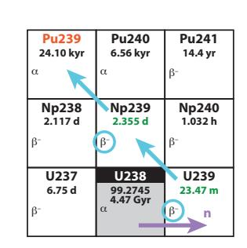

**Figure 15.17:** Breeder route to 239Pu.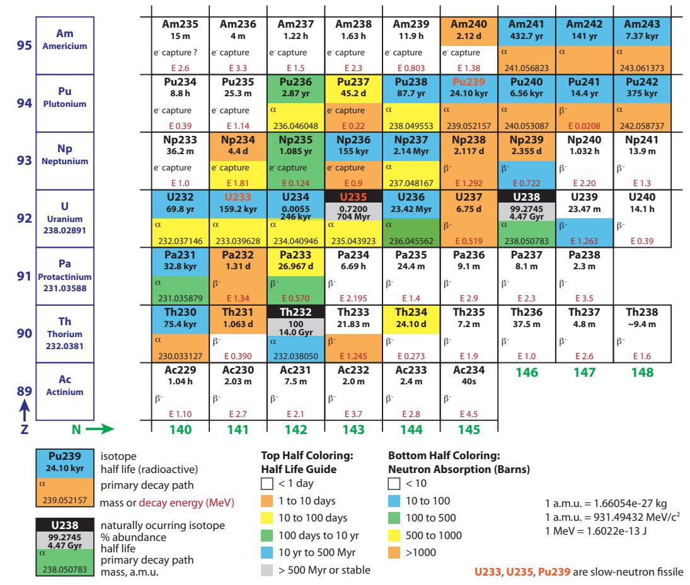

**Figure 15.18:** [Chart of the Nuclides](#page-443-0) in the fission region. See also [Figure](#page-261-1) [15.4](#page-261-1) for the lower-left corner.The result is that sterile 238U can be turned into fissile 239Pu that can be used in fission reactors. This process of transmuting an inert nucleus into a fissile one is called [breeding,](#page-442-4) and is how we get any plutonium at all.44 A nuclear reactor is a great place to introduce 238U to neutrons: both are already in attendance. In fact, breeding happens as a matter of course in a nuclear reactor: it is estimated that one-third of the fission 44: . . . e.g., for weapons

44: ...e.g., for weapons

energy in ordinary nuclear reactors comes from plutonium breeding and subsequent fissioning—without any extra effort. Special reactor designs enhance plutonium production, allowing the [fuel rod](#page-447-3) to be "harvested" for plutonium. Usually, the plutonium is destined for use in weapons, but in principle reactors could be designed to efficiently produce and use plutonium from the U 238 feedstock. Downsides will be addressed in [Section](#page-281-0) [15.4.6](#page-281-0) on weapons and [proliferation.](#page-454-0)

#### **Box 15.5: Thorium Breeding**

Another form of breeding merits mention. Notice that thorium[45](#footnote-45-1) is more abundant than uranium in [Table 15.9.](#page-277-1) But like 238U, it is not fissile. However, applying the breeding trick, the absorption of a neutron by 232Th ends up as 233U—the last of our three fissile nuclei—in about a month's time. This provides an avenue for an even *greater* energy store than exists in 238U via breeding to 239Pu, by virtue of greater abundance. Unlike the plutonium route, thorium breeders are less susceptible to weapons and [proliferation](#page-454-0) concerns.[46](#footnote-46-1) That said, thorium reactors are more complex than uranium reactors, so that technical hurdles have thus far prevented any commercial scale application of the technique, leaving us unclear whether thorium represents a viable nuclear path.
  
  

45: . . . of which 100% is the desired 232Th isotope
  
  

46: . . . although, radioactive waste is still problematic### **15.4.5 Nuclear Waste**

As we saw in our description of the fission process, the fragments distribute over a range of masses in a randomized way [\(Figure](#page-272-0) [15.15\)](#page-272-0). The results are generally neutron-rich, and will migrate toward stable elements via 훽 − decays over the ensuing seconds, hours, days, months, and years. Some will go fast, and some will take ages to settle, depending on half-lives. [Radioactive](#page-454-3) waste is dangerous to be around because the high-energy particles (like sub-atomic "bullets") spewing out in all directions can alter DNA, leading to cancer and birth defects, for instance.

The lighter of the two fission fragments has a 59% chance of landing on a stable nucleus within a day or so. For the heavier fragment, it's a 45% chance. The rest get hung up on some longer half-life nuclide, and could remain [radioactive](#page-454-3) for a matter of weeks or in some cases millions of years. The colors in the fission probability histograms in [Figure](#page-272-0) [15.15](#page-272-0) provide a visual guide for the mass numbers that reach stability promptly (gray) vs. those that get hung up for a long time (blue is more than 10 years). For example, the histogram element at 퐴 = 90 is blue because Sr 90 —discussed below—stands in the way of a fast path to stability.

45: ...of which 100% is the desired \$^{232}\$Th
isotope

problematic

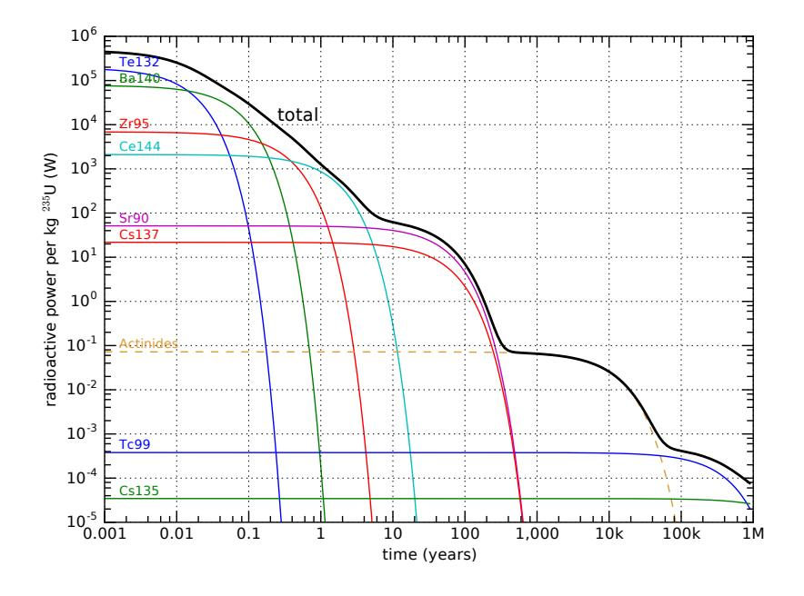

**Figure 15.19:** Decay activity of fragments from 1 kg of fissioned 235U over time, on a log–log plot. The vertical axis is the power of [radioactive](#page-454-3) emission, in W, for a variety of relevant [isotopes—](#page-450-0)each having their own characteristic [half life.](#page-448-1) The black line at the top is the total activity (sum of all contributions), and some of the key individuals are separated out. The dashed line for actinides is an approximate representative indicator of the role played by heavy nuclides formed in the reactor by uranium absorption of neutrons. Minor tick marks are at multipliers of 2, 4, 6, and 8 for each axis. As a matter of possible interest, the exponential decays of each element on this log–log plot have the functional form of exponential curves drawn upside-down.

[Figure](#page-280-0) [15.19](#page-280-0) shows how the fission decays play out over time. For the first month or so out of the reactor, the spent fuel is really "hot" radioactively, but falls quickly as 95Zr and then 144Ce dominate around one year out. At about 5 years, the pair of 90Sr and 137Cs begin to dominate the output for the next few-hundred years. Some of the products survive for millions of years, albeit at low levels of radioactive power. In addition to the daughter fragments, uranium in the presence of neutrons transmutes into neptunium, plutonium, americium, and curium via neutron absorption and subsequent  $\beta$ − decays, represented approximately and collectively in [Figure](#page-280-0) [15.19](#page-280-0) by a dashed curve labeled Actinides.47The bottom line is that fission leaves a trash heap of radioactive waste that remains at problematic levels for many thousands of years. When nuclear reactors were first built, they were provisioned with holding tanks—deep pools of water—in which to place the waste fuel until a more permanent arrangement could be sorted out [\(Figure](#page-280-1) [15.20\)](#page-280-1). We are still waiting for an adequate permanent solution for waste storage, and the "temporary" pools are just accumulating spent fuel. Transporting the spent fuel is hazardous—in part because it could fall into the wrong hands and be used to make "dirty" bombs—and no one wants a nuclear waste facility in their backyard, making the problem politically thorny. On the technical side, it is difficult to identify sites that are geologically stable enough and have little chance of groundwater contamination. Underground salt domes offer an interesting possibility, but political challenges remain daunting.

47: Breeder reactors can "burn" the actinides, reducing some of the long-term waste threat, but will unavoidably still be left with all the radioactive fission products.

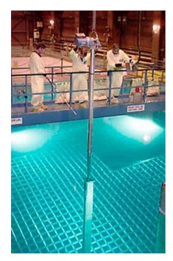

**Figure 15.20:** A spent fuel rod being lowered into a storage grid in a pool of water at a nuclear power plant. Source: [U.S. DoE.](#page-374-2)

# **15.4.6 Nuclear Weapons and Proliferation**

Nuclear bombs are the most destructive weapons we have managed to create. The first bombs from the 1940s were based on either highly enriched 235U or on 239Pu. For uranium bombs, the idea is shockingly simple. Two separate lumps of the bomb material are held apart until detonation is desired, at which point they are slammed together.48 It's not the collision that creates the explosion, but a runaway process based on having a high concentration of [fissile](#page-447-2) material and no neutron absorbers present to control the resulting [chain reaction.](#page-443-2) The concept is [critical](#page-444-4) [mass.](#page-444-4) The combined lump exceeds the critical mass, and explodes.49  
48: For plutonium, this process is fouled
49: Never stack lumps of fissile materialAs simple as nuclear weapons are to build, the bottleneck becomes
obtaining fissile material. Plutonium does not exist in nature, since its
24,100 yr half-life means nothing is left over from the astrophysical
processes that gave us uranium and thorium (Box [15.4\)](#page-276-0). We only still
have the latter two thanks to their long half lives. So fissile material has to
start with uranium. But as we have seen, natural uranium is only 0.72%
fissile ( $^{235}U$ ). In order to be explosive, the uranium must be [enriched](#page-446-4)
to at least 20%  $^{235}U$ , and generally much higher (85%). Reactor fuel, at
3–5%  $^{235}U$  will experience [meltdown](#page-451-4) if the critical mass is exceeded,
but will not explode. Enrichment is technically difficult, and attempts
to acquire and enrich uranium are monitored closely. Often we hear of
countries pursuing uranium enrichment, claiming that they are only
interested in domestic energy production—a peaceful purpose. And it
is true that the first step in nuclear power generation is also enrichment.
So it is very difficult to ascertain true intentions. Once a country has
the ability to enrich uranium enough for a nuclear plant, they can in
principle keep the process running longer to arrive at weapons-grade
 $^{235}U$ .While we worry about 235U falling into the wrong hands, perhaps more disturbing is 239Pu. Having a much shorter half-life than 235U (24 kyr vs. 704 Myr), it is more dangerous to handle.50 But plutonium is otherwise easy to deal with, since it requires no enrichment and can be chemically separated to achieve purity. It is the material of choice for nuclear weapons.
  
50: ... much higher rate of [radioactive de-](#page-454-1)caySerious pursuit of [breeder reactors](#page-442-2) effectively means manufacturing lots of plutonium, leading to [proliferation](#page-454-0) of nuclear materials: it becomes harder to track and keep away from mal-intentioned groups. The world becomes more dangerous under a breeder program. Thorium breeding [\(Box](#page-279-1) [15.5\)](#page-279-1) is less risky in this regard because the  $^{233}$ U prize is mixed with a ridiculously dangerous  $^{232}$ U isotope that puts plutonium to shame, so working with it is pretty deadly, which may deter would-be pursuit of this material by rogue groups.A related concern involves [proliferation](#page-454-0) of the abundant radioactive waste from fission plants, which could be mixed into conventional explosives51 to radioactively contaminate a city or local region—poisoning 51: . . . called a "dirty bomb"by the presence of  $^{240}$ Pu, forcing a different approach in which a sphere below [critical](#page-444-4) [mass](#page-444-4) is imploded to create high density.together on a shelf, or a nasty surprise may50: ...much higher rate of radioactive de-[cay](#page-454-1)51: . . . called a “dirty bomb”

water, food, and air. In short, nuclear fission carries many perils on a number of fronts.

## **15.4.7 Nuclear Safety**

A properly operating nuclear facility actually emits less radioactivity than does a traditional coal-fired power plant! As is true for many materials mined from the ground, coal contains some small amount of [radioactive](#page-454-3) elements found in the earth's crust: principally thorium, uranium, and potassium. Lacking any shielding or protection, the exhaust from a coal plant distributes these products into the atmosphere. Nuclear plants, by contrast, have no exhaust,52 and carefully control the exposure to radioactivity.However, things can go wrong. The U.S. had a scare in 1979 when a six-month-old nuclear plant at Three Mile Island in Pennsylvania [\(Figure](#page-282-1) [15.21\)](#page-282-1) suffered a loss-of-cooling incident that resulted in severe damage to [\(meltdown](#page-451-4) of) the core. But the containment vessel held and no significant radioactivity was released to the environment. Workers at the plant received a dose equivalent to an extra 100 days of natural53 53: We are unavoidably exposed to [radia](#page-454-5)exposure. So we dodged a bullet.

Chernobyl was not so lucky in April 1986 when an ill-conceived test went sideways and resulted in an actual explosion of the core. This scenario was previously thought to be impossible, but it was a steam explosion, not a nuclear blast—so more like a "dirty bomb" that scattered radioactive material across the region. Thirty-one people died in the immediate aftermath, and about 200 people got acute radiation sickness. It is estimated that in the long term, 25,000 to 50,000 additional cancer cases will result, but this number is controversial and it is hard to tease Chernobyl-caused cancer/deaths apart from the much larger number of background cancer cases. The town of Chernobyl is still abandoned and only recently has begun to allow strictly limited incursions.

The most recent major accident was the Fukushima Daiichi plant in Japan following the Sendai earthquake in March 2011, resulting in the evacuation of 200,000 people and agricultural loss. The earthquake caused the three operating reactors to shut down (safely), while dieselfueled generators ran to power pumps maintaining cooling flow over the hot [fuel rods.](#page-447-3) The core of a reactor is still very hot after fission stops and continues to generate heat as daughter nuclei decay, so cooling flow must be maintained or the core can melt. The ensuing tsunami54 ruined 54: . . . within 10 minutes of the earthquake the plan to keep the cores cool, as the generator rooms flooded, causing the cooling flow to fail. The cores of all three reactors melted down and hydrogen gas explosions created a major release of radioactivity. Perhaps in contrast to the Chernobyl plant, Fukushima was designed by General Electric and operated by a well-educated high-tech society. No one is exempt from risk when it comes to nuclear reactors.

plume of water vapor above them, but this is the result of evaporative cooling, and not exhaust in the usual sense.

[tion](#page-454-5) in our daily lives from air, water, food, Earth, and the cosmos.

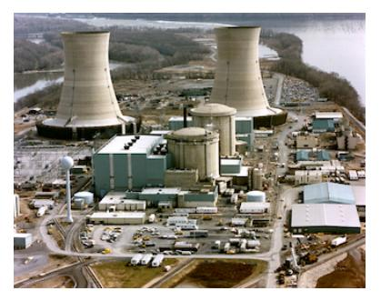

**Figure 15.21:** Three Mile Island nuclear plant in Pennsylvania. The two reactor cores are in the foreground of the larger cooling towers behind. Source: [U.S. DoE.](#page-374-3)

54: ... within 10 minutes of the earthquake

# **15.4.8 Pros and Cons of Fission**

Collecting the advantages and disadvantages of fission, we start with the positive aspects:

- I Nuclear fuel has extraordinary [energy density,](#page-446-2) about a million times better than chemical energy density;
- I Nuclear fission is proven technology providing a substantial fraction of electrical energy at present;
- I Life-cycle CO2 [emissions](#page-451-5) for nuclear fission is only 2% that of traditional fossil fuel electricity [\[68\]](#page-435-0); [\[68\]](#page-435-0): (2020), *Life Cycle GHG Emissions*
- I [Breeder reactors](#page-442-2) could provide thousands of years of fuel, by way of uranium and thorium (undeveloped as yet).

And for the downsides:

- I Radioactive waste is dangerous for thousands of years, and no clear solution to its disposal or long-term storage has emerged.
- I Conventional uranium fission has limited fuel supply,55 55: . . . in the absence of [breeder reactor](#page-442-2) measuring in decades;
- I [Breeder reactors](#page-442-2) exacerbate the waste issue and promote [prolifera](#page-454-0)[tion](#page-454-0) of nuclear materials;
- I Development of nuclear energy technology prepares an easy step to immensely destructive nuclear weapons;
- I Accidents happen even to the best-managed reactors, the consequences often being severe for a region.

Nuclear fission is a complex topic that has compelling advantages and worrisome faults. Not surprisingly, attitudes are highly mixed. One survey [\[104\]](#page-437-3) indicates that adults in the U.S. oppose building more nuclear plant by a slim 51% to 45%, while scientists overall favor advancing nuclear plants by a 2:1 margin,56 and physicists surveyed favored nuclear by 4:1. Scientists are much more likely to view climate change as a serious threat than the U.S. population as a whole, and therefore are likely to be attracted to energy resources that do not emit CO2. Of the physicists surveyed, it would be a mistake to assume that even the majority know the topic as thoroughly as it is covered in this chapter—given the degree of specialization within the field. Among those who understand the topic thoroughly57 it is almost certain you'd find a healthy split: those for whom the perils outweigh advantages, and those who are concerned enough about climate change to accept the "lesser of two evils," and/or who are enthusiastic about the technology as a glowing example of our mastery over nature's hidden secrets. [\[104\]](#page-437-3):  

Pew Research (2015), "Elaborating on the Views of AAAS Scientists, Issue by Issue"  

56: ... a clear, but not overwhelming, result  

57: We might also acknowledge an intrinsic psychological appeal for complex topics that have been mastered: a sort of pride in the privileged comprehension that might transfer to warm feelings for the subject.# **15.5 Fusion**

Given that [fission](#page-447-0) has problems of finite uranium supply, radioactive waste, [proliferation](#page-454-0) and weapons, and safety issues, its future is uncertain.

implementation

on the Views of AAAS Scientists, Issue by Issue"

56: . . . a clear, but not overwhelming, result

psychological appeal for complex topics that have been mastered: a sort of pride in the privileged comprehension that might transfer to warm feelings for the subject.

[Fusion,](#page-448-0) on the other hand, is not plagued by most of these issues. It's main problem is that it is incredibly difficult and has been in the research stage for 70 years. Other than that, it has many (virtual) virtues. To be clear, the world does not have and never has had an operational fusion power plant. It *may* belong to the future, but is not guaranteed to ever become practical.

First, the basics. We have alluded to the fact that fusion builds from the small to the big. Putting four  ${}^{1}$ H nuclei together, at 1.007825 [a.m.u.](#page-441-1) each and forming  ${}^{4}$ He at 4.0026033 a.m.u. leaves a difference of 0.0287 a.m.u.— 0.7% of the total mass—which amounts to 153 million kcal/g.58 This is *almost ten times* as large as the amount for fission (17 million kcal/g; [Box](#page-273-0) [15.3\)](#page-273-0), making it ten-million times more potent than chemical reactions. Recall that fusion's better performance can be related to the steepness of the left-hand-side of the binding-energy-per-nucleon curve of [Figure](#page-268-1) [15.10.](#page-268-1)
  

58: The calculation is that 0.0287 [a.m.u.](#page-441-1) corresponds to  $\Delta m = 4.8 \times 10^{-29}$  kg, or  $E = \Delta mc^2 = 4.2 \times 10^{-12}$  J (26.7 MeV). We convert the Joules to kcal by dividing by 4,184, and then divide by the input mass in grams (4.03 a.m.u. times  $1.6605 \times 10^{-24}$  g/a.m.u.) to get 153 kcal/g. Starting with two deu-What makes fusion so difficult is that getting protons to stick together is incredibly hard. Their electric repulsion is so strong that they need to be approaching each other at a significant fraction of the speed of light (about 7%) in order to get within reach of the strong nuclear force that takes over at distances smaller than about  $10^{-15}$  m. The corresponding temperature is a billion degrees.[59](#page-3-5)
  

Even the center of the sun is “only” 16 million degrees. The sun has the advantage of being enormous, though. So even at a comparatively chilly 16 million degrees, some rare protons by chance will be going extra fast and have enough oomph to overcome the repulsion and stick together. It's like winning the lottery against very long odds, but the sun is large enough to buy ample tickets so the process still happens often enough.[60](#page-3-5) We don't have such a luxury in a terrestrial laboratory setting, so we need higher temperatures than what exists in the center of the sun!Using 2H nuclei [\(deuterons,](#page-445-1) labeled D) instead of 1H (protons) in what is called a [D–D fusion](#page-444-5) reactor, allows operation at 100 million degrees instead of 1 billion. And colliding one deuteron with a [triton](#page-457-4)61 (3H nucleus, labeled T; 12.3 year half-life), *only* requires 45 million degrees for a [D–T fusion](#page-445-2) reactor. For this reason, only D–T fusion is currently pursued.For all three types, the relevant reactions[62](#page-442-1) are: 62: . . . allowing [beta decays](#page-442-1) to change pro-

| p-p: | 1H + 1H + 1H + 1H → | 4He     | + | 26.7 MeV |        |
|------|---------------------|---------|---|----------|--------|
| D-D: | 2H + 2H →           | 4He     | + | 23.8 MeV | (15.3) |
| D-T: | 2H + 3H →           | 4He + n | + | 17.6 MeV |        |

But the 45 million degrees required for D–T fusion is still frightfully hard to achieve. No containers will withstand temperatures beyond a few thousand degrees. Containment—or [confinement—](#page-444-6)is the big challenge then. The multi-million degree [plasma](#page-453-4)63 cannot be permitted to touch the qualifies as a plasma.

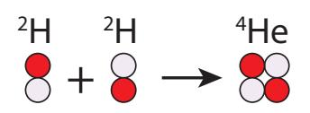

**Figure 15.22:** Fusion concept: helium from [deuterium.](#page-445-0)

responds to Δ푚 = 4.8 × 10−29 kg, or 퐸 = Δ푚푐2 = 4.2 × 10−12 J (26.7 [MeV\)](#page-451-2). We convert the Joules to [kcal](#page-450-1) by dividing by 4,184, and then divide by the input mass in grams (4.03 a.m.u. times 1.6605 × 10−24 g/a.m.u.) to get 153 kcal/g. Starting with two [deu](#page-445-0)[terium](#page-445-0) nuclei reduces energy yield a bit to to 137 kcal/g, and for deuterium[-tritium](#page-456-5) reactions it's down to 81 million kcal/g.

matter whether we specify Kelvin or Celsius, as the 273 degree difference is nothing compared to a billion degrees. The scales are therefore essentially identical here.

60: This is no accident: if the center were too cool, the sun would contract in the absence of radiation pressure until the center heated up from the compression and nuclear fusion ignited—just enough to hold off further contraction. It finds its own equilibrium right at the edge of fusion. In the case of the sun, all it takes is one out of every 1026 collisions to stick in order to keep the lights on.

61: If only the UCSD mascot were named after *this* triton. . .

tons to neutrons in the process

63: [Plasma](#page-453-4) is a hot ionized gas where electrons are stripped off the nuclei. The sun

walls of the chamber, despite its constituents zipping around at speeds around 1,000 km/s! This feat can be sort-of managed via magnetic fields bending the paths of the fast-moving charged particles into circles. But turbulence in the plasma plagues attempts to confine the D–T mixture at temperatures high enough to produce fusion yield.

#### **Box 15.6: Successful Fusion**

Note that besides stars as an example of successful fusion, we *have* managed to create artificial fusion in a net-energy-positive manner in the form of the **hydrogen bomb**. This is indeed a fusion device, but we could not call it *controlled* fusion. It actually takes a fission bomb (plutonium) right next to the D–T mixture in a hydrogen bomb to heat up the D–T enough to undergo fusion. It's neat (and awful) that it works and is demonstrated, but it's no way to run a power plant.

If a 45 million degree plasma could be confined in a stable fashion, the heat generated by the reactions64 64: . . . in the form of radioactive release could be used to make steam and run a traditional power plant—replacing the flame symbol in [Fig.](#page-109-0) [6.2](#page-109-0) (p. [90\)](#page-109-0) with something much fancier. The scheme, therefore, requires first heating a plasma to unbelievable temperatures in order for the plasma to self-generate enough *additional* heat through fusion that the game shifts to one of keeping the plasma *cool* enough to produce a steady rate of fusion without blowing itself out. In this scenario, the heat extracted from the cooling flow makes steam. It's the most elaborate65 65: Should we be proud if we succeed, or possible source of heat to boil water. It may be a bit like working hard to develop a light saber whose only use will be as a letter opener.

### **15.5.1 Fuel Abundance**

[Deuterium—](#page-445-0)an [isotope](#page-450-0) of hydrogen—is found in 0.0115% of hydrogen,66 66: See the [Chart of the Nuclides](#page-443-0) abundance information in [Figure](#page-261-1) [15.4.](#page-261-1)
which means that the occasional H2O molecule is actually HDO.67 Therefore sea water is chock-full of deuterium. The global 18 TW appetite
would need  $3 \times 10^{32}$  deuterium atoms per year for D–D or  $2 \times 10^{32}$  each
of deuterium and [tritium](#page-456-5) atoms per year for D–T. Running with this
latter number for the comparatively easier D–T reaction, we would
need to process  $9 \times 10^{35}$  water molecules each year to find the requisite
deuterium. This corresponds to 26 million tons of water, which is a cubic
volume about 300 m on a side. Yes, that's large, but the ocean is larger.
Also, it corresponds to a volume of 0.16 billion [barrels](#page-442-5) per year, which
is about 200 times smaller than our annual oil consumption. Thus, the
volume required should be not at all challenging.68 68: Ocean water is *far* easier to access than
The ocean volume is 60 billion times larger than our 300-m-sided cube, implying that we
have enough deuterium for 60 billion years. The sun will not live that
long, so let's say that we have sufficient deuterium on Earth.back to the plasma

embarrassed at the lengths we had to go to?

66: See the Chart of the Nuclides abun-
dance information in Figure 15.4.

67: . . . one  $^{1}H$ , one  $^{2}H$  and one oxygen

underground oil deposits, after all.

Tritium, however, is essentially nowhere to be found, as it has a half-life of 12.3 years. We can generate [tritium](#page-456-5) by adding a neutron to lithium and stimulating an α decay. So the question moves to how much lithium we have. [Proven reserves](#page-454-4) are at about 15 million tons, currently produced at about 30,000 tons per year.69 We would need 2,300 tons70 of lithium per year to meet our  $2 \times 10^{32}$  tritium atom target (for 18 TW). In the absence of competition71 for lithium resources, the associated [R/P ratio](#page-454-6) timescale is 6,500 years. Yes, that is a comfortably long time, but not eons. The thought is that this would buy time to solve the D–D challenge.# **15.5.2 Fusion Realities**

It is clear why people get excited by fusion. It seems like an unlimited supply that can last thousands if not billions of years at today's rate of energy demand. For some perspective, think about what else we know that lasts billions of years. We already have a giant fusion reactor parked 150 million kilometers away that requires no mining, servicing, or any attention whatsoever. In this sense, the sun is essentially as inexhaustible as fusion promises to be, but already working and free of charge. [Photovoltaic](#page-453-0) panels plus batteries work *today* and have already shown a possible path to eternal energy. The author built his own off-grid solar setup on a budget that's tiny compared to the fusion enterprise.

As for the fusion enterprise, an effort called ITER [\(Figure](#page-286-1) [15.23\)](#page-286-1) in southern France is an international effort currently constructing a [plasma](#page-453-4) confinement machine that aims to commence experimental [D–T fusion](#page-445-2) by the year 2035 via occasional 8-minute pulses of 0.5 GW thermal power. This machine is a stepping stone that is not designed to produce electricity. Estimates for construction cost range from \$22 billion to \$65 billion. By comparison, a nuclear fission plant costs \$6–9 billion to build. Admittedly, the first experimental facility is going to cost more, but it is hard to imagine fusion ever being a real steal, financially. Even if the fuel is free, *so what*? Solar is the same.

An effort in the U.S. called the nuclear ignition facility (NIF) is pursuing a different approach to fusion research: attempting to implode a tiny sphere of D–T mixture by blasting it with 192 converging laser beams, crushing it to enormous pressure exceeding that in a star's interior, leading to an explosive release of heat. The building, mostly taken up by gigantic lasers, is the size of three football fields and has so far cost something to the tune of \$10 billion. Again, this experimental facility is not provisioned to harness any net energy gain72 72: . . . the prospects for which are dubious to create electricity.

Let's say that by the year 2050, we will have mastered the art and can build a 1 GW electrical-output73 73: . . . thus ∼3 GW thermal, given typical fusion plant for \$15 billion. That's \$15 per [Watt](#page-457-5) of output, which we can compare to a present-day solar utility-scale installation cost of \$1 per peak Watt [\[89\]](#page-436-0). Applying typical [capacity factors](#page-443-3)74 puts fusion at twice what solar costs *already*, today. fusion?

69: Most lithium is used in batteries; the [R/P ratio](#page-454-6) in this case is 500 years.

70: . . . only 8% of current annual production

71: Otherwise, we're still looking at the 500 year [R/P ratio.](#page-454-6)

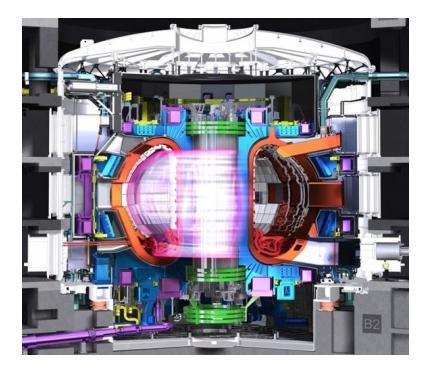

**Figure 15.23:** ITER [tokamak](#page-456-6) cut-away where the [plasma](#page-453-4) would be created. The white outer chamber is the size of a six-story building. From the [ITER Organization.](#page-374-4)

72: ...the prospects for which are dubious

[heat engine](#page-449-0) efficiency

74: . . . 10–20% for [PV](#page-454-7) and perhaps 90% for

Fusion is therefore a complicated and not particularly cheap way to generate electricity. Meanwhile, we are not running terribly short on renewable ways to produce electricity: solar; wind; hydroelectric; geothermal; tidal. Liquid fuels for transportation represent a greater and more pressing challenge, and fusion does not directly address this aspect any better than other options for electrical production. Fusion is by far the most complex power generation scheme we have ever attempted, evidenced by the 70 year effort to bring it to fruition that is still underway. How many physics PhDs will it take to keep a fusion plant running? Sometimes, we get stuck pursuing a flawed vision of the future, and have trouble reevaluating our options. Imagine being a middle-aged physicist or engineer in the 1950s. In your lifetime, you would have seen the advent of the car, airplane, radio, television, nuclear fission, among a blur of other technology advances. The next frontier was obviously fusion, so let's crack that one! At this point, 70 years later, maybe we should ask: why?

And let's point out that fusion is not without its waste challenges. It is still a radioactive environment, albeit not one that produces dangerous direct products ( He 4 is okay!). It *does* involve a radioactive fuel source [\(tritium\)](#page-456-5), and it *does* embed the containment vessel with high energy particles and neutrons that over time compromise the integrity of the vessel so that it must be discarded as a radioactively-charged hunk of metal.75 75: [Transmutation](#page-456-4) of the nuclei in the ma-By comparison, solar, wind, and other renewable sources based on the sun have no such problems. All of the nastiness is created in the sun, and stays in the sun.

terial will create radioactivity.

### **15.5.3 Pros and Cons of Fusion**

Collecting the advantages and disadvantages of fusion, we start with the positive attributes:

- I Fusion would enjoy an inexhaustible supply of deuterium, easily accessed, outlasting the sun;
- I The fusion reactor would serve as a heat source for tried-and-true steam-driven power plant technology.

And now the not-so-good aspects:

- I Stable [plasmas](#page-453-4) are exceedingly hard to generate at the requisite temperatures;
- I 70 years of effort have not yet borne fruit as an energy supply;
- I [Tritium](#page-456-5) is not available, and must be fabricated from a limited supply of lithium;
- I Fusion still contends with [radioactive](#page-454-3) fuel (tritium) and a containment vessel that is radioactively contaminated.

The smaller number of positive points is not in itself an indicator of imbalance, since the first point is huge. One elephant can balance dozens of kids on a playground see-saw.

# **15.6 Upshot on Nuclear**

Nuclear fission is a real thing: it can and does produce a significant fraction the world's power. A number of substantive challenges stand in the way of scaling up significantly.76  
76: See [\[105\]](#page-437-4) for a short article summarizing For conventional nuclear fission as it has been practiced thus far, the [proven reserves](#page-454-4) of uranium only last 90 years at today's rate of use, and less than 4 years if we tried to get all 18 TW from fission. Radioactive waste is an unsolved Pros and cons are listed separately for [PV](#page-454-7) problem that persists for hundreds to thousands of years. Breeder programs can extend the resource by large factors (into the 500 or 1,000 year range under an 18 TW nuclear-breeder effort). But [proliferation](#page-454-0) and bomb dangers become more pronounced—not to mention an even more pressing waste issue and greater accident rates given the profusion of operating reactors. It can be difficult to get excited about a nuclear future. It is very cool that we figured out how to do it. But just because we *can* do something does not mean it is a good idea to scale it up.Fusion is a harder prospect to pin down. At present, it is not on the table, having never been demonstrated in a viable reactor capable of producing commercial-scale electricity. But even if we did manage it, how could it compete economically, as complex as it is? Even if the fuel itself is free,[77](#page-10-1) it may turn out to be the most expensive form of electricity we could muster. Fusion is not without radioactivity concerns, and placed side-by-side, solar can look a lot better—intermittency being the crippling drawback, necessitating storage.Nuclear options cause us to grapple with the question: who are we? What is our identity? What are our aims, and where do we see ourselves going? Are we plotting a course for a Star Trek future, in which case it seems we have little choice but to adopt the highest-tech solutions. Or are we aiming for a more modest future more aligned with natural ecosystems on Earth? So even if we *can* do something, does it mean we're obligated to? Sometimes the costs may be too high.

# **15.7 Problems**

- 1. If an atom were scaled up to be comparable to the extent of a mid-sized campus, how large would the nucleus be, and what sort of familiar object would be similar?
- 2. In parallel to [Example](#page-259-2) [15.1.1,](#page-259-2) what are all the ways to label the radioactive isotope carbon-14?

the various challenges.

and [ST](#page-455-0) in [Section](#page-283-0) [15.4.8](#page-283-0) and [Section](#page-287-0) [15.5.3,](#page-287-0) respectively.

does not mean solar power is cheap

- 3. How many neutrons does the isotope Fe 56 contain?
- 4. Use the information in the boxes for C 12 and C 13 in [Figure](#page-261-1) [15.4](#page-261-1) to determine the weighted composite mass of a natural blend of carbon—showing work—and compare this to the number in the left-most box for carbon in the same figure.
- 5. In [Figure](#page-261-1) [15.4,](#page-261-1) what are the only mass numbers, 퐴, for which no stable nuclei exist?
- 6. What are the only three long-lived radioactive isotopes in the portion of the [Chart of the Nuclides](#page-443-0) appearing in [Figure](#page-261-1) [15.4,](#page-261-1) and which one lives the longest (how long)?
- 7. Cosmic rays impinging on our atmosphere generate radioactive C 14 from 14N nuclei.78 78: Nitrogen is the principal constituent in These C 14 atoms soon team up with oxygen to form CO2, so that plants absorbing CO2 from the air will have about *one in a trillion* of their carbon atoms in this form. Animals eating these plants79 79: . . . and/or eating the animals that eat will also have this fraction of carbon in their bodies, until they die and stop cycling carbon into their bodies. At this point, the fraction of carbon atoms in the form of C 14 in the body declines, with a [half life](#page-448-1) of 5,715 years. If you dig up a human skull, and discover that only one-eighth of the usual one-trillionth of carbon atoms are C 14 , how old do you deem the skull to be?
- 8. If a friend creates a nucleus whose half-life is 4 hours and gives it to you at noon, what is the probability that it will *not* have decayed by noon the following day?
- 9. In close analog to the half-lives of U 235 and U 238 , let's say two elements have half lives of 4.5 billion years and 750 million years.80 80: . . . a factor of 6 different If we start out having the same number of each (1:1 ratio), what will the ratio be after 4.5 billion years? Express as 푥:1, where 푥 is the larger of the two.
- 10. Control rods in nuclear reactors tend to contain B 10 , which has a high neutron absorption cross section.81 81: . . . as indicated by the orange lower-half What happens to this nucleus when it absorbs a neutron, and is the result stable? If not, track the decay chain until it lands on a stable nucleus.
- 11. If someone managed to create a B 14 nucleus, what would its fate be? Track the decay chain on [Figure](#page-261-1) [15.4—](#page-261-1)indicating the type of decay at each step—until it reaches stability, and indicate how long each step is likely to take.
- 12. A particular nuclide is found to have lost 3 neutrons and 1 proton after a decay chain. What combination of 훼 and 훽 decays could account for this result?
- 13. How would you qualitatively describe the overall sense from [Figure](#page-264-0) [15.8](#page-264-0) in terms of where82 on the chart one is likely to see 훼 elements (proton-rich or neutron-rich).

Earth's atmosphere.

these plants

The wording is long because without context, it's just math. The real learning is in the *application* of math to the world.

80: ... a factor of 6 different

of the corresponding box in [Figure](#page-261-1) [15.4](#page-261-1)

82: Region descriptions can include references to the mass range (e.g., low mass or high mass), above or below the stable

decay,  $\beta$ − decay,  $\beta$ + decay, and spontaneous fission?- 14. In a year, an average American uses about 3 × 1011 J of energy. How much mass does this translate to via 퐸 = 푚푐2 ? Rock has a density approximately 3 times that of water, translating to about 3 mg per cubic millimeter. So roughly how big would a chunk of rock material be to provide a year's worth of energy if converted to pure energy? Is it more like dust, a grain of sand, a pebble, a rock, a boulder, a hill, a mountain?
- 15. The world uses energy at a rate of 18 TW, amounting to almost 6 × 1020 J per year. What is the mass-equivalent83 83: of this amount of annual energy? What context can you provide for this amount of mass?
- 16. How much mass does a nuclear plant convert into energy if running uninterrupted for a year at 2.5 GW (thermal)?
- 17. A large boulder whose mass is 1,000 kg having a specific [heat](#page-448-5) [capacity](#page-448-5) of 1,000 J/kg/◦C is heated from 0◦C to a glowing 1,800◦C. How much more massive is it, assuming no atoms have been added or subtracted?
- 18. Replicate the computations in [Table](#page-267-1) [15.5](#page-267-1) for He 4 , paralleling the Fe 56 case in [Example](#page-267-0) [15.3.2.](#page-267-0) Along the way, report the Δ푚 in kg and the corresponding Δ퐸 in Joules, which are not in the table.
- 19. To illustrate the principle, let's say we start with a nucleus whose mass is 200.000 a.m.u. and inject 1,600 MeV of energy to completely dismantle the nucleus into its constituent parts. How much mass would the final collection of parts have?
	- a) the exact same: 200.000 a.m.u.
	- b) less than 200.000 a.m.u.
	- c) more than 200.000 a.m.u.
- 20. Using the setup from [Problem](#page-290-0) [19,](#page-290-0) compute the mass of the final configuration in a.m.u., after adding energy to disassemble the nucleus.
- 21. Referring to [Figure](#page-268-1) [15.10,](#page-268-1) what is the *total* binding energy (in MeV) of a nucleus whose mass number is 퐴 = 180?
- 22. Explain in some detail what happens if control rods are too effective at absorbing neutrons so that each fission event produces too few unabsorbed neutrons.
- 23. Which of the following is true about the fragments from a U 235 fission event?
	- a) any number of fragments (2 through 235) can be produced
	- b) a small number of fragments will emerge (2 to 5)
	- c) two nearly identical fragments will emerge

*i* This is how much mass would have to "disappear" each year to satisfy current human demand.

Hint: convert MeV to Joules, then kg, then a.m.u.

Hint: [Fig.15.10](#page-268-1) is binding energy *per nucleon*.

- d) two fragments of distinctly different size will emerge
- e) the fission is an alpha decay: a small piece having 퐴 = 4 is emitted
- 24. A particular fission of 235U + n (total 퐴 = 236) breaks up. One fragment has 푍 = 54 and 푁 = 86, making it Xe 140 . If no extra neutrons are produced in this event, what must the other fragment be, so all numbers add up? Refer to a periodic table (e.g., [Fig.](#page-394-0) [B.1;](#page-394-0) p. [375\)](#page-394-0) to learn which element has the corresponding 푍 value, and express the result in the notation X A .
- 25. Follow the same scenario as in [Problem](#page-291-0) [24,](#page-291-0) except this time *two* neutrons are left out of the final fragments. What is the smaller fragment this time, if the larger one is still Xe 140 ?
- 26. Provide three examples of probable fragment size pairs (mass numbers, 퐴) from the fission of 235U + n, making up your own random outcome while respecting the distribution of [Figure](#page-272-0) [15.15](#page-272-0) in determining 퐴 values. For the sake of this exercise, assume no extra neutrons escape the fragments.
- 27. Paralleling the graphical approach in [Example](#page-273-1) [15.4.3](#page-273-1) using [Figure](#page-268-1) [15.10,](#page-268-1) what total energy would you expect to be released in a fusion process going from two [deuterium](#page-445-0) ( 2H) nuclei to He 4 , in MeV?
- 28. Both nuclear and coal electric power plants are heat engines. What is the fundamental difference between these two, comparing [Fig.](#page-109-0) [6.2](#page-109-0) (p. [90\)](#page-109-0) to [Figure](#page-269-1) [15.12?](#page-269-1)
- 29. If a nuclear plant is built for \$10 billion and operates for 50 years under an operating cost of \$100 million per year, what is the cost to produce electricity, in \$[/kWh](#page-451-6) assuming that the plant delivers power at a steady rate of 1 GW for the whole time?
- 30. Since each nuclear plant delivers ∼1 GW of electrical power, at ∼40% thermodynamic efficiency this means a *thermal* generation rate of 2.5 GW. How many nuclear plants would we need to supply all 18 TW of our current energy demand? Since a typical lifetime is 50 years before decommissioning, how many days, on average then how many plants per day? would it be between new plants coming online (while old ones are retired) in a steady state?
- 31. Extending [Problem](#page-290-1) [16](#page-290-1) toward what *actually* happens, we know from [Table](#page-272-2) [15.7](#page-272-2) that the change in mass (which was close to 1 kg in [Prob.](#page-290-1) [16\)](#page-290-1) is only 0.08% of the U 235 mass.84 Furthermore, a fresh [fuel rod](#page-447-3) is only 5% U 235 —the rest being U 238 . So how much total uranium85 must be loaded into the reactor each year, if all the U 235 is used up?86
- 32. [Problem](#page-290-2) [15](#page-290-2) indicated that we need the mass-equivalent of fewer than 10 tons87 87: One ton is 1,000 kg. of material to support the world's annual energy

Hint: no need to identify elements; just settle on pairs of 퐴 values that add up correctly.

Hint: Don't forget to count both 2H.

Hint: express the plant power in kW and multiply by hours in 50 years to get kWh produced.

Hint: how many days will one plant live,

84: 0.185 out of 235 a.m.u.

85: Treat the two isotopes as having the same mass: the rod has 20 times more uranium than just the 235U part.

86: It's not, actually, so this answer is a lower limit on the actual mass that has to be loaded in. So much for the ∼1 kg answer from [Problem](#page-290-1) [16.](#page-290-1)

87: One ton is 1,000 kg.

needs. But given realities that only 0.08% of mass is converted to energy in nuclear reactions, that only 0.72% of natural uranium is fissile 235U, and that only half of the 235U is retrievable[88](#page-88-0) and "burned" in reactors, how many tons of uranium must be mined per year to support 18 TW via conventional fission, assuming for the sake of this problem that 5 tons of mass need to convert to energy via  $E = mc^2$  ? [88](#page-88-0): . . . given enrichment inefficiency- 33. Based on the abundance of U 235 in the earth's crust [\(Table](#page-277-1) [15.9\)](#page-277-1), how many kilograms of typical crust would need to be excavated and processed per year to provide the ∼ 0.005 kg of U 235 you need for your personal energy (as in [Example](#page-273-2) [15.4.2\)](#page-273-2)?
- 34. In crude terms, proven uranium reserves could go another 90 years at the present rate of use. But the world gets only about a tenth of its electricity from nuclear. What does this imply about the timescale for the uranium supply if the world got *all* of its electricity from conventional (non-breeding) nuclear fission?
- 35. Replicate the calculation and show the work that if we have 2×1021 J of proven uranium reserves under conventional fission, we would exhaust our supply in less than 4 years if using this source to support the entire 18 TW global energy appetite.
- 36. Use [Figure](#page-278-1) [15.18](#page-278-1) to reconstruct Hint: start by adding a neutron to Th 232 the breeder route from Th 232 to U 233 by describing the associated nuclei and decays (and half-lives) involved.
- 37. For spent nuclear fuel a few decades old, what isotopes are responsible for most of the radioactivity, according to [Figure](#page-280-0) [15.19?](#page-280-0)
- 38. Let's say that spent fuel rods are pulled out of the holding pool at the nuclear facility ten years after they came out of the core. Based on the total radioactive power from waste products (black line on [Figure](#page-280-0) [15.19\)](#page-280-0), *approximately* how long will you have to wait until the radioactivity level is down by another factor of 1,000 from where it is at the time of extraction?
- 39. Operating approximately 450 nuclear plants over about 60 years at a total thermal level of 1 TW, we have had two major radioactive releases into the environment. If we went completely down the nuclear road and get all 18 TW89 this way, what rate of accidents 89: . . . also a thermal measure might we expect, if the rate just scales with usage levels?
- 40. On balance, considering the benefits and downsides of conventional nuclear fission, where do you come down in terms of support for either terminating, continuing, or expanding our use of this technology? Should we pursue breeder reactors at a large scale? Please justify your conclusion based on the things you consider to be most important.

8: ... given enrichment inefficiency

*i* Of course mining does not work this way, instead seeking concentrations.

Hint: start by adding a neutron to  $^{232}Th$ 

89. ... also a thermal measure

- 41. The sun is a fusion power plant producing 3.8 × 1026 W of power. How many kilograms of mass does it lose in a year trough pure energy conversion? How does this compare to the mass of a spherical asteroid 50 km in diameter whose density is 2,000 kg/m3 ?
- 42. Based on the fractional mass loss associated with turning four hydrogen atoms into a helium atom, what fraction of the sun's mass would it lose over its lifetime by converting all its hydrogen into helium, under the simplifying assumption that it starts its life as 100% hydrogen?
- 43. The three fusion forms in [Eq.](#page-284-0) [15.3](#page-284-0) each have different energy outputs. Looking at [Figure](#page-268-1) [15.10,](#page-268-1) how would you *qualitatively* describe why the three reactions differ in this way?
- 44. Based on the calculation that 18 TW would require an annual cube of seawater 300 m on a side to provide enough [deuterium,](#page-445-0) what is your personal share as one of 8 billion people on earth, in liters? Could you lift this yourself? One cubic meter is 1,000 L.
- 45. What are your thoughts about fusion? Are you excited, skeptical, confused, all of the above? Please offer your thoughtful assessment of the role you imagine fusion playing in our future—your best guess.

Hint: the volume of a sphere is  $4\pi R^3/3$ .90 how would you *qualitatively* differ in this way? 90: Tritium is not labeled, but visible just below 3 MeV on the left side.