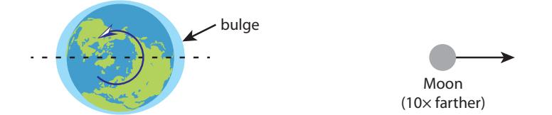
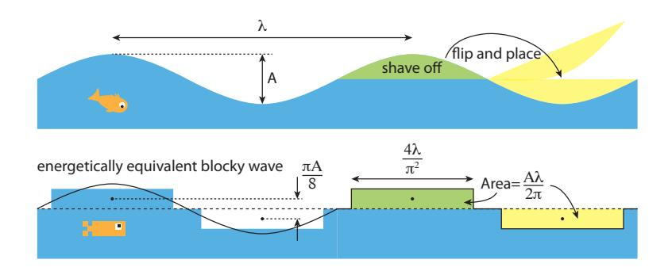

(chap:smallplayers)= 
# Small Players

This short chapter serves to round out the menu of renewable energy options. While all of the entries are viable, at various levels of demonstration and implementation, none of them can scale up to be an important contributor to global power at the relevant level of many terawatts. In this sense, we might call the remaining resources "cute." Because of this, items are kept brief—not warranting unjustified attention. Likewise for graphical adornment: the chapter is a little bare, in part because the subjects do not deserve much in the way of undue promotion.

Skipping this chapter will not sacrifice much in the way of knowledge vital to our future. It simply fills in the gaps and addresses some of the "but what about *insert-scheme*?" questions that may arise. The next chapter, [Chapter](#page-308-0) [17,](#page-308-0) highlights the pros and cons of the full range of alternative energy resources, so this installment largely exists to provide a basis for the conclusions of that more important capstone.

## **16.1 Geothermal Energy**

The interior of Earth is still hot from the initial collapse of mass in the formation of the planet. We can think of this as the thermal conversion of [gravitational potential energy](#page-448-0) as pieces fell into the gravitational field of the earth, converting first to [kinetic energy](#page-450-0) and then into [thermal energy](#page-456-0) (heat) after collision. But that's only half of the story. The other half is [radioactive decay](#page-454-0) of long-lived unstable elements within the earth [\[106\]](#page-437-0) [\[106\]](#page-437-0): Johnston (2011), *Radioactive decay* . Of the radioactive decay part, 40% is from uranium (238U), 40% is from thorium (232Th), and 20% is from potassium (40K). As was indicated in Table [10.2](#page-187-0) [\(p.168\),](#page-187-0) a total of 44 TW of [geothermal](#page-448-1) power flows through the earth's crust. Divided by total surface area, this amounts to less than

Lava seeping along east of Pu'u 'O'o crater in Hawaii as an evident display of geothermal energy. Photo Credit: Tom Murphy

*accounts for half of Earth's heat*

*© 2022 T. W. Murphy, Jr.; [Creative Commons Attribution-NonCommercial 4.0 International Lic.;](https://creativecommons.org/licenses/by-nc/4.0/) Freely available at: [https://escholarship.org/uc/energy\\_ambitions.](https://escholarship.org/uc/energy_ambitions)*

0.1 W/m2, making it less than one-two-thousandth of the solar input average.[1](#page-450-1) 1: Recall average [insolation](#page-450-1) is around 200 W/m2### **16.1.1 Sustainable Harvest**

Let's evaluate what it would take to tap into the steady 44 TW geothermal heat flow in order to provide some or all of today's 18 TW energy demand. In this way, we could be assured of steady flow for billion-year timescales, as the [half lives](#page-448-2) of the [radioactive](#page-454-1) elements measure in the billions of years and the residual heat of formation is still slowly leaking out after 4.5 billion years. On the face of it, 44 TW compared to 18 TW would suggest that geothermal has margin to spare.

In order to utilize geothermal energy for most of the things we do, we really need to turn the heat into a versatile form of energy like electricity. The only exception would be for heating water and air spaces. Otherwise, it is not hot enough to perform most industrial process demands, like melting metals. We know how to turn a temperature difference into electricity, via a [heat engine](#page-449-0) (Sec. [6.4; p.](#page-107-0) [88\)](#page-107-0). We saw that the theoretical efficiency of a heat engine is

$$
\varepsilon_{\text{max}} = \frac{T_{\text{h}} - T_{\text{c}}}{T_{\text{h}}} = \frac{\Delta T}{T_{\text{h}}},\tag{16.1}
$$

where the hot and cold thermal reservoirs are at temperatures 푇h and 푇c, and Δ푇 is the difference.

A typical temperature gradient in the earth's crust is 25°C per kilometer, meaning that the temperature rises by another 25°C for each kilometer of depth. A [heat engine](#page-449-0) constructed to operate between the surface (288 K average) and 1 km down (313 K) could expect a *maximum* thermodynamic efficiency of 8%. Now imagine an ambitious deployment across 100% of land (29% of the globe): 8% of 29% of the original 44 TW flow is down to a paltry 1 TW.2 2: 44 TW  $\times$  0.08  $\times$  0.29  $\approx$  1 TW. And that's if achieving the *theoretical maximum* efficiency limit3 and somehow accessing the *entire* flow of heat 1 km 3: Typically, we fall short by a factor of two. down through a network of pipes across *every* bit of land area on Earth. Can you imagine the scale of this effort? And for all that, it would fall well short of 1 TW, considering practical limitations. Don't hold your breath for this long-term-sustainable form of geothermal energy to provide an answer to our 18 TW appetite.4 4: In fact, the continental share of the steady### **Box 16.1: Deeper and Oceans, Too**

While the ambitious global-scale 1 km deep geothermal network was disappointing in its output, the mathematical solution is to "just"5 use the *entire* globe and dig deeper, allowing a larger thermal gradient and therefore higher efficiency, according to [Eq.](#page-295-1) 16.1. Allowing forW/m2 .Temperatures must be in Kelvin.

2:  $44 \text{ TW} \times 0.08 \times 0.29 \approx 1 \text{ TW}$ .

3: Typically, we fall short by a factor of two.

geothermal flow—29% of 44 TW—is only 13 TW and not enough to satisfy demand even at the impossible-to-realize efficiency of 100%.

5: Beware of the word "just."

engineering challenges that may limit us to half the theoretical efficiency, we would have to capture 36 TW of theoretical flow to end up at 18 TW. Now we need a theoretical efficiency of 82%,[6](#page-6-1) translating to  $T_h$  of 1,600 K, which would be about 50 km down: deeper than the earth's crust is thick.  
6: 36 out of 44For context, the deepest mine is less than 4 km deep, and the deepest drill hole is about 12 km.7 So outfitting 100% of Earth's surface including under the oceans—with a dense thermal collection grid 50 km down sounds like pure fantasy.

### **16.1.2 Geothermal Depletion**

The previous section was framed in the context of accessing the 44 TW steady geothermal flow, sustainable for billions of years—finding that we cannot expect to satisfy demand by that route. But when did we ever exhibit collective concern for long-term sustainable solutions? The human way is more about exploiting a resource fully, not worrying about consequences even decades down the line. In that sense, geothermal energy has more to offer—at least on paper.

A one-time extraction of [thermal energy](#page-456-0) under out feet—not worrying about replenishment—amounts to *mining* thermal energy, in much the same way that we mine copper, or fossil fuels. Using a rock density of 2,500 kg/m3 and a specific [heat capacity](#page-448-3) of 1,000 J/kg/◦C [\(Sec.](#page-104-0) [6.2;](#page-104-0) p. [85\)](#page-104-0), each cubic meter of rock has an extra 60 MJ of thermal energy for each kilometer deeper we go—based on a gradient of 25 ◦C/km, as before. Is that a lot? It's about the same as the energy in 2 L of gasoline. The [energy density](#page-446-0) works out to 0.006 [kcal/](#page-450-2)g, to put in familiar units (see [Table](#page-296-1) [16.1\)](#page-296-1).

So it's no screaming-good deal, but it's still energy, and the earth's crust has a heck of a lot more rock than it does oil. To appreciate the scale, the land area of the lower-48 states is approximately  $10^{13}$  m2. A 1-meterthick slice of earth under the U.S. at a depth of 1 km therefore contains 60 MJ/m3 times  $10^{13}$  m3, or  $6 \times 10^{20}$  J of energy. It's a big number, but recall that 1 qBtu is about  $10^{18}$  J, so we're talking about ∼600 qBtu. The U.S. uses about 100 qBtu per year of energy, but at an average efficiency of 35% in [heat engines](#page-449-0), so that we seek about 35 qBtu of *useful* energy. As we saw, the geothermal resource, at lower temperature, is less potent in terms of efficiency. If achieving half of the theoretical 8% efficiency for the 1 km  $\Delta T$  of 25 °C, a one-meter-thick slice would provide about 24 qBtu of useful work.8 Reaching the 35 qBtu goal would require a slice about 1.5 m thick, at 24 qBtu per meter.To summarize, we would need to *completely* remove all the heat from all the rock 1 km below our feet in a 1.5 m-thick layer every year. Once we cool the underground rock, it will take a long time for the surrounding

5: 36 out of 44

7: Drilling stopped because technical challenges prevented going deeper. The project goal was 15 km.

**Table 16.1:** [Energy densities](#page-446-0) of familiar energy substances. For hydroelectricity, a 50 m dam is assumed, and for geothermal, the depth is 1 km.

| Substance            | kcal/g |
|----------------------|--------|
| Gasoline             | 11     |
| Fat (food)           | 9      |
| Carbohydrates        | 4      |
| TNT explosive        | 1      |
| Li-ion battery       | 0.15   |
| Alkaline battery     | 0.11   |
| Lead-acid battery    | 0.03   |
| Geothermal (1 km)    | 0.006  |
| Hydroelectric (50 m) | 0.0001 |

8: . . . 4% efficiency times 600 qBtu thermal resource for one meter

heat to diffuse in, so we'd have to keep moving down, year after year. This would mean completely replacing the collection network (whatever comprises it—this is all fantasy) every few years. It's ludicrous to imagine we would endeavor to go to such extremes, plowing through the deep earth to remove every scrap of thermal energy in a massive never-ending effort.9 Such a colossal scheme makes oil drilling seem like child's play.

Granted, as one drills deeper, the thermal energy goes up *and* the efficiency increases as  $\Delta T$  climbs. The result is *quadratic*, in that the energy yield 3 km down is 9 times that at 1 km down.[10](#page-2-1) At the same time, drilling gets more challenging and at some point exceeds the current state of the art. By the time the temperature reaches 150 $^{\circ}$ C—which is thought of as a minimum viable temperature for traditional geothermal ventures—drilling technology runs into limitations.
[10](#page-2-1): ... because the hotter rock contains 3× more thermal energy *and* that energy can be converted to electricity 3× more efficiently#### **Box 16.2: There Will Be Hype**

As long as an idea is not outright impossible, the world is big enough and competitive enough that enterprising individuals will be able to generate interest and investment in ideas that seem viable and can be touted to have great promise. Whether that idea is truly capable of benefiting humanity as a "good" idea is not fully evaluated. Instead, if it can make money in the short term,11 then it may get a green light. 11: . . . or at least attract investment

So be wary of claims by people or companies whose financial interests lie in the perception of success and promise. Even media coverage that *should* be objective is often quantitatively sloppy,12 and has a 12: . . . lacking a staff physicist much easier time finding enthusiasts willing to devote time and quotes than non-enthusiast experts who are too busy pursuing their own projects to waste time poking holes in shoddy ideas.

### **16.1.3 Geothermal Reality**

Enough, then, about "pipe dreams" of massive geothermal exploitation on a planetary scale. Geothermal energy is not *all* fantasy, as some places are able to capture significant energy from this resource.

In a few locations, hot magma is brought near the surface, offering rare cracks of access to high temperatures. An electrical power plant, as depicted in [Fig.](#page-109-0) [6.2](#page-109-0) (p. [90\)](#page-109-0), does not care particularly where the thermal energy derives, as long as it's hot enough to make steam. The ideal site has:

- I magma near the surface—volcanic regions, for instance;
- I fractured rock above the magma in which water can flow;
- I water temperatures in excess of 180◦C (under pressure);
- I a [caprock](#page-443-0) above the fractured rock, able to trap pressurized steam.

9: It would not be surprising if the [EROEI](#page-447-0) is abysmally low or even a net energy drain.

more thermal energy *and* that energy can be converted to electricity 3× more efficiently

11: ... or at least attract investment

12: ...lacking a staff physicist

The most common scheme—labeled "hydrothermal"—is to drill two holes into the ground near each other, injecting water into one and collecting pressurized steam from the other. Fractures in the rock permit water and/or steam to flow between the two holes. Alternatively, but far less common, a fluid13 can be run through a closed loop that passes 13: . . . not necessarily water now through the hot medium. By either direct use of the steam in the hydrothermal case, or generating steam from the hot fluid in the closedloop case, the resulting steam can be used to run a [turbine](#page-457-0) and [generator](#page-448-4) in the usual way.

A newer form, called "binary" geothermal uses two fluids: water in the ground as in other schemes, but a second fluid having a much lower boiling point to make a steam analog at lower temperatures. This opens additional power generation possibilities at temperatures below 100◦C, but of course will suffer the inevitable efficiency hit when 푇h is lower, according to [Eq.](#page-295-1) [16.1.](#page-295-1)

Globally, roughly 10 GW of electricity is produced from geothermal energy [\[107\]](#page-437-1) (2018), *Renewable Energy Statistics 2018* , and an estimated additional 28 GW of direct heating is obtained from this source [\[108\]](#page-437-2) [\[108\]](#page-437-2): (2020), *Geothermal Heating* . Together, these account for 0.4% of the 18 TW global energy budget, after a [thermal equivalent](#page-456-1) adjustment.

| Country     | GW installed | GW produced | % elec. |
|-------------|--------------|-------------|---------|
| U.S.        | 3.5          | 1.9         | 0.4     |
| Philippines | 1.9          | 1.3         | 27      |
| Indonesia   | 1.5          | 1.2         | 4       |
| New Zealand | 1.0          | 0.85        | 15      |
| Mexico      | 1.0          | 0.7         | 3       |
| Italy       | 0.9          | 0.7         | 1.5     |
| Iceland     | 0.7          | 0.6         | 30      |
| World Total | 12.6         | 9.4         | 0.4     |

[Table](#page-298-0) [16.2](#page-298-0) lists the top 7 producers of geothermal electricity, capturing 72% of the global total. Note that many are on the Pacific Rim, sometimes called the "ring of fire" for its volcanic activity. Iceland gets 30% of its electricity14 14: And electricity is only about one third from geothermal sources. But in absolute terms, it is a small amount of energy. Considering that a single nuclear plant puts out about 1 GW, the countries in [Table](#page-298-0) [16.2](#page-298-0) have the equivalent of 1–2 nuclear plants in the form of geothermal (compare to Table [15.8; p.](#page-275-0) [256\)](#page-275-0).

The U.S. gets an average of 1.9 GW of electrical production15 from geother- 15: . . . ∼0.4% of total electricity mal sources [\[85\]](#page-436-0) [\[85\]](#page-436-0): U.S. Energy Inform. Admin. (2020), . 72% of this is produced in California—almost all at a site called The Geysers in the northern part of the state—accounting for ∼6% of the state's electricity. Another 22% of U.S. geothermal electricity is produced in in Nevada. The rest is in Utah, Hawaii, Oregon, Idaho, and New Mexico, in that order (7 states total).

Geothermal is just a small player. The fact that a country like Iceland can produce a large fraction of its electricity this way mostly tells us that Iceland is on a geological hot-spot and is not very populated. We should

13: ...not necessarily water now

[\[107\]](#page-437-1): Intern'l Renewable Energy Agency

**Table 16.2:** Global geothermal electricity production in 2016 [\[85,](#page-436-0) [107,](#page-437-1) [109\]](#page-437-3). Note that the percentage is the fraction of *electricity*, not total energy, contributed by geothermal. The [capacity factor](#page-443-1) tends to be relatively high for this non-intermittent resource (see [Problem](#page-307-0) [6\)](#page-307-0).

of Iceland's energy demand.

15: ... ~0.4% of total electricity

*Electric power monthly*

not expect geothermal to assume a large role in the energy landscape of tomorrow.

### **16.2 Tidal Capture**

Table [10.2](#page-187-0) [\(p.168\)](#page-187-0) indicates that the earth currently receives 3 TW of power in the form of tidal energy. Gravity from the moon (and the sun16 ) tug on the earth, pulling slightly harder on the nearest side, and less enthusiastically on the far side. This deforms the otherwise spherical Earth17 into a *prolate ellipsoid*, which is a fancy way to say oval—somewhat like an egg. The bulges that form on either side (near and far; see [Figure](#page-299-1) [16.1\)](#page-299-1) as a consequence are more pronounced in the ocean than the land, but both indeed deform.

The earth rotates "under" these bulges, since the bulges point along the Earth–Moon axis and take a month to make a complete revolution in space, while the earth rotates once per day. At a fixed position on Earth, then, the experience is two high tides and two low tides each day.18 As the tide comes in and flows out, friction between land and water results in energy dissipation, to the tune of 3 TW.19

The idea for capturing this natural flow of energy is to allow the tide to enter a bay or inlet—raising the water level by perhaps several meters then closing the exit, trapping the water behind a wall. At this point, the situation is very much like a hydroelectric dam (Sec. [11.2; p.175\)](#page-194-0), but at a much lower water height than is typical for hydroelectric dams. All the same, exiting water can be forced through [turbines](#page-457-0) turning [generators](#page-448-4) to create electricity. Draining through turbines over a 6-hour period allows the process to begin again at low tide, opening the gates to refill the inlet as the tide comes back in.

The amount of energy depends on the area of the captured body of water and the height of water trapped behind the wall. We use the familiar [gravitational potential energy:](#page-448-0)  $E = mgh$  to calculate the energy involved (Sec. [11.1; p. 173\)](#page-192-0). If the height of water trapped behind the wall at high tide is called  $h$ , the height of water behind the wall smoothly transitions from  $h \rightarrow 0$  as the water drains out, so that the *average* height of water behind the wall is  $h/2$ , and the gravitational potential energy available really looks like  $mgh/2$ . The mass is density ( $\rho = 1,000$  kg/m3) times volume, and volume is the area of the captured water surface,  $A$ , in square meters, times the initial water height,  $h$ . To get [power,](#page-453-0) we16: The tidal influence from the sun is subdominant, at 45% the strength of lunar tides, so for simplicity we will describe just lunar tides from here on.

17: Actually, an even larger (21 km) effect is the spinning motion of the earth flattening it into an *oblate ellipsoid*.

**Figure 16.1:** The moon (pictured closer here to fit on page) raises bulges on the near and far side of the earth, while the earth rotates underneath, causing two high tides and two low tides each day.

18: The sun also contributes, sometimes adding to the peaks and troughs (near new and full moon, when Earth, Moon, and Sun are arranged along a line), and sometimes moderating the tides by filing in the gaps a bit (at quarter moon phases).

19: An aggressive global-scale tidal capture enterprise could actually increase the total tidal energy budget, which would have the side effect of pushing the moon further away, slowly, as is described in [Sec.](#page-421-0) [D.4](#page-421-0) (p. [402\).](#page-421-0)

divide the energy available by the time over which we let out the water: nominally 6 hours.20 20: Six hours is a typical time between high Collecting it all, we have:

$$
P = \varepsilon \frac{\Delta E}{\Delta t} = \frac{\varepsilon m g \frac{h}{2}}{\Delta t} = \frac{\varepsilon \rho A g h^2}{2\Delta t},
$$
(16.2)

where *g* ≈ 10 m/s2 is the acceleration due to gravity and *ε* is the efficiency of converting gravitational energy into electrical energy.**Example 16.2.1** The Rance tidal capture station in France has a capture area of 퐴 = 22.5 km2 , and a height capacity of 8 m. If operating off of a 7 m high tide and draining for 6 hours, what is the expected power delivered at an efficiency of 90% (as is typical for hydroelectric power)?

Expressing  $A$  in square meters yields  $22.5 \times 10^6 \text{ m}^2$ . The time is 21,600 seconds, leading to a calculated value of 230 MW.Only two large tidal facilities operate in the world today: Rance in France [\(Example](#page-300-1) [16.2.1\)](#page-300-1) has a rated capacity of 240 MW, and produces an average of 57 MW. Thus the [capacity factor](#page-443-1) is about 24% due to the fact that it can only generate tidal power half the time21 21: It has to spend half the time letting and not all high tides are at the full design height. The ℎ 2 in [Eq.](#page-300-2) [16.2](#page-300-2) indicates particular sensitivity to height—due to the double-whammy that lower height means less trapped mass *and* lower pressure head.

The other facility is Sihwa Lake in South Korea, a 254 MW facility that came online in 2011. Much like Rance, and for the same reasons, its [capacity factor](#page-443-1) is 25%, averaging 63 MW. Its basin is 30 km2 and has similar operating height as the French installation. The Sihwa Lake facility cost \$560 million to build, making it \$9 per average Watt of delivered power. This puts it roughly in line with the cost of nuclear power (page [256\)](#page-275-0), and a little higher than utility-scale [PV,](#page-454-3) currently.

Two other large tidal stations in the 300–400 MW capacity range are in the works for the UK and Scotland. But it's not something that works well everywhere: best suited for areas that have large tidal swings and large inlets having narrow mouths that are easy to dam. It's a niche player now and always will be. After all, the 3 TW global budget for tidal energy suggests that it is not an energy jackpot.

# **16.3 Ocean Currents**

Steady currents throughout the volume of the ocean22 are estimated to total 5 TW (see Table [10.2; p. 168](#page-187-0)). This is not much more than total tidal dissipation on the planet, at 3 TW. Already, we don't hold out much hope for an energy bonanza. Wind in the atmosphere, by contrast, has 22: ... contrasted to the oscillating currents from tidestide and the next low tide.

water back in as the tide flows.

from tides

almost 200 times as much power. And we saw that getting even a few terawatts out of wind is a challenge, globally.

The physics is very similar to that of wind [\(Chapter 12\)](#page-203-0). [Kinetic energy](#page-450-0) from the motion of the water is transferred to rotational motion in a [turbine](#page-457-0) to turn a [generator](#page-448-4) to make electricity. Echoing Eq. [12.2 \(p.187\),](#page-206-0) we have
$$
P_{\text{current}} = \frac{1}{2} \varepsilon \rho_{\text{water}} \pi R^2 v^3. \tag{16.3}
$$

The efficiency,  $\varepsilon$  is limited by the same physics as for wind, so 50% is a reasonable maximum. Recall that  $\rho$ water = 1,000 kg/m3.

So we still have the quadratic dependence on rotor radius and the crucial cubic power of velocity. Ocean currents tend to be far slower than wind velocities, but the density of water is about 800 times the density of air, so that for the same rotor area, water moving at 1 m/s has similar power as air moving at 9 m/s.

One problem is that the giant land-based wind turbines whose rotors move at high speeds relative to the wind would not be practical in water, so individual units would more likely be on the ten-meter scale and not a 100-meter scale. Individual rotors would therefore likely generate a few hundred kilowatts apiece, requiring thousands of rotors to make up a typical 1 GW power plant output.

**Example 16.3.1** A 10 m diameter rotor sits in a brisk 2 m/s current. At an efficiency of 50% (similar to wind), how much power would the turbine deliver?All the pieces23 fall right into [Eq.](#page-301-1) [16.3](#page-301-1) to yield about 160 kW.  
23: Just be careful about diameter vs. ra-Among the advantages, marine currents are very steady and dependable, so that [capacity factors](#page-443-1) would be high. This is in contrast to solar, wind, and even hydroelectric and tidal resources.

However, marine environments are not kind to underwater structures,24 24: Look at pier pilings and sunken ships making it hard to imagine the headache it would be to maintain the to get an idea. moving parts in good condition—all in a difficult operating environment for human workers. Additionally, marine life might not be so happy to get whacked by a rotor blade.

In the end, we should not expect this sector to contribute substantively to global energy, given the small scale of total energy available and the practical difficulties associated with harnessing any sizeable piece of it.

# **16.4 Wave Energy**

Waves present an interesting case to study, being composed of a continuous interplay between potential and kinetic energies—water particles

*© 2022 T. W. Murphy, Jr.; [Creative Commons Attribution-NonCommercial 4.0 International Lic.;](https://creativecommons.org/licenses/by-nc/4.0/) Freely available at: [https://escholarship.org/uc/energy\\_ambitions.](https://escholarship.org/uc/energy_ambitions)*

dius.

24: Look at pier pilings and sunken ships
to get an idea.

executing circular paths as they gain and lose gravitational potential energy. Meanwhile, the energy in a packet of waves travels efficiently onward, until reaching a barrier like a shoreline, where they break in a display of kinetic energy. It is hard to stare at a coastline being pounded by surf without admiring the power of nature. What if we harnessed that power?

As a means of estimation, let's imagine sinusoidal25 waves 1 m in 25: . . . shaped like a sine wave amplitude (peak-to-trough) arriving every 6 seconds, traveling at about 3 m/s. Crests must then be 18 m apart, since the distance between crests is their rate (3 m/s) times time (6 seconds). We call this the [wavelength,](#page-457-1) symbolized by 휆 (Greek lambda). See [Figure](#page-302-0) [16.2](#page-302-0) for the layout.

In order to figure out the energy involved, we need the mass of water raised Author's note: we'll be going through a and a height to which it is raised. Notice that in [Figure](#page-302-0) [16.2,](#page-302-0) the potential energy in the wave can be extracted by making the water flat again, which is equivalent to taking all the water from the crest and putting it into the trough. We just need to know how much water we're moving, and through what height. [Figure](#page-302-0) [16.2](#page-302-0) has done the fancy math already and redrawn the wave as rectangular chunks that have equivalent area as the sinusoidal crest and trough and also the same average (midpoint) height relative to the average surface height (dashed line). From this, we learn that the wave crest has area 퐴휆/2휋 and the height of the displacement is 휋퐴/8, where 퐴 is the wave amplitude from the top of the crest to the bottom of the trough.

To assess potential energy as  $mgh$ , we need three pieces. We already know  $g \approx 10 \text{ m/s}^2$ , and we now know that  $h = \pi A/8$ . The mass is a density,  $\rho$ , times a volume. We already have the area of the crest cross section as  $A\lambda/2\pi$ . To get a volume, we need a length *along* the wave, which we are free to make up as a variable we'll call  $l$ . The mass,  $m$ , of our block of water is then  $\rho A \lambda l / 2\pi$ . Putting this together, the [gravitational](#page-448-0) [potential energy](#page-448-0) (GPE) associated with putting the water back to a flat state along a length,  $l$ , of one wave is
$$
E_{\text{GPE}} = mgh = \frac{\rho A \lambda \ell}{2\pi} g - \frac{\pi A}{8} = \frac{\rho \lambda \ell g A^{2}}{16}.
$$
 (16.4)

25: ... shaped like a sine wave

**Figure 16.2:** Sinusoidal waves have amplitude 퐴, and wavelength 휆. In terms of harvesting the [gravitational potential energy,](#page-448-0) we can think of it as lopping off the crest and flipping it over onto the trough to level the water surface. In doing so, we move some mass, 푚, down a height ℎ to get 푚 푔 ℎ of energy. The block-equivalent is shown below, where the area and average height of the sinusoidal trough/crest has been faithfully captured by rectangles of height ∼0.39퐴 and length ∼0.41휆. From these, it is possible to figure out the potential energy associated with the wave.

bit of a derivation here—not because wave power is particularly important, but because physicists sometimes can't help it. Feel free to skip past all the equations, as this is meant as a sort of entertainment. What can I say: the introduction had a warning about skipping the whole chapter, yet here you are.

*© 2022 T. W. Murphy, Jr.; [Creative Commons Attribution-NonCommercial 4.0 International Lic.;](https://creativecommons.org/licenses/by-nc/4.0/) Freely available at: [https://escholarship.org/uc/energy\\_ambitions.](https://escholarship.org/uc/energy_ambitions)*

It's not an equation to remember, just a way to keep track of the physics as we build toward a final/useful result. Next, we want to understand the power delivered as the waves come and come. We get a new one every  $\Delta t = 6$  s. And we also reasoned before, in slightly different form, that  $\Delta t = \lambda / v$ , where  $v$  is the velocity of the wave: 3 m/s in our example. The power looks like:
$$
P_{\rm GPE} = \frac{E_{\rm GPE}}{\Delta t} = \frac{\rho \lambda \ell g A^2}{16 \Delta t} = \frac{\rho \ell g A^2 v}{16}.
$$
 (16.5)

This is how much power the potential energy part of waves contributes as the waves pile onto the shore. But waves also have [kinetic energy.](#page-450-0) It turns out that kinetic energy and potential energy are balanced in a wave—which is perpetually sloshing back and forth between potential and kinetic forms, much as happens in the motion of a pendulum. So the total power is just double 푃GPE, or

$$
P_{\text{tot}} = \frac{\rho \ell g A^2 v}{8}.
$$

(16.6)

It is a little awkward to have to specify the length of the wave, but we needed it to make sense of the mass involved. At this point, let's switch to expressing the *power per unit length* of the wave, or  $P/l$ .
$$
\frac{P_{\text{tot}}}{\ell} = \frac{\rho g A^2 v}{8}.
$$

(16.7)

Notice that this expression does not actually depend on the wavelength, in the end. The only measures of the wave that enter are the amplitude and velocity.26

For our example of 1 m amplitude and 3 m/s velocity, we compute a power per unit length of 3,750 W/m. We will use this 3,750 W/m figure from Okay, this is a new unit, and it looks vaguely encouraging. Blow dryers, toaster ovens, space heaters, or similar power-hungry appliances consume about 1,800 W of power when running full blast, so 3,750 W/m is roughly equivalent to having *two* such appliances plugged in and running for every meter of length along the wave, or coastline. It seems like a bonanza: Our collective hair will be dry in no time! Take a moment to picture a beach cluttered with a power-hog appliance plugged in every 0.5 m all down the beach, all running at full power. That's what the waves can support, and it seems pretty impressive.

But what we care about, in the end, is how much *total* power the waves can deliver: how many terawatts? So we need to multiply the wave 푃/ℓ value by a length along the wave, or a shoreline length.

**Example 16.4.1** How much wave power arrives on the U.S. Pacific coast if the whole coastline is experiencing 1 m amplitude waves at a

*© 2022 T. W. Murphy, Jr.; [Creative Commons Attribution-NonCommercial 4.0 International Lic.;](https://creativecommons.org/licenses/by-nc/4.0/) Freely available at: [https://escholarship.org/uc/energy\\_ambitions.](https://escholarship.org/uc/energy_ambitions)*

26: The velocity of near-shore waves is set only by the depth,  $d$ , of the water ( $v = \sqrt{gd}$ ).here on for our rough analysis, but it should be borne in mind that larger wave amplitude has a quadratic effect on power, and waves are not all 1 m peak-to-trough!

#### wave speed of 3 m/s?

The foregoing text already worked out that  $P/l$  for these wave parameters is 3,750 W/m. Now we just need to multiply by a coastline length. The Pacific coast of the U.S. is approximately 2,000 km long. Multiplying 3,750 W/m by 2,000,000 m yields 7.5 GW.Getting 7.5 GW on the Pacific coast, and maybe a similar amount on the Atlantic coast for a total of 15 GW is nothing to sneeze at. But consider that the U.S. electricity demand is about 450 GW, and various alternatives already top the upper limit of wave potential, as shown in [Table](#page-304-0) [16.3.](#page-304-0) 27 Also, to get 15 GW from waves would require extracting *all* the wave energy from the U.S. coasts. Sorry surfers. Sorry marine life who depend on the waves for stirring nutrients and other functions a physicist can only guess. The point is that when a *fully developed* wave energy resource only provides a few percent of demand, while a promising thing like solar is already roughly matching it and has ample room to grow, we can be pretty confident that wave power will not become an important player.

But let's make a quick estimate of global potential to compare to the 18 TW demand. The question becomes one of how much coastline28 28: Keep in mind that many coastlines are receives wave energy.

We can play a crude trick by recognizing that two big clumps of connected land occupy the eastern and western hemispheres, each having an east coast and a west coast, running roughly pole to pole. So the exposed coastlines roughly ring the globe twice. Our familiar unit of length, the meter, was actually chosen to yield approximately 10,000 km from equator to pole, so it takes 40,000 km to circle the earth once, and we therefore estimate 80,000 km of wave-receiving coastline. Multiplying 3.75 kW/m by 80,000 km yields 0.3 TW, or less than 2% of global demand, if *fully* developed.3,750 W/m seemed so promising at first, especially compared to [insola](#page-450-1)[tion](#page-450-1) numbers we saw in [Chapter](#page-216-0) [13](#page-216-0) that tend to be around 200 W/m2 . But a huge difference here is that wave density is a *linear* measure (Watts per *meter* of coastline) versus an *areal* measure in the case of insolation (Watts per *square* meter of land). A country has *far* more square meters than linear meters. So wave power, even if fully developed around all the world's coastlines, could not amount to very much, and is therefore placed in the "boutique" category, along with the other occupants of this chapter.

We have not even mentioned the technologies that can convert wave power to electricity—because what's the point? Suffice it to say that the same relative motion of magnets past coils of wire that create electrical energy in a [generator](#page-448-4) can work in applications that do not spin all the way around, as is usually the case. A back-and-forth motion like one cylinder inside another, or a joint bending back and forth can be configured to generate electrical power as well.

**Table 16.3:** Alternative electricity scales in the U.S.

| Resource  | GW average |
|-----------|------------|
| Solar     | 11         |
| Wind      | 31         |
| Hydro     | 33         |
| Nuclear   | 92         |
| All Elec. | 450        |

27: Note that wind and solar are growing year by year, so their ultimate numbers will be significantly higher, still.

protected from waves by their orientation or lack of exposure to long stretches of open water.

Work this out for yourself, maybe by thinking of something small like a house first, to understand why.

# **16.5 Hydrogen**

Combustion of hydrogen gas produces energy, and indeed is sometimes used as rocket fuel and in some demonstration vehicles. It can also be combined with oxygen in a fuel cell (not combustion) to generate electricity. Twenty years ago, references to a *hydrogen economy* replacing fossil fuels were common. So why has it been left out of this book, shoved unceremoniously into the last part of a chapter on miscellaneous small players? One key reason: hydrogen **is not a source** of energy. Pockets of hydrogen gas are not found underground.29 29: It is too reactive to survive on its own, in-

Hydrogen can be produced from water given enough energy input, typically via *electrolysis*, which splits H2O into hydrogen and oxygen. Electrolysis efficiency is typically 65–80% in terms of capturing input energy in the form of stored hydrogen. So hydrogen should be thought of as energy **storage**—like a chemical battery—rather than as an energy *source*. Combustion of hydrogen to drive a car, for instance, would suffer the usual [heat engine](#page-449-0) inefficiency of  $\sim$ 25%. Combined with electrolysis inefficiency, total efficiency is down to 15–20%. A standard battery does far better in round-trip30 storage efficiency: 60–90%. Fuel cells are far more efficient than combustion—around 65%. Combined with the electrolysis step, the overall efficiency is still well short of battery storage, at around 50% overall.Hydrogen in gaseous form is bulky and hard to package—especially in mobile applications like cars. The alternative to gaseous storage is as a cryogenic liquid, adding other complications. Hydrogen is more dangerous than gasoline as an explosion hazard. Fuel cells are not particularly robust and have difficulty in cold weather. On balance, hydrogen is unlikely to come roaring onto the scene as a fossil fuel replacement. An article [\[110\]](#page-437-4) summarizes the pros and cons well. [\[110\]](#page-437-4): Volkswagen (2019), *Hydrogen or*# **16.6 Upshot on Small Players**

The topics discussed in this chapter are presented more out of duty to completeness than as set of hopeful candidates for the energy of tomorrow. The first four are physically viable *sources* of real energy. Geothermal and tidal (to a lesser extent) contribute to today's energy mix, and new development is underway to expand both.

Geothermal energy is only practical in a small number of places that provide proximate access to high-temperature magma. Plans to extract geothermal energy from "normal" locations have not yet materialized, and the challenges are substantial. We should not expect geothermal energy to contribute at the terawatt scale, in practice.

Tidal energy, like geothermal, is very location-dependent—requiring large inlets with large tidal amplitude that can be closed off easily. But stead bound in H2O and CH4, for instance.

ergy cycle

*battery? A clear case, until further notice*

some locations *are* well-suited to supplement local power generation from this resource. The possibilities for terawatt-scale extraction are essentially non-existent, so tidal will remain a small player.

Ocean currents and wave power are sometimes explored in small demonstration projects, but never yet at scales that add significantly to the total energy mix. Terawatt-scale implementation is not to be expected.

Hydrogen is not a source of energy, but a possible means of energy storage. Various challenges make it less than exciting as a fuel of the future.

As much as anything, this chapter may go to show that physics can be used to explore all sorts of ideas, operating within a finite set of rules and options. Humans have had a very long time to explore the world and identify possible sources of energy.31 31: . . . which has been understood to be a The options on the table are now well known, and any new ideas can be assessed quantitatively usually only to show that the resource is small compared to present-day demand.

### **16.7 Problems**

- 1. A typical college campus is probably about one square kilometer in area. How much power out of Earth's 44 TW geothermal budget passes through the campus area, assuming uniform distribution across the 5.1 × 108 square kilometers of earth's surface? How does this compare to a typical college electrical demand of about 20 MW?
- 2. If it were possible to achieve 60% of the *theoretical* maximum heat engine efficiency for a geothermal plant, how deep would it have to drill to access high enough temperatures to match the 35% efficiency of fossil fuel power plants if the thermal gradient is 25 ◦C/km? Have we drilled this far before?
- 3. At 4 km down, we expect the Δ푇 to be about 100◦C, and each Hint: breathe. Realized efficiency; amount cubic meter of rock would contain about 250 MJ of thermal energy. If 50% of the maximum theoretical efficiency were achieved from an ambient environment at 288 K, how much rock thickness would have to be depleted in a year to satisfy a 1 km2 campus whose output electricity demand is 20 MW?
- 4. Your friend just visited a geothermal power plant, and is excited by the facts that it is environmentally clean, not intermittent like solar or wind, can last ages, totals more than twice our 18 TW budget, and it really works—seen with their very own eyes. What are the key points you might offer to temper their unvarnished enthusiasm?

pressing concern for at least half-a-century

Hint: using 푇c = 288 K, solve for 푇h at the target theoretical maximum efficiency, then figure out Δ푇.

of *thermal* power needed; thermal energy in a year; how many cubic meters; how thick for the campus area?

- 5. What are your thoughts on whether we should "mine" geothermal heat in a way that could theoretically last hundreds or thousands of years, but not tens of thousands of years before depleting the resource? Such activity would not be strictly sustainable in the long haul, but could seem abundant for many generations. Should we care about this? Where do you land?
- 6. Work out the [capacity factors](#page-443-1) of geothermal installations for various countries and the world as a whole from the data in [Table](#page-298-0) [16.2.](#page-298-0)
- 7. The average global production, in GW, for hydroelectricity, wind, solar, and nuclear are 477, 125, 67, and 393, respectively (Tables [11.2,](#page-199-0) [12.2,](#page-210-0) [13.3,](#page-236-0) and [15.8\)](#page-275-0). Add geothermal production from this chapter to the list and express each of the five as percentages32 and draw 32: . . . so that the five add to 100% an approximate pie chart to help put these alternative electricity resources in context.
- 8. The Sihwa tidal power plant has a reservoir area of 30 km2 and is rated to generate 254 MW of electrical output. If generation efficiency is 90%, what initial water height does the power rating correspond to, assuming a 6 hour discharge time?
- 9. On the basis of fluid power scaling as the cube of velocity, show the supporting math for the claim in the text that a water current at 1 m/s delivers the equivalent power (per rotor area) as a wind speed of about 9 m/s.
- 10. If placed in a steady current of 1 m/s, and at a generation efficiency of 40%, how large would an ocean current rotor be (diameter) to satisfy the 10,000 W demand of the average American? Put this scale in the context of some familiar object or space.
- 11. The running example for waves in the text delivers 3,750 W/m of energy along a coastline. It sounds like a lot. But if we put the 40 million residents of California along its 1350 km coastline, how many meters does each person have, and how much power from waves?
- 12. Let's imagine waves hitting the entire 2,000 km Pacific coastline of the U.S. that are different from those evaluated in the text. This time, the waves have 50 m wavelength, arriving every 10 seconds, and 2 m crest-to-trough amplitude. How much power does the coast receive under these more active conditions?

32: ... so that the five add to 100%