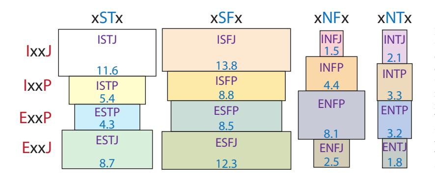
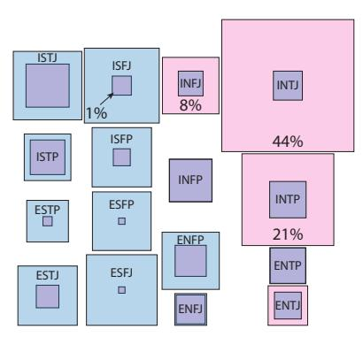
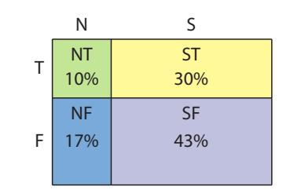
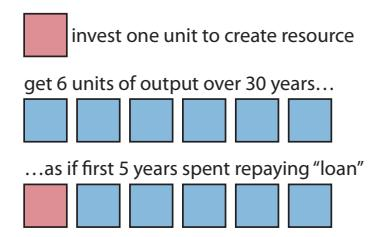

(chap:humanfactors)= 
# Human Factors

Energy has occupied center-stage in this book because it is the physical currency of activity. Fossil fuel availability permitted the Industrial Revolution and all that came with it. Human civilization has never before faced the prospect of such a crucial global resource either disappearing or being abandoned due to other ills (e.g., climate change).

Despite the mixed suitabilities of alternative energy sources presented in [Chapter](#page-308-0) [17,](#page-308-0) *some* physically viable avenues *are* open to us. In other words, physics itself does not preclude development of an energy landscape consisting primarily of solar, wind, and hydroelectric power, plus a few small contributions from a variety of other sources. Life may be different; less air travel or transportation in general, as one possibility. The enormous solar potential combined with decent storage technologies could *conceivably* maintain our 18 TW appetite without fossil fuels. Or we could scale back and not expect to live in such a profligate manner, viewing our current ways and expectations in the broader human experience as anomalous, temporary, and not important to preserve.

In any case, the barriers are not completely due to physical constraints—though we must heed limits where they exist. A practical concern is the expense of a non-fossil energy infrastructure: both in energy and financial terms. It is possible that the prosperity required to afford such a dream is physically unavailable.1 Another limitation involves people and how they work collectively, which is the focus of this chapter.## **18.1 Personality**

Discussion of personality may seem out of place in a physics-based textbook. But how we react to a looming crisis—both individually

1: If it were easy to conjure wealth, energy, and material goods, why would any person or country be poor?

Easter Island stands as a testament to humans' ability to do really dumb things, like cutting every tree on the island. Who cut down the last one? Photo by [Sophie Hurel.](#page-374-0)

or collectively—becomes a central question. Physics and nature are indifferent to the choices we make, and whether or not these choices serve our long-term interests. Success or failure therefore depends more on our attitudes and reactions to physical reality than it does on physics itself. While this section addresses how personality preferences might influence human reaction to crisis, it is by no means the only determining factor. Education, socio-economic status, financial interests, and many other attributes can play a role. Yet underneath it all, we are humans, and possess various traits that influence our reactions.

A common fallacy is that a collection of people, possessing access to the same set of facts,2 will respond similarly. Having only occupied one person's head, each of us cannot easily comprehend the reactions another might have to a situation. A variety of metrics have been devised to characterize different personalities and preferences, which play a role in shaping reactions. The Big–5 and Myers–Briggs are among the most well known. The former provides a scale for each of five traits:

- 1. Openness: creative and curious vs. careful and regimented
- 2. Conscientiousness: degree of organization and efficiency
- 3. Extraversion: socially energetic vs. preference for quiet or alone
- 4. Agreeableness: engaging and sympathetic vs. aloof or cranky
- 5. Neuroticism: easily rattled vs. confident and stable

The Myers–Briggs scheme3 has four categories that are usually represented as binary (either/or) labels, but in truth also exist on a continuum as do the Big–5 traits. Each category in Myers–Briggs acquires a one-letter label, in the end generating 16 possibilities.4 The categories are:- 1. I/E: Introvert vs. Extravert: are parties draining or energizing?
- 2. N/S: iNtuiting vs. Sensing: preference for abstract vs. concrete direct-sensory information
- 3. T/F: Thinking vs. Feeling: preference for intellectual/logical or emotional reasoning
- 4. J/P: Judging5 vs. Perceiving: decisiveness vs. keeping options 5: . . . not meaning judgmental open

If you have never taken a Myers-Briggs type test, the following three citations include links to online tests [\[114](#page-438-0)[–116\]](#page-438-1). These sites, and many others, offer descriptions of the types. For instance, here is a link6 description of the [INTJ](http://www.humanmetrics.com/personality/intj) type from [\[114\]](#page-438-0). Other types are linked from that page.

Many scientists find themselves in the INTX camps.7 Technically speaking, the last category (J/P) reflects whether a person relies more heavily on the N/S axis (if P) or the T/F axis (if J). In the case of INTP, abstraction/theory is valued over logic, and the reverse for INTJ. [Figure](#page-325-0) [18.1](#page-325-0) provides an indication of the frequency of each type.8 8: Keep in mind that real people can blendA [survey of visitors](https://dothemath.ucsd.edu/2015/04/programmed-to-ignore/) to the author's [Do the Math](https://dothemath.ucsd.edu/) website, which presents a quantitative look at energy and resource use much in the same spirit as 2: . . . itself a perplexing challenge in an ecosystem of polarized information flow

3: Myers–Briggs often triggers a reaction among knowledgeable individuals that it is an invalid, or debunked personality measure. If you are one of those, please reserve judgment until seeing how it is framed, and accompanying data.

4: . . . ignoring the inconclusive "X" label that can take the place of any letter when someone is not strongly to one side or the other in a category

5: ... not meaning judgmental

to a 6: . . . can also access from citation link

7: Experimentalists are more likely to be J and theorists are more likely to be P.

attributes and do not always fall cleanly into a given "box," so the 16 tidy categories is somewhat artificial.

this text, found that a staggering 44% of about 1,000 survey respondents shared the *same* INTJ type as the author, despite INTJs constituting only about 2% of the population. The over-representation of INTJ is thus about a factor of 20, and beyond question a statistically significant result (see [Figure](#page-325-1) [18.2\)](#page-325-1). The adjacent INTP cohort accounted for an additional 21% of visitors, despite being about 3% of the population. Thus about two-thirds of the site visitors represented 5% of the population for more than a factor-of-ten anomaly. While the Myers–Briggs scheme is not free of criticism (see [Box](#page-325-2) [18.1\)](#page-325-2), the result from *Do the Math* is pretty convincing that the Myers–Briggs scheme is measuring *something* relevant. Had the site asked for astrological sign, we can be pretty sure that representation would have been essentially uniform: no statistical anomalies. Myers–Briggs is evidently telling us *something*.

#### **Box 18.1: Criticism of Myers–Briggs**

Much of the criticism of the Myers–Briggs personality type indicator owes to the binary nature of each result, unlike the Big–5 percentage for each category. The argument is that people are more complex than this, and do not fall into 16 distinct and tidy categories. But any Myers–Briggs test will indicate where you fall on the spectrum from the hard extremes—based on the number of answers in the survey toward each direction. Some people fall in the middle of a category and get an X designation. 16 rigid types is illusory and unnecessary.

It is easy enough to accept this valid criticism yet still value the fact that people *do* spread out in their preferences. Also, some of the dimensions map onto the more widely-embraced Big 5 scheme. What if objection to the Myers–Briggs frame-The most important aspect of personality that bears on our energy/resource challenges, and a key reason for covering the topic at all in this book, is that the Myers–Briggs "S" types constitute 73% of the population, yet are most resistant to the argument that unprecedented disruptive changes are on the horizon. S-types place more value on direct sensory input than on abstraction. Things directly experienced—seen with their own eyes, heard by their own ears, personally touched, smelled or tasted—carry much greater weight than "theory." Presented with

**Figure 18.1:** Frequency of Myers–Briggs types from one collection of data, as percentages [\[117\]](#page-438-2). Areas are proportioned accordingly. Don't take the numbers literally: they are not as precisely determined as decimals indicate, but visually at least this representation gives a decent sense for distribution. Note how significant it is when a two-thirds majority of interest-selected individuals piles into the small INTJ and INTP boxes at upper right, as described in the text.

**Figure 18.2:** Stunning Myers–Briggs personality disparity between [Do the Math](https://dothemath.ucsd.edu/) readership and the general population. Areas of blue boxes represent frequency of types in the general population, as a variant of [Figure](#page-325-0) [18.1.](#page-325-0) Pink areas reflect the readership of Do the Math, and overlaps appear purple. Visible pink means over-representation on the site, and visible blue indicates underrepresentation. 73% of the readership occupies the top right corner of the personality types, even though these three boxes only capture 7% of the population. A result this extreme, involving over 1,000 respondents, is absurdly far from random. Percentages are shown in the three most overwhelmingly over-represented boxes, plus a 1% box for reference.

work correlated strongly withMyers–Briggs type?

warnings about climate change, a hard-over S-type might hold up a snowball (as Senator Inhofe famously did in front of Congress in 2015) to demonstrate—in their mind—how preposterous this global warming talk is. When warned about potential hardships following fossil fuel availability, an S-type may look out the metaphorical window and sense that everything seems to be fine. [\[118\]](#page-438-3): Weiler et al. (2012), "Personality type differences bet. Ph.D. climate researchers and the general public: implications for effective communication"differences bet. Ph.D. climate researchers and the general public: implications for effective communication"

#### **Box 18.2: Scientists Have a Type**

Scientists tend to be NT types, combining a preference for abstraction and models with a favoring of logical thought. Note that not all scientists are alike; it is good to have diversity, so it is possible to find any personality type within the science community. But the NT types will be perhaps more attracted to scientific pursuits as a good match to their personality preferences. The NT combination is the most rare, comprising 10% of the population (see [Figure](#page-326-1) [18.3\)](#page-326-1). Meanwhile, SF—the diametric opposite of NT—is over four times as prevalent.

When it comes to forming rational plans for future unseen challenges, NT types are well suited to the task. Ironically, if N–type predictions of future threats were faithfully heeded and mitigated, the threats would be averted and their failure to materialize would make the N–types look like terrible predictors to the S–type crowd! Failure by success.9 9: This irony can also plague successful

#### **18.1.1 Consequences and Coping**

The S-type asymmetry[10](#page-n-0) in human populations may confer an overall adaptive advantage. In stable times, recent history and apparent conditions provide reliable guidance to the likely future. It is understandable, therefore, that humankind would have difficulty adapting early to an upcoming reversal of fortunes, or even acknowledging its possibility. The prevailing narrative of growth and progress are so firmly rooted in society that the mere suggestion of a more primitive future[11](#page-n-1) is discordant enough to be rejected by cultural antibodies—alien enough to resist comprehension, as if spoken in a foreign language.  
  

[10](#page-n-0): . . . nearly 3 to 1  

[11](#page-n-1): . . . fewer resources and possessions, no space colonies, closer to natureThe growth narrative's firm grip is easy to understand: Earth has always been large enough to accommodate human cravings, for countless generations. Yet 8 billion people competing for finite resources12 at an 12: See Fig. [8.1](#page-135-0) [\(p.116\)](#page-135-0) for a visual reminder. unprecedented rate, climate change, deforestation, fisheries collapse, species loss, and a host of other crises signal that the prevailing narrative may simply be *wrong*13 13: Recall that Chapters [1](#page-21-0) and [2](#page-36-0) made a [\(Figure](#page-327-0) [18.4\)](#page-327-0).

Timely, effective mitigation is possible only by seriously entertaining a radically new paradigm *before* widespread disruption becomes unmistakably evident. Is it possible to implant a wholly different narrative

**Figure 18.3:** Distribution of N/S and T/F traits among the population.

governance: people take for granted clean air, water, and food ensured by invisible, effective government. This quiet success creates complacent room for anti-government sentiments, potentially culminating in its failure.

10: . . . nearly 3 to 1

space colonies, closer to nature

12: See Fig. 8.1 (p. 116) for a visual reminder.

compelling case.

Wrong Wrong

Wrong ... You're-Wrong ... You're-Wrong ... You're-WrongWrong … WrongWrong

Wrong

Wrong

**Figure 18.4:** The growth narrative is. . . *wrong*. Sung to the tune of a clock chime striking three; inspired by [Dr. Cox in S1:E9](https://www.youtube.com/watch?v=WrjwaqZfjIY) of *Scrubs*.

about the long-term relationship of humans to this planet, or is it cooked in to human nature14 14: See Sec. [D.6](#page-427-0) (p. [408\)](#page-427-0) for additional disthat we fail this challenge?

One aspect of this dilemma is a pattern of unwillingness to accept personal responsibility for our predicament. Our own habits and expectations place demands on planetary resources that lead to global-scale challenges larger than we have ever faced. People have a tendency to blame others for their plights. In this complex world, it is never difficult to identify some other contributor to our problems: capitalists, socialists, liberals, conservatives, environmentalists, illegal immigrants, other religions, other powerful countries. What fraction of the blame might we assign to ourselves, and is it honest/accurate? In the end, we as humans must accept responsibility for the conditions we—and our expectations—create.

The human penchant for blaming and even demonizing "others" might lead to resource wars in the face of hardships imposed by limited resource availability. Such a path is lamentable on many levels, not least of which is that precious resources and energy would be channeled toward destructive acts rather than using them to build a better future. Are humans capable of mounting a transformative effort of global cooperation on a scale even greater than that of, say, World War II if we are not fighting an enemy other than ourselves and our own resource demands? Can we identify a precedent in which human societies have done so in the past at a large/relevant scale?

The first step in avoiding these pitfalls is awareness of the roles that human personality and psychology play in these problems, as this section has attempted to point out. One thing that became evident to the author on the basis of the [Do the Math survey](https://dothemath.ucsd.edu/2015/04/programmed-to-ignore/) was that like seems to attract like: the communication style of the blog was a magnet for those of the same or adjacent types. But the message had startlingly little grip on the S crowd—especially the population-dominant xSFx types (second column in [Figure](#page-325-1) [18.2\)](#page-325-1). Perhaps a concerted effort to recruit all personality types to communicate important messages will better reach a broader audience, in terms that are more resonant with recipients.

One other coping mechanism is simple: time. The world a child is born into is by definition "normal" to the child. Future generations who do not grow up spoiled by abundant fossil fuel energy will not fight for a bygone lifestyle, and will simply adapt to the world as they find it—where the S–types shine. One way or another, nature will settle on a solution, and humans will be part of that solution, whatever its form. Ideally, we can guide ourselves into a mutually agreeable coexistence.

cussion.

### **18.2 Policy vs. Individual Action**

From where does power15 stem? Monarchs of old claimed divine prove-  
nance as a source of power. Authoritarians might use a combination of  
personality and strong military backing. Some countries put on a show  
of democracy, while exercising power to thwart rivals and control the  
legal apparatus—resulting in sham elections. 15: Wait, [Watt?](#page-457-0) For once, we are not talking  
about Joules per second.In a functioning democracy, power is meant to come *from the people*. Votes send ineffective or crooked politicians packing, replacing them with folks promising to be faithful servants to the people and to the country's constitution. If democracy works as planned, then how far can a politician be from the sentiment of the people[16](#page-9-1) and still get elected (or re-elected)? Since presumably politicians cannot afford to stray far from the views of their constituents, are democratic politicians leaders or followers?
[16](#page-9-1): If 73% of the people are S-type person-alities, then our policies will lean toward satisfying that contingent.What would happen in a functioning democracy if the government told people what to eat, how many kids to have, or what temperature to set in homes? If people are not *already* willing to make the changes on their own,17 17: . . . and in fact, already *changing* habits how can a democratic government impose "responsible" choices when those choices involve unwanted sacrifice in some form? If democratically-elected politicians are constrained to only offer "better," more personally attractive choices, a democratic world may no longer have the flexibility necessary to address our fundamental challenges.

So if democratic governments turn out to be ineffective at promoting substantive change involving reduction, what can be done if indeed that's the necessary course of action? Citizens are free to take charge of their own choices, for the greater good. Yet, individual action as a response to our predicament often provokes criticism and debate. The argument is that only policy has the teeth to bring about effective change. If person A uses less of a resource, it just leaves person B free to use more of it.

But consider that *voting* is also an individual action. One person's vote seldom makes any measurable difference: it is a tiny drop in the bucket. Yet, if everyone18 concluded that the individual action of voting 18: . . . or even a large majority was wasted and meaningless, the result would be disastrous: gross underrepresentation and distortion of the will of the people.

We understand in the context of voting that individual action leads to collective representation, and tend to practice this right even though policy does not demand that we do so. We see it as part of a civic responsibility—as the right way to participate in our society. Our system can tolerate a certain fraction of individuals who won't donate time to their civic responsibility, but things fall apart if we have too many such people.19 Next time someone challenges your individual efforts to improve the world in some way, labeling them as meaningless, ask them to be consistent with their espoused principles and please refrain from
about [Joules](#page-450-0) per second.

alities, then our policies will lean toward satisfying that contingent.

on their own accord

It feels icky to point out flaws in democracy, as this form of government has admirably lifted countless individuals up and promoted enlightened progress. It really is the best in many respects—except for this fundamental flaw in a world of constraints and possible reductions.

18: ... or even a large majority

jerks.

voting in the future, lest they be labeled hypocrites. Often such objections are rooted in defense: they *want* stuff, and your giving something up is a threat to their perceived moral "right" to have it. The sense of sanctimony and righteousness of the individual making sacrifices—even if not intentional—can be very offputting.

One other aspect of individual action is that it could influence others to follow, thus amplifying the individual's effect. This approach is perhaps most effective if others see benefits for themselves, and are not made to feel bad for not already being "woke" to the right side of the practice.

## **18.3 The Energy Trap**

If we unwisely mount a response only *after* we find ourselves in fossil fuel decline—as crisis responders, not proactive mitigators—we could find ourselves in an [energy trap:](#page-446-0) a crash program to build a new energy infrastructure requires up-front energy, for decades. If energy is already in short supply, additional precious energy must be diverted to the project, making peoples' lives seem even harder/worse.20 20: Amid consternation over energy short-A democracy will have a hard time navigating this decades-long sacrifice.

Let's flesh this concept out a bit more. In the financial world, money can be borrowed on the promise of paying it back.21 In this way, something is 21: . . . with interest created from nothing, essentially. Modern monetary systems are based on *fiat currency*, rather than being tied to physical gold or silver. This means money can be "willed" into existence by the financial system. Energy does not work that way. To build a hydroelectric dam, solar panels, wind turbines, or a nuclear plant, all the energy must be available up front. Nature offers no financing!

Recall from Sec. [14.3.1](#page-250-0) (p. [231\)](#page-250-0) that the [EROEI,](#page-447-0) or energy returned on energy invested, describes the ratio of output energy over the lifetime of the resource to the input energy needed to secure it in the first place. For many cases, like a hydroelectric dam, nuclear plant, wind turbine, or solar panel, most of the energy *input* happens before any energy is delivered. In other cases, like biofuels, the investment may be more drawn out and seem more like an efficiency. In the context of the [energy](#page-446-0) [trap,](#page-446-0) we will focus on the input as an up-front investment.

**Example 18.3.1** If a solar panel has an [EROEI](#page-447-0) of 6:1, that "1" unit has to be paid *up front*, even though ultimately the panel will more than pay for itself, energetically. How many years of the panel's energy needs to be available up front if the panel lasts 30 years in the sun?22 22: Any EROEI estimate must assume some

The 6 in the EROEI figure relates to the total output of the resource. amount of energy delivered. So we equate 30 years of operation to the number 6, meaning that 1 "unit" is 5 years of output [\(Figure](#page-329-1) [18.5\)](#page-329-1). Since the input is 1 unit (in

falls and likely high prices, pulling more energy away from people will not be popular.

21: ... with interest

**Figure 18.5:** Energy "payback" time for 30 year resource with [EROEI](#page-447-0) of 6:1.

resource lifetime in order to compute the

6:1 construction; see Sec. [14.3.1; p.](#page-250-0) [231\)](#page-250-0), we conclude that it takes 5 years of the panel's output energy to fabricate the panel. So its first five years are spent paying off the "loan," in a sense.

As another example, development of a resource that will last 40 years and whose [EROEI](#page-447-0) is 10:1 will require 4 years of its energy output ahead of time23 to bring it to fruition.
23: ... from a re ducing energy**Example 18.3.2** In order to replace the current 15 TW[24](#page-367-1) now derived 24: ∼80% of the 18 TW total from fossil fuels with a renewable resource whose lifetime is 40 years and EROEI is 10:1,[25](#page-367-1) 25: . . . or a combination of resources having what options might you suggest for diverting the 15 TW into construction and how long would it take under those options?It takes four years of the ultimate resource output to create the resource in this scenario. In one extreme, *all* 15 TW from fossil fuels could be diverted into the effort over a four year period26 to develop 15 TW 26: . . . leaving nothing for societal needs of the new resource. Or half of the 15 TW fossil resource could be dedicated to the effort over 8 years, or a quarter over 16 years, or 10% over 40 years.27 27: Even a 10% diversion will "hurt" and Choosing this last path for a 40-year resource means "starting over" at this juncture, essentially forever re-investing 10% of available energy into perpetuating a resource with EROEI of 10:1.

Imagine now that we find ourselves having reduced access to oil,28 28: . . . as the most plausible example; the first to peak driving prices up and making peoples' lives harder. Now the government announces a 16 year plan to divert 25% of energy into making a new infrastructure in an effort to reduce dependence on fossil fuels. That is a huge additional sacrifice on an already short-supply commodity. Voters are likely to respond by tossing out the responsible29 politicians, 29: . . . in the true sense of the word installing others who promise to kill the program and restore relief on a short timescale. Election cycles are short compared to the amount of time needed to dedicate to this sort of major initiative, making meaningful infrastructure development a difficult prospect in a democracy. And this is before addressing the likely contentious fights about *what* the new infrastructure should be, out of the table of imperfect30 30: See [Chapter](#page-308-0) [17,](#page-308-0) for instance. options.

Now it is perhaps more apparent why this is called an [energy trap:](#page-446-0) short-term political and economic interests forestall a proactive major investment in new energy, and by the time energy shortages make the crisis apparent, the necessary energy is even harder to attain. Short-term focus is what makes it a trap.31 31: Is this a human limitation?

One wonders how democracies will fare in the face of declining resources. The combination of capitalism and democracy have been ideal during the growth phase of our world: efficiently optimizing allocation of resources according to popular demand. But how do either work in a decline scenario, when the future is not "bigger" than today, and may involve sacrifice? We simply do not yet know. This is a giant unauthorized experiment that is not operating from a script. [Chapter](#page-335-0) [19](#page-335-0) will return to this notion.

23: . . . from a resource that is *already* pro-

24: ~80% of the 18 TW total

similar EROEI and lifetime

26: ... leaving nothing for societal needs

be unwelcomed.

28: ...as the most plausible example; the
first to peak

29: ...in the true sense of the word

30: See Chapter 17, for instance.

31: Is this a human limitation?

#### **18.4 Fermi Paradox Explained?**

Having discussed some of the top-level challenges facing our technological society, it is too tempting to speculate on how universal our trajectory might be. We do so in the context of the Fermi Paradox [\[119\]](#page-438-4), which asks: **if** the [universe](#page-457-1) produces a reasonably high probability of intelligent life developing, why have we seen no credible evidence32 of advanced civilizations? Yes, this is a bit of a tangent,33 but it could be interpreted as a relevant data point in the likelihood that we maintain an advanced civilization for a long duration.  
  

32: ... in the form of communications or alien visits  

33: Normally, this kind of tangent might go in a box, but it is big enough to be awkward in that format, thus a whole section.The setup to the question is a "big if." The usual approach to estimating the number of intelligent species in our [galaxy](#page-448-0)34 34: . . . or the whole [universe,](#page-457-1) if thinking is via the *Drake Equation* [\[120\]](#page-438-5). The equation is simple, just multiplying the number of stars by a chain of probabilities: that the star has planets at all; that one of the star's planets is "habitable;" that the environment is benign and that life has had enough time to develop; and finally that the life develops into an intelligent form, capable of communicating. Also factored in is the likelihood that any such species would endeavor to reach out, and how long their civilization lasts in that state so that we might overlap35 35: The notion of "overlap" is complicated in time. For the Milky Way galaxy, 100 billion stars—almost all of which we now know are likely to have planets—gives a huge start so that even if the chance of intelligent life arising is one in a million, we're left with quite a margin.

But maybe our trajectory is pretty typical. By the time an intelligent species arises, the many millions or billions of years of life leading up to that event may ubiquitously lead to deposits of fossil fuels.[36](#page-2-1) The first species smart enough to utilize the planet's fossil fuels does so with reckless abandon. Because evolution does not skip steps, we should not expect to find a species *wise* enough to *refrain* from rapid fossil fuel use emerging before a species who is *just* smart enough to use them, but not smart enough *not* to. So the "intelligent" species short-circuits the battery[37](#page-2-1) in a blaze of glory that may even involve baby-step excursions into space before either climate change or other resource/planetary limitations removes the fossil fuel source that made it all possible. Lacking wisdom and foresight, solid plans are not in place to handle the withdrawal, which does not go well and leaves the species in a crippled lower-tech state. Rebuilding from the ashes is then much less likely to explode without that one-time elixir that made it all possible the first time.[38](#page-2-1) A simple, and possibly quite satisfying life may await, but it may not involve traveling or communicating across space for others to learn of our existence.

36: ... buried remnants of life

37: Fossil fuels can be thought of as a solar-charged battery that we are discharging almost a million times faster than the time it took to charge it: see Box 10.2 (p. 169).

38: Also, easily accessed surface metal deposits have long disappeared, bringing into question whether a Bronze Age would be possible to replicate.

This notion is, of course, highly speculative and of little practical value. Except it may allow us to think "bigger" than ourselves and ponder whether it is surprising that we might fail to achieve a Star Trek future. It is at least *somewhat* relevant to note that the universe we peer into does *not* have an evident intergalactic intelligent presence. Perhaps the

*© 2022 T. W. Murphy, Jr.; [Creative Commons Attribution-NonCommercial 4.0 International Lic.;](https://creativecommons.org/licenses/by-nc/4.0/) Freely available at: [https://escholarship.org/uc/energy\\_ambitions.](https://escholarship.org/uc/energy_ambitions)*

32: ...in the form of communications or
alien visits

33: Normally, this kind of tangent might go in a box, but it is big enough to be awkward in that format, thus a whole section.

more broadly

here by the 100,000 light-year scale of the galaxy, so that by the time a signal arrives at Earth, the civilization may be long gone already.

36: ... buried remnants of life

charged battery that we are discharging almost a million times faster than the time it took to charge it: see Box [10.2](#page-188-0) [\(p.169\).](#page-188-0)

posits have long disappeared, bringing into question whether a Bronze Age would be possible to replicate.

combination of evolution and fossil fuels makes our path—including a possible decline to follow—a very natural and expected outcome, leaving the universe a quiet place.

## **18.5 Upshot on Humanity**

We face unprecedented pressures on resources and on our environment, as human population *and* standard of living both surge on a finite planet. Nature will not allow this trend to continue indefinitely. While much of this book has pointed out limitations of one form of energy or the other, we should be clear that physics does not preclude a satisfying route to the future that operates within planetary limits. It would appear that the real barrier is human limitations in accepting physical constraints. Failure (as a whole) to:

- 1. process abstract information;
- 2. anticipate situations that have never yet arisen;
- 3. make individual sacrifices39 39: For how many generations in a row for the greater good, even if not mandated;
- 4. recognize that awaiting a clear-and-present crisis may leave us unable to mount a timely response;
- 5. acknowledge that our loneliness in the universe might constitute evidence that intelligent species don't routinely "make it."

Of course, *individuals* in a society may not share all of these shortcomings. But if these failings are *collectively* prevalent, the more cognizant individuals have too little sway.

Can we collectively overcome these limitations? Can we use the gift of intelligence40 40: Are we smart enough to recognize and to bypass built-in limitations? Only by being well aware of the barriers do we have any meaningful chance of managing them. This chapter aimed to at least raise awareness so that readers can begin to think about the role that human nature plays in the challenges ahead.

## **18.6 Problems**

- 1. If each of the four axes in the Myers–Briggs type happened to be equally41 41: they are not, in reality likely—that is, 50% chance of being I and 50% chance of E, etc., and uncorrelated, then how probable would you expect each of the 16 types to be, in percent?
- 2. Approximate probabilities for the four different axes in the Myers– Briggs type appear as follows:42 42: You can recreate this table by adding

For extended thought on this subject, see Sec. [D.6](#page-427-0) (p. [408\).](#page-427-0)

are humans capable of leaving tempting global resources "on the shelf," while being perfectly capable of exploiting them?

mitigate our shortcomings?

Hint: the total should add to 100%.

numbers in [Figure](#page-325-0) [18.1.](#page-325-0)

| Axis | % Share | % Share |
|------|---------|---------|
| I/E  | I: 51   | E: 49   |
| S/N  | S: 73   | N: 27   |
| F/T  | F: 60   | T: 40   |
| J/P  | J: 54   | P: 46   |

If we imagine that the four axes do not correlate with each other,43
we could approximate the fraction of the population that is ESFP
as  $0.49 \cdot 0.73 \cdot 0.60 \cdot 0.46 = 0.103$ , or approximately 10%.44 What
would you expect the most abundant personality type to be, and
what percentage of the population would be this type? What is
the rarest, and what percentage would you expect in this type?
How do the results compare to the probabilities in [Figure 18.1?](#page-325-0)
  

43: in practice, they do
  

44: Actual frequency is 8.5%, which is close but not exact. Hint: Largest factors yield the largest product.- 3. Reproduce the numbers in [Figure](#page-326-1) [18.3](#page-326-1) from the percentages in [Figure](#page-325-0) [18.1.](#page-325-0) The visual width of each of the four columns in [Figure](#page-325-0) [18.1](#page-325-0) also speaks to this.
- 4. In reference to box sizes in [Figure](#page-325-1) [18.2,](#page-325-1) answer the following questions:
	- a) Which three types are vastly over-represented45 45: . . . i.e., far more respondents than is in the survey?
	- b) Which three types turn out to be almost perfectly represented?
	- c) Which column is most poorly represented (what common letters in four associated types)?
	- d) Which two types are most vastly under-represented, and by roughly what factor,46 based on area of the squares? 46: Form a rough guess on ratio of areas.
	- e) What relationship do you notice between the types in comparing the two most over-represented types and the two most under-represented types?
	- f) How would you explain to a fellow student who disparages the Myers–Briggs scheme as little better than astrology what this figure/result means in terms of far-from-random outcomes and predictiveness?
- 5. Imagining for a moment that the distribution of human personality types is adaptive47 47: . . . emerging to best serve collective surin an evolutionary sense, we might try to understand the asymmetry between "S–types" and "N–types." When trying to plot a course for the future, what advantages does each type bring, and what disadvantages? Another way to frame the question is: how can the contributions of each help things go right, and how might each one contribute to wrong decisions?
- 6. How might you propose getting people of all personality types on board with a collective campaign to fight a credible future threat that may involve sacrifice and the recognition that our own habits are part of the problem?
- 7. Let's say you have decided to reduce your footprint48 in some way. You run into someone who challenges your choice, pointing

but not exact.

Hint: Largest factors yield the largest product.

consistent with the general population frequency of [Figure](#page-325-0) [18.1](#page-325-0)

46: Form a rough guess on ratio of areas.

vival interests

48: E.g., allow a larger indoor temperature range as it gets colder/warmer outside; eating less meat; conserving water via shower habits

out that your effort is so small in the grand scheme of things that it cannot make a credible difference, and others will just use more—offsetting your sacrifice. Do you believe that is correct? If not, what argument would you offer in support of your decision?

- 8. Let's say that the U.S. were willing to divert a one-time investment of 10 qBtu out of its 100 qBtu annual energy budget toward building a new energy infrastructure having a 10:1 EROEI and a 40 year lifetime. How many qBtu will the new resource produce in its lifetime, and now much per year? How many years before the amount of energy put in is returned by the output?
- 9. If some country or the entire world committed to a one-decade program to replace fossil fuels with solar [photovoltaics](#page-453-0) at an [EROEI](#page-447-0) of 6:1 (Table [14.1; p.](#page-251-0) [232\)](#page-251-0) based on a 36 year panel lifetime expectation, what fraction of that region's49 49: . . . country or world, depending on the energy would have to be poured into this effort?
- 10. Imagine that we hit energy decline as a result of less energy available each year in traditional fossil forms, experiencing 5% less energy each year50 50: . . . a steep decline A new renewable energy infrastructure effort will require up-front energy, reducing the available energy even further.51 51: . . . maybe by another 10% for a 40-year Imagine yourself as a politician wanting to get elected *after* such a program has been started, and you think you can get elected by pledging to kill the program. What is your pitch to the voters to get elected?
- 11. The Milky Way has about 100 billion stars (1011). If 50% of stars have planetary systems, 10% of those have a rocky planet in the habitable zone, 10% of those are in benign52 environments, 0.1% manage to produce life of some form, and 0.1% of those result in intelligent life, how many instances of intelligent life might we expect to emerge in our galaxy?
- 12. What would it take, in your view, to overcome the collective human failings summarized in [Section](#page-332-0) [18.5?](#page-332-0) How do we crack this predicament?

Hint: you never need to convert qBtu: it's just some energy unit.

chosen confines of the problem

50: ... a steep decline

plan at EROEI of 10:1 and a 40-year lifetime resource

52: . . . stable star without flares and cosmic rays

Note that we have no solid understanding of the probability that life emerges or that having done so intelligent life will form, so these numbers could be optimistic or pessimistic.